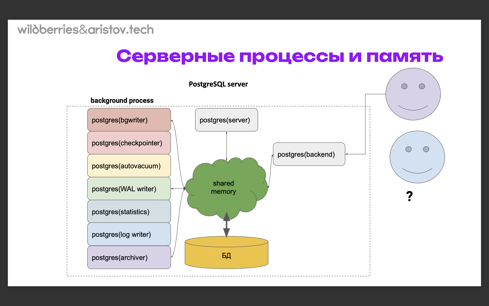
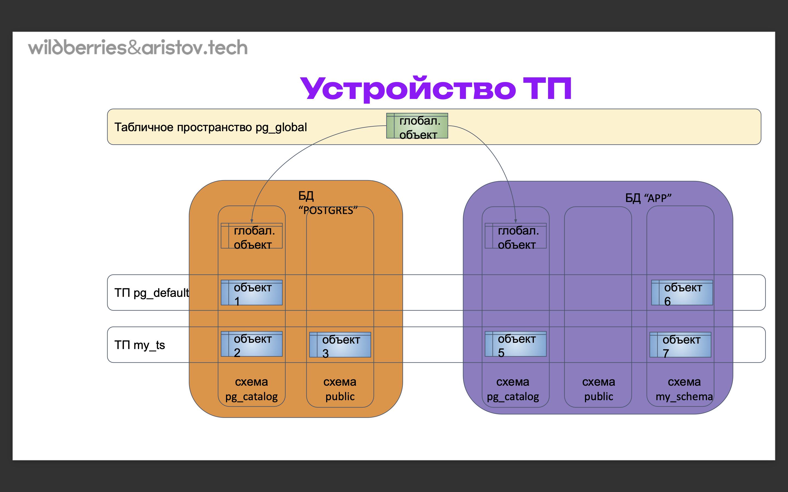
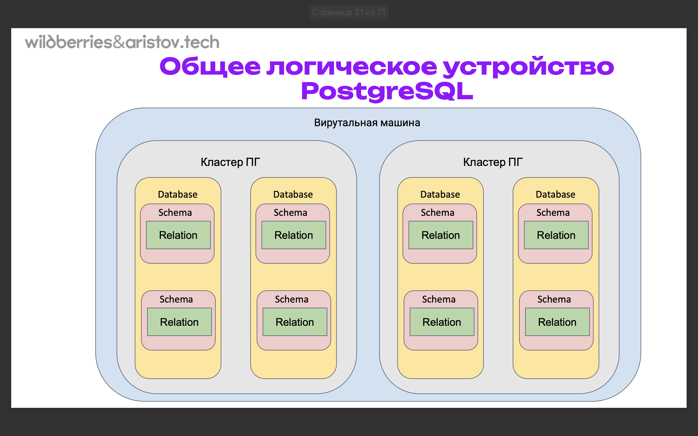
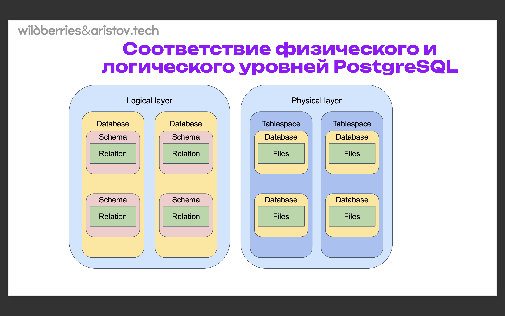
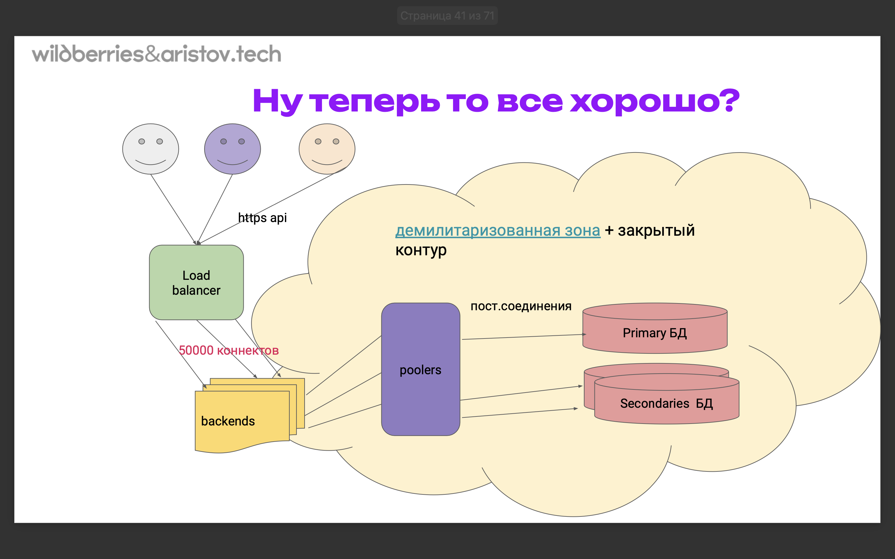
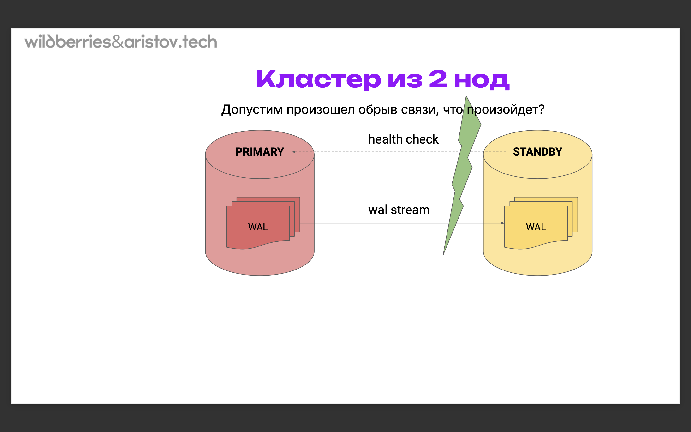
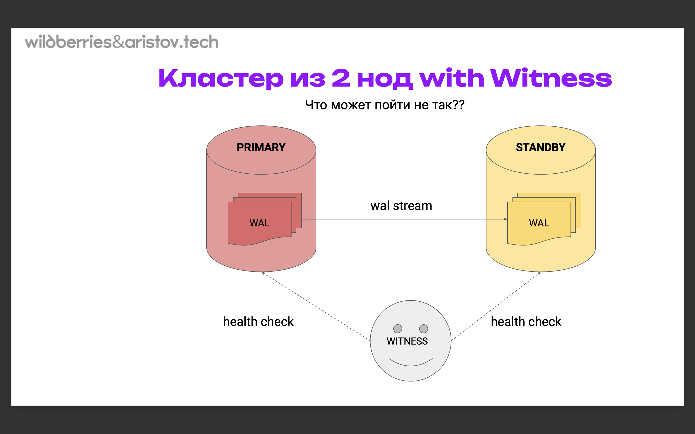
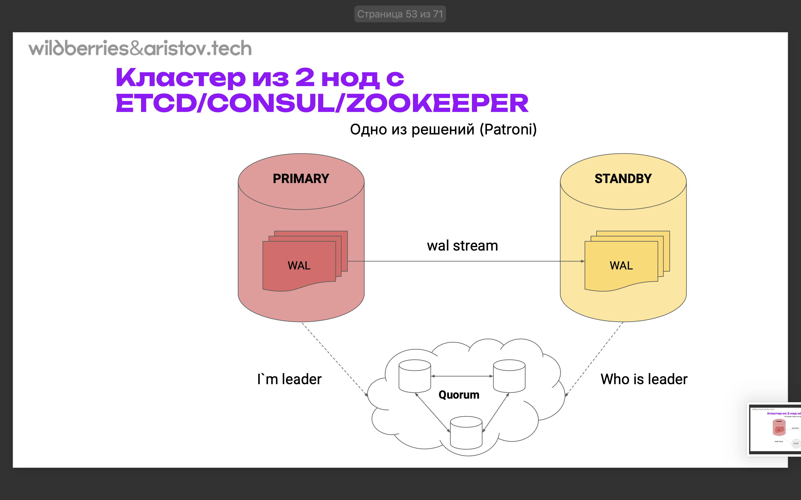

# Внутренняя Архитектура PostgreSQL

В сентябре будет курс лекций по монго

## Маршрут вебинара

- Основные концепции PostgreSQL - плюсы и минусы, OLTP vs OLAP
- Новые функции и улучшения в последних версиях PostgreSQL
- Архитектура PostgreSQL - cерверные процессы и память, фоновые процессы
- Физическая структура данных - табличные пространства, файловое хранение
- Логический уровень - базы данных, схемы, объекты и search_path, соотношение с физическим уровнем
- Ограничения архитектуры
- Построение отказоустойчивой инфраструктуры
- Облачная архитектура

##  Плюсы PostgreSQL

- Традиционная популярная реляционная модель
- Поддержка множества типов данных, в том числе JSON (jsonb)
- Открытый исходный код
- Работа с большими объемами (традиционно - от 1 до 50 Тб)
- Поддержка сложных запросов, объединений десятков таблиц (но оракл производительней по джоинам. при переходе с оракла на пг приходится добавлять железо процентов на 30 в среднем)
- Написание функций на нескольких языках, например можно установить расширение и использовать Python для написания функций и хранимых процедур
- Одновременный параллельный доступ к БД с сотен устройств благодаря системе MVCC  (Multiversion Concurrency Control) - уникальный принцип copy-on-write, что накладывает много ограничений
- Поддержка ACID ( Atomicity, Consistency, Isolation, Durability ) — атомарность, согласованность, изолированность, надежность
- Возможность включать и создавать расширения (extension) - микропрограммы, расширяющие функционал Постгреса
- Высокая мощность и широкая функциональность
- Кроссплатформенность

## Минусы PostgreSQL

- внутренняя архитектура отличается от стандартных СУБД, необходимо это учитывать (связано с MVCC, которая не удаляет старые записи, а помечает на удаление)
- сложная система настройки (изначально постгрес не настроен, а система настройки сложная)
- соответственно высокий порог вхождения (как минимум нужно подтюнить)
- нет кластеров “из коробкиˮ
- проблемы с онлайн обновлением на новую версию
- производительность ниже по сравнению с Oracle & MSSql до 30% на сложных запросах (большие, многострочные джоины)
- под OLAP запросы нужно использовать специальные подходы

Что нового в пг17 ? [ссылка](https://www.postgresql.org/about/news/postgresql-17-released-2936/)

## Серверные процессы и память (17:45)

Как у нас стартует сервер.

Запускается процесс нашего постгреса (на картинке - postgres(server)). После этого происходит форк наших процессов постгрес (background process) (то есть будет постгрес, постгре, и тд - на каждый выполняет свою роль). Создается сегмент разделяемой памяти shared memory (что то типа буферного пула, но чуть шире). С базой происходит общение через эту разделяемую память (через нее идет запись на диск). Все процессы делают что то в разделяемой памяти и по определенным критериям это все записывается в  базу. Постгрес ждет подключений.



Самое интересное происходит когда к базе приходит пользователь. В этом случае тоже происходит форк процессов - тоже будет постгрес, но только postgres(backend). Когда прийдет новых пользователь - произойдет еще один форк и будет еще один процесс postgres(backend). Именно поэтому постгрес, наверное, самая тяжелая СУБД для подключения новых юзеров. Так как форк процессов - это в любом случае небыстро + выделяется память на каждого пользователя. Поэтому есть такое ограничение что даже по умолчанию подключение ограничено 100 пользователями.

форк - это unix-fork, клонирование процесса. То есть когда мы запускаем какой то процесс, он отъедает процессорное время, память и процесс становится такой же. Это именно полноценное клонирование.

Поэтому у постгреса коннекшн - это боль. Подробнее на четвертой лекции. Проблема коннектинга у постгреса стоит на одном из первых мест! Так сложилось исторически и менять это вроде как никто не собирается.

## Установка PostgreSQL

Варианты установки:
- Собрать из [исходников](https://www.postgresql.org/ftp/source/) 
- [on-premise](https://www.postgresql.org/download/) - просто скачиваем бинарник
- Установка из [линукс репозитория](https://www.postgresql.org/download/linux/ubuntu/) (классика на ВМ - VirtualBox, ЯО, GCP, Hyper-V, ESXi, Proxmos, etc)
- Используем [docker](https://hub.docker.com/_/postgres)
- Используем [k8s](https://www.sumologic.com/blog/kubernetes-deploy-postgres/)
- [DBaaS](https://habr.com/ru/companies/timeweb/articles/648989/)

Описаны популярные варианты установки: https://aristov.tech/blog/ . В блоге написано как что развернуть

При сборке из исходников есть интересная возможность вносить изменения в код - то есть вносить какие то кастомные патчи, добавляя функционал. Основная проблема потом - обновить постгрес. Придется каждый раз переписывать патчи.

Процентов 70-80 в настоящее время устанавливают на ВМ.
 
При создании ВМ указываем:
- диск не меньше 15 Гигабайт
- ОЗУ не меньше 4 Гигабайт

Почему стоит использовать убунту:
- Безопасность. Ubuntu — один из самых самых безопасных Линуксов
- Бесплатность
- Большое дружелюбное сообщество
- Простота в использовании
- Удобный центр приложений
- Релизы выходят каждые полгода

Почему 24.04?
- он самый современный
- этот дистрибутив является LTS - Long Time Support, то есть обновления этого дистрибутива будут выходить еще 5 лет. У остальных (не LTS) не более 2 лет, обычно намного меньше

Будет вариант с разворачиванием постгреса в яндекс облаке.

## Физическая структура (28:00)

Посмотрим что установлено на ВМ. 

У нас есть семейство утилит, называемых pg_* . 
```bash
pg_  # и нажать таб
# pg_amcheck           pg_checksums         pg_createcluster     pg_dump              pg_receivexlog       pg_restorecluster    pg_upgrade           pg_walsummary
# pg_archivecleanup    pg_combinebackup     pg_createsubscriber  pg_dumpall           pg_recvlogical       pg_rewind            pg_upgradecluster    
# pg_backupcluster     pg_config            pg_ctl               pg_isready           pg_renamecluster     pg_test_fsync        pg_verifybackup      
# pg_basebackup        pg_conftool          pg_ctlcluster        pg_lsclusters        pg_resetwal          pg_test_timing       pg_virtualenv        
# pg_buildext          pg_controldata       pg_dropcluster       pg_receivewal        pg_restore           pg_updatedicts       pg_waldump 
pg_lsclusters  # выведет информацию по кластерам
```

В терминологии постгреса 1 запущенный инстанс постгреса называется кластер! Это не 2-3-5 машин , работающих как единая система.

PostgreSQL работает с данными на дисках только через файловую систему (с сырыми устройствами работать не может). Одной таблице соответствует минимум 3 файла:
- с данными (нарезка по 2Гб) (так сложилось исторически, дальше идут сегменты (1,2,3...)) (табличке соответствует файл с данными! файл называется цифрой, это object identifier - сквозная нумерация в постгресе)
- файл с картой видимости (для мультиверсионности)
- файл с картой свободных строк (при мультиверсионности новая версия строки добавляется в конец, старая помечается на удаление) (copy on write - при апдейт у нас просто в свободное место добавляется строчка, а эта удаляется. Потом на место удаленной строчки новая записывается. То есть у нас идет полная фрагментация данных, подробнее про это будет в теме про кластерные индексы. А с помощью этого файла мы будем знать, куда писать.)

Особенности:
- EXT3/4 и XFS наиболее популярны (EXT3/4 - обычный постгрес, XFS - highload)
- Raw devices (like Oracle) не поддерживаются

Best practices:
- не хранить данные в корневой файловой системе
- отдельная файловая система для каждого табличного пространства
- в случае внешнего файлового хранилища - отдельный каталог для каждого табличного пространства

Классически файлы с данными у нас хранятся по базам данных и по табличным пространствам (это отдельный каталог для хранения объектов).
 
Данные дефолтно хранятся по пути:
- Data Directory - `/var/lib/postgresql/16/main`
- Log file - `/var/log/postgresql/postgresql-16-main.log` , где 16 - версия кластера, main - имя кластера

У нас есть возможность и создавать свои табличные пространства. Табличное пространство - это специальный смонтированный диск (внешний/сетевой/и тд). Мы можем сделать отдельное табличное пространство и туда размещать таблицы, индексы и тд. Это позволяет нам распараллелить нагрузку.

Также в постгресе есть еще 2 (на самом деле 3 - есть еще auto_cong, который появляется если мы командами меняем какие то значения, он применяется после основного pg_hba.conf файла) конфигурационных файла:

Как посмотреть конфигурационные файлы?
```sql
show hba_file;
\! vi /var/lib/postgresql/data/pg_hba.conf
show config_file;
\! vi /var/lib/postgresql/data/postgresql.conf
```
Путь зависит от ОС. В Ubuntu они расположены:
- /etc/postgresql/15/main/pg_hba.conf
- /etc/postgresql/15/main/postgresql.conf

Посмотрим, что из себя представляет hba_file. Для этого нужно переключиться на пользователя постгрес (из под которого запущен постгрес):
```bash
sudo su postgres
psql  # это консольный клиент по умолчанию, всегда входит в комплект поставки
# теперь мы находимся в постгресе! 
show hba_file;  # выдаст путь до него - /etc/postgresql/16/main/pg_hba.conf
# Посмотрим где в pg_hba.conf физически хранятся данные:
\! nano /etc/postgresql/15/main/pg_hba.conf  # \! позволяет из постгреса выполнять команды как будто мы в ОС
```

pg_hba.conf файл предназначен для того чтобы ограничить доступ извне до нашей СУБД (такой вот встреенный файервол последней линии, при этом он не должен выполнять функции единственного файервола, только подчищать). Здесь мы прописываем правила, откуда мы можем к нему подключиться.

Следующая опция - это наш конфиг файл, в котором и хранятся все наши настройки.
```bash
show config_file;  # выдаст путь до него - /etc/postgresql/16/main/posgresql.conf
# Посмотрим где в postgresql.conf физически хранятся данные:
\! nano /etc/postgresql/15/main/postgresql.conf  # \! позволяет из постгреса выполнять команды как будто мы в ОС
```
Настроек там очень много - так, в 16м постгресе их 360. Если что, всегда настройку можно записать в конец. Последняя встречная настройка - будет применена (то есть мы 10 раз запишем одну и ту же настройку с разными значениями - она применится 1 раз, последнее значение).

Подробней про настройки будет по ходу курса и в 12й лекции!

## Табличные пространства (39:00)

Табличное пространство представляет собой ссылку на каталог

Допустим, у нас есть 2 БД, у каждой БД есть объекты (таблицы, индексы и тд). Каждый объект может принадлежать только одному табличному пространству (ТП), тк это физический процесс (физический файл).



У нас есть дефолтное табличное пространство pg_default. Мы можем создать свое табличное пространство на другом диске и туда размещать объекты. Мы можем объекты перемещать между табличными пространствами - по факту это будет перемещение файла между каталогами. Но нужно понимать, что это будет физическое перемещение файла (то есть это будет не быстро) и будет требоваться эксклюзивный доступ (то есть в это время другие сеансы с ним работать не могут).

При этом одно и то же табличное пространство может включать объекты из разных баз. 

Но одном физическом устройстве делать 2 ТП смысла особого нет. Внутри БД у нас есть еще схемы (но схемы, как и базы данных - это логическое устройство). Плюс у нас есть глобальные объекты pg_global (которые начинаются на pg_), которые у нас принадлежат сразу всем базам данных (точнее - сразу все БД на него ссылаются)

Файлы у нас лежат 
```bash
$PGDATA/base/OID(db)  # $PGDATA - путь к БД, OID - object identifier, сквозная нумерация всех объектов СУБД
$PGDATA/pg_tblspc/OID(ts)/путь_к_каталогу/vеr/OID(d b)  # для всех новых ТП - когда мы делаем свое табличное пространство
```

Оптимизация ТП
- отдельные объекты (БД, таблицы) размещаем в разных ТП, расположенных на разных дисках, дисковых массивах - таким образом распараллеливаем нагрузку (можно распараллелить даже до одного объекта)
- можно из оперативной памяти часть смонтировать как файловую систему, создать ТП и держать там, например, материализованные представления, временные таблицы, индексы
- вариант установить локально на сервер ssd диск под такие же некритичные данные

Немного про psql. Это единственный дефолтный клиент для работы с БД (утилита командной строки).
```bash
psql
\h  # help, например `\h select`
\?  # справка по всем командам
\l  # list databases
\dn  # list of schemas
\dt  # list of relations
```
можно и отдельно поставить клиент - через `apt install posgresql-client` или как то так.

## Логический уровень



Допустим, у нас есть ВМ, там есть пару кластеров (инстансов) постгреса, внутри каждого кластера может быть много БД. Там внутри есть схемы (область зоны видимости). Что это значит - объекты внутри схемы public видят только сами себя. Внутри schema1 - тоже сами себя, и тд. Это логическое разделение, чтобы наши проекты не мешали друг другу. Внутри схем уже располагаются наши relations - физические объекты (таблицы, индексы и тд).

Теперь подробней по БД:

Database
- Является контейнером самого верхнего уровня
- По умолчанию в любом кластере есть как минимум 3 БД
  - postgres 
  - template0 
  - template1
- Присутствует на логическом и физическом уровне

template0
- для восстановления из резервной копии (восстановление происходит так - копируется шаблон (шаблонные файлы) и в них восстанавливается БД )
- по умолчанию даже нет прав на connect
- лучше всего не создавать в ней никаких объектов
- а еще лучше про нее забыть, не трогать и не вспоминать ;)
 
template1
- используется как шаблон для создания новых баз данных
- в нем имеет смысл делать некие действия, которые не хочется делать каждый раз при создании новых баз данных
- например create extension или create schema (при следующем create database они создадутся)
- но (как мне кажется) лучше не создавать объектов, так как для других пользователей это будет неочевидно
 
postgres
- первая база данных для регулярной работы
- создается по умолчанию
- хорошая практика - также не использовать, но и не удалять - иногда нужна для различных утилит (обычно под каждую задачу создается своя БД )

Как создаются БД:
- [create database](https://www.postgresql.org/docs/current/sql-createdatabase.html)
- [create schema](https://www.postgresql.org/docs/current/sql-createschema.html)
- [create table](https://www.postgresql.org/docs/current/sql-createtable.html)

Виды отношений в БД (что у нас может содержаться в схеме):
- r = ordinary table

Кроме простых таблиц, также существуют и [другие отношения](https://www.postgresql.org/docs/15/catalog-pg-class.html): 
- i = index,
- S = sequence,
- v = view,
- m = materialized view, 
- c = composite type,
- t = TOAST table,
- f = foreign table,

[Создание БД](https://www.postgresql.org/docs/current/sql-createdatabase.html)
```sql
CREATE DATABASE name
    [ WITH ] [ OWNER [=] user_name ]
           [ TEMPLATE [=] template ]
           [ ENCODING [=] encoding ]
           [ STRATEGY [=] strategy ]
           [ LOCALE [=] locale ]
           [ LC_COLLATE [=] lc_collate ]
           [ LC_CTYPE [=] lc_ctype ]
           [ BUILTIN_LOCALE [=] builtin_locale ]
           [ ICU_LOCALE [=] icu_locale ]
           [ ICU_RULES [=] icu_rules ]
           [ LOCALE_PROVIDER [=] locale_provider ]
           [ COLLATION_VERSION = collation_version ]
           [ TABLESPACE [=] tablespace_name ]
           [ ALLOW_CONNECTIONS [=] allowconn ]
           [ CONNECTION LIMIT [=] connlimit ]
           [ IS_TEMPLATE [=] istemplate ]
           [ OID [=] oid ]
```

Контейнер 2 уровня - это [схемы](https://www.postgresql.org/docs/current/sql-createschema.html). Схумы нужны для того чтобы объекты не видели друг друга по умолчанию. То есть мы логически разделяем объекты, в разных схемах объекты могут называться одинаково.
```sql
CREATE SCHEMA IF NOT EXISTS имя_схемы [ AUTHORIZATION указание_роли ]
```
Контейнер 3 уровня - [таблицы](https://www.postgresql.org/docs/current/sql-createtable.html)
```sql
CREATE [ { TEMPORARY | TEMP } | UNLOGGED ] TABLE [ IF NOT EXISTS ] имя_таблицы (
[
 { имя_столбца тип_данных [ ограничение_столбца [ ... ] ]
--  UNLOGGED - работает значительно быстрее, но если сервер рестартует - таблица очищается
```


## Соответствие физического и логического уровней



цвета соблюдены. В целом физический и логический уровни у нас довольно тесно совпадают.

## Небольшая практика (52 00)

```sql
-- sudo pg_ctlcluster 16 main start
CREATE DATABASE wb;
\l  -- посмотрим существующие базы
\c wb  -- подключимся к базе wb , \c == connect
-- You are now connected to database "wb" as user "postgres".
CREATE SCHEMA eugene;
CREATE TABLE eugene.test (i int);  
\dt+  -- по умолчанию ищется в схеме публик!
\dt+ eugene.*
/*
                                   List of relations
 Schema | Name | Type  |  Owner   | Persistence | Access method |  Size   | Description 
--------+------+-------+----------+-------------+---------------+---------+-------------
 eugene | test | table | postgres | permanent   | heap          | 0 bytes | 
(1 row)
*/
\d+ eugene.test
/*
                                          Table "eugene.test"
 Column |  Type   | Collation | Nullable | Default | Storage | Compression | Stats target | Description 
--------+---------+-----------+----------+---------+---------+-------------+--------------+-------------
 i      | integer |           |          |         | plain   |             |              | 
Access method: heap
*/
insert into eugene.test values (1);
\c postgres
\dt+ eugene.*
/*
Did not find any relation named "eugene.*".
*/

-- весь текст приводится к нижнему регистру
sELEcT * from test;
sELEcT * from eugene.test;
-- НЕ используйте принужительно разный регистр/пробелы/русские названия
CREATE TABLE "te S t" (i int);
-- кроме выборок возможны и логически операции
SELECT 1+1;

-- хорошая практика - большие скрипты оборачивать в транзакции. По умолчанию включен автокоммит. 
BEGIN;
DROP TABLE IF EXISTS warehouse CASCADE;
CREATE TABLE warehouse (
    id serial UNIQUE,
    name text NOT NULL DEFAULT '',
    kolvo int NOT NULL DEFAULT 0,
    price decimal NOT NULL DEFAULT 0.0
);
-- \d+ warehouse
DROP TABLE IF EXISTS sales;
CREATE TABLE sales(
    id serial PRIMARY KEY,
    kolvo int NOT NULL,
    summa numeric NOT NULL DEFAULT 0.0,
    fk_warehouse int references warehouse(id) ON DELETE CASCADE,
    salesDate date default current_date
);
-- \d+ sales
INSERT INTO warehouse(name) VALUES ('apple');
--INSERT INTO warehouse(id,name) VALUES (1,'banana');
INSERT INTO warehouse(name) VALUES ('banana');
--INSERT INTO sales(fk_warehouse) VALUES (2);
--INSERT INTO sales(id, fk_warehouse) VALUES (1, 2);
INSERT INTO sales(fk_warehouse,kolvo,summa) VALUES (2,10,100);
INSERT INTO warehouse(name) VALUES ('apple2');
--INSERT INTO sales(fk_warehouse,kolvo,summa) VALUES (4,10,100);
-- rollback;
COMMIT;

SELECT * FROM warehouse;
TABLE warehouse;
SELECT * FROM sales;

-- Физический уровень
-- Введение в линукс
-- https://aristov.tech/blog/likbez-po-linux/
-- Как посмотреть конфигурационные файлы?
show hba_file;
show config_file;
show data_directory;
/*
      data_directory      
--------------------------
 /var/lib/postgresql/data
(1 row)
*/
\! ls -l /var/lib/postgresql/data
/*
total 128
drwx------ 7 postgres postgres  4096 Mar 13 07:19 base
drwx------ 2 postgres postgres  4096 Mar 13 07:19 global
drwx------ 2 postgres postgres  4096 Mar 13 06:21 pg_commit_ts
drwx------ 2 postgres postgres  4096 Mar 13 06:21 pg_dynshmem
-rw------- 1 postgres postgres  5743 Mar 13 06:21 pg_hba.conf
-rw------- 1 postgres postgres  2640 Mar 13 06:21 pg_ident.conf
drwx------ 4 postgres postgres  4096 Mar 13 07:31 pg_logical
drwx------ 4 postgres postgres  4096 Mar 13 06:21 pg_multixact
drwx------ 2 postgres postgres  4096 Mar 13 06:21 pg_notify
drwx------ 2 postgres postgres  4096 Mar 13 06:21 pg_replslot
drwx------ 2 postgres postgres  4096 Mar 13 06:21 pg_serial
drwx------ 2 postgres postgres  4096 Mar 13 06:21 pg_snapshots
drwx------ 2 postgres postgres  4096 Mar 13 06:21 pg_stat
drwx------ 2 postgres postgres  4096 Mar 13 06:21 pg_stat_tmp
drwx------ 2 postgres postgres  4096 Mar 13 06:21 pg_subtrans
drwx------ 2 postgres postgres  4096 Mar 13 06:21 pg_tblspc
drwx------ 2 postgres postgres  4096 Mar 13 06:21 pg_twophase
-rw------- 1 postgres postgres     3 Mar 13 06:21 PG_VERSION
drwx------ 4 postgres postgres  4096 Mar 13 07:22 pg_wal
drwx------ 2 postgres postgres  4096 Mar 13 06:21 pg_xact
-rw------- 1 postgres postgres    88 Mar 13 06:21 postgresql.auto.conf
-rw------- 1 postgres postgres 30777 Mar 13 06:21 postgresql.conf
-rw------- 1 postgres postgres    36 Mar 13 06:21 postmaster.opts
-rw------- 1 postgres postgres    94 Mar 13 06:21 postmaster.pid
*/
/*
postgresql.auto.conf - если мы вносим изменения в конфигурационные файлы не ручками, а через `alter system` - изменения попадают сюда, последнее изменение перезатирает предыдущее
*/

-- посмотрим, что происходит с нашим объектом
CREATE TABLE test5(i int);
-- всегда можем посмотреть, где лежит таблица
SELECT pg_relation_filepath('test5');  -- покажет нам где лежит табличка
/*
 pg_relation_filepath 
----------------------
 base/5/16394
(1 row)
*/
-- посмотрим на файловую систему
\! ls -l /var/lib/postgresql/data/base
\! ls -l /var/lib/postgresql/data/base/5 | grep 16394
/*
-rw------- 1 postgres postgres      0 Mar 13 07:40 16394
0 - так как таблица пустая. Вставим любую запись - станет 8 кб (размер блока по умолчанию). Менять блок мы можем только при пересборке постгреса
*/
INSERT INTO test5 VALUES (1);
ls -l | grep
/*
-rw------- 1 postgres postgres   8192 Mar 13 07:43 16394
*/
INSERT INTO test5 VALUES (2);
ls -l | grep
/*
-rw------- 1 postgres postgres   8192 Mar 13 07:43 16394
*/

-- Табличные пространства
-- перейдем в домашний каталог пользователя postgres в ОС линукс
sudo su postgres
cd ~
pwd
-- у пользователя постгрес домашним является каталог `/var/lib/postgresql`
mkdir temp_tblspce
psql
CREATE TABLESPACE ts location '/var/lib/postgresql/temp_tblspce';
\db
-- можем создать БД и указать, где будут располагаться все новые объекты у нас
CREATE DATABASE app TABLESPACE ts;
\c app
\l+ -- посмотреть дефолтный tablespace
/*
   Name    |  Owner   | Encoding | Locale Provider |  Collate   |   Ctype    | Locale | ICU Rules |   Access privileges   |  Size   | Tablespace |                Description   
              
-----------+----------+----------+-----------------+------------+------------+--------+-----------+-----------------------+---------+------------+--------------------------------------------
 app       | postgres | UTF8     | libc            | en_US.utf8 | en_US.utf8 |        |           |                       | 7547 kB | ts         | 
 pg_db     | postgres | UTF8     | libc            | en_US.utf8 | en_US.utf8 |        |           |                       | 7321 kB | pg_default | 
 postgres  | postgres | UTF8     | libc            | en_US.utf8 | en_US.utf8 |        |           |                       | 7483 kB | pg_default | default administrative connection database
 template0 | postgres | UTF8     | libc            | en_US.utf8 | en_US.utf8 |        |           | =c/postgres          +| 7321 kB | pg_default | unmodifiable empty database
           |          |          |                 |            |            |        |           | postgres=CTc/postgres |         |            | 
 template1 | postgres | UTF8     | libc            | en_US.utf8 | en_US.utf8 |        |           | =c/postgres          +| 7547 kB | pg_default | default template for new databases
           |          |          |                 |            |            |        |           | postgres=CTc/postgres |         |            | 
 wb        | postgres | UTF8     | libc            | en_US.utf8 | en_US.utf8 |        |           |                       | 7555 kB | pg_default | 
(6 rows)

*/
CREATE TABLE test (i int);
SELECT pg_relation_filepath('test');
/*
            pg_relation_filepath             
---------------------------------------------
 pg_tblspc/16397/PG_17_202406281/16398/16399
(1 row)
*/
CREATE TABLE test2 (i int) TABLESPACE pg_default;
SELECT tablename, tablespace FROM pg_tables WHERE schemaname = 'public';
/*
 tablename | tablespace 
-----------+------------
 test      | 
 test2     | pg_default
(2 rows)
*/
ALTER TABLE test set TABLESPACE pg_default;  -- это будет физический перенос с устройства на устройство!
SELECT oid, spcname FROM pg_tablespace; -- oid уникальный номер, по которому можем найти файлы
/*
  oid  |  spcname   
-------+------------
  1663 | pg_default
  1664 | pg_global
 16397 | ts
(3 rows)
*/
SELECT oid, datname,dattablespace FROM pg_database;
/*
  oid  |  datname  | dattablespace 
-------+-----------+---------------
     5 | postgres  |          1663
 16384 | pg_db     |          1663
     1 | template1 |          1663
     4 | template0 |          1663
 16389 | wb        |          1663
 16398 | app       |         16397
(6 rows)
*/
-- всегда можем посмотреть, где лежит таблица
SELECT pg_relation_filepath('test2');
/*
 pg_relation_filepath 
----------------------
 base/16398/16402
(1 row)
*/
-- Узнать размер, занимаемый базой данных и объектами в ней, можно с помощью ряда функций.
SELECT pg_database_size('app');
-- Для упрощения восприятия можно вывести число в отформатированном виде:
SELECT pg_size_pretty(pg_database_size('app'));
-- Полный размер таблицы (вместе со всеми индексами):
SELECT pg_size_pretty(pg_total_relation_size('test2'));
-- И отдельно размер таблицы...
SELECT pg_size_pretty(pg_table_size('test2'));
-- ...и индексов:
SELECT pg_size_pretty(pg_indexes_size('test2'));
-- !!! с дефолтным неймспейсом не все так просто !!!
SELECT count(*) FROM pg_class WHERE reltablespace = 0;  -- тейблспейс по умолчанию
/*
 count 
-------
   365
(1 row)
*/
-- то есть у нас 365 табличек

-- Логический уровень
-- database
-- system catalog
-- schema
\dn
/*
      List of schemas
  Name  |       Owner       
--------+-------------------
 public | pg_database_owner
(1 row)

*/
-- current schema
SELECT current_schema();
-- view table
\d pg_database
select * from pg_database;
-- seach path - для того чтобы мы понимали, где мы можем искать
SHOW search_path;
/*
   search_path   
-----------------
 "$user", public
(1 row)
*/
-- "$user", public  -- сначала по имени пользователя (сейчас у нас postgres), затем public (общая схема)
-- на самом деле здесь присутствуют еще 2 переменные - наше системное представление (`pg_`) и временные таблицы

-- SET search_path to .. - в рамках сессии
-- параметр можно установить и на уровне отдельной базы данных:
-- ALTER DATABASE otus SET search_path = public, special;
-- в рамках кластера в файле postgresql.conf
\dt
-- интересное поведение и search_path
\d pg_database
/*
               Table "pg_catalog.pg_database"
     Column     |   Type    | Collation | Nullable | Default 
----------------+-----------+-----------+----------+---------
 oid            | oid       |           | not null | 
 datname        | name      |           | not null | 
 datdba         | oid       |           | not null | 
 encoding       | integer   |           | not null | 
 datlocprovider | "char"    |           | not null | 
 datistemplate  | boolean   |           | not null | 
 datallowconn   | boolean   |           | not null | 
 dathasloginevt | boolean   |           | not null | 
 datconnlimit   | integer   |           | not null | 
 datfrozenxid   | xid       |           | not null | 
 datminmxid     | xid       |           | not null | 
 dattablespace  | oid       |           | not null | 
 datcollate     | text      | C         | not null | 
 datctype       | text      | C         | not null | 
 datlocale      | text      | C         |          | 
 daticurules    | text      | C         |          | 
 datcollversion | text      | C         |          | 
 datacl         | aclitem[] |           |          | 
Indexes:
    "pg_database_oid_index" PRIMARY KEY, btree (oid), tablespace "pg_global"
    "pg_database_datname_index" UNIQUE CONSTRAINT, btree (datname), tablespace "pg_global"
Tablespace: "pg_global"
*/
CREATE TABLE pg_database(i int);
-- все равно видим pg_catalog.pg_database
\d pg_database
-- чтобы получить доступ к толко что созданной таблице используем указание схемы
\d public.pg_database
/*
            Table "public.pg_database"
 Column |  Type   | Collation | Nullable | Default 
--------+---------+-----------+----------+---------
 i      | integer |           |          | 
*/
SELECT * FROM pg_database limit 1;
/*
 oid | datname  | datdba | encoding | datlocprovider | datistemplate | datallowconn | dathasloginevt | datconnlimit | datfrozenxid | datminmxid | dattablespace | datcollate |  datctype  | datlocale | daticurules | datcollversion | datacl 
-----+----------+--------+----------+----------------+---------------+--------------+----------------+--------------+--------------+------------+---------------+------------+------------+-----------+-------------+----------------+--------
   5 | postgres |     10 |        6 | c              | f             | t            | f              |           -1 |          731 |          1 |          1663 | en_US.utf8 | en_US.utf8 |           |             | 2.31           | 
(1 row)
*/
-- в 1 схеме или разных?
CREATE TABLE t1(i int);
CREATE SCHEMA postgres;
CREATE TABLE t1(i int);
-- мы увидим, что таблица создастся в схеме постгрес! Так как в search_path присутствует текущий пользователь $user. 
\dt
\dt+
/*
                                     List of relations
  Schema  | Name  | Type  |  Owner   | Persistence | Access method |  Size   | Description 
----------+-------+-------+----------+-------------+---------------+---------+-------------
 postgres | t1    | table | postgres | permanent   | heap          | 0 bytes | 
 public   | test  | table | postgres | permanent   | heap          | 0 bytes | 
 public   | test2 | table | postgres | permanent   | heap          | 0 bytes | 
(3 rows)
*/
\dt public.*
/*
            List of relations
 Schema |    Name     | Type  |  Owner   
--------+-------------+-------+----------
 public | pg_database | table | postgres
 public | t1          | table | postgres
 public | test        | table | postgres
 public | test2       | table | postgres
(4 rows)
*/
SET search_path TO public, "$user";
\dt
SET search_path TO public, "$user", pg_catalog;
\dt
CREATE TEMP TABLE t1(i int);
\dt
/*
           List of relations
   Schema   | Name  | Type  |  Owner   
------------+-------+-------+----------
 pg_temp_10 | t1    | table | postgres
 public     | test  | table | postgres
 public     | test2 | table | postgres
(3 rows)
*/
SET search_path TO public, "$user", pg_catalog, pg_temp;
\dt
-- можем переносить таблицу между схемами - при этом меняется только запись в pg_class, физически данные на месте
ALTER TABLE t2 SET SCHEMA public;
-- чтобы не было вопросов указываем схему прямо при создании
CREATE TABLE public.t10(i int);
-- Пример склада и магазина в виртуальном окружении
https://www.db-fiddle.com/f/5RSrPHeFvaRbHaYJkxBZAR/0
-- Пример развертывания в YC
-- 01_ya_create_vm.txt
-- там же пример создания ssh ключей для подключения
```

## Теперь по инфре (1:17:00)

Вот у нас пошли юзеры на лоад балансер. Балансер идет на наши бэкэнды, они уже идут в закрытый контур (тут уже вопросы к ИБ, что где разместить). Бэкэнды идут к пулерами (потому что всего 100 соединений!), пулер уже устанавливает соединение к БД (к мастеру или secondary)



Изъян схемы - кто будет переключать primary и secondary при проблемах? Есть следующие варианты:
- PgPool (он является и пулером, и мультикомбайном, который может и переключать, и роутить трафик - но чем больше функций, тем все медленней работает (синтаксический разбор запроса и тд))
- [Pg_auto_failover](https://github.com/hapostgres/pg_auto_failover)
- [Repmgr](https://github.com/EnterpriseDB/repmgr)

Перед тем, как перейти к патрони, можно обсудить одну небольшую известную проблему.

Допустим, у нас есть кластер из 2 нод (primary, standby). 



В случае обрыва связи у нас будет сплитбрейн - 2 мастера, одни запросы идут на одну ноду, другие - на другую, таймлайн разъедется. СОбрать все воедино будет проблематично - скорее всего потребуется пожертвовать частью информации. Что можно сделать - например, можно использовать технологию witness



Наблюдатель смотрим сразу primary и standby, если primary умер - переопределяет standby в новый primary. Теперь у нас 2 проблемы - может умереть как наблюдатель, так и произойти обрым соединения с основной нодой.

Решение придумали в компании патрони



у нас есть отказоустойчивый dcs-кластер, там etcd, zookeeper, по рафт-протоколу. primary регулярно пушит сообщение что он лидер. Оно протухает через какое то время. standby в свою очередь также регулярно опрашивает, кто сейчас лидер. Если лидер теряется - происходят перевыборы, определяется новый лидер, остальные на него подписываются. старый лидер понимает что он пушить не может - и переходит в режим read-only.

Patroni - самый популярный кластер (70-80 процентов рынка). Можно еще добавить pgbouncer, keepalived+2 HAPROXY для HA.

Есть еще citus - там нет etcd и используется Patroni3.0

Добавим кэш в наше отказоустойчивое решение.

Тут тоже возникает вопрос - а какой кэш? 
Если делать локальный кэш, то лоад балансер должен запросы с 1 фронта всегда отправлять на нужный бэкенд.
Если делать общий tarantool/redis (не совсем кэш), то сетевые задержки. И общие проблемы:
- TTL
- инвалидация кэша
 
Все это можно собрать самим. Но классически выбирают уже собранную конфигурацию. 

HA: (классическая реализация master-slave)
- Patroni
- Stolon
- Slony (умер)
- ClusterControl 
- Kubegres

Параллельные кластера: (позволяют шардироваться или распределенные трензакции)
- Postgres-BDR 
- CitusData
- Bucardo
- CockroachDB 
- Yogabyte
- Greenplum

Опять же как развернуть - on-premise, docker, k8s... А уж сколько облачных решений...

## Ограничения архитектуры (1:23:00)

- огриничения коннектинга! (пул соединений - 100 дефолтно)
- ограничение 32Тб на одну таблицу - заранее думаем про секционирование!!!
- бэкап снимаем с secondary и не забываем про валидацию бэкапа
- возможно есть смысл в каскадной репликации при проблемах с производительностью сети
- синхронная реплика снижает производительность, но обеспечивает надежность
- геораспределение нагрузки
- строим планы развития системы (краткосрочный, долгосрочный) - прогноз обязателен!!!
- мониторим пустое место !!! размер WAL и не только !!!
- Не забываем включать pg_rewind !!! В stolon по умолчанию отключен!!! Подробнее про pg_rewind на 4й лекции. Если вкратце - он позволяет накатить изменения. Реплика отвалилась на какое то время - есть журналы изменений, можно потом изменения донакатить. Без него у нас произойдет переналивка огромного объема данных. Не все кластера умеют переживать "моргание" сети.
 
Что делать с OLAP? Это самая большая проблематика в постгресе
- отдельная реплика для OLAP!!
- промежуточные агрегаты, избыточность 
- материализованные представления
- возможно - использование хранимых процедур?
- [message broker](https://www.ibm.com/topics/message-brokers) для накопления данных и их ночная обработка?
- готовые olap решения (greenplum, clickhouse, citus, arenadata)
- [fdw](https://www.postgresql.org/docs/current/postgres-fdw.html), [timescaledb](https://www.timescale.com/)

## Облачные варианты и кубер

DBaaS у любого провайдера. (на самом деле норм вариант на небольших проектах)
- Плюсы:
  - кластер за пару кликов в GUI
  - бэкапы, репликация за 1 нажатие
- Минусы:
  - повышенная стоимость - только платные лицензии
  - нет контроля над инстансом
  - минимум настроек
  - дебаг запросов превращается в многоуровневый квест
  - обычно HA реплику не получится использовать как read реплику
  - ооочень огромная сложность построения мултиклауд конфигураций и даже реплики у другого провайдера
  - время развертывания инстанса значительно превышает вариант on premise
 
K8S

Как в облачном так и on premise кластере.
Плюсы - гибкость и простота развертывания HA конфигураций со встроенными пулерами и д., обычно есть GUI для управления.
Варианты:
- свой релиз обернуть в чарт
- cloud native
  - [patroni](https://patroni.readthedocs.io/en/latest/)
  - [stolon](https://github.com/sorintlab/stolon)
  - [ClusterControl](https://severalnines.com/database-blog/how-deploy-postgresql-high-availability)
- операторы (для YAML разработчиков новый тип ресурса - postgresql)
  - от авторов Патрони https://github.com/zalando/postgres-operator
  - от дистрибьютора Crunchy https://github.com/CrunchyData/postgres-operator
  - от контрибьютора EnterpriseDB https://cloudnative-pg.io/
  - на хабе операторов 15 вариантов

## Конец лекции

Приложен файлик как развернуть постгрю в яндекс клауде (файл 01_ya_create_vm.txt)

Для практики используется файлик 01_arch.txt

у постгреса есть такой нюанс, что по умолчанию мы не можем из одной БД видеть объекты другой (но это настраивается). Пример - мы развернули из дампа бд thai и создали свою бд wb. Из wb мы не видим thai. даже при переключении на другую бд рвется соединение и устанавливается новое соединение.

Раньше была известная уязвимость - если пользователь имел право создавать временные таблички, то можно было через обходные пути (создание таблички settings) повышать себе привилегии!

В 14й версии постгреса убрали права по умолчанию на public. Вообще желательно убирать эту схему. Это сразу убирает огромный пласт проблем с безопасностью:
- отбираем дефолтные права на public
- убираем из search_path

В лекциях будет часто использоваться db-fiddle. Это аналог виртуального окружения, где можно выбрать БД и писать запросы со структурой. [Пример](https://www.db-fiddle.com/f/5RSrPHeFvaRbHaYJkxBZAR/0) склада и магазина в виртуальном окружении

## ДЗ (1:30:00)

Есть небольшое демо по подниманию виртуалки и подключению к ней

См презу, делаем публичный проект
- ответить на вопрос
- написать, где развернул вм
- в первом письме - упомянуть свое ФИО