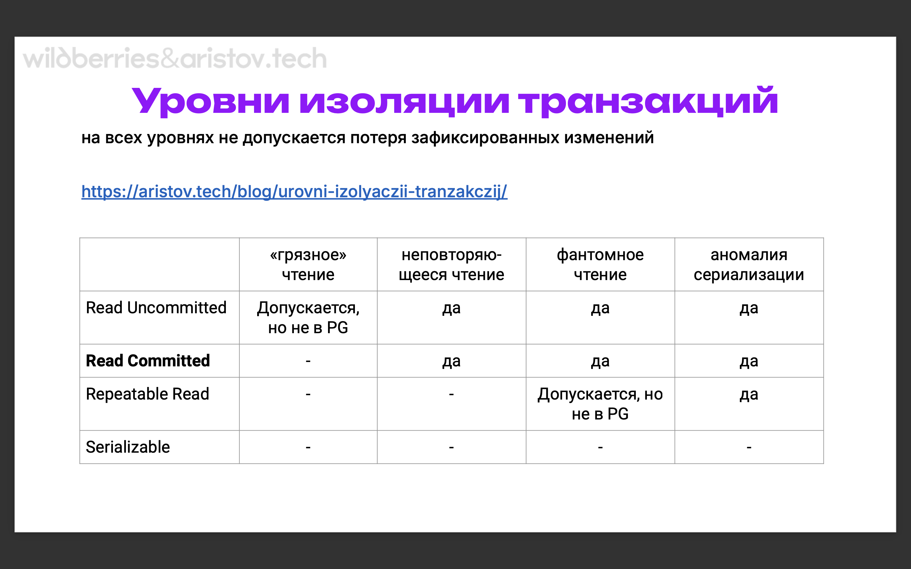
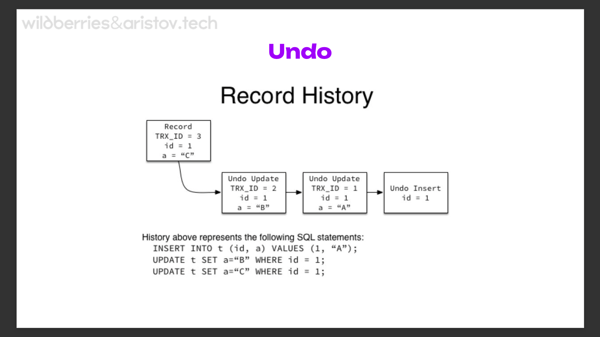
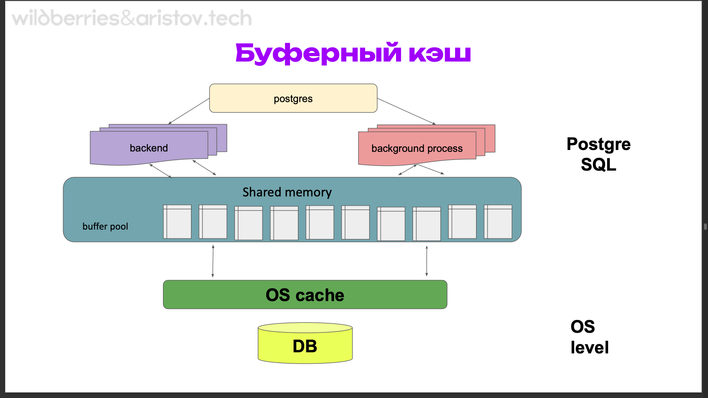
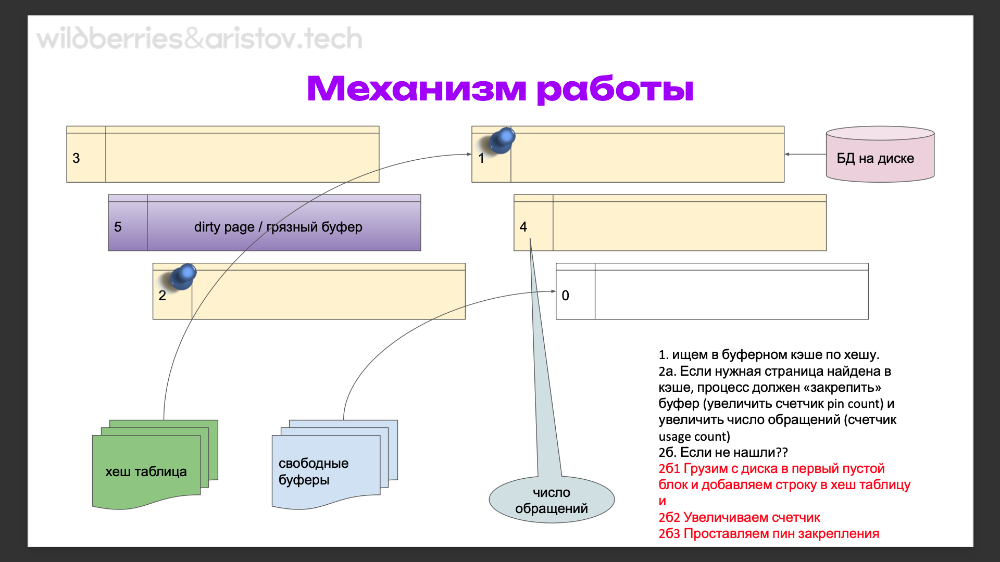

# PostgreSQL «ACID, MVCC, буферный кэш»

В этой теме делимя принципом ACID и особенностями его реализации, работой транзакций, включая уровни изоляции и autocommit, подходами к использованию транзакций и особенностями массовой загрузки данных. Также рассматриваем MVCC, его отличие от других СУБД, внутренние особенности реализации. Знакомимся с устройством буферного кэша, принципом работы shared buffers, механизмом вытеснения и буферным кольцом, а также назначением и примерами использования прогрева данных.

Почему это важно - оракл все хорошо делает внутри, а у постгреса есть нюанс. Поэтому чтобы писать хорошие запросы, нужно понимать тонкости.

## Структура лекции

- ACID - принцип и особенности реализации
- Транзакции - принцип работы, уровни изоляции транзакций, autocommit, подходы к использованию транзакций, особенности массовой загрузки данных
- MVCC - принцип, отличие от других СУБД, внутренние особенности реализации, xmax, xmin, ctid, infomask
- Буферный кэш - устройство shared buffers, принцип работы и практическое использование, механизм работы с вытеснением, буферное кольцо
- Прогрев данных - назначение и примеры использования

## ACID

Реляционная теория и SQL позволяет абстрагироваться от конкретной СУБД, но есть одна непростая проблема:
- как обеспечить параллельную работу множества сессий (concurrency)
- которые модифицируют данные
- так чтобы они не мешали друг другу
- ни с точки зрения чтения ни с точки зрения записи
- и обеспечивали целостность данных - т.н. consistency
- и их надежность - т.н. durability

У нас есть параллельная работа, куча сессий, и нам нужно добиться чтобы мы друг другу не мешали, могли одновременно получать доступ к одним и тем же данным. При этом у нас должна быть консистентность.

Этому отвечает классическая OLTP система (Online Transaction Processing). 

ACID
- Atomicity — Атомарность 
- Consistency — Согласованность 
- Isolation — Изолированность 
- Durability — Долговечность

И тогда транзакцией (transaction) называется множество операций, выполняемое приложением:
- которое переводит базу данных из одного корректного состояния в другое корректное состояние (согласованность)
- при условии, что транзакция выполнена полностью (атомарность)
- и без помех со стороны других транзакций (изолированность)

Транзакция нам гарантирует первые 3 буквы, а Durability нам обеспечивает сама СУБД!

Уровни изоляции транзакций:

Стандарт SQL допускает четыре уровня изоляции, которые определяются в терминах аномалий, которые допускаются при конкурентном выполнении транзакций на этом уровне:
- «Грязное» чтение (**dirty read**). Транзакция T1 может читать строки измененные, но еще не зафиксированные, транзакцией T2. Отмена изменений (ROLLBACK) в T2 приведет к тому, что T1 прочитает данные, которых никогда не существовало.  
  Это самое ужасное, что может произойти. Такого уже в реальных базах не допускается, но до сих пор есть такой уровень изоляции
- Неповторяющееся чтение (**non-repeatable read**). После того, как транзакция T1 прочитала строку, транзакция T2 изменила или удалила эту строку и зафиксировала изменения (COMMIT). При повторном чтении этой же строки транзакция T1 видит, что строка изменена или удалена. (про изменение самих строк)
- Фантомное чтение (**phantom read**). Транзакция T1 прочитала набор строк по некоторому условию. Затем транзакция T2 добавила строки, также удовлетворяющие этому условию. Если транзакция T1 повторит запрос, она получит другую выборку строк. (про изменение количества строк)
- Аномалия сериализации (**serialization anomaly**) - Результат успешной фиксации группы транзакций оказывается несогласованным при всевозможных вариантах исполнения этих транзакций по очереди.  
  Самый сложный кейс для объяснения в sql. Мы стараемся транзакции построить последовательно, а не параллельно. Соответственно, когда параллельные транзакции меняют одни и те же данные - у нас происходит аномалия сериализации, соотвественно мы не можем их последовательно построить, и происходит ошибка.

Каждый следующий уровень требует больше ресурсов для поддержания консистентности.

Пострес работает на уровне non-repeatable read. Mysql работает на уровне phantom read

Пример грязного чтения:

Есть два счёта в банке: Светлана (500 Р) и Петр (500 Р). Светлана переводит 200Р Петру:
```sql
-- грязная транзакция
BEGIN TRANSACTION ISOLATION LEVEL READ UNCOMMITTED;
UPDATE account SET amount - 200 WHERE name = ‘Svetlanaʼ; -- ok
UPDATE account SET amount + 200 WHERE name = ‘Petrʼ; -- ok
-- Решили проверить баланс в другом сеансе, пока параллельная транзакция не зафиксирована:
BEGIN TRANSACTION ISOLATION LEVEL READ UNCOMMITTED; 
SELECT amount FROM account WHERE name = ‘Petrʼ; -- 700 
--Итог - видим несуществующие деньги.
```
 
[Уровни изоляции транзакций](https://aristov.tech/blog/urovni-izolyaczii-tranzakczij/): 
на всех уровнях не допускается потеря зафиксированных изменений



Мы можем немного повысить уровень. Уровень аномалий сериализации - поднимают достаточно редко, но с точки зрения теории необходимо иметь его в виду.

Классический пример: 
у нас есть класс и значение:
|class | value |
|-------|------|
|1|10|
|1|20|
|2|100|
|2|200|
```sql
-- сериализуемая транзакция A вычисляет:
SELECT SUM(value) FROM mytab WHERE class = 1; 
-- добавляем запись с суммой и class 2 (то есть будет запись 2 | 30)
-- сериализуемая транзакция B вычисляет:
SELECT SUM(value) FROM mytab WHERE class = 2; 
-- добавляем запись с суммой и class 1 (то есть будет запись 1 | 300)
-- что произойдет при попытке фиксации изменений?
```
Мы должны построить эти транзакции последовательно. Как только первая зафиксирует транзакцию - результат второй будет неактуален. Поэтому у нас будет ошибка - не удалось сериализовать доступ из-за зависимостей чтения/записи между транзакциями. Причем если бы одна из транзакций была бы repeatable read - все бы успешно закоммитилось. (на практике убедимся что все это у нас работает)

Но мы можем установить уровень изоляции как на конкретную СУБД, так и на пользователя, да даже на конкретную транзакцию!

Продакшн-советы:
- дефолтный уровень у постгреса в целом норм. non-repeatable read - это в целом не перебор. Но на какие то финансовые (банковские) транзакции лучше установить уровень serialization anomaly.
- классическое решение - отсортировать операции в транзакции по айди. Так у нас не будет дед-локов и не будет проблем с сериализацией

## Транзакции и batch load.

batch load - классика загрузки. На создание транзакции тоже тратятся ресурсы. Если вставлять батчами - это на порядки быстрее. Если есть массовая загрузка и не нужно прям срочно давать ответ - лучше вставлять батчами
- Оптимальные размеры батчей 100к-1кк - учитываем размер транзакций, аффект на WAL файлы и занимаемую память + сброс грязных буферов на диск
- самый быстрый метод, как ни странно, COPY (в 17 постгресе ее еще и ускорили)
- отключаем индексы, если позволяет логика (индексы требуют постоянной перестройки и могут замедлить загрузку в разы)
- отключаем триггеры, внешние ключи
- не забываем ANALYZE после лоада
- ну и вернуть индексы и иже с ними
- есть нюанс про vacuum analyze - подробней на 7 лекции

Полезная [ссылка](https://www.enterprisedb.com/blog/7-best-practice-tips-postgresql-bulk-data-loading) - 7 путей бест практиса от контрибьютера постгреса

Почему рекомендуется использовать TCL (`begin;\n create table;\n --rollback;\n commit;`):

У нас есть несколько этапов жизни проекта. На первом мы создаем общую структуру, далее у нас происходят этапы миграции нашей структуры. Даже на первом этапе рекомендуется оборачивать DDL в begin/rollback. Это позволяет избежать ситуаций когда у нас 1000 строк кода и посреди что то ломается. Так мы избегаем ситуации, когда у нас что то создалось, а что то нет. Rollback всегда поможет откатить изменения. Единственный минут - наши счетчики откатить не удастся (serial).

## Практика (27:00)

Уровни изоляции транзакций. Создадим БД для тестов:
```sql
-- https://www.postgresql.org/docs/16/sql-set-transaction.html
DROP DATABASE IF EXISTS iso;
CREATE DATABASE iso;
\c iso

\echo :AUTOCOMMIT  -- проверяем, включен ли у нас AUTOCOMMIT (включен всегда и везде на всех драйверах)
SELECT txid_current();  -- посмотрим номер текущей транзакции. Каждый следующий селект (да и вообще любая команда) - оборачивается в транзакцию! В постгресе практически нет команд, которые не оборачиваются в транзакцию. Вот они слева направо - подлкючение к БД, создание/удаление БД
-- список БД
\l
SELECT current_database();
CREATE TABLE test (i serial, amount int);
INSERT INTO test(amount) VALUES (1000);
INSERT INTO test(amount) VALUES (2000);
SELECT * FROM test;

-- можем и сами начать транзакцию:
begin;
-- в следующей строке тогда появится астерикс - это будет обозначать что открыта транзакция , например: postgres=*#
-- при этом если одна из последующих команд завершится ошибкой (например, syntax error), то все последующие не будут выполняться: `ERROR: current transaction is aborted, commands ignored until end of transaction block`. при этом postgres=*# сменится на postgres=!#
sdmflsmdf;
select 1;
-- даже `commit;` вызовет rollback
```

С счетчиком есть небольшая проблема с его переполнением (2млрд). МОжно расшириться до бигинт, но тут будет проблемы - у нас не только это поле увеличится в 2 раза (с 4 байт до 8), но и внешние ключи, и индексы.

Мы можем отключить это поведение (AUTOCOMMIT). Также мы можем поменять дефолтное поведение на уровне базы/юзера, а также сразу начинать транзакцию на нужном уровне
```sql
\set AUTOCOMMIT OFF
-- теперь любая команда вызовет транзакцию (postgres=*#)
show transaction isolation level;  -- можем поменять уровень изоляции
/*
 transaction_isolation 
-----------------------
 read committed
(1 row)
*/
set transaction isolation level read committed;  -- сработает только в транзакции! иначе выведет WARNING:  SET TRANSACTION can only be used in transaction blocks
-- ERROR:  SET TRANSACTION ISOLATION LEVEL must be called before any query
set transaction isolation level repeatable read;
set transaction isolation level serializable;
SELECT txid_current();
\set AUTOCOMMIT ON
SELECT txid_current();
SELECT * FROM test;
```

Откроем вторую консоль
```bash
sudo -u postgres psql
```

```sql
-- Теперь в первой консоли откроем транзакцию на уровне read commited:
-- test TRANSACTION ISOLATION LEVEL READ COMMITTED;
-- 1 console
BEGIN;
SELECT * FROM test;

-- в это время во второй консоли сделаем апдейт - открываем транзакцию и в конец коммитим ее
-- 2 consoleapp=# 
-- sudo -u postgres psql
\c iso
BEGIN;
UPDATE test set amount = 777 WHERE i = 1;
COMMIT;

-- 1 console
-- получаем аномалию не-повторяющегося чтения - вроде транзакция та же (в том плане что не закрывалась), а значение изменилось
SELECT * FROM test; -- different values
COMMIT;
```

В этой аномалии (read committed) ничего хорошего нет, но с другой стороны - зачем нам перечитывать одни и те же данные во второй раз? Обычно мы что то быстро сделали и все. Следовательно - об этом поведении нужно знать и помнить, что он может быть.

Чем выше уровень изоляции - тем больше блокировок! Соответственно, тем дороже и тем медленнее скорость.

Теперь посмотрим уровень repeatable read:
```sql
-- TRANSACTION ISOLATION LEVEL REPEATABLE READ;
-- 1 console
BEGIN TRANSACTION ISOLATION LEVEL REPEATABLE READ;
SELECT * FROM test;
 
-- 2 console
BEGIN TRANSACTION ISOLATION LEVEL REPEATABLE READ;
INSERT INTO test VALUES (888);
COMMIT;

-- 1 console
SELECT * FROM test;
-- изменений мы не увидим. То есть мы подняли уровень изоляции и теперь мы работаем со снимком данных (мы не видим никаких изменений - мы видим старое)
-- при этом в других СУБД фантомное чтение допускается (именно инсерт, а не апдейт), но не в постгресе - так как мы работаем со снимками данных
```

Совет для прода - уровень транзакций serializable в проде практически не встречается. Теоретически он может понадобиться когда у нас плохая архитектура, в остальных случаях - избыточен.

Последний вариант - serializable:
```sql
drop table if exists testS;
create table testS (i int, amount int);
insert into testS values (1,10), (1,20), (2,100), (2,300);


-- 1 console
BEGIN TRANSACTION ISOLATION LEVEL SERIALIZABLE;
-- транзакция начинается в момент первого запроса! Бегин - не начинает транзакцию!
-- если хотим поменять уровень изоляции - писать сразу в бегин-е
SELECT sum(amount) FROM testS WHERE i = 1;
INSERT INTO testS VALUES (2,30);

-- 2 consol
BEGIN TRANSACTION ISOLATION LEVEL SERIALIZABLE;
SELECT sum(amount) FROM testS WHERE i = 2;
INSERT INTO testS VALUES (1,300);
-- в этом окне будет "противофаза"

-- 1 console 
COMMIT;

-- 2 console 
COMMIT;
-- Появится ошибка о том, что мы не можем сериализовать данную ситуацию
/*
iso=*# commit;
ERROR:  could not serialize access due to read/write dependencies among transactions
DETAIL:  Reason code: Canceled on identification as a pivot, during commit attempt.
HINT:  The transaction might succeed if retried.
*/

-- Аномалии нет, но у нас произошла проблема. Решение - retry


-- то же самое на RR
-- 1 console
BEGIN TRANSACTION ISOLATION LEVEL REPEATABLE READ;
SELECT sum(amount) FROM testS WHERE i = 1;
INSERT INTO testS VALUES (2,30);

-- 2 console
BEGIN TRANSACTION ISOLATION LEVEL REPEATABLE READ;
SELECT sum(amount) FROM testS WHERE i = 2;
INSERT INTO testS VALUES (1,300);

-- 1 console 
COMMIT;

-- 2 console 
COMMIT;
```

## Почему конкурентный доступ это плохо? (45:00)

Конкурентный доступ - это там где много субъектов и нельзя договорится:
- например подождать
- или действовать упорядоченно
- как правило это система у которой много пользователей и они люди
- а если не люди, то нужен быстрый ответ от системы

Почему плохо:
- Достаточно сложные алгоритмы реализации
- Дорого с точки зрения затрат на ресурсы - процессоры, память, диски
- Не платите за то что вам не надо
- И не ищите проблем где их быть не должно
- Используйте OLTP СУБД только там где есть реальный конкурентный доступ!

Ключевые требования к ОЛТП
- конкурентный доступ к данным
- гарантированная сохранность данных
  - данные всех завершенных транзакций будут сохранены
  - данные всех незавершенных транзакций будут отменены
- необходимо корректно работать как в нормальном режим, так и в случае аварии

Классика - это 2фазная блокировка. 2PL - two-phase locking / двухфазная блокировка
- самый первый метод обеспечения конкурентного доступа
- основан на блокировках (дорогой конкурентный доступ)
- сначала блокировались полностью таблицы
- потом строки..
- но помним про проблему византийских генералов  
Подробнее можно почитать [тут](https://vladmihalcea.com/2pl-two-phase-locking/). Блокируем те ресурсы, которые нам нужны.
 
Concurrency control сейчас - это MVCC (Multi Version Concurrency Control). 
Особенности работы:
- современный и наиболее популярный метод обеспечения конкурентного доступа - практически не использует блокировок (только одна - писатель блокирует писателя если они пытаются работать с одной записью) 
- или ручная select for update..  
Наша строчка ,грубо говоря, знает свою версию. При запросе мы знаем номер нашего запроса (`SELECT txid_current();`). Благодаря этой штуке решаются много проблем.

## MVCC (49:00)
 
Стандартный механизм для Oracle Database, MySQL InndoDB и др - использование Undo (rollback) segment (сегмент отката). Особенности реализации:
- туда вносятся «противодействия». То есть, если в таблицу был внесен insert, то в сегмент отката вносится delete, delete – insert, update – вносится предыдущее значение строки. Блоки (и соответствующие данные undo) помечаются как грязные и переходят в redo log buffer (буфер донакатки изменений после сбоя). В redo журнал записываются не только инструкции, какие изменения стоит внести (redo), но и какие у них противодействия (undo).
- информация завершенных транзакций потихоньку оттуда вытесняется
- если rollback, нужно вернуть данные обратно в таблицу - много лишней работы
- если слишком много данных для вставки, удаления или обновления сегмент может
переполниться и произойдет откат транзакции
- длинные транзакции могут стать проблемой
подробней в [статье](https://habr.com/ru/articles/72122/)

Поэтому операция redo зачастую более тяжеловесная, чем сам операция изменения данных. Пример - операция долго длится, нажимаем "отмена" - а отмена длится еще дольше. Плюс, если большие изменения (длинная транзакция) - может закончиться буфер.

Как это выглядит:



постгрес пошел по другому пути - это уникальная разработка, больше нигде такого нет. Это Tuple multiversioning - многоверсионность - copy on write (новая версия записи создается прямо в базе. Нет сегмента undo, в пустом месте создается новая запись, старая помечается на удаление). Это влечет за собой массу проблем. 
Особенности работы:
- данные не удаляются в процессе обработки транзакций
- создаются новые версии записей
- дорого для операции update
- нет кластерного индекса (только в виде одноразовой операции)
- необходим механизм уборки старых записей
 
Что у нас есть для записи: В каждой таблице есть скрытые колонки
- `xmin` - идентификатор транзакции которая создала данную версию записи
- `xmax` - идентификатор транзакции которая удалила данную версию записи
- `cmin` - порядковый номер команды в транзакции, добавившей запись
- `cmax` - номер команды в транзакции, удалившей запись
 
Механизм работы. При CRUD операциях происходит следующее:
- `Insert` - в пустое место добавляется новая запись с xmin=txid_current() и xmax=0
- `Delete` - в старой версии записи xmax=txid_current()
- `Update` - это комбинация вставки и удаления
  - в старой версии записи xmax=txid_current(), то есть делается delete
  - добавляется новая запись с xmin=txid_current() и xmax=0, то есть делается insert
- Если происходит отмена транзакции
  - xmax так и остается с номером пытавшейся изменить его транзакции
  - проставляется бит отмены транзакции xmax_aborted

В этом проблема постгреса. Мы не просто изменяем пару байтиков при апдейте, а мы делаем новую строчку. Это основная проблема постгреса.

Фиксация и отмена транзакции для постгреса - в целом, одно и то же, просто проставляются биты.

Подробнее про версии записей можно почитать [тут](http://www.interdb.jp/pg/pgsql05.html)
  
Дополнительные атрибуты строки:
- `infomask` - содержит ряд битов, определяющих свойства данной версии.
- `xmin_commited`, `xmin_aborted`, `xmax_commited`, `xmax_aborted` - биты отвечающие за коммит или роллбек транзакции и также участвуют при заморозке (freeze)
- `ctid`
  - является ссылкой на следующую, более новую, версию той же строки (указатель на самую свежую версию строки)
  - У самой новой, актуальной, версии строки ctid ссылается на саму эту версию
  - Номера ctid имеют вид (x,y): здесь x — номер страницы, y — порядковый номер в странице
 
Исходя из архитектуры, отмена транзакции выполняется так же быстро, как и фиксация (просто проставляется бит фиксации или отмены). Хоть команда и называется ROLLBACK, отката изменений не происходит: все, что транзакция успела изменить в страницах данных, остается без изменений (кроме этих бит). При обращении к странице будет проверен статус и в версию строки будет установлен бит подсказки xmax_aborted. Сам номер xmax при этом остается в странице, но смотреть на него уже никто не будет.

## Буферный кэш (57:00)



Бэкграунды - 8 процессов, которые занимаются каждый своей задачей. Бэкэнды - это клиенты, которые к нам приходят.  
Как у нас происходит работа: у нас есть постгрес, есть бэкэнд (пользователи подключаются) и бэкграунд (автовакуум и тд) процессы. Все они работают с разделяемой памятью. По каким то критериям она записывается на диск, при этом записывается она через кэш. Запись на диск отдана на откуп ОС, там она тоже круто тюнится.  
Зачем нам буферный кэш? Почему не хранить все в оперативной памяти?
- оперативная память очень быстра, но ее мало и она дороже
- ЖД большой, но медленный

Что такое буферный кэш: память поднимает страничку с диска в буфер. К странице добавляется счетчик - число обращений к ней. Это для того, чтобы понять, какая память самая горячая (какую мы чаще всего используем). При этом максимальное значение 5 - смысл в том, что если какие то данные мы считаем 1_000_000 раз, а потом они нам перестанут быть нужны, то счетчик будет отматываться назад очень медленно. А так счетчик держит только самые актальные данные.

Каждый селект в том числе читает мертвые строки!

Из чего состоит буферный кэш:  
Каждый буфер состоит из одной страницы данных и заголовка. Размер по умолчанию 8 кб (изменить можно только при создании кластера).  
Заголовок содержит:
- расположение страницы на диске - файл и номер страницы в нем
- число обращений к буферу (`count buffer`) - счетчик увеличивается каждый раз, когда процесс читает или изменяет буфер, максимально значение 5
- признак “грязногоˮ буфера(`dirty buffer`) - если данные на странице изменились и рано или поздно должны быть записаны на диск. Напрямую мы на диск не пишем НИКОГДА! Мы изменяем данные в памяти и определенные процессы синхронизирует данные с диском.

Размер буферного кэша задается параметром shared_buffers. Его изменение требует перезапуска сервера. По умолчанию shared_buffers = 128MB - очень мало!!! Да и в целом изначально постгрес настроен примерно никак. Постгрес никуда не смотрит и ничего не делает, пока мы его не заставим.

Буферный кэш должен содержать «активные» данные:
- при меньшем размере постоянно вытесняются полезные страницы
- при большем размере бессмысленно растут накладные расходы по поиску в хеш таблицах

Начальная рекомендация — 25% ОЗУ, по факту 40% в среднем. Нужно учитывать двойное кэширование - если страницы нет в кэше СУБД, она может оказаться в кэше ОС (или в кэше дисков), но алгоритм вытеснения ОС не учитывает специфики базы данных.

Изначально кэш содержит:
- пустые буферы, и все они связаны в список свободных буферов,
- указатель на «следующую жертву» при вытеснении старых буферов,
- также используется хеш-таблица, чтобы быстро находить нужную страницу в кэше. 
 
### Механизм работы:



У нас есть хэш таблица и буферы (тут 6, но по факту их миллионы) с количеством обращений. Также есть грязный буфер - в любом случае мы его должны сначала зафиксировать, а не вытеснять. Есть специальный список свободных буферов: нам нужен свободный буфер; пошли, спросили; нам сказали, где такой есть. Также есть buffer pin - закрепление, то есть этот буфер кем то используется. Если он кем-то используется - мы его вытеснить не можем. Также у нас есть счетчик обращений (максимально 5).

Общий алгоритм:
1. Ищем в буферном кэше по хешу
2. если нужная страница найдена в кэше, процесс должен "закрепить" буфер (`buffer pin`, метка что кто то использует буффер)( увеличить счетчик pin count) и увеличить число обращений (счетчик usage count)
3. если не нашли:
   1. Грузим с диска в первый пустой блок и добавляем строку в хеш таблицу
   2. увеличиваем счетчик
   3. проставляем пин закрепления

Самое интересное происходит когда у нас все буферы заполнены. Тогда смотрится количество обращений. У нас есть такая штука как victim page. Мы пробегаем по очереди все наши буферы и уменьшаем количество на 1. Как только мы встретим буфер с 0 - считаем что он никому не нужен и на это место мы можем загрузить новый буфер (с БД загружаем новую страницу). При этом закрепленные буферы мы не можем трогать (мы не можем разрушать транзакции). В случае с "грязными данными" - грязные буферы мы выгружаем на диск (частично сглаживается процессом bgwriter и механизмом контрольных точек). В этом и прикол что всегда должны быть свободные буферы. Если свободных буферов нет - тогда и начинается эта гонка (очень сильно роняет производительность! Транзакция сидит и ждет, пока грязный буфер сгрузится на диск).

### Буферное кольцо

Это часть буферного кэша, выделенная для одной операции предотвращает вытеснение кэша «одноразовыми» данными. Стандартно используется 32 буфера (закольцованные) (понятно, что терабайт за раз с диска никто не поднимает). Позволяют делать sequetional scan (последовательное сканирование данных с диска).  
Посмотрим более глубокий разбор в [статье](https://www.interdb.jp/pg/pgsql08.html).  
На самом деле seq scan - не очень хороший механизм, тк постепенно сканируется вся таблица. Index scan гораздо лучше.

### Временные таблицы

Данные временных таблиц:
- видны только одному сеансу — нет смысла использовать общий кэш
- существуют в пределах сеанса — не жалко потерять при сбое

Используется локальный буферный кэш:
- не требуются блокировки
- память выделяется по необходимости в пределах temp_buffers

Лектор сказал что совсем их не использует.
 
### Разогрев кэша

Расширение pg_prewarm
- используется после рестарта кластера (2 варианта - ручной или автоматизированный через shared_preload_libraries)
- заполняет кэш указанными таблицами, например, юзеры или каталог товаров 

Подробнее [тут](https://www.postgresql.org/docs/current/pgprewarm.html)

Инфа для дополнительного изучения:
- https://www.postgresql.org/docs/current/storage-fsm.html
- https://www.postgresql.org/docs/current/storage-vm.html
- https://habr.com/ru/companies/postgrespro/articles/458186/ 


## Практика (1:14:00)
 
Начнем с MVCC
```sql
-- MVCC
-- sudo -u postgres psql

DROP TABLE IF EXISTS test;
CREATE TABLE test(i int);
INSERT INTO test VALUES (100),(200),(300);

-- смотрим, что у нас вообще происходит
SELECT relname, n_live_tup, n_dead_tup, trunc(100*n_dead_tup/(n_live_tup+1))::float "ratio%", last_autovacuum FROM pg_stat_user_tables WHERE relname = 'test';
/*
 relname | n_live_tup | n_dead_tup | ratio% | last_autovacuum 
---------+------------+------------+--------+-----------------
 test    |          3 |          0 |      0 | 
(1 row)
*/
-- (может статистика дойти не сразу). В постгресе статистика - очень крутая штука!

UPDATE test set i = 201 WHERE i = 200;

table test;
-- при этом у нас запись с числом 201 будет в конце! После 300. Связано это с тем, что механизм MVCC пишет на пустое место. Старая запись пометилась на удаление и новая добавилась в конец.
/*
  i  
-----
 100
 300
 201
(3 rows)
*/

-- смотрим, что у нас вообще происходит
SELECT relname, n_live_tup, n_dead_tup, trunc(100*n_dead_tup/(n_live_tup+1))::float "ratio%", last_autovacuum FROM pg_stat_user_tables WHERE relname = 'test';
/*
 relname | n_live_tup | n_dead_tup | ratio% | last_autovacuum 
---------+------------+------------+--------+-----------------
 test    |          3 |          1 |     25 | 
(1 row)

*/
-- (может статистика дойти не сразу)

SELECT xmin,xmax,cmin,cmax,ctid FROM test;
/*
 xmin | xmax | cmin | cmax | ctid  
------+------+------+------+-------
  862 |    0 |    0 |    0 | (0,1)
  862 |    0 |    0 |    0 | (0,3)
  863 |    0 |    0 |    0 | (0,4)
(3 rows)
*/
-- изначально мы увидим 3 записи, а на самом деле их 5 (были же удаленные). Чтобы увидеть все записи - мы можем подключить экстеншн
CREATE EXTENSION pageinspect;
\dx+
/*
                Objects in extension "pageinspect"
                        Object description                         
-------------------------------------------------------------------
 function brin_metapage_info(bytea)
 function brin_page_items(bytea,regclass)
 function brin_page_type(bytea)
 function brin_revmap_data(bytea)
 function bt_metap(text)
 function bt_multi_page_stats(text,bigint,bigint)
 function bt_page_items(bytea)
 function bt_page_items(text,bigint)
 function bt_page_stats(text,bigint)
 function fsm_page_contents(bytea)
 function get_raw_page(text,bigint)
 function get_raw_page(text,text,bigint)
 function gin_leafpage_items(bytea)
 function gin_metapage_info(bytea)
 function gin_page_opaque_info(bytea)
 function gist_page_items_bytea(bytea)
 function gist_page_items(bytea,regclass)
 function gist_page_opaque_info(bytea)
 function hash_bitmap_info(regclass,bigint)
 function hash_metapage_info(bytea)
 function hash_page_items(bytea)
 function hash_page_stats(bytea)
 function hash_page_type(bytea)
 function heap_page_item_attrs(bytea,regclass)
 function heap_page_item_attrs(bytea,regclass,boolean)
 function heap_page_items(bytea)
 function heap_tuple_infomask_flags(integer,integer)
 function page_checksum(bytea,bigint)
 function page_header(bytea)
 function tuple_data_split(oid,bytea,integer,integer,text)
 function tuple_data_split(oid,bytea,integer,integer,text,boolean)
(31 rows)
*/
SELECT lp as tuple, t_xmin, t_xmax, t_field3 as t_cid, t_ctid FROM heap_page_items(get_raw_page('test',0));
/*
 tuple | t_xmin | t_xmax | t_cid | t_ctid 
-------+--------+--------+-------+--------
     1 |    862 |      0 |     0 | (0,1)
     2 |    862 |    863 |     0 | (0,4)
     3 |    862 |      0 |     0 | (0,3)
     4 |    863 |      0 |     0 | (0,4)
(4 rows)
*/
-- У удаленных записей проставлен t_xmax и проставлена ссылка на новую, актуальную запись t_ctid (0,4) (была 2, стала 5; была 3, стала 4). То есть если отключить автовакуум, то мы всегда сможем отследить всю историю.
```
Как достать данные из мертвой строки? Можно их достать в бинарнике (в двоичном виде). То есть из строки мы получим набор байтов. В привычном виде мы их не получим.

Рекомендация - позапускать транзакции, поотменять их и посмотреть, что будет.

```sql
-- практика по транзакциям
DROP TABLE IF EXISTS tbl;
CREATE TABLE IF NOT EXISTS tbl (i int);

-- процедура - это единственный вариант управления транзакциями! Через функции мы управлять ими не можем.

-- drop procedure insert_data();
-- есть процедура 
-- - если мы укажем 1 при вызове - будет 10к транзакций
-- - если не укажем - то будет одна транзакция, но 10к вставок
CREATE or replace PROCEDURE insert_data(a int)
AS $$
BEGIN
    FOR I in 1..10000 LOOP
        INSERT INTO tbl VALUES (I);
        IF a = 1 THEN  /* если процедура с определенным ключом - то мы коммитим каждую транзакцию */
            COMMIT; 
            /* обратить внимание - в постгресе нет мультитранзакций! Но можем в процедуре транзакцию закоммитить/зароллбэчить и автоматом начнется следующая транзакция */
        END IF;
    END LOOP;
END;
$$ LANGUAGE plpgsql;


-- вызовем процедуру используя CALL
\timing  -- включаем тайминг
begin;
CALL insert_data(1);  -- коммитим каждую вставку, время будет 9 секунд
commit;

CALL insert_data(0);  -- 1 транзакция и 10к вставок, время будет 21 миллисекунда (ускорились в 450 раз)
/*
CALL
Time: 35.253 ms
*/
```

Транзакция не бесплатна! Можем вставить много за раз - вставляем.

Теперь по поводу буферного кэша
```sql
-- Буферный кеш
-- проверим размер кеша
SELECT setting, unit FROM pg_settings WHERE name = 'shared_buffers'; 
-- у нас 16384 буферов по 8кб (128мб)
-- уменьшим количество буферов для наблюдения
ALTER SYSTEM SET shared_buffers = 300;

-- рестартуем кластер после изменений
select pg_reload_conf();
-- pg_ctlcluster 16 main stop && pg_ctlcluster 16 main start  -- это в терминале

DROP TABLE IF EXISTS test;
CREATE TABLE test(i int);

-- сгенерируем значения
INSERT INTO test SELECT s.id FROM generate_series(1,150) AS s(id);  -- сгенерируем данные 
SELECT * FROM test limit 10;

-- создадим расширение для просмотра кеша
CREATE EXTENSION pg_buffercache; 

\dx+  -- эта команда показывает нам список возможных экстеншнов и список возможных функций!

-- создаем вьюшку - 
CREATE VIEW pg_buffercache_v AS
SELECT bufferid,
       (SELECT c.relname FROM pg_class c WHERE  pg_relation_filenode(c.oid) = b.relfilenode ) relname,
       CASE relforknumber
         WHEN 0 THEN 'main'
         WHEN 1 THEN 'fsm'
         WHEN 2 THEN 'vm'
       END relfork,
       relblocknumber,
       isdirty,
       usagecount
FROM   pg_buffercache b
WHERE  b.relDATABASE IN (    0, (SELECT oid FROM pg_DATABASE WHERE datname = current_database()) )
AND    b.usagecount is not null;

SELECT * FROM pg_buffercache_v WHERE relname='test';
/*
 bufferid | relname | relfork | relblocknumber | isdirty | usagecount 
----------+---------+---------+----------------+---------+------------
     6893 | test    | main    |              0 | f       |          5
(1 row)

Time: 64.654 ms
*/
-- если убить процесс и заново подключиться к постгресу


SELECT * FROM test limit 10;
SELECT * FROM pg_buffercache_v WHERE relname='test';
-- bufferid/relname/relfork/relblochnumber/isdirty/usagecount
-- 292/test/main/0/t/5
-- мы сгенерировали 150 значений типа интеджер по 4 байта - итого 600 байт + заголовок 23 байта, то есть мы не вышли за 8кб. Поэтому буфер 1

UPDATE test set i = 2 WHERE i = 1;
-- увидим грязную страницу
SELECT * FROM pg_buffercache_v WHERE relname='test';
-- тут уже мы выйдем за пределы - данных у нас мало, но есть куча системных данных
-- так, у нас появится сегмент fsm (free spaced map)
-- isdirty - грязный/негрязный сегмент, то есть он еще не записан на диск.

-- сделаем чекпойнт
checkpoint;
-- увидим страницу в кеше, но она будет уже чистой
SELECT * FROM pg_buffercache_v WHERE relname='test';
-- чекпоинт у нас физически записывает все данные из памяти на диск - все в столбце isdirty будет f

-- даст пищу для размышлений над использованием кеша -- usagecount > 3
-- этот запрос даст нам самые горячие данные на текущий момент 
SELECT c.relname,
  count(*) blocks,
  round( 100.0 * 8192 * count(*) / pg_TABLE_size(c.oid) ) "% of rel",
  round( 100.0 * 8192 * count(*) FILTER (WHERE b.usagecount > 3) / pg_TABLE_size(c.oid) ) "% hot"
FROM pg_buffercache b
  JOIN pg_class c ON pg_relation_filenode(c.oid) = b.relfilenode
WHERE  b.relDATABASE IN (
         0, (SELECT oid FROM pg_DATABASE WHERE datname = current_database())
       )
AND    b.usagecount is not null
GROUP BY c.relname, c.oid
ORDER BY 2 DESC
LIMIT 10;

-- сгенерируем значения с текстовыми полями - чтобы занять больше страниц
DROP TABLE IF EXISTS test_text;
CREATE TABLE test_text(t text);
INSERT INTO test_text SELECT 'string '||s.id FROM generate_series(1,100000) AS s(id); 
SELECT * FROM test_text limit 10;
SELECT * FROM test_text;
SELECT * FROM pg_buffercache_v WHERE relname='test_text';

-- интересный эффект
vacuum test_text;

checkpoint;

-- посмотрим на прогрев кеша
-- рестартуем кластер для очистки буферного кеша
pg_ctlcluster 16 main restart

psql
SELECT * FROM pg_buffercache_v WHERE relname='test_text';
CREATE EXTENSION pg_prewarm;
SELECT pg_prewarm('test_text');
SELECT * FROM pg_buffercache_v WHERE relname='test_text';

-- Buffer Manager
-- https://www.interdb.jp/pg/pgsql08.html

-- список менеджеров
/usr/lib/postgresql/16/bin/pg_waldump -r list  -- какие менеджеры пишут нам wal-файлы
```

## По дз (1:38:00)

ДЗ Пошаговая инструкция:
1. открыть консоль и зайти по ssh на ВМ
2. открыть вторую консоль и также зайти по ssh на ту же ВМ (можно в докере 2 сеанса)
3. запустить везде psql из под пользователя postgres
4. сделать в первой сессии новую таблицу и наполнить ее данными
5. посмотреть текущий уровень изоляции:
6. начать новую транзакцию в обеих сессиях с дефолтным (не меняя) уровнем изоляции
7. в первой сессии добавить новую запись
8. сделать запрос на выбор всех записей во второй сессии
9. видите ли вы новую запись и если да то почему? После задания можете сверить правильный ответ с эталонным (будет доступен после 3 лекции)
10. завершить транзакцию в первом окне
11. сделать запрос на выбор всех записей второй сессии
12. видите ли вы новую запись и если да то почему?
13. завершите транзакцию во второй сессии
14. начать новые транзакции, но уже на уровне repeatable read в ОБЕИХ сессиях
15. в первой сессии добавить новую запись
16. сделать запрос на выбор всех записей во второй сессии
17. видите ли вы новую запись и если да то почему?
18. завершить транзакцию в первом окне
19. сделать запрос во выбор всех записей второй сессии
20. видите ли вы новую запись и если да то почему?