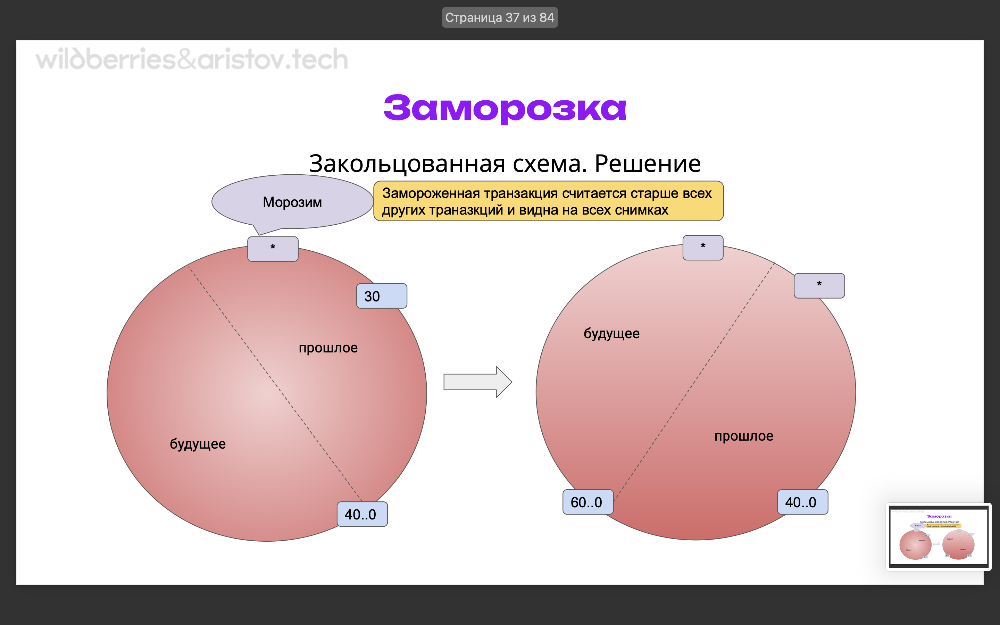

# Система очистки, журнал предзаписи

## Маршрут вебинара

- Vacuum - принцип работы и назначение, особенности очистки старых данных
- Autovacuum - предназначение, особенности работы
- TransactionID Wraparround - проблематика и решение
- WAL - write ahead log - механизм упреждающей записи - назначение, особенности работы, режимы синхронной/асинхронной записи на диск
- Checkpoint - назначение и принципы работы, влияние на производительность
- BackgroudWriter - особенности и важность использования

## Vacuum

### Проблематика

В результате мультиверсионности появляются новые версии строк. Соответственно, старые должны куда то деваться, они помечаются на удаление. Кто то должен очищать старые записи после MVCC. Очисткой занимается вакуум. А управлением вакуумом занимается автовакуум (запускает по определенным критериям). Но в определенные моменты он может вызывать огромный рост нагрузки.

https://aws.amazon.com/ru/blogs/database/a-case-study-of-tuning-autovacuum-in-amazon-rds-for-postgresql/

Что делает вакуум:

У нас могут быть незавершенные/отмененные транзакции (`ROLLBACK;`). Также у нас могут изменяться данные (`COPY ON WRITE`) или просто удаляться . Неиспользуемые в рамках незавершенных транзакций строки называются мертвыми (dead). Они, равно как и соответствующим им записи в индексах, будут присутствовать в БД вплоть да принудительного удаления - т.н. vacuum
Ну и пусть?
- занимают место на диске - мы поднимаем постранично по 8кб, а там лежит по 50% мертвых записей. Мы тратим лишние 50% времени на то, чтобы эти данные поднять
- занимают место в памяти - тк данные мы поднимаем в память - мы тратим и память
- участвуют в select и update where (незримо - запись существует и нужно проверить флаг ее состояния)
- достаточно ощутимо и негативно влияют на производительность  
Поэтому идея отключать вакуум и автовакуум - плохая!
 
В современных версиях PostgreSQL (начиная с 9-х) есть autovacuum (это демон который периодически запускает вакуум). Его можно и нужно использовать. Ручное использование vacuum еще возможно, но не рассматривайте его, пожалуйста, как альтернативу autovacuum. Вакуум проставляет наш usability map (у нас есть 3 вида файлов - с данными, с юзабилити мэп (пустые строчки, куда мы может писать), с юзабилити мэп(куда мы проставляем номера транзакций чтобы не было изоляций))

Use case для vacuum (без использования autovacuum):
- после массового batch insert - обновляет карты видимости и собирает статистику. В результать вставки огромного объема данных у нас не обновляется статистика и из-за этого постгрес, не зная об этом огромном объеме данных, может неправильно нам строить планы запросов
- если “пролетелиˮ с настройками autovacuum (при приближении к границе "заморозки" (см ниже VACUUM FREEZE))
- использование PostgreSQL в режиме DWH хранилища (данные только добавляются, ничего не обновляется)
- а больше то и придумать не могу
- https://www.postgresql.org/docs/current/sql-vacuum.html
 
Варианты использования вакуума:
- VACUUM (default)
- VACUUM ANALYZE выполняет очистку (VACUUM), а затем анализ (ANALYZE) всех указанных таблиц (если мы вставляем массово кучу данных, если мы не применим VACUUM ANALYZE, то не проставится карта видимости, не соберется статистика, постгрес не сможет нормально работать - и индексы не будут нормально работать, и тд)
- VACUUM VERBOSE (более отладочный вариант, чтобы посмотреть, что чистится, а что нет)
- VACUUM FULL - дефрагментация. нужен исключительный доступ без блокировок на запись (то есть другие транзакции не смогут ничего сделать). Создается новый файл!!! (до х2 места). На хайлоаде это невозможно!
- VACUUM FREEZE - экстренная заморозка (если мы пролетели с настройкой с автовакуумом, например)

За выполнением можно следить через:
- консоль в случае vacuum verbose (ручками довольно редко используют)
- или через системное представление [pg_stat_progress_vacuum](https://www.postgresql.org/docs/current/progress-reporting.html)

Вакуум настраивается достаточно точечно, можно выбрать вплоть до таблицы. [Дока по вакууму](https://www.postgresql.org/docs/current/sql-vacuum.html)


Ссылка на скрине - очень хорошая статья по вакууму!

Что делать при длинных транзакциях? Мертвые строчки не отпускаются в транзакциях вообще, вакуум не может их почистить. Считается, что длинные транзакции препятствуют работе вакуума. То есть вакуум приходит, видит длинную транзакцию и уходит, ничего не сделав. Подробнее на [воркшопе](https://aristov.tech/blog/idle-vs-idle-in-transaction/).

## Автовакуум

[Дока](https://www.postgresql.org/docs/current/routine-vacuuming.html) 
- Обязательно надо использовать! не верим 1эсникам
- Настраивается через параметры категории Autovacuum
- Инициируется выделенным фоновым процессом, т.е. он не работает все время и запускается в зависимости от различных порогов срабатывания
- Которые задаются как ну уровне кластера так и на уровне отдельных объектов (таблиц)
- запускает вакуум в режиме ANALYZE - еще и собирает статистику (поэтому после подгрузки большого количества строк обязательно использовать)
- обновляет карту видимости
- защищает систему от проблемы Transaction ID wraparound

Автовакуум не отключаем! Если и отключаем - то мы должны побайтно понимать, что мы делаем! Автовакуум просыпается раз в какое то время, смотрим, что нужно чистить, а что нет и вызывает вакуум. Вакуум смотрит косты - сколько вообще будет стоить очистка той или иной страницы (если дорого - может отказаться от очистки полностью). То есть сам автовакуум систему не грузит - он запускает процессы вакуума, они и грузят.  
Настройки автовакуума:
- vacuum_cost_delay: 
  - определяет задержку между выполнением шагов операции VACUUM. Операция VACUUM - это процесс удаления устаревших строк из таблиц и индексов, чтобы освободить место и поддерживать производительность. Установка значения vacuum_cost_delay добавляет задержку между операциями VACUUM, что может быть полезным для снижения нагрузки на систему во время выполнения VACUUM. Однако слишком большая задержка может увеличить время выполнения VACUUM.
  - практически все основано в постгресе на основе костов, но косты весьма относительны (причем от версии к версии формулы меняются)
- vacuum_cost_page_hit и vacuum_cost_page_miss:
  - определяют стоимость чтения страницы данных и индекса во время операции VACUUM. Операция VACUUM может читать данные и индексы, чтобы определить, какие строки можно удалить. Значения vacuum_cost_page_hit и vacuum_cost_page_miss определяют затраты на чтение страницы, когда она находится в кэше (попадание) и когда ее нет в кэше (промах), соответственно. Выбор правильных значений этих параметров позволяет управлять нагрузкой на систему во время выполнения VACUUM.
- vacuum_cost_page_dirty:
  - определяет стоимость изменения (записи) страницы во время операции VACUUM. При выполнении VACUUM часто возникает необходимость записать изменения (удаленные строки) на диск. Значение vacuum_cost_page_dirty определяет затраты на запись страницы данных. Увеличение значения этого параметра увеличивает стоимость записи страницы, что может быть полезным для управления нагрузкой на систему I/O во время VACUUM.
- vacuum_cost_limit:
  - задает лимит затрат для операции VACUUM. Когда общие затраты операции VACUUM превысят значение vacuum_cost_limit, VACUUM завершит текущую итерацию. Значение этого параметра влияет на продолжительность выполнения операции VACUUM и может помочь управлять ее нагрузкой на систему. Однако слишком низкое значение vacuum_cost_limit может привести к тому, что VACUUM будет завершаться слишком часто, не выполнив достаточно уборки.

Интересные кейсы - что происходит с вакуумом во время долгих транзакций. По теме - [тут](https://dba.stackexchange.com/questions/332402/is-harmfulness-of-idle-in-transaction-connections-a-myth) и [тут](https://aristov.tech/blog/idle-vs-idle-in-transaction/). Вкратце - пока идет транзакция - конкретно занятые ей строчки мы изменить не можем (логично - они еще заняты). При этом незанятые строчки вакуум может чистить.

## Autovacuum

- Обязательно надо использовать! не верим 1эсникам
- Настраивается через параметры категории Autovacuum
- Инициируется выделенным фоновым процессом, т.е. он не работает все время (при этом висит - все время, это же фоновый процесс) и запускается в зависимости от различных порогов срабатывания (классически - 200мс)
- Которые задаются как ну уровне кластера так и на уровне отдельных объектов
- запускает вакуум в режиме ANALYZE - еще и собирает статистику (на основании нее выбирается план запроса)(но подсчет статистики тоже не бесплатен!)
- обновляет карту видимости
- защищает систему от проблемы Transaction ID wraparound

Дока по [теме](https://www.postgresql.org/docs/current/routine-vacuuming.html)

Настройки:
- autovacuum_analyze_scale_factor: (порог срабатывания аналайза)
  - определяет, какую долю строк в таблице должен превысить объем изменений (INSERT, UPDATE, DELETE), чтобы автоматическая операция анализа (ANALYZE) была запущена автоматически. Анализ обновляет статистику о данных, которая используется оптимизатором запросов для выбора планов выполнения. Установка значения autovacuum_analyze_scale_factor позволяет настроить, какие изменения в данных будут считаться достаточно значительными для запуска анализа. Более высокое значение означает, что больше изменений может накопиться до запуска анализа.
  - то есть 2 порога срабатывания - или по количеству, или по процентам
  - допустим, у нас 100 строк, но они постоянно обновляются. То есть строчек то у нас немного, но они меняются.
- autovacuum_analyze_threshold: (задержка)
  - задает пороговое значение, после которого автоматическая операция анализа будет запущена. Пороговое значение определяет минимальное количество измененных строк, необходимых для запуска анализа. Если количество измененных строк превышает или равно значению autovacuum_analyze_threshold, то будет запущен анализ. Это позволяет управлять частотой запуска анализа в зависимости от объема изменений в данных.
- autovacuum_max_workers: (чем больше воркеров - тем больше тратим ресурсов) - обычно выделяется какое то количество ядер чисто под процессы, под обслугу
  - определяет максимальное количество параллельных рабочих процессов, которые могут выполнять операции автоматической уборки одновременно. Autovacuum - это процесс, который автоматически убирает устаревшие данные из таблиц и индексов для поддержания производительности и эффективности. Увеличение значения autovacuum_max_workers может позволить более эффективно обрабатывать несколько таблиц и сократить время выполнения уборки. Однако слишком высокое значение может также увеличить нагрузку на систему и ресурсами CPU.
- autovacuum_naptime: (сколько спим между процессами уборки - чем меньше спим - тем аггрессивнее процесс уборки - классически просыпается раз в 15 секунд)
  - определяет интервал времени в секундах между итерациями операции автоматической уборки. Итерации процесса Autovacuum происходят циклически с заданным интервалом. Значение autovacuum_naptime задает, как часто процесс Autovacuum будет проверять таблицы на предмет необходимости уборки. Увеличение значения autovacuum_naptime может уменьшить нагрузку на систему, но может также увеличить задержку в обработке устаревших данных.
- autovacuum_vacuum_cost_delay:
  - определяет задержку между выполнением шагов операции VACUUM в рамках автоматической уборки. Значение autovacuum_vacuum_cost_delay добавляет задержку между операциями VACUUM, что может быть полезным для снижения нагрузки на систему во время выполнения автоматической уборки. Однако слишком большая задержка может увеличить время выполнения операции уборки.
- autovacuum_vacuum_cost_limit:
  - задает лимит затрат для операции VACUUM в рамках автоматической уборки. Когда общие затраты операции VACUUM превысят значение autovacuum_vacuum_cost_limit, Autovacuum завершит текущую итерацию уборки. Значение этого параметра влияет на продолжительность выполнения операции уборки в автоматическом режиме. Слишком низкое значение autovacuum_vacuum_cost_limit может привести к частому завершению операций уборки.
- autovacuum_vacuum_insert_scale_factor:
  - определяет, какая часть новых вставок в таблицу должна превысить объем существующих строк, чтобы автоматическая операция уборки (VACUUM) была запущена. Цель уборки в данном случае - предотвратить накопление устаревших данных в таблицах, особенно если вставки происходят большими пакетами. Установка значения autovacuum_vacuum_insert_scale_factor позволяет настроить, когда новые данные должны быть убраны, чтобы поддерживать эффективное использование места.
- autovacuum_vacuum_insert_threshold:
  - определяет пороговое значение, после которого автоматическая операция уборки будет запущена в результате вставок. Если количество новых вставок превышает или равно значению autovacuum_vacuum_insert_threshold, то будет запущена автоматическая операция уборки. Это позволяет управлять частотой запуска уборки на основе вставок новых данных.
- autovacuum_vacuum_scale_factor:
  - определяет, какая часть таблицы должна превысить объём удалённых (устаревших) строк, чтобы автоматическая операция уборки (VACUUM) была запущена. Операция уборки удаляет устаревшие данные из таблиц для освобождения места и поддержания производительности. Установка значения autovacuum_vacuum_scale_factor позволяет настроить, какой процент устаревших данных в таблице считается достаточно значительным для запуска операции уборки.
- autovacuum_vacuum_threshold:
  - задаёт пороговое значение, после которого автоматическая операция уборки будет запущена в результате общего объёма устаревших данных в таблице. Если общий объём устаревших данных превышает или равен значению autovacuum_vacuum_threshold, то будет запущена автоматическая операция уборки. Это позволяет управлять частотой запуска уборки на основе общего объёма устаревших данных.
- autovacuum_work_mem: (имеет смысл настроить побольше если он работает с большими объемама, но сильно большое значение тоже не имеет особого значения)
  - определяет объём оперативной памяти, который будет выделен для каждого параллельного процесса Autovacuum при выполнении операции уборки. Увеличение значения autovacuum_work_mem может ускорить выполнение уборки за счёт более эффективного использования памяти для временных операций. Однако слишком большое значение может привести к увеличению использования памяти и нагрузке на систему.
- log_autovacuum_min_duration: (логирование долгих операций автовакуума)
  - определяет минимальное время в миллисекундах, которое операция уборки должна выполняться, чтобы информация о ней была записана в журнал (лог). Установка значения log_autovacuum_min_duration позволяет вести журнал только для длительных операций уборки, что помогает отслеживать производительность и обнаруживать возможные проблемы. Если выставлено значение 0, то все операции уборки будут записаны в журнал.

Желательно настаивать максимально агрессивно. Пример настроек:
- log_autovacuum_min_duration = 0
- autovacuum_max_workers = 16 (побольше работников)
- autovacuum_naptime = 15s (поменьше спим)
- autovacuum_vacuum_threshold = 25
- autovacuum_vacuum_scale_factor = 0.1
- autovacuum_vacuum_cost_delay = 10 (минимизируем косты для вакуума)
- autovacuum_vacuum_cost_limit = 1000
Но не забывать что autovacuum может стать источником проблем, например высокий ввод-вывод: https://www.postgresql.org/docs/15/runtime-config-autovacuum.html

Желательная стратегия - поработал-уснул (чем все время работал бы). Если мы видим что вакуумы постоянно работают (это один из примеров мониторинга) - так не должно быть, периодически воркеры должны простаивать!

## Проблема - Transaction ID wraparound. Заморозка

Под номер транзакции в PostgreSQL выделено 32 бита (около 4 млрд). При активной работе сервера - нагрузке 1000 транзакций в секунду (а это совсем слабенький сервер) переполнение произойдет всего через полтора месяца непрерывной работы. Казалось бы произойдет переполнение и ладно, но! эта проблема называется [Transaction ID wraparound](https://blog.sentry.io/transaction-id-wraparound-in-postgres/). И сейчас мы разберем в чем конкретно проблема и механизм её решения - заморозка.

Механизм многоверсионности полагается на последовательность нумерации — тогда из двух транзакций транзакцию с меньшим номером можно считать начавшейся раньше. То есть транзакции с бОльшим номером происходят всегда в будущем. С помощью разницы номеров мы решаем все проблемы с изоляцией. Таким образом схема со снепшотами (мгновенный снимок БД, чтобы тразнакции не мешали друг другу) работает нативно. Поэтому нельзя просто так обнулить счетчик и продолжить нумерацию заново.

Почему под номер транзакции не выделено 64 бита — ведь это полностью исключило бы проблему? Дело в том, что в заголовке каждой версии строки хранятся два номера транзакций — xmin и xmax. Заголовок и так достаточно большой, минимум 23 байта (доки) (то есть условно строчка 8 байт, а заголовок к ней - 23, в него входит 2 по 4 - xmin, xmax), а увеличение разрядности привело бы к его увеличению еще на 8 байт. Это уже совсем ни в какие ворота. П.С. в платной версии PostgresPro, Тантор, Proxima DB есть вариант с 64 битными транзакциями. Необходимо запрашивать пресейл отдельно. Есть огромные минусы (плюсы должны перевешивать):
- не работают стандартные внешние утилиты
- несовместимость бинарных выгрузок

Комьюнити пока не пришла к единому решению по поводу 64бит

Какое решение? Закольцованная схема!

  
  
  

У нас есть относительный номер транзакции, допустим 10. И мы считаем что 2млрд номеров находятся в будущем, а 2млрд - в прошлом. Через некоторое время приходит другая транзакиция 30. ВОзраст транзакции - 30-10=20. ЧЕрез некоторое время приходит еще транзакция и 10 транзакция оказывается в далеком прошлом. В какой то момент приходит еще транзакция (на картинках - 60..0) и транзакция 10 оказывается в будущем! В этой ситуации постгрес лдомается и переходит в аварийный режим (по факту начинает предупреждать нас об этом немного раньше, на 90%). постгрес не может понять, как так - транзакция была в глубоком прошлом и стала в будущем.  
Что для этого придумано: как только какая то транзакция становится сильно старше всех остальных, мы этот номер замораживаем. Этот номер будет виден все и считатья самым старым. Теперь, сколько бы не было транзакций - номер считается самым старым. Наш механизм вакуум как раз и занимается заморозкой транзакций (`vacuum freeze`).

Так сделано чтобы мы могла работать со снимками данных из будущих транзакций и не было проблем с аномалиями. Через какое то время приходит новая транзакция, потом еще и еще. Через какое то время наша первая транзакция оказывается в будущем. Это и называется Transaction ID wraparound. В этой ситуации постгрес останавливается и предлагает эту проблему как то аварийно решать. То есть мы должны не допустить такой ситуации, чтобы какая то из прошлых транзакций оказалась в будущем. Если хоть раз хоть одна транзакция оказалась в будущем (незамороженная) - мы проиграли (постгрес остановится - база не принимает коннекты).
 
Чтобы решить эту проблему - была придумана заморозка. Когда ситуация начинает приближаться - мы эти записи морозим. Проставляем биты отмены фиксации транзакции - так постгрес понимает, что эта транзакция начинает считаться старше всех остальных. Эта транзакция становится видна на всех снимках данных. Автовакуум помимо удаления старых записей - еще и морозит.

Заморозка:
- Для того, чтобы пометить номер транзакции xmin как замороженный, выставляются одновременно оба бита-подсказки — бит фиксации и бит отмены. Так как транзакция не может быть одновременно выполнена и отменена - постгрес понимает что в этой ситуации данная транзакция самая старая.
- Одна из задач автовакуума пробегать и замораживать старые строки. Интересный кейс - как часто пробегать и замораживать (мы не можем каждый миллион записей пробегать наш миллиард записей)
- Замороженная версия строки считается старше любых обычных данных и всегда видна во всех снимках данных
 
Есть 3 параметра настройки (3 порога срабатывания):
- SHOW vacuum_freeze_min_age; (возраст, когда к нам заглянет автовакуум) - минимальный порог, постгрес лениво заходит и замораживает
  - плохо делать очень маленьким для активно меняющихся данных - двойная работа автовакуума. В таких режимах мы вообще можем не дойти до 2млрд
- SHOW vacuum_freeze_table_age;
  - вакуум пробегает полностью заполненные и неменяющиеся странички, куда обычно не заходит. Данные не меняются - не проиходит порогов срабатывания. Когда порог срабатывает - автовакуум отправляет туда вакуум, чтобы тот прошел и заморозил старые данные
- SHOW autovacuum_freeze_max_age;
  - для аварийной заморозки (когда скоро мы заморозимся), иначе: Если возникнет ситуация, при которой еще не замороженная транзакция рискует попасть в будущее, PostgreSQL аварийно остановится, скорее всего перейдя в ридонли, чтобы предотвратить возможные проблемы. Такое происходит когда база старая и никто туда не заходит

Из-за чего это может произойти (аварийной заморозки)? Есть разные причины.
- Может быть отключена автоочистка, и обычная очистка тоже не запускается. Я уже говорил, что так делать не надо, но технически это возможно
- Даже включенная автоочистка не приходит в базы данных, которые не используются (отсутствие мониторинга старых таблиц)
- Как мы видели очистка может пропускать таблицы, в которые данные только добавляются, но не удаляются и не изменяются
- оооочень долгие транзакции (транзакция держит таблицу - и выполняется 2млрд других транзакций)
- оооочень долгие блокировки

Как это выглядит:


Также:
- когда остается 10млн транзакций - начинают сыпаться ворнинги
- когда остается 1млн - база переходит в ридонли

Что делать?

Конечно вакуум, скорее всего вакуум фулл. Можно из [консоли](https://www.postgresql.org/docs/current/app-vacuumdb.html) в n jobs. 

Если не запускается сервер, то:
```bash
/usr/lib/postgresql/16/bin/postgres --single -D /var/lib/postgresql/16/main --config-file="/etc/postgresql/16/main/postgresql.conf"  # запускаем в сингл моде
select current_database(); # для каждой БД открывать и вакуумировать + template 
SELECT set_config('log_statement_stats', 'on', false);  # отключаем статистику логирования
vacuum full;
```

Чтобы дойти до этой проблемы - нужно постараться (настройки как то выкрутить или сделать по настоящему дикий хайлоуд с долгими транзакциями). Ну и когда автовакуум отключен.
 
Еще раз по отключению автовакуума: (40:00)

Позволяет убрать нагрузку с дисков, но есть несколько моментов, которые в долгосрочной перспективе выйдут боком и сделают только хуже.
- Самый простой и очевидный (для DBA) момент – это то, что статистика планировщика перестает собираться. Потому что автовакуум не только чистит таблицы, а еще и собирает статистику о распределении данных. И эта статистика используется планировщиком для того, чтобы строить оптимальные планы для запросов.
- Как только мы выключаем вакуум, таблицы и индексы перестают чиститься. И они начинают распухать. В них появляются мусорные строки.
- Следствием этого является то, что область shared buffers, где размещаются все оперативные данные для работы базы данных (это таблицы, индексы), начинается использоваться неэффективно. В ней находятся те самые мусорные строки. И чтобы запросу прочитать какие-то данные, постгресу нужно загружать страницу с мусорными данными и помещать ее в shared buffers.
Все это очень плохо с точки зрения общей производительности. Производительность запросов снижается. И в долгосрочной перспективе отключение вакуума – это гарантированно плохие спецэффекты в БД.

https://github.com/lesovsky/ConferenceStuff/tree/master/2016.highload

##  background_writer (41:00)

Допустим, у нас заполнены все буферы в памяти. В буфер подтягивается информация с диска, с диском напрямую мы не работаем, а читаем в буфер. Допустим, в какой то момент у нас заполнены все буферы в памяти. У нас есть закрепленный буфер, количество обращений к нашему буферу (растет до 5). Также есть механизм victim page - пробегается по буферам, уменьшает количество обращений на 1, если где то цифра достигает 0 и буфер не закреплен (то есть не используется какой то текущей транзакцией) - если буфер не грязный, то на его место просто поднимаются данные из базы, если грязный - вытесняется на диск и на его место поднимаются данные с диска.

Как долго наши данные из буферного кэша могут находиться в памяти? То есть мы данные получили, изменили. Данные меняются в памяти (в нашем буферном кэше). Соответственно нам нужен какой то процесс, который будет их оттуда вытеснять на диск (bgwriter). bgwriter вместо victim page в бэкграундном режиме (раз в 200мс) пробегает и смотрит, чем меньше остается пустых буферов - тем быстрее он пытается эти данные очистить чтобы у следующих процессов были свободные буферы для работы. То есть bgwriter нужен для того чтобы у нас была память, куда данные бы поднимались с диска.

То есть нам нужен какой то журнал изменений на случай смерти сервера, чтобы потом мы могли восстановиться. Кроме того, у нас есть еще несколько механизмов (несколько процессов), которые нам помогут с записью файлов на диск:
- фоновая запись. Просыпается раз в определенное время, смотрим, нужно ли почистить память (есть набор буферов, который мы поднимаем с диска - смотрим, сколько их остались - смотрим, горячие ли данные и начинаем вытеснять). У нас уменьшается счетчик использование и, если счетчик 0 и данные не грязные - можно их потихоньку записывать на диск.

Здесь что важно: при активном использовании простого решения (например, "запиши 200 страниц") нам может не хватать. Поэтому у нас есть такой параметр как bgwriter_lru_multiplier (можем заставлять процесс фоновой записи работать более аггрессивно). Еще про параметры:
- bgwriter_lru_maxpages:
 - определяет максимальное количество страниц данных, которые фоновый процесс записи (Background Writer) может вытеснить из буферного кэша за одну итерацию. В PostgreSQL страницы данных находятся в буферном кэше для оптимизации доступа к данным. Когда буферный кэш заполняется, необходимо вытеснить некоторые страницы, чтобы освободить место для новых данных. Увеличение значения bgwriter_lru_maxpages позволяет вытеснять больше страниц за итерацию, что может помочь управлять памятью и снизить накладные расходы на I/O, но может также увеличить нагрузку на дисковую систему.
- bgwriter_lru_multiplier:
  - определяет коэффициент, который умножается на bgwriter_lru_maxpages для вычисления реального числа страниц, которые фоновый процесс записи может вытеснить. Значение bgwriter_lru_maxpages умножается на bgwriter_lru_multiplier для получения конечного числа страниц, которые будут вытеснены из буферного кэша за итерацию фоновой записи. Это позволяет динамически регулировать количество вытесняемых страниц в зависимости от текущей загрузки системы и доступной памяти.
  - если свободных буферов много - проснулся, посмотрел, спит дальше. Если заканчиваются - работает агресивней. Своего рода предохранительный клапан для того чтобы не закончились свободные буферы.
- bgwriter_delay: (сколько мы спим между перезапусками процесса - процесс записи не работает постоянно, а периодически просыпается)
  - определяет задержку в миллисекундах между итерациями процесса фоновой записи данных (Background Writer). Background Writer - это фоновый процесс, который отвечает за запись изменений из буферного кэша на дисковое хранилище. Установка значения bgwriter_delay позволяет добавить задержку между итерациями фоновой записи, что может помочь управлять нагрузкой на дисковую систему. Однако слишком большая задержка может привести к тому, что запись данных на диск будет выполняться менее эффективно.
- pg_stat_bgwriter:
  - представление (view) в PostgreSQL, которое предоставляет статистику о работе фонового процесса записи данных (Background Writer). Это представление позволяет мониторить различные метрики и статистику, связанную с фоновой записью данных, такие как количество выполненных записей, запросов на запись, и другие показатели. Вы можете использовать pg_stat_bgwriter для анализа производительности фоновой записи и выявления возможных проблем. 

Это важно потому что у нас есть второй процесс который вытесняет - pg_stat_checkpointer (появился в 17 PG). Ссылки
- [раз](https://pganalyze.com/blog/5mins-postgres-17-pg-stat-checkpointer-bgwriter)
- [два](https://dataegret.de/2017/03/deep-dive-into-postgres-stats-pg_stat_bgwriter/)
 
Настройки:
- bgwriter_delay = 200ms
- bgwriter_lru_maxpages = 100
- bgwriter_lru_multiplier = 2.0

То есть фоновая запись - это у нас такое равномерное вытеснение прохладных записей из памяти для того, чтобы освободить там место для наших горячих данных.

Алгоритм:
- уснуть на bgwriter_delay
- если в среднем за цикл запрашивается N буферов, то записать N * bgwriter_lru_multiplier ≤ bgwriter_lru_maxpages грязных буферов
 
## Чекпойнты и влияние на производительность

Соответветсвенно, и контрольная точка. То есть вся информация записывается в WAL-файлы (получили транзакцию, хотим ее фиксировать - сначала она фиксируется в WAL-файле, и только потом мы говорим окей). Данные в памяти постоянно меняются, на диске изменения не всегда синхронизируются. При смерти нам все WAL-файлы нужно накатить с определенной точки. Но сколько их хранить? Поэтому у нас есть чекпоинтер - в момент контрольной точки у нас помечаются все измененные буферы, которые нужно сохранить. Делается отметка в WAL-файлах, что мы начинаем процесс записи этих измененных буферов. И все эти буферы начинают записываться на диск пока полностью не запишутся.

Зачем она нужна? Можно же с самого начала накатить все wal...
- сколько может страница измененная лежать в буферном кэше?
- очень большой объем информации хранить
- большое время восстановления

Нужен определенный баланс, как часто делать контрольную точку. Если мы будет делать ее очень часто - у нас одни и те же данные будут постоянно фиксироваться на диске. Если слишком редко - то будет расти количество наших WAL-файлов для восстановления после сбоев. То есть нужна какая то золотая середина (допустим, 15-30 минут), как часто ее делать. 

Чекпоинтер (как и bgwriter) только dirty буферы пишет на диск - остальные нет смысла писать, тк они неизмененные. Пишется не построчно, а по блокам (классически - 8кб). Изменять по строчке и каждый раз записывать 8кб - неэффективно. Гораздо эффективней закэшировать и затем записать все разом. То есть у нас этот грязный буфер в памяти, мы туда пишем все изменения и есть 2 варианта, как его записать на диск - bgwriter или чекпоинт. Нужен баланс между контрольной точкой (как часто она используется) и сколько WAL-файлов у нас лежит.

Как происходит запись контрольной точки:  
Классически (по умолчанию) `checkpoint_timeout=5min` , можно увеличить до 15 (не так часто происходит краш сервера базы данных). Дальше у нас есть `checkpoint_completion_target` - сколько по времени мы размазываем запись (от 0 до 1, где 1 - это 100%). Мы не пишем все в один момент потому что если мы одновременно записали 100гб измененных данных и попробовать записаться их сразу на диск - серевер встанет. А так у нас есть checkpoint_timeout * checkpoint_completion_target = 4.5 минуты на запись буферов. Оцениваем, объем (допустим, 100гб), делим на количество секунд (270) - и будем писать 300мб в секунду на диск, размазывая нагрузку. Так мы не вызываем единого всплеска записи. Это важный момент - пока мы не записали все буферы, мы не можем гарантировать восстановление.

Таким образом обеспечивается баланс между надежностью и производительностью.

Соответственно, работаем так:
1. помечаются буферы на удаление (грязные буферы на сброс)
2. сбрасывается буфер мультитранзакции (наши wal-файлы)
3. потихоньку наши буферы сбрасываются. Как только буфер вытеснен - он уже не грязный.
4. помеченные страницы постепенно записываются
5. пометка убирается из заголовка буфера


Выглядит это примерно так: начали запись контрольной контрольной точки. Позаписывали, когда завершился чекпоинт - сделали фиксацию последнего завершенного чекпоинта. После фиксации чекпоинта нам достаточно wal-файлов для восстановления. Предыдущие чекпоинты нам уже не нужны - мы знаем, что на эту точку у нас все изменения зафиксированы, и все остальное есть в WAL-файлах.


LSN - long sequence number, 64 бита (то есть уже никогда не переполнится). Также есть утилита pg_control о состоянии кластера.

Контрольная точка - причины срабатывания
- По истечении времени (временные чекпойнты): Когда время между чекпойнтами достигает заданного значения, PostgreSQL может инициировать процесс чекпойнта.
- По достижении определенного объема изменений (значимые чекпойнты): Когда объем изменений, записанных в журнал транзакций, становится слишком большим (скопилось слишком много WAL-файлов), PostgreSQL может запустить чекпойнт, чтобы уменьшить количество несогласованных данных в журнале. (не может быть ситуации - WAL-файлы исчезли, а чекпоинт еще не завершен). Это плохо тк может быть всплеск записи, что может негативно сказаться на нашей производительности. То есть нам нужно чтобы у нас хватало WAL-файлов на момент чекпоинтов (между чекпоинтами). Это экстренный чекпоинт, он ничего не размазывает, а прям сразу пишет. Это пик нагрузки, что печально
- Во время завершения транзакции: При завершении некоторых длительных транзакций (например вставляем по 100млн записей) PostgreSQL может провести чекпойнт, чтобы зафиксировать изменения в таблицах и индексах.
- При вызове команды CHECKPOINT: Администратор базы данных может также вручную инициировать чекпойнт с помощью команды CHECKPOINT. Например, когда создаем бэкап или делаем физическую реплику.

Параметры, которые могут повлиять на производительность:
- `checkpoint_flush_after`: определяет, сколько записей в журнале транзакций (WAL - Write-Ahead Logging) должно быть записано (может быть недозаписано) перед тем, как чекпойнт считается завершенным. После завершения чекпойнта, все данные, изменения которых были записаны в журнале до `checkpoint_flush_after`, считаются безопасно сохраненными на диске. Значение по умолчанию для этого параметра - 0, что означает, что чекпойнт считается завершенным, как только все данные изменений, связанные с чекпойнтом, записаны в журнал. Увеличение значения параметра может помочь улучшить производительность чекпойнтов, за счет уменьшения частоты записи на диск, но при этом возможна потеря более свежих данных при сбое.
  - особо не тюнят
- `maxwritten_clean`: показывает номер самой последней записи в журнале транзакций, которая была успешно записана на диск во время чекпойнта. Значение этого параметра используется для определения точки в журнале, до которой можно проводить "чистку" (вычищение) устаревших файлов журнала. Это позволяет освободить дисковое пространство, занятое старыми данными, которые больше не нужны для восстановления. Значение `maxwritten_clean` инкрементируется каждый раз, когда успешно записывается новая запись во время чекпойнта.

Утилита `control_data` - утилита, которая собирает контрольную информацию с кластера (обычно используется когда постгрес уже упал)
- Версия PostgreSQL: Утилита сообщает о версии PostgreSQL, используемой в данном кластере.
- Идентификатор кластера: Идентификатор, который однозначно идентифицирует данный кластер базы данных.
- Дата и время создания кластера: Указывает на дату и время создания кластера.
- Уровень совместимости: Указывает на уровень совместимости с предыдущими версиями PostgreSQL.
- Размер страниц: Размер используемых страниц в байтах (обычно 8 кБ).
- Информация о чекпоинте: Выводит информацию о последнем выполненном чекпоинте, включая временные метки и номера транзакций.
- Минимальный номер транзакции: Минимальный номер активной транзакции в кластере.
- Максимальный номер транзакции: Максимальный номер транзакции, когда были собраны контрольные данные.
- Параметры управления: Показывает значения некоторых важных параметров конфигурации кластера, таких как максимальное количество соединений и директории для данных.
- Статус WAL: Информация о Write-Ahead Log (журнал записи перед записью),

## Восстановление после сбоев (53 00)

Логичный вопрос - что будет если сбой наступит во время выполнения чекпоинта? Нам понядобятся все (!) wal-файлы с начала предыдущего чекпоинта. Как происходит запуск сервера - он видит что он в сбою, берет файлы журнала с нужной контрольной точки , берет LSN и все изменения в wal-файлах начиная с этого LSN фиксируются на диск. После этого происходит чекпоинт и после этого открывается доступ к базе. Именно поэтому есть формула, сколько нам нужно хранить WAL-файлы.


Механизм восстановления при старте сервера после сбоя:
1. найти LSN0 начала последней ЗАВЕРШЕННОЙ контрольной точки
2. применить каждую запись журнала, начиная с LSN0 , если LSN записи больше, чем LSN страницы
3. перезаписать нежурналируемые таблицы init-файлами  (unlogged-файлы - журналы и таблицы, изменения в которых не записываются в wal-файлы, при рестарте постгрес обнулит эти файлы)
4. выполнить контрольную точку

Настройка частоты срабатывания:
- checkpoint_timeout = 5min
- max_wal_size = 1GB , как его посчитать: мы смотрим, сколько мы генерируем вал-файлов между чекпоинтами и делаем х2, может с небольшим запасом.

Сервер хранит журнальные файлы необходимые для восстановления:
- (2 (1 с 12 версии) + checkpoint_completion_target) * max_wal_size
- еще не прочитанные через слоты репликации
- еще не записанные в архив, если настроена непрерывная архивация
- не превышающие по объему минимальной отметки
Настройки:
- max_wal_size = 1GB
- min_wal_size = 100MB
- wal_keep_segments = 0 (до 13 версии)
- https://pgpedia.info/m/max_slot_wal_keep_size.html

Рекомендация по настройке - min_wal_size и max_wal_size сделать одинаковыми, смысл что мы можем переиспользовать вал файлы, это значительно быстрее чем искать свободное место
 
Тюнинг: Checkpoint сделать меньше:
- плюс - меньше нам нужно WAL файлов
- плюс - меньше времени на восстановление кластера
- минус - чаще страницы будут вытеснены на диск - а в них может продолжать идти запись
- минус - возможна неравномерная нагрузка на диск (чем реже чекпоинт - тем равномернее нагрузка)
- минус - скорее всего падение производительности

При увеличении времени на чекпойнт все в обратную сторону. Обычно делают от 5 до 15 минут
 
Неочевидная взаимосвязь: Checkpoint ↔ bgwriter
- чем больше обработает bgwriter, тем меньше работы checkpoint
- но скорее всего лишние записи часто меняющихся данных

Имеет смысл анализировать:
- равномерность нагрузки на диск
- статистику bgwriter
- статистику checkpoint
- разогретость shared buffers - usage count >3 от общего объема - это плохо, у нас данные постоянно гретые

Тюнинг:
- Соответственно нужен баланс между WAL и checkpoint
- Смотрим размер WAL файлов за чекпойнт и устанавливаем х2
- Ну или уменьшаем время checkpoint
- Учитываем аффект чекпойнта на дисковую подсистему
 
## WAL. Устройство и варианты тюнинга (1:00:00)

Допустим, у нас есть грязные буферы, на диск они не записаны, а сервер умирает. Что делать?

WAL (write ahead log), журналы предзаписи. Сначала информация записывается туда, а потом говорится ок нашему клиенту. Попадает туда практически вся информация кроме временных таблиц, нежурналируемых таблиц - в общем, кроме того, что мы сам говорим что не хотим чтобы у нас туда писалось. Это обеспечивает нам надежность (durability) - то есть все транзакции, которые были у нас зафиксированы, должны у нас сохраниться. Есть асинхронный режим.  
Основная задача - возможность восстановления согласованности данных после сбоя 
Механизм
- при изменении данных действие также записывается в журнал журнальная запись попадает на диск раньше измененных данных
- восстановление после сбоя — повторное выполнение потерянных операций с помощью журнальных записей  
Что туда попадает
- изменение любых страниц в буферном кэше
- фиксация и отмена транзакций - буфере XACT
- НЕ ПОПАДАЮТ - временные и нежурналируемые таблицы
 
Уровни журнала: (Настройка `wal_level = logical`, изменение требует рестарта сервера)
- minimal - восстановление после сбоя (обычно не используется)
- replica (по умолчанию с 10 версии)
  - восстановление из резервной копии, репликация
  - \+ операции массовой обработки данных, блокировки
- logical (еще выше, еще больше места) (просто так до этого уровня повышать не рекомендуется, смысла нет - это достаточно большой оверхед)
  - логическая репликация
  - \+ информация для логического декодирования
  - значительно больше размером

Характер нагрузки: так как WAL файлы пишутся последовательно, то есть определенный характер нагрузки этих файлов:
- Постоянный поток записи:
  - характер нагрузки отличается от остальной системы
  - последовательная запись, отсутствие случайного доступа
  - файлы по 16 Мб (можно изменить)
  - при высокой нагрузке — размещение на отдельных физических дисках (символьная ссылка из $PGDATA/pg_wal)
- Редкое чтение:
  - при восстановлении
  - при работе процессов walsender, если реплика не успевает быстро получать записи
Один из вариантов снятия нагрузки - вынести на отдельный диск запись наших wal файлов (писать их отдельно)

Пишется все достаточно просто. WAL файлы у нас сразу с контрольной суммой, в отличии от файлов данных. Есть лсн, данные записываются последовательно, следующий пакет ссылается на предыдущий чтобы понимать, где он находится (тк данные могут быть разной длины, не по 8 кб). Писаться могут много разных менеджеров ( `$/usr/lib/postgresql/17/bin/pg_waldump -r list` - список менеджеров), не только чекпоинтер. WAL пишется тоже не напрямую, а через буфер. Рекомендация - сразу устанавливать большой размер min_wal_size && max_wal_size 4-32 GB


Соответственно, что у нас происходит: у каждой странички есть LSN, пишется он в вал-файл, пишутся транзакции и потом через буфер пишется в наши вал-файлы. После этого уже вытесняется в базу.

Также необходимо учитывать, что у WAL файлов есть еще и WAL буферы (небольшие). Через них мы заставляем ОС писать, но у операционки тоже есть кэш fsync. Так что пока попадет на ЖД - пройдет 3 кэша и 2 буфера.

Есть 5 уровней синхронного коммита (более подробно будет на лекции по репликации).


Синхронизация с диском
- данные должны дойти до энергонезависимого хранилища через многочисленные кэши
- СУБД сообщает операционной системе способом, указанным в wal_sync_method
- надо учитывать аппаратное кэширование

Настройки
- fsync VS fdatasync - разница до 30%
- show [fsync](https://www.postgresql.org/docs/current/runtime-config-wal.html#GUC-FSYNC);
- show [wal_sync_method](https://www.postgresql.org/docs/current/runtime-config-wal.html#GUC-WAL-SYNC-METHOD); - синхронизация с дисковыми кешами в ОС
- утилита [pgtestfsync](https://www.postgresql.org/docs/current/pgtestfsync.html) помогает выбрать оптимальный способ

Нюансов масса - и как смонтированы диски, и какая у нас ОС и тд.

Режимы записи (на самом деле 5 режимов - более подробно на лекции по репликации)
- синхронный режим
- асинхронный режим
 
## Режим синхронной записи

Пишем сначала в WAL файл, потом говорим "окей, транзакция", но даже здесь можно указать пачки по 5 транзакций.  
Алгоритм:
- при фиксации изменений сбрасывает накопившиеся записи из буфера WAL, включая запись о фиксации
- ждет commit_delay, если активно не менее commit_siblings транзакций  
Характеристики:
- гарантируется долговечность
- увеличивается время отклика  
Настройки:
- synchronous_commit = on  
Можно писать пачками:
- commit_delay = 0
- commit_siblings = 5

Режимы синхронной записи: (напрямую связаны с режимами репликации)
- `commit_delay`: Этот параметр в PostgreSQL позволяет задать задержку перед фактическим записыванием данных на диск после фиксации транзакции. Вместо того, чтобы писать на диск сразу же после коммита, PostgreSQL будет ждать указанное количество миллисекунд перед тем как выполнять запись. Это может помочь объединить несколько записей для более эффективной записи на диск. Однако, этот параметр может увеличить задержку перед тем, как данные физически сохранятся на диске, что повышает риск потери данных в случае сбоя.
- `commit_siblings`: Минимальное число одновременно открытых транзакций, при котором будет добавляться задержка commit_delay. Чем больше это значение, тем больше вероятность, что минимум одна транзакция окажется готовой к фиксированию за время задержки. По умолчанию это число равно пяти.
 
## Режим асинхронной записи 

Пишем раз в какой то цикл (допустим, раз в 200мс). Гарантируется что все будет согласовано, но не факт, что долговечно (можем потерять последние 3 × wal_writer_delay изменений). Можем включить синхронный режим (медленней, но ничего не теряется) на банковские транзакции, а асинхронный (более быстрый, но можем что то потерять) - на какие нибудь лайки в банковском приложении.

Алгоритм:
- циклы записи через wal_writer_delay
- записывает только целиком заполненные страницы
- если новых полных страниц нет, то записывает последнюю до конца  
Характеристики:
- гарантируется согласованность, но не долговечность
- зафиксированные изменения могут пропасть (3 × wal_writer_delay)
- уменьшается время отклика  
Настройки:
- synchronous_commit = off (можно изменять на уровне транзакции) (то есть можно включить асинхронный режим, а на чувствительные транзакции включить синхронный - тогда чувствительные транзакции будут защищены)
- wal_writer_delay = 200ms  


Параметры
- full_page_writes: (можем писать по 8кб, но проще включить режим компрессии wal_compression чтобы поменьше их писать)
 - on: Включает включение полных страниц в записи журнала (по умолчанию). Это делает восстановление более надежным, но может увеличивать объем журнала и накладывать небольшие затраты на производительность из-за больших записей.
  - off: Позволяет включать только измененные биты в записи журнала, что экономит место в журнале, но делает восстановление сложнее и менее надежным.
- wal_log_hints:
  - влияет на то, будут ли записываться подсказки для оптимизации журнальных записей. Подсказки содержат дополнительную информацию для улучшения производительности и эффективности записи в журнал. Когда параметр установлен в on, PostgreSQL может использовать определенные подсказки, чтобы улучшить структуру записей WAL и уменьшить накладные расходы на запись. Однако эффективность подсказок может зависеть от конкретной рабочей нагрузки и аппаратной платформы.
- wal_compression:
  - позволяет включить сжатие журнальных записей перед записью в журнал. Когда параметр установлен в on, PostgreSQL будет использовать сжатие данных перед их записью в журнал, что может сократить использование дискового пространства. Однако сжатие может потребовать дополнительных ресурсов CPU, особенно при высоких нагрузках на запись.
- wal_init_zero:
  - указывает, следует ли инициализировать новые страницы журнала нулевыми байтами. При установке в on, PostgreSQL будет заполнять новые страницы журнала нулевыми байтами перед записью на диск. Это может помочь предотвратить утечки старых данных, если страница не будет полностью перезаписана при следующей записи. Однако это также может увеличить нагрузку на дисковую подсистему.
- wal_recycle:
 - указывает, следует ли перезаписывать существующие журнальные файлы, когда пространство в журнале исчерпывается. Если параметр установлен в on, PostgreSQL будет пытаться перезаписать существующие файлы журнала, чтобы избежать исчерпания дискового пространства. Это может быть полезно, чтобы избежать ситуации, когда база данных остановится из-за отсутствия места для записи журнала. Однако при включении этой опции данные в журнале могут перезаписываться, что усложнит процесс восстановления.
- wal_buffers:
  - определяет количество буферов (страниц памяти), выделенных для кэширования записей журнала перед их записью на диск. Когда PostgreSQL генерирует записи журнала, они временно кэшируются в буферах, прежде чем будут записаны на диск. Это позволяет сгруппировать записи в пакеты и уменьшить накладные расходы на запись. Увеличение значения wal_buffers может улучшить производительность записи журнала, особенно на системах с высокой нагрузкой на запись.
- wal_writer_flush_after:
  - определяет количество записей журнала (WAL records), которые WAL writer будет записывать в одной итерации, прежде чем выполнить синхронную запись на диск. Синхронная запись означает, что данные действительно записываются на диск и подтверждается операционной системой. Увеличение значения wal_writer_flush_after может уменьшить количество операций записи на диск, но при этом возможно увеличение времени ожидания для других процессов, ожидающих выполнения записей.
- wal_skip_threshold:
  - определяет минимальный размер записи журнала (WAL record), при котором WAL writer может пропустить запись и перейти к следующей. Если размер записи меньше или равен wal_skip_threshold, WAL writer может оптимизировать запись, пропустив ее и перейдя к следующей. Это может быть полезным для оптимизации производительности, особенно для небольших транзакций.
 
[Бенчмарк](https://www.percona.com/blog/wal-compression-in-postgresql-and-recent-improvements-in-version-15/) по компрессии, [гитлаб](https://gitlab.com/postgres-ai/postgresql-consulting/tests-and-benchmarks/-/issues/15)

## Практика (1:10:00)

```sql
-- кто может писать в wal-файлы - пишутся не только буферы, но и ряд другой информации (мультитранзакции, сиквенсы и тд)
/usr/lib/postgresql/17/bin/pg_waldump -r list 
/*
XLOG
Transaction
Storage
CLOG
Database
Tablespace
MultiXact
RelMap
Standby
Heap2
Heap
Btree
Hash
Gin
Gist
Sequence
SPGist
BRIN
CommitTs
ReplicationOrigin
Generic
LogicalMessage
*/


-- посмотрим на наши WAL файлы
-------------WAL-----------------
SELECT * FROM pg_ls_waldir() LIMIT 10;
/*
           name           |   size   |      modification      
--------------------------+----------+------------------------
 000000010000000000000028 | 16777216 | 2025-03-14 07:42:51+00
 000000010000000000000027 | 16777216 | 2025-03-14 07:43:01+00
 00000001000000000000002F | 16777216 | 2025-03-14 07:42:40+00
 000000010000000000000026 | 16777216 | 2025-03-14 07:43:07+00
 000000010000000000000021 | 16777216 | 2025-03-14 07:42:56+00
 000000010000000000000020 | 16777216 | 2025-03-14 07:43:07+00
 00000001000000000000003A | 16777216 | 2025-03-14 07:42:59+00
 000000010000000000000037 | 16777216 | 2025-03-14 07:42:58+00
 000000010000000000000031 | 16777216 | 2025-03-14 07:42:39+00
 00000001000000000000003D | 16777216 | 2025-03-14 07:46:44+00
*/
-- размер 16777216 (16Мб), но его можно и изменить

CREATE EXTENSION pageinspect; -- нужен для того чтобы посмотреть, что у нас там внутри
-- экстеншн ставится на конкретную БД!

BEGIN;

-- текущая позиция lsn - номер записи, с которой будут вставлены записи в WAL файл 
-- lsn - long sequence number
SELECT pg_current_wal_insert_lsn();
/*
 pg_current_wal_insert_lsn 
---------------------------
 0/1F5E9D70
(1 row)
*/

-- посмотрим какой у нас wal file (какому файлу принадлежит лсн)
SELECT pg_walfile_name('0/1F5E9D70');
/*
     pg_walfile_name      
--------------------------
 00000001000000000000001F
(1 row)
*/

-- после UPDATE номер lsn изменился
DROP TABLE if exists test;
CREATE TABLE test(i int);
INSERT INTO test VALUES (100),(400),(300);
UPDATE test set i = 500 WHERE i = 400;
-- обратим внимание - лсн у нас есть даже в хедере странички!
SELECT lsn FROM page_header(get_raw_page('test',0));
/*
    lsn     
------------
 0/1F5FDB90
(1 row)
*/
commit;

-- смотрим сколько мы записали в файлик (81440 == 81кб)
SELECT '0/1F5FDB90'::pg_lsn - '0/1F5E9D70'::pg_lsn;
-- так много - потому что еще какие то системные процессы происходили (начало транзакции, конец транзакции, создание, удаление, ддл, изменение буфера)
-- то есть в WAL файл пишется значительно больше информации чем мы сдлелали, туда пишется все что происходит


-- через утилиту pg_waldump мы можем посмотреть содержимое, что у нас вообще писалось
\! /usr/lib/postgresql/17/bin/pg_waldump -p /var/lib/postgresql/data/pg_wal -s 0/1F5E9D70 -e 0/1F5FDB90 00000001000000000000001F
/*
rmgr: XLOG        len (rec/tot):     30/    30, tx:          0, lsn: 0/1F5E9D70, prev 0/1F5E9D38, desc: CHECKPOINT_REDO wal_level replica
rmgr: Standby     len (rec/tot):     50/    50, tx:          0, lsn: 0/1F5E9D90, prev 0/1F5E9D70, desc: RUNNING_XACTS nextXid 890 latestCompletedXid 889 oldestRunningXid 890
rmgr: Standby     len (rec/tot):     50/    50, tx:          0, lsn: 0/1F5E9DC8, prev 0/1F5E9D90, desc: RUNNING_XACTS nextXid 890 latestCompletedXid 889 oldestRunningXid 890
rmgr: XLOG        len (rec/tot):    114/   114, tx:          0, lsn: 0/1F5E9E00, prev 0/1F5E9DC8, desc: CHECKPOINT_ONLINE redo 0/1F5E9D70; tli 1; prev tli 1; fpw true; wal_level replica; xid 0:890; oid 24778; multi 1; offset 0; oldest xid 731 in DB 1; oldest multi 1 in DB 1; oldest/newest commit timestamp xid: 0/0; oldest running xid 890; online
rmgr: Standby     len (rec/tot):     50/    50, tx:          0, lsn: 0/1F5E9E78, prev 0/1F5E9E00, desc: RUNNING_XACTS nextXid 890 latestCompletedXid 889 oldestRunningXid 890
rmgr: Standby     len (rec/tot):     42/    42, tx:        890, lsn: 0/1F5E9EB0, prev 0/1F5E9E78, desc: LOCK xid 890 db 5 rel 16631 
rmgr: Storage     len (rec/tot):     42/    42, tx:        890, lsn: 0/1F5E9EE0, prev 0/1F5E9EB0, desc: CREATE base/5/16631
rmgr: Heap        len (rec/tot):     54/  3086, tx:        890, lsn: 0/1F5E9F10, prev 0/1F5E9EE0, desc: INSERT off: 16, flags: 0x01, blkref #0: rel 1663/5/1247 blk 14 FPW
rmgr: Btree       len (rec/tot):     53/  5133, tx:        890, lsn: 0/1F5EAB38, prev 0/1F5E9F10, desc: INSERT_LEAF off: 252, blkref #0: rel 1663/5/2703 blk 2 FPW
rmgr: Btree       len (rec/tot):     53/  6521, tx:        890, lsn: 0/1F5EBF48, prev 0/1F5EAB38, desc: INSERT_LEAF off: 148, blkref #0: rel 1663/5/2704 blk 2 FPW
rmgr: Heap2       len (rec/tot):     57/  2001, tx:        890, lsn: 0/1F5ED8E0, prev 0/1F5EBF48, desc: MULTI_INSERT ntuples: 1, flags: 0x02, blkref #0: rel 1663/5/2608 blk 13 FPW
rmgr: Btree       len (rec/tot):     53/  4593, tx:        890, lsn: 0/1F5EE0D0, prev 0/1F5ED8E0, desc: INSERT_LEAF off: 161, blkref #0: rel 1663/5/2673 blk 4 FPW
rmgr: Btree       len (rec/tot):     53/  7345, tx:        890, lsn: 0/1F5EF2C8, prev 0/1F5EE0D0, desc: INSERT_LEAF off: 110, blkref #0: rel 1663/5/2674 blk 7 FPW
rmgr: Heap        len (rec/tot):    211/   211, tx:        890, lsn: 0/1F5F0F98, prev 0/1F5EF2C8, desc: INSERT off: 17, flags: 0x00, blkref #0: rel 1663/5/1247 blk 14
rmgr: Btree       len (rec/tot):     64/    64, tx:        890, lsn: 0/1F5F1070, prev 0/1F5F0F98, desc: INSERT_LEAF off: 252, blkref #0: rel 1663/5/2703 blk 2
rmgr: Btree       len (rec/tot):     53/  7089, tx:        890, lsn: 0/1F5F10B0, prev 0/1F5F1070, desc: INSERT_LEAF off: 44, blkref #0: rel 1663/5/2704 blk 4 FPW
rmgr: Heap2       len (rec/tot):     85/    85, tx:        890, lsn: 0/1F5F2C80, prev 0/1F5F10B0, desc: MULTI_INSERT ntuples: 1, flags: 0x02, offsets: [33], blkref #0: rel 1663/5/2608 blk 13
rmgr: Btree       len (rec/tot):     72/    72, tx:        890, lsn: 0/1F5F2CD8, prev 0/1F5F2C80, desc: INSERT_LEAF off: 161, blkref #0: rel 1663/5/2673 blk 4
rmgr: Btree       len (rec/tot):     53/  5377, tx:        890, lsn: 0/1F5F2D20, prev 0/1F5F2CD8, desc: INSERT_LEAF off: 105, blkref #0: rel 1663/5/2674 blk 5 FPW
rmgr: Heap        len (rec/tot):     54/   890, tx:        890, lsn: 0/1F5F4240, prev 0/1F5F2D20, desc: INSERT off: 2, flags: 0x01, blkref #0: rel 1663/5/1259 blk 0 FPW
rmgr: Btree       len (rec/tot):     53/  2473, tx:        890, lsn: 0/1F5F45C0, prev 0/1F5F4240, desc: INSERT_LEAF off: 119, blkref #0: rel 1663/5/2662 blk 2 FPW
rmgr: Btree       len (rec/tot):     53/  4705, tx:        890, lsn: 0/1F5F4F70, prev 0/1F5F45C0, desc: INSERT_LEAF off: 113, blkref #0: rel 1663/5/2663 blk 2 FPW
rmgr: Btree       len (rec/tot):     53/  6581, tx:        890, lsn: 0/1F5F61F0, prev 0/1F5F4F70, desc: INSERT_LEAF off: 283, blkref #0: rel 1663/5/3455 blk 1 FPW
rmgr: Heap2       len (rec/tot):     57/  6025, tx:        890, lsn: 0/1F5F7BA8, prev 0/1F5F61F0, desc: MULTI_INSERT ntuples: 1, flags: 0x03, blkref #0: rel 1663/5/1249 blk 16 FPW
rmgr: Btree       len (rec/tot):     53/  7953, tx:        890, lsn: 0/1F5F9350, prev 0/1F5F7BA8, desc: INSERT_LEAF off: 217, blkref #0: rel 1663/5/2658 blk 14 FPW
rmgr: Btree       len (rec/tot):     53/  4093, tx:        890, lsn: 0/1F5FB280, prev 0/1F5F9350, desc: INSERT_LEAF off: 200, blkref #0: rel 1663/5/2659 blk 10 FPW
rmgr: Heap2       len (rec/tot):    782/   782, tx:        890, lsn: 0/1F5FC298, prev 0/1F5FB280, desc: MULTI_INSERT ntuples: 6, flags: 0x02, offsets: [22, 23, 24, 25, 26, 27], blkref #0: rel 1663/5/1249 blk 16
rmgr: Btree       len (rec/tot):     72/    72, tx:        890, lsn: 0/1F5FC5A8, prev 0/1F5FC298, desc: INSERT_LEAF off: 217, blkref #0: rel 1663/5/2658 blk 14
rmgr: Btree       len (rec/tot):     64/    64, tx:        890, lsn: 0/1F5FC5F0, prev 0/1F5FC5A8, desc: INSERT_LEAF off: 200, blkref #0: rel 1663/5/2659 blk 10
rmgr: Btree       len (rec/tot):     72/    72, tx:        890, lsn: 0/1F5FC630, prev 0/1F5FC5F0, desc: INSERT_LEAF off: 219, blkref #0: rel 1663/5/2658 blk 14
rmgr: Btree       len (rec/tot):     64/    64, tx:        890, lsn: 0/1F5FC678, prev 0/1F5FC630, desc: INSERT_LEAF off: 200, blkref #0: rel 1663/5/2659 blk 10
rmgr: Btree       len (rec/tot):     72/    72, tx:        890, lsn: 0/1F5FC6B8, prev 0/1F5FC678, desc: INSERT_LEAF off: 217, blkref #0: rel 1663/5/2658 blk 14
rmgr: Btree       len (rec/tot):     64/    64, tx:        890, lsn: 0/1F5FC700, prev 0/1F5FC6B8, desc: INSERT_LEAF off: 200, blkref #0: rel 1663/5/2659 blk 10
rmgr: Btree       len (rec/tot):     72/    72, tx:        890, lsn: 0/1F5FC740, prev 0/1F5FC700, desc: INSERT_LEAF off: 220, blkref #0: rel 1663/5/2658 blk 14
rmgr: Btree       len (rec/tot):     64/    64, tx:        890, lsn: 0/1F5FC788, prev 0/1F5FC740, desc: INSERT_LEAF off: 200, blkref #0: rel 1663/5/2659 blk 10
rmgr: Btree       len (rec/tot):     72/    72, tx:        890, lsn: 0/1F5FC7C8, prev 0/1F5FC788, desc: INSERT_LEAF off: 217, blkref #0: rel 1663/5/2658 blk 14
rmgr: Btree       len (rec/tot):     64/    64, tx:        890, lsn: 0/1F5FC810, prev 0/1F5FC7C8, desc: INSERT_LEAF off: 200, blkref #0: rel 1663/5/2659 blk 10
rmgr: Btree       len (rec/tot):     72/    72, tx:        890, lsn: 0/1F5FC850, prev 0/1F5FC810, desc: INSERT_LEAF off: 221, blkref #0: rel 1663/5/2658 blk 14
rmgr: Btree       len (rec/tot):     64/    64, tx:        890, lsn: 0/1F5FC898, prev 0/1F5FC850, desc: INSERT_LEAF off: 200, blkref #0: rel 1663/5/2659 blk 10
rmgr: Heap2       len (rec/tot):     85/    85, tx:        890, lsn: 0/1F5FC8D8, prev 0/1F5FC898, desc: MULTI_INSERT ntuples: 1, flags: 0x02, offsets: [34], blkref #0: rel 1663/5/2608 blk 13
rmgr: Btree       len (rec/tot):     53/  4257, tx:        890, lsn: 0/1F5FC930, prev 0/1F5FC8D8, desc: INSERT_LEAF off: 149, blkref #0: rel 1663/5/2673 blk 9 FPW
rmgr: Btree       len (rec/tot):     72/    72, tx:        890, lsn: 0/1F5FD9D8, prev 0/1F5FC930, desc: INSERT_LEAF off: 156, blkref #0: rel 1663/5/2674 blk 7
rmgr: Standby     len (rec/tot):     42/    42, tx:          0, lsn: 0/1F5FDA20, prev 0/1F5FD9D8, desc: LOCK xid 890 db 5 rel 16631 
rmgr: Standby     len (rec/tot):     54/    54, tx:          0, lsn: 0/1F5FDA50, prev 0/1F5FDA20, desc: RUNNING_XACTS nextXid 891 latestCompletedXid 889 oldestRunningXid 890; 1 xacts: 890
rmgr: Heap        len (rec/tot):     59/    59, tx:        890, lsn: 0/1F5FDA88, prev 0/1F5FDA50, desc: INSERT+INIT off: 1, flags: 0x00, blkref #0: rel 1663/5/16631 blk 0
rmgr: Heap        len (rec/tot):     59/    59, tx:        890, lsn: 0/1F5FDAC8, prev 0/1F5FDA88, desc: INSERT off: 2, flags: 0x00, blkref #0: rel 1663/5/16631 blk 0
rmgr: Heap        len (rec/tot):     59/    59, tx:        890, lsn: 0/1F5FDB08, prev 0/1F5FDAC8, desc: INSERT off: 3, flags: 0x00, blkref #0: rel 1663/5/16631 blk 0
rmgr: Heap        len (rec/tot):     69/    69, tx:        890, lsn: 0/1F5FDB48, prev 0/1F5FDB08, desc: HOT_UPDATE old_xmax: 890, old_off: 2, old_infobits: [], flags: 0x40, new_xmax: 0, new_off: 4, blkref #0: rel 1663/5/16631 blk 0
*/
```
INSERT_LEAF - это индекс у нас пошел что то делать, MULTI_INSERT - делали вставку 3 записей

WAL файлы освобождают от необходимости постоянно писать что то на диск.

Теперь посмотрим, как у нас выглядят контрольные точки:
```sql
-- Контрольные точки 
-- посмотрим информацию о кластере
\! /usr/lib/postgresql/17/bin/pg_controldata /var/lib/postgresql/data/
/*
pg_control version number:            1700
Catalog version number:               202406281
Database system identifier:           7481561992321130533
Database cluster state:               in production
pg_control last modified:             Sat 15 Mar 2025 07:13:22 PM UTC
Latest checkpoint location:           0/1F604798
Latest checkpoint's REDO location:    0/1F604740
Latest checkpoint's REDO WAL file:    00000001000000000000001F
Latest checkpoint's TimeLineID:       1
Latest checkpoint's PrevTimeLineID:   1
Latest checkpoint's full_page_writes: on
Latest checkpoint's NextXID:          0:891
Latest checkpoint's NextOID:          24778
Latest checkpoint's NextMultiXactId:  1
Latest checkpoint's NextMultiOffset:  0
Latest checkpoint's oldestXID:        731
Latest checkpoint's oldestXID's DB:   1
Latest checkpoint's oldestActiveXID:  891
Latest checkpoint's oldestMultiXid:   1
Latest checkpoint's oldestMulti's DB: 1
Latest checkpoint's oldestCommitTsXid:0
Latest checkpoint's newestCommitTsXid:0
Time of latest checkpoint:            Sat 15 Mar 2025 07:13:19 PM UTC
Fake LSN counter for unlogged rels:   0/3E8
Minimum recovery ending location:     0/0
Min recovery ending loc's timeline:   0
Backup start location:                0/0
Backup end location:                  0/0
End-of-backup record required:        no
wal_level setting:                    replica
wal_log_hints setting:                off
max_connections setting:              100
max_worker_processes setting:         8
max_wal_senders setting:              10
max_prepared_xacts setting:           0
max_locks_per_xact setting:           64
track_commit_timestamp setting:       off
Maximum data alignment:               8
Database block size:                  8192
Blocks per segment of large relation: 131072
WAL block size:                       8192
Bytes per WAL segment:                16777216
Maximum length of identifiers:        64
Maximum columns in an index:          32
Maximum size of a TOAST chunk:        1996
Size of a large-object chunk:         2048
Date/time type storage:               64-bit integers
Float8 argument passing:              by value
Data page checksum version:           0
Mock authentication nonce:            f8e5e0895a63b3320da725807dae735773dc1a7b811f72146a9474e6c1f2f46d
*/
-- Что нас там интересует
-- - Database cluster state: in production
-- - куча характеристик по чекпоинтам
-- - что у нас с основными настройками
-- то есть здесь у нас есть вся основная информация из кластера, которая у нас и используется

-- сделаем чекпоинст и посмотрим, что у нас с lsn
SELECT pg_current_wal_insert_lsn();
/*
 pg_current_wal_insert_lsn 
---------------------------
 0/1F604848
(1 row)
*/
CHECKPOINT;  -- теперь у нас зафиксируются все грязные буферы на диск
SELECT pg_current_wal_insert_lsn();
/*
 pg_current_wal_insert_lsn 
---------------------------
 0/1F604918
(1 row)
*/
-- lsn сменился!
SELECT pg_walfile_name('0/1F604918');  -- 00000001000000000000001F

\! /usr/lib/postgresql/17/bin/pg_waldump -p /var/lib/postgresql/data/pg_wal -s 0/1F604848 -e 0/1F604918 00000001000000000000001F
-- запишутся XACTS буферы, запишется чекпоинт и снова запишутся XACTS буферы
/*
rmgr: XLOG        len (rec/tot):     30/    30, tx:          0, lsn: 0/1F604848, prev 0/1F604810, desc: CHECKPOINT_REDO wal_level replica
rmgr: Standby     len (rec/tot):     50/    50, tx:          0, lsn: 0/1F604868, prev 0/1F604848, desc: RUNNING_XACTS nextXid 891 latestCompletedXid 890 oldestRunningXid 891
rmgr: XLOG        len (rec/tot):    114/   114, tx:          0, lsn: 0/1F6048A0, prev 0/1F604868, desc: CHECKPOINT_ONLINE redo 0/1F604848; tli 1; prev tli 1; fpw true; wal_level replica; xid 0:891; oid 24778; multi 1; offset 0; oldest xid 731 in DB 1; oldest multi 1 in DB 1; oldest/newest commit timestamp xid: 0/0; oldest running xid 891; online
*/

-- можем сравнить oldest running xid из аутпута выше с текущим:
select txid_current();  -- 891
-- то есть до последнего txid он нам и записал информацию


-- интересный кейс
-- давайте проверим, попадают ли массивные данные из отмененных транзакций в WAL
-- вставим 100к записей и сделаем ROLLBACK
SELECT pg_current_wal_insert_lsn();
-- 0/1F6049B0
BEGIN;
DROP TABLE IF EXISTS testindex;
CREATE TABLE testindex (
    a   int,
    b   int
);
INSERT INTO testindex SELECT i, i*2
FROM generate_series(1,100000) s(i);
ROLLBACK;

SELECT pg_current_wal_insert_lsn();
-- 0/1FC3A2C0
-- разница
SELECT pg_walfile_name('0/1FC3A2C0');
/*
     pg_walfile_name      
--------------------------
 00000001000000000000001F
(1 row)
*/
SELECT '0/1FC3A2C0'::pg_lsn - '0/1F6049B0'::pg_lsn;
-- будет 6510864 - 6 мб
-- то есть даже незафиксированные транзакции пишутся в WAL файл. Сделано это для того чтобы у нас быстро эти данные были зафиксированы. То есть про коммите WAL файлы уже меняться не будут, буферы пометятся как грязные и процессом bgwriter или чекпоинтом запишутся на диск

sudo /usr/lib/postgresql/17/bin/pg_waldump -p /var/lib/postgresql/data/pg_wal -s 0/1F6049B0 -e 0/1FC3A2C0 00000001000000000000001F
-- как видим все попадает сначала в WAL файл, несмотря на то, что транзакция может быть отменена
/*
...
rmgr: Heap        len (rec/tot):     63/    63, tx:        892, lsn: 0/1FC3A1C0, prev 0/1FC3A180, desc: INSERT off: 107, flags: 0x00, blkref #0: rel 1663/5/16634 blk 442
rmgr: Heap        len (rec/tot):     63/    63, tx:        892, lsn: 0/1FC3A200, prev 0/1FC3A1C0, desc: INSERT off: 108, flags: 0x00, blkref #0: rel 1663/5/16634 blk 442
rmgr: Transaction len (rec/tot):     70/    70, tx:        892, lsn: 0/1FC3A240, prev 0/1FC3A200, desc: ABORT 2025-03-15 19:26:08.649567 UTC; rels: base/5/16634; dropped stats: 2/5/16634
rmgr: Standby     len (rec/tot):     50/    50, tx:          0, lsn: 0/1FC3A288, prev 0/1FC3A240, desc: RUNNING_XACTS nextXid 893 latestCompletedXid 892 oldestRunningXid 893
*/

-- Сымитируем сбой:
-- делаем вставку
begin;
INSERT INTO test VALUES (22222);

-- а с параллельного сеанса убъем постгрес
-- sudo pg_ctlcluster 17 main stop -m immediate
-- apt-get install procps
sudo pkill -9 postgres

-- посмотрим инфу о кластере
sudo /usr/lib/postgresql/17/bin/pg_controldata /var/lib/postgresql/data/
-- кластер выключен, но статус in production
/*
pg_control version number:            1700
Catalog version number:               202406281
Database system identifier:           7481561992321130533
Database cluster state:               in production
pg_control last modified:             Sat 15 Mar 2025 07:31:27 PM UTC
Latest checkpoint location:           0/1FC3A508
Latest checkpoint's REDO location:    0/1FC3A508
Latest checkpoint's REDO WAL file:    00000001000000000000001F
Latest checkpoint's TimeLineID:       1
*/
pg_lsclusters
-- Ver Cluster Port Status Owner Data directory Log file

-- запускаем кластер и убеждаемся, что данные накатились
-- при старте кластера он смотрит, когда был последний чекпоинт, возьмет наши WAL файлы и восстановит ситуацию до последней закоммиченной транзакции
sudo pg_ctlcluster 17 main start
sudo -u postgres psql

-- в 1 терминале сделаем коммит (естественно, он нам не даст его сделать)
commit;
/*
server closed the connection unexpectedly
        This probably means the server terminated abnormally
        before or while processing the request.
The connection to the server was lost. Attempting reset: Succeeded.
*/
SELECT * FROM test LIMIT 10;  -- последней вставки 22222 там не будет
/*
  i  
-----
 100
 300
 500
(3 rows)
*/

-- посмотрем в логах что у нас произошло (у меня не было логов)
\! cat /var/log/postgresql/postgresql-16-main.log
-- 2023-01-15 13:37:14.009 UTC [12959] LOG:  database system was interrupted; last known up at 2023-01-15 11:11:11 UTC
-- 2023-01-15 13:37:14.056 UTC [12959] LOG:  database system was not properly shut down; automatic recovery in progress
-- 2023-01-15 13:37:14.061 UTC [12959] LOG:  redo starts at 0/1596AAA
-- 2023-01-15 13:37:14.062 UTC [12959] LOG:  invalid record length at 0/1596AAA: wanted 24, got 0
-- 2023-01-15 13:37:14.062 UTC [12959] LOG:  redo done at 0/1596AAA system usage: CPU: user: 0.00 s, system: 0.00 s, elapsed: 0.00 s
-- и только после этого у нас база переходит в ready to accept connections
```

Теперь по bgwriter
```sql
-- Статистика bgwriter
SELECT * FROM pg_stat_bgwriter \gx
-- у нас есть специальная табличка - совмещенная с чекпоинтом статистика
/*
-[ RECORD 1 ]----+-----------------------------
buffers_clean    | 0
maxwritten_clean | 0
buffers_alloc    | 117
stats_reset      | 2025-03-15 19:31:27.21503+00
*/

-- настройка 
show fsync;  -- смотрим что у нас с записью на диск
show wal_sync_method;  -- запись наших wal data буфферов - fdatasync
show data_checksums;  -- по умолчанию отключен, позволяет нам проверять на валидность наши странички с данными. Для восстановления это не поможет, но поможет узнать если у нас данные сбойнули где то на диске


-- Попробуем нагрузочное тестирование в синхронном и асинхронном режиме
-- pgbench - позволяет сгенерировать тестовые данные, 5 транзакций: 4 на изменение данных, 1 селект
create database buffer_temp2;
sudo su postgres
pgbench -i buffer_temp2
/*
dropping old tables...
NOTICE:  table "pgbench_accounts" does not exist, skipping
NOTICE:  table "pgbench_branches" does not exist, skipping
NOTICE:  table "pgbench_history" does not exist, skipping
NOTICE:  table "pgbench_tellers" does not exist, skipping
creating tables...
generating data (client-side)...
100000 of 100000 tuples (100%) of pgbench_accounts done (elapsed 0.07 s, remaining                                                                                  vacuuming...
creating primary keys...
done in 0.18 s (drop tables 0.00 s, create tables 0.01 s, client-side generate 0.09 s, vacuum 0.04 s, primary keys 0.03 s).
*/
\! pgbench -P 1 -T 10 buffer_temp2;
/*
pgbench (17.1 (Debian 17.1-1.pgdg110+1))
starting vacuum...end.
progress: 1.0 s, 1178.9 tps, lat 0.845 ms stddev 0.325, 0 failed
progress: 2.0 s, 1196.0 tps, lat 0.836 ms stddev 0.253, 0 failed
progress: 3.0 s, 1246.1 tps, lat 0.803 ms stddev 0.253, 0 failed
progress: 4.0 s, 1333.0 tps, lat 0.750 ms stddev 0.086, 0 failed
progress: 5.0 s, 1249.9 tps, lat 0.800 ms stddev 0.234, 0 failed
progress: 6.0 s, 1220.1 tps, lat 0.820 ms stddev 0.161, 0 failed
progress: 7.0 s, 1247.9 tps, lat 0.800 ms stddev 0.260, 0 failed
progress: 8.0 s, 1098.0 tps, lat 0.911 ms stddev 1.819, 0 failed
progress: 9.0 s, 1209.9 tps, lat 0.825 ms stddev 0.161, 0 failed
progress: 10.0 s, 1234.1 tps, lat 0.811 ms stddev 0.273, 0 failed
transaction type: <builtin: TPC-B (sort of)>
scaling factor: 1
query mode: simple
number of clients: 1
number of threads: 1
maximum number of tries: 1
duration: 10 s
number of transactions actually processed: 12215
number of failed transactions: 0 (0.000%)
latency average = 0.818 ms
latency stddev = 0.590 ms
initial connection time = 2.781 ms
tps = 1221.817062 (without initial connection time)
*/


ALTER SYSTEM SET synchronous_commit = off;

\! pgbench -P 1 -T 20 buffer_temp2;
/*
progress: 19.0 s, 1152.9 tps, lat 0.867 ms stddev 0.346, 0 failed
progress: 20.0 s, 990.0 tps, lat 1.010 ms stddev 0.442, 0 failed
transaction type: <builtin: TPC-B (sort of)>
scaling factor: 1
query mode: simple
number of clients: 1
number of threads: 1
maximum number of tries: 1
duration: 20 s
number of transactions actually processed: 21700
number of failed transactions: 0 (0.000%)
latency average = 0.921 ms
latency stddev = 0.593 ms
initial connection time = 3.364 ms
tps = 1085.162232 (without initial connection time)
*/
-- почему не увидели разницы???


-- потому что конфигурацию не перечитали
SELECT pg_reload_conf(); 
sudo pg_ctlcluster 17 main reload  -- команда не получилась

-- на простых старых hdd разница до 20 раз 
\! pgbench -P 1 -T 20 buffer_temp2;


-- VACUUM
SELECT lp as tuple, t_xmin, t_xmax, t_field3 as t_cid, t_ctid FROM heap_page_items(get_raw_page('test',0));
-- увидели мертвую запись
/*
 tuple | t_xmin | t_xmax | t_cid | t_ctid 
-------+--------+--------+-------+--------
     1 |    890 |      0 |     1 | (0,1)
     2 |    890 |    890 |     0 | (0,4)
     3 |    890 |      0 |     1 | (0,3)
     4 |    890 |      0 |     2 | (0,4)
     5 |    893 |      0 |     0 | (0,5)
(5 rows)
*/

-- начнем обновление нашей записи
BEGIN;
UPDATE test set i = 600 WHERE i = 400;

-- попробуем сделать VACUUM FULL с параллельной транзакцией
VACUUM FULL test;
-- с параллельной транзакцией вакуум фулл не получится сделать. Поэтому на реальных продакшн базах вакуум фулл не получится сделать

-- расширение для онлайн выполнения VACUUM FULL
-- https://github.com/reorg/pg_repack

-- параметры автовакуума
SELECT name, setting, context, short_desc FROM pg_settings WHERE category like '%Autovacuum%';
/*
                 name                  |  setting  |  context   |                 
                       short_desc                                         
---------------------------------------+-----------+------------+-----------------
--------------------------------------------------------------------------
 autovacuum                            | on        | sighup     | Starts the autov
acuum subprocess.
 autovacuum_analyze_scale_factor       | 0.1       | sighup     | Number of tuple 
inserts, updates, or deletes prior to analyze as a fraction of reltuples.
 autovacuum_analyze_threshold          | 50        | sighup     | Minimum number o
f tuple inserts, updates, or deletes prior to analyze.
 autovacuum_freeze_max_age             | 200000000 | postmaster | Age at which to 
autovacuum a table to prevent transaction ID wraparound.
 autovacuum_max_workers                | 3         | postmaster | Sets the maximum
 number of simultaneously running autovacuum worker processes.
 autovacuum_multixact_freeze_max_age   | 400000000 | postmaster | Multixact age at
 which to autovacuum a table to prevent multixact wraparound.
 autovacuum_naptime                    | 60        | sighup     | Time to sleep between autovacuum runs.
 autovacuum_vacuum_cost_delay          | 2         | sighup     | Vacuum cost delay in milliseconds, for autovacuum.
 autovacuum_vacuum_cost_limit          | -1        | sighup     | Vacuum cost amount available before napping, for autovacuum.
 autovacuum_vacuum_insert_scale_factor | 0.2       | sighup     | Number of tuple inserts prior to vacuum as a fraction of reltuples.
 autovacuum_vacuum_insert_threshold    | 1000      | sighup     | Minimum number of tuple inserts prior to vacuum, or -1 to disable insert vacuums.
 autovacuum_vacuum_scale_factor        | 0.2       | sighup     | Number of tuple updates or deletes prior to vacuum as a fraction of reltuples.
 autovacuum_vacuum_threshold           | 50        | sighup     | Minimum number of tuple updates or deletes prior to vacuum.
(13 rows)
*/

-- запрос покажет, что у нас со статистикой в нашей БД
-- первый показатель показывает приближение проблемы - показывает самую старую транзакцию, которая у нас висит
-- второй показывает когда запустится автоматический автофриз
-- https://www.crunchydata.com/blog/managing-transaction-id-wraparound-in-postgresql
WITH max_age AS ( 
    SELECT 2000000000 as max_old_xid
        , setting AS autovacuum_freeze_max_age 
        FROM pg_catalog.pg_settings 
        WHERE name = 'autovacuum_freeze_max_age' )
, per_database_stats AS ( 
    SELECT datname
        , m.max_old_xid::int
        , m.autovacuum_freeze_max_age::int
        , age(d.datfrozenxid) AS oldest_current_xid 
    FROM pg_catalog.pg_database d 
    JOIN max_age m ON (true) 
    WHERE d.datallowconn ) 
SELECT max(oldest_current_xid) AS oldest_current_xid
    , max(ROUND(100*(oldest_current_xid/max_old_xid::float))) AS percent_towards_wraparound
    , max(ROUND(100*(oldest_current_xid/autovacuum_freeze_max_age::float))) AS percent_towards_emergency_autovac 
FROM per_database_stats;
/*
 oldest_current_xid | percent_towards_wraparound | percent_towards_emergency_autovac 
--------------------+----------------------------+-----------------------------------
              55626 |                          0 |                                 0
(1 row)
*/


-- если пролетели с TXID
-- Per-Table Fix
-- If you cannot afford to do a cluster-wide vacuum and want to just get the TXID age under control 
-- as quickly as possible, it's certainly possible, but just involves more steps than just calling a single binary command. 
-- This is definitely the case if you've reached wraparound or are getting close.

-- возраст каждой нашей таблицы по транзакциям и максимальный сеттинг, после которого придут и начнут нас замораживать. Если видим возраст больше максимального - есть повод задуматься над ручным запуском.
SELECT datname
    , age(datfrozenxid)
    , current_setting('autovacuum_freeze_max_age') 
FROM pg_database 
ORDER BY 2 DESC;
/*
   datname    |  age  | current_setting 
--------------+-------+-----------------
 postgres     | 55626 | 200000000
 pg_db        | 55626 | 200000000
 template1    | 55626 | 200000000
 template0    | 55626 | 200000000
 thai         | 55626 | 200000000
 iso          | 55626 | 200000000
 buffer_temp2 | 55626 | 200000000
(7 rows)
*/

SELECT * FROM pg_stat_activity WHERE query ~ 'autovacuum' \gx
/*
-[ RECORD 1 ]----+-----------------------------------------------------------
datid            | 5
datname          | postgres
pid              | 653
leader_pid       | 
usesysid         | 10
usename          | postgres
application_name | psql
client_addr      | 
client_hostname  | 
client_port      | -1
backend_start    | 2025-03-15 19:54:53.731826+00
xact_start       | 2025-03-15 19:59:26.599663+00
query_start      | 2025-03-15 19:59:26.599663+00
state_change     | 2025-03-15 19:59:26.599676+00
wait_event_type  | 
wait_event       | 
state            | active
backend_xid      | 
backend_xmin     | 56357
query_id         | 
query            | SELECT * FROM pg_stat_activity WHERE query ~ 'autovacuum' 
backend_type     | client backend
*/


-- посмотрим маскимальный возраст для наших таблиц
SELECT c.oid::regclass as table_name,
       greatest(age(c.relfrozenxid),age(t.relfrozenxid)) as age
FROM pg_class c
LEFT JOIN pg_class t ON c.reltoastrelid = t.oid
WHERE c.relkind IN ('r', 'm');
/*
                 table_name                 |  age  
--------------------------------------------+-------
 test                                       |     1
 pg_statistic                               | 55626
 pg_type                                    | 55626
 pg_foreign_table                           | 55626
 pg_authid                                  | 55626
 ...
*/
-- если возраст приближается к 1.5ккк - пора бить в набат и что то придумывать
```

## Допматериалы и ссылки

- [автоочистка](https://habr.com/ru/companies/postgrespro/articles/452762/)
- [как амазон решил проблему с автовакуумом](https://aws.amazon.com/ru/blogs/database/a-case-study-of-tuning-autovacuum-in-amazon-rds-for-postgresql/)
- [основы постгреса - процесс вакуума](http://www.interdb.jp/pg/pgsql06.html)
- [Давайте отключим vacuum?! Алексей Лесовский](https://habr.com/ru/articles/501516/)
- заморозка
  - [MVCC в PostgreSQL-8. Заморозка](https://habr.com/ru/companies/postgrespro/articles/455590/)
  - https://www.postgresql.fastware.com/blog/how-to-fix-transaction-wraparound-in-postgresql
  - [как симулировать Transaction Wraparound Problem](https://fatdba.com/2021/07/20/how-to-simulate-the-deadly-transaction-wraparound-problem-in-postgresql/)
  - [и как ее обойти](https://fatdba.com/2021/07/21/how-to-fix-handle-wraparound-problem-in-postgresql/)
  - [еще раз - как обойти](https://www.percona.com/blog/overcoming-vacuum-wraparound/)