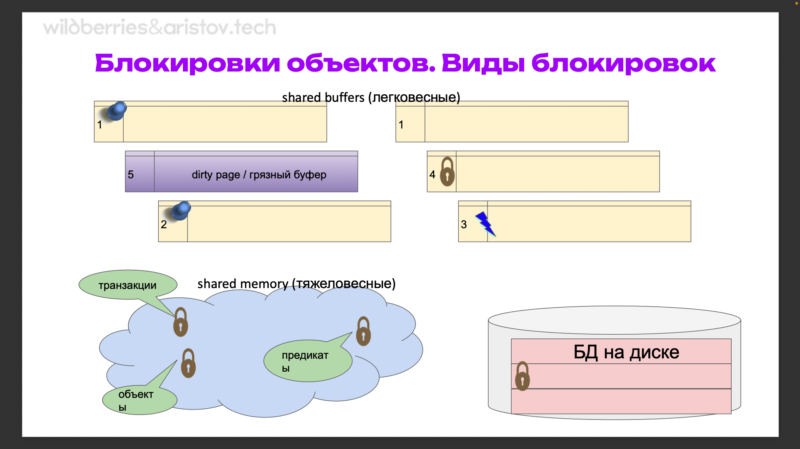
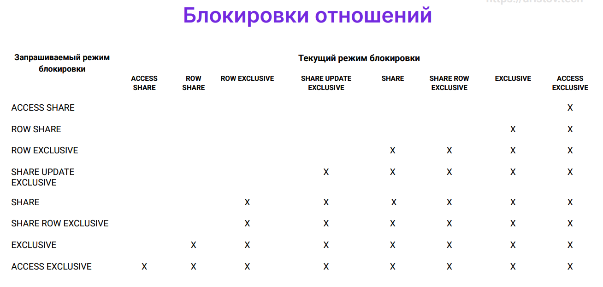
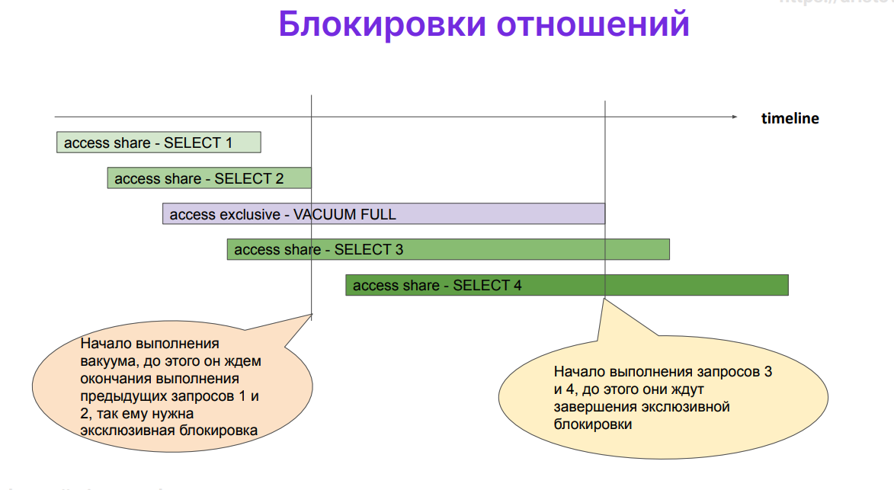
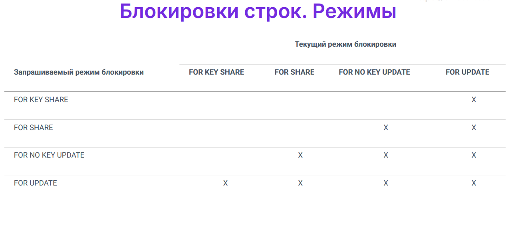
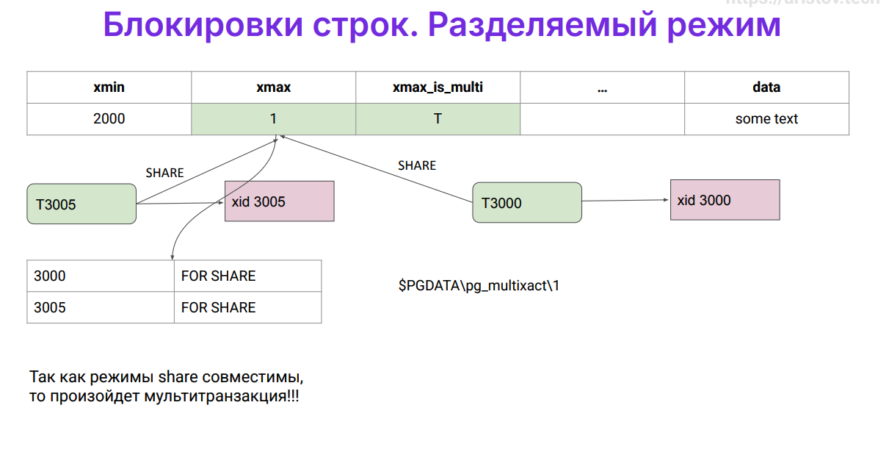
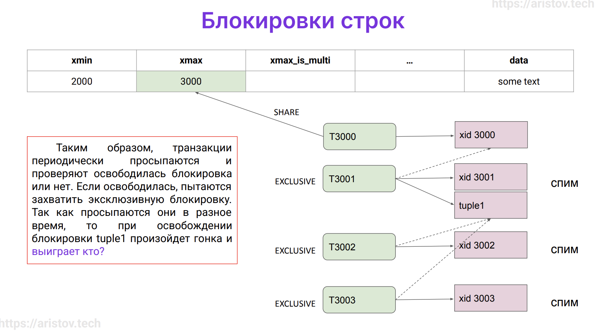
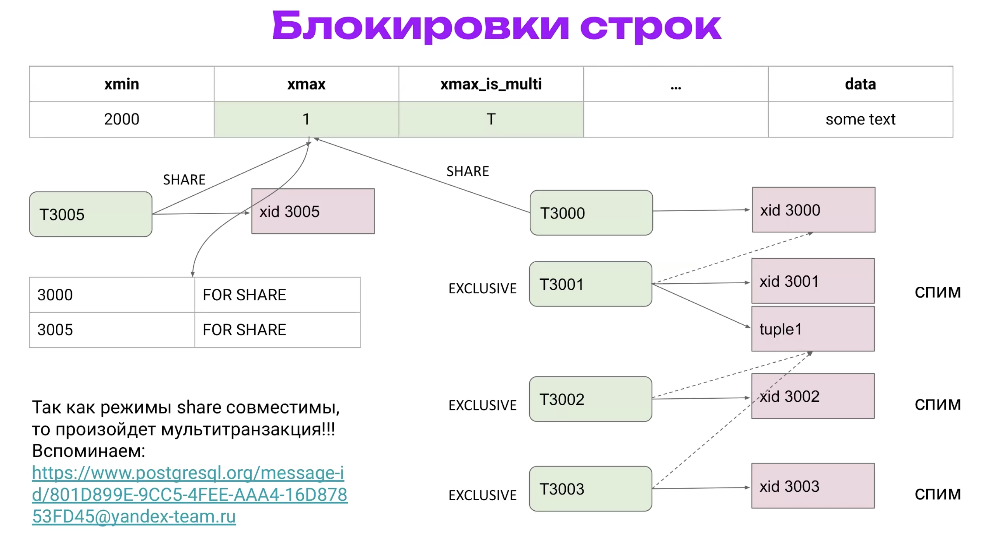
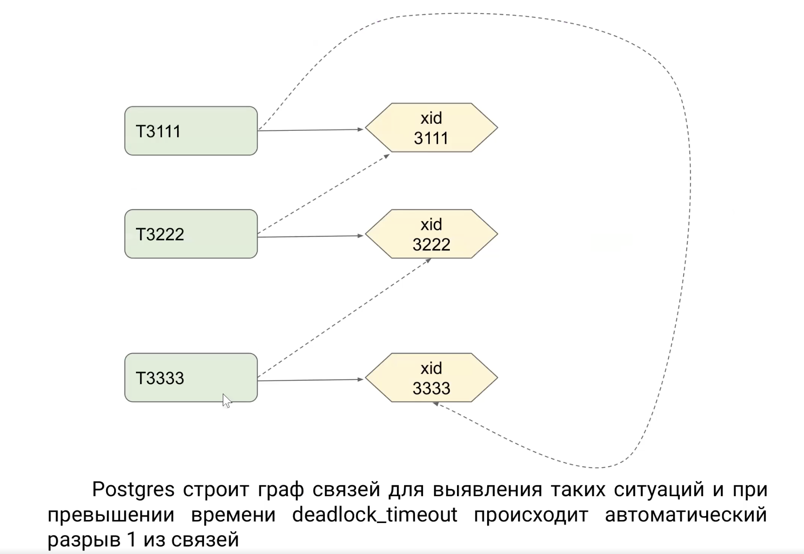
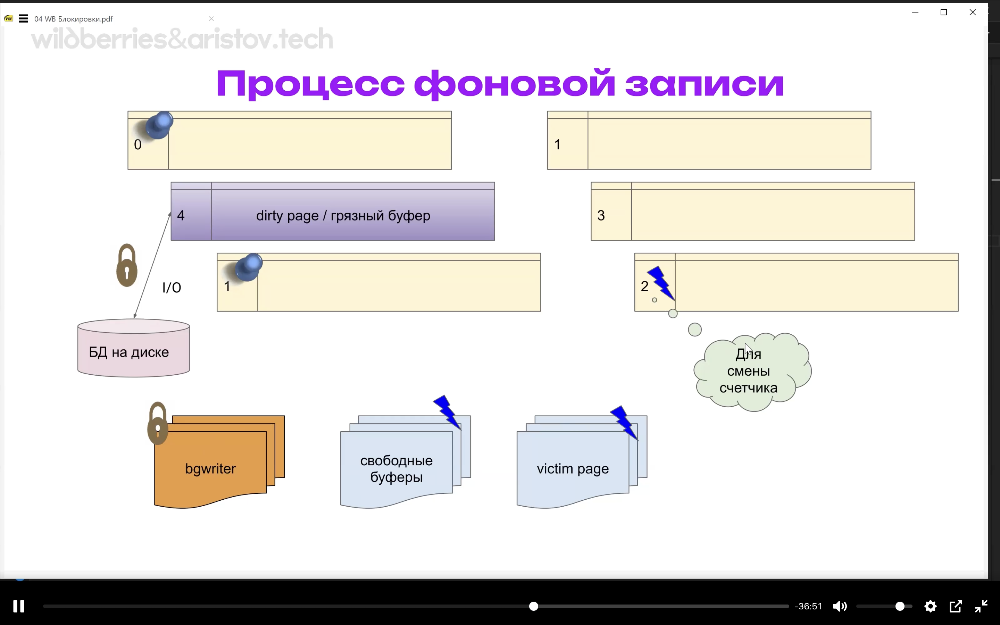

# Блокировки

## Маршрут вебинара

- Блокировки - что это и зачем нужно
- Блокировки объектов - exclusive, shared, pg_locks, предикатные блокировки
- Блокировки строк - понятие и режимы, SELECT FOR UPDATE vs SELECT FOR SHARE, мультитранзакции
- Deadlock - понятие, причины и последствия
- Блокировки памяти - принцип работы и назначение, SpinLock, LightWeightLock, BufferPin

## Блокировки

Блокировки являются причиной 40% проблем, которые могут возникать! Допустим, мы запустили запрос, обычно он выполняется 10мс, а тут он выполняется 1 секунду. В данной лекции мы как раз разберем, как это работает и что у нас под капотом (как искать что и где тормозит).

Как одновременно получить доступ к одному объекту? У нас же мультиверсионности (MVCC) + ACID + миллион наших клиентов. Одно из решений - мы захватываем блокировочку, остальные клиенты ждут. Решение - упорядочение конкурентного доступа к разделяемым ресурсам:
- перед обращением к данным процесс захватывает блокировку, после обращения
— освобождает, другой процесс начинает ожидать освобождения ресурса
- блокировки приводят к очередям  
(это печально).  
Дальнейшее развитие:
- многоверсионность — несколько версий данных, не избавляет от всех проблем
- оптимистичные блокировки — процессы не блокируются, но при неудачном стечении обстоятельств возникает ошибка 

Что подразумевается под ресурсом? Все, что можно идентифицировать. Примеры ресурсов:
- реальные хранимые объекты: страницы, таблицы, строки, индексы и т.п.
- структуры данных в общей памяти (хеш-таблицы, буферы...)
- абстрактные ресурсы (число!) - распараллеливаем работу

Факторы, влияющие на производительность:  
Гранулярность блокировки:
- степень детализации, уровень в иерархии ресурсов
- например: таблица → страница → строки, хеш-таблица → корзины
- выше гранулярность — больше возможностей для параллелизма  
Режимы блокировок:
- совместимость режимов определяется матрицей
- больше совместимых режимов — больше возможностей для параллелизма

Допустим, движок myisam MySQL в свое время считался самым быстрым в мире. Это связано с тем что они в случае чего блокировали таблицу целиком, остальные запросы даже с простейшим селектом - ждали. Тут же мы можем блокировать таблицу/строку/страницу/и тд. Чем меньше объекты, тем проще параллелить. Здесь возникает вопрос матрицы (как мы можем параллелить при тех или иных операциях), чем больше режимов - тем больше возможностей массивно параллельно работать с базой.

По типу блокировок есть следующие варианты:
- исключительные (exclusive) - мы одни захватываем, другие не могут
- совместные (shared) - мы совместно используем  
По времени жизни блокировки разделяются на:
- Долговременные блокировки:
  - обычно захватываются до конца транзакции и относятся к хранимым данным (например таблицы и отношения) (мы начали транзакцию, использовали какие то объекты в ней, они тоже заблокированы)
  - большое число режимов
  - развитая «тяжеловесная» инфраструктура, мониторинг
- Краткосрочные блокировки:
  - обычно захватываются на доли секунды (управляются автоматически)
  - и относятся к структурам в оперативной памяти
  - минимум режимов
  - «легковесная» инфраструктура, мониторинг может отсутствовать

Вакуум фулл требует эксклюзивной блокировки! В случае селекта какой то таблицы в транзакции (селект - разделяемая блокировка, то есть во время чьего-то селекта другие тоже могут делать селекты) вакуум фулл сделаться не может! Поэтому есть матрицы совместимости наших команд, блокировок. Чем объекты тяжеловесней - тем больше режимов и мониторинга того, что есть в постгресе.  
По краткосрочные блокировки - мы не можем обвесить мониторингом атомарную инструкцию процессора. 



У нас есть 3 вида блокировок. Самая тяжеловесная - это у нас когда в разделяемой памяти происходит работа с объектами, транзакциями, то есть все что мы рассматривали на предыдущих 3 лекциях. Также есть предикаты. 2 уровень - это уже конкретно наши shared buffers (грязные буферы, закрепление наших буферов и все остальное). 3 большой кейс - данные на диске. То есть 3 уровень - терабайты, 2 уровень - гигабайты, а 1 уровень - все остальное. Пойдем от большего к меньшему.

### Блокировки объектов 

(то, что есть у нас в shared memory)

Информация в общей памяти сервера:
- представление pg_locks: - у нас происходит селект и у нас автоматом идет в pg_locks что эта табличка у нас зашарена для выборки. Представление есть - мониторить можем. Все классические режимы мониторинга показывают, сколько у нас локов в системе доступно. Это как раз классический кейс что мониторить.
  - locktype — тип блокируемого ресурса,
  - mode — режим блокировки  
Инфраструктура:
- очередь ожидания: ждущие процессы не потребляют ресурсы
- обнаружение взаимоблокировок  
Ограниченное количество:
- max_locks_per_transaction × max_connections (сколько всего таких процессов может ожидать)
- при этом 1 транзакция может превысить max_locks_per_transaction

### Блокировки отношений

Тип ресурса - Relation в pg_locks. Режимы работы:
- допускают изменение данных (не мешают друг другу):
  - Access Share - `SELECT`
  - Row Share - `SELECT FOR UPDATE/SHARE`
  - Row Exclusive - `UPDATE`, `DELETE`, `INSERT`
  - Share Update Exclusive - `VACUUM`, `ALTER TABLE`, `СREATE INDEX CONCURRENTLY`
- не допускают изменение данных (мешают друг другу)
  - Share - `CREATE INDEX`
  - Share Row Exclusive - `CREATE TRIGGER`, `ALTER TABLE`
  - Exclusive - `REFRESH MAT. VIEW CONCURRENTLY`
  - Access Exclusive - `DROP`, `TRUNCATE`, `VACUUM FULL`, `LOCK TABLE`, `ALTER TABLE`, `REFRESH MAT. VIEW`  
Есть команды, которые друг другу не мешают, а есть команды, которые друг другу мешают. Поэтому есть такая вот матрица совместимости этих команд (крестик - не совместимы, нет крестика - совместимы):



То есть `СREATE INDEX CONCURRENTLY` друг другу не мешает, но `CREATE INDEX` требует эксклюзивной блокировки, поэтому когда мы делаем какие то действия - нужно понимать последствия. Если у нас идет долгая транзакция - мы не можем в принципе сделать `ALTER TABLE`. (есть разные альтер тейбл - альтер тейбл добавить колонку и альтер тейбл изменить констрэинт, они по разному отработают - даже на долгой транзакции изменить констрэинт можно будет, а добавить колонку - нет).

Соответственно, как это работает:



Селект делает access share, второй селект - то же самое. Тут приходит вакуум фулл, который хочет acess exclusive (полный доступ, остальные идут лесом). Первый селект выполняется, второй тоже - вакуум фулл начнет выполняться только тогда, когда закончит выполняться второй селект. Третий селект будет ждать пока выполнится 3й запрос (вакуум фулл) и так далее. Поэтому на продакшне мы не можем сделать вакуум фул!

Блокировать мы можем не только таблицы. Типы ресурсов:
- Extend — добавление страниц к файлу отношения
- Object — не отношение: база данных, схема и т. п.
- Page — страница (используется некоторыми типами индексов)
- Tuple — версия строки
- Advisory — рекомендательная блокировка
- Transactionid — транзакция
- Virtualxid — виртуальная транзакция [Понимание Типа Транзакции Virtualxid В Postgres](https://progi.pro/ponimanie-tipa-tranzakcii-virtualxid-v-postgres-3892336) . Это очень интересный кейс в постгресе, они пытались ускорить работу и добились неплохой производительности (где то в 2 раза!)

Режимы:
- исключительный
- разделяемый

Текущие блокировки можно увидеть:
- представление `select * from pg_locks`;
- функция `select pg_blocking_pids(pid)`; - узнаем кто нас блокирует, то есть конкретно узнает пид процесса, смотрим кто что делает и в случае необходимости - даем по рукам  
Вывод сообщений в журнал сервера:
- параметр `SHOW log_lock_waits;` - можем вывести в журнал
- выводит сообщение об ожидании дольше deadlock_timeout
- или log_min_duration_statement - сколько у нас выполнялся наш запрос  
Максимальное время ожидания блокировки:
- lock_timeout - мы ждем какой то ресурс, он не блокируется какое то время - наша транзакция будет прервана. Важный параметр на самом деле!  
https://www.postgresql.org/docs/current/runtime-config-client.html

Мы можем блокировать еще несуществующие данные! Например, мы хотим сделать вставку с записью 100, а другая транзакция этот диапазон заблокировала (имеется в виду неавтоматический выбор ключа). Как раз она реализуется на уровне Serializable, это довольно дорого. Для реализация блокировки еще НЕсуществующих данных:
- для реализация уровня изоляции Serializable:
- GAP блокировка - диапазон (мы пытаемся вставить в рамках одной тразакции записи в интервале от 1к до 1кк, а другая транзакция пытается вставить запись с номером 500к)
- блокировки используются в дополнение к обычной изоляции на снимках данных
- оптимистичные блокировки, название сложилось исторически (мы считаем классически что если СУБД что то должна сделать - она это сделает. То есть мы считаем оптимистично. Эти штуки автоматом под капотом реализуются.)  
Информация в общей памяти сервера:
- представление pg_locks со специальным режимом SIReadLock  
Ограниченное количество:
- max_pred_locks_per_transaction × max_connections (Это довольно нечастая проблема, но мы можем столкнуться с такой проблемой - если мы постоянно используем уровень Serializable, если постоянно одни транзакции блокируют большой диапазон, а другие пытаются туда попасть и тд. Для этого используется max_pred_locks_per_transaction)  
Повышение количества блокировок (автоэкскалация от уровня строчки до уровня таблицы):
- max_pred_locks_per_relation (имеется в виду таблица, вьюшка и тд)
- max_pred_locks_per_page

## Блокировки строк (29 00)

Это уже не релайшны, то есть не большие наши таблицы, а строчки. Блокировки строк у нас уже более легковесные. Это уже происходит на диске. Это нужно потому что эти блокировки обсулживаются - то есть создаются структуры в памяти, которые отслеживают, что происходит (тот же самый pg_locks). Здесь такая проблема строчек на диске могут быть миллиарды. В память инфу о каждой строчке не поднять. Поэтому есть специальный режим работы со строками. Особенности:
- информация только в страницах данных на ЖД (информация хранится только в битах этой строки - что мы с ней работаем. Если мы делаем какие то изменяющие эту строку операции, например update/delete, то меняется xmax. При этом мы можем и отменить эту транзакцию - у нас xmax так и останется и проставится бит xmax aborted)
- поле xmax заголовка версии строки + информационные биты
- неограниченное количество (могут быть миллиарды строк) (неограниченный объем, мы работаем непосредственно с данными)
- большое число минимально отражается на производительности
- очередь ожидания организована с помощью блокировок объектов (пропорционально числу процессов, а не строк)

Со строками мы работаем практически напрямую! (исключение - если строка в кэше, то работаем в кэше)

Уже меньше режимов - эксклюзивный и разделяемый. (что мы можем делать с данными - только обновлять, читать, удалять, вставлять)
- Эксклюзивный:
  - UPDATE - удаление строки или изменение всех полей:
    - SELECT FOR UPDATE
    - UPDATE (с изменением ключевых полей)
    - DELETE
  - NO KEY UPDATE - изменение любых полей, кроме ключевых:
    - SELECT FOR NO KEY UPDATE
    - UPDATE (без изменения ключевых полей - все внешние ключи без изменений)
- Разделяемый:
  - SHARE - запрет изменения любых полей строки
    - SELECT FOR SHARE (конечно, можно сделать сразу апдейт, но быстрее получится сказать "сейчас я буду изменять эту строку")
  - KEY SHARE - запрет изменения только ключевых полей строки (но если на проекте требуется поменять ключевое поле (айдишник записи) - у нас проблемы в архитектуре, обоснованных кейсов нет)
    - SELECT FOR KEY SHARE  
https://www.postgresql.org/docs/current/explicit-locking.html



Увлекательный кейс. У нас есть системные поля xmin, xmax (кто запись породил и удалил). Приходит кто то и делает селект. Условно, транзакция 3000. При этом наша запись порождает интересный процесс - такая сущность как ссылка на блокировку (xid). Приходит следующая транзакция (3005) - она хочет сделать share-доступ (то есть пришел еще один селект). В поле xmax (тип интеджер) должен быть записан инт, но транзакции у нас две и не блокируют друг друга. Тогда у нас произойдет мультитранзакция, проставится ее номер и закешируется состояние кто там вообще тусит в этой записи (будет расти список тех, кто получил туда доступ). (на скрине таблица с нашими данными).



Какие проблемы могут быть на продакшне с мультитранзакциями? Когда огромные списке мультитранзакций - под них может закончиться буфер и они пойдут выгружаться на диск. Поэтому долгие мультитранзакции - вещи очень плохая.

Другой случай - у нас была share блокировка, затем пришла еще exclusive. Что произойдет создастся новая сущность под названием тапл (со своим номером). Наша сущность (т3001) будет ждать освобождения xid (спать, периодически просыпаться и проверять, существует ли такая виртуальная транзакция). Если придет следующая эксклюзивная транзакция - она будет ожидать уже тапл. Это сделано чтобы не было эффекта гонки. Здесь возникает  один интересный кейс, когда приходит еще одна эксклюзивная транзакция. Тапл 2 не будет , все ждут тапл1. Это та же самая область с транзакциями. Начинается гонка, выигрывает случайный процесс. Такой интересный кейс происходит на каждую запись, иногда из-за этого происходят блокировки, поэтому хороший кейс - мониторить количество блокировок. Если начало расти - где то что то пошло не так.

Если строчек будет миллион, то будет и таплов миллион. На каждую строчку свой тапл, тапл для конкретной записи. По сну - каждый спит свое, рандомное время. Вся инфа хранится в разделяемой памяти, доступ туда мы получить не сможем (и посмотреть эту инфу не сможем, соответственно). МОжем увидеть только кто что блокирует и чего мы ждем.



Так как режимы share совместимы, то есть придет еще один селект - то произойдет мультитранзакция; когда 3000 транзакция выпонится, придется ждать еще 3005



## Взаимоблокировки. Deadlock 

Postgres строит граф связей для выявления таких ситуаций и при превышении времени deadlock_timeout происходит автоматический разрыв 1 из связей - соответственно, все изменения 2 будут потеряны. То есть проблема решается автоматически. Дедлок - это плохо и желательно такое расследовать, тк это проблема в архитектуре и ее нужно решать. 



Как дедлоки связаны с архитектурой? У нас один процесс пытается что то сделать, а другой тоже пытается что то сделать, но в противофазе. То есть у нас нарушен порядок, что мы хотим сделать. Поэтому происходит дедлок. 

Как выглядит взаимоблокировка 
```bash
tail /var/log/postgresql/postgresql-17-main.log
# ERROR: deadlock detected
# DETAIL: Process 23432 waits for ShareLock on transaction 333333; blocked by process 444444.
# HINT: See server log for query details.
# CONTEXT: while updating tuple (1,22) in relation "tests"
```

## Блокировки в памяти (1 00 00)

У нас есть shared memory , у нее есть shared buffers (это наши буферы, подтянутые из памяти), там же есть различные буферы wal buffers и так далее. Но, так как это память, здесь возникает ряд нюансов.

Spinlock - меняет наш usage count, сколько раз наш буфер использовался
- устанавливаются на очень короткое время, несколько инструкций процессора
- используются атомарные инструкции процессора
- единственный режим — исключительный
- нет возможности мониторинга
- нет обнаружения взаимоблокировок
- цикл активного ожидания (нет возможности заблокировать - пытаемся, пытаемся, пытаемся)

LightWeightLock - если мы берем shared buffers, это означает что буфер заблокирован какой то транзакцией. (выгрузка на диск и так далее - системная операция, повлиять на нее мы не можем)
- устанавливаются на короткое время, обычно доли секунды
- исключительный и разделяемый режимы
- есть мониторинг
- нет обнаружения взаимоблокировок (но они и не нужны)
- пассивное ожидание
- при освобождении ресурса возникает состояние гонки, выигрывает случайный процесс

BufferPin - закрепление буфера - тоже блокировка, которая не позволяет нам переиспользовать буфер! Если буфер используется в транзакции, то вытеснить из буфера мы не можем.
- устанавливается на время работы с буфером, возможно длительное
- исключительный и разделяемый режимы
- есть мониторинг
- есть обнаружение взаимоблокировок
- пассивное ожидание, но обычно закрепленный буфер пропускается  
Что произойдет с буфер пином при чекпоинте? Он скинет грязный буфер (запиненный), но буфер так и будет висеть запиненный (так и останется в памяти, только он станет чистый). Скинется только признак грязного. ПОчему буфер грязный - потому что данные в нем отличаются от данных на диске

bgwriter (смотри количество буферов) - это LightWeightLock, свободные буферы и виктим пейдж - Spinlock



Когда процесс ожидает чего-либо, этот факт отражается в представлении pg_stat_activity. Что мы там можем увидеть:
- wait_event_type — тип ожидания
- wait_event — имя конкретного ожидания
- информация может быть не полна
- охвачены не все места в коде, в которых могут быть ожидания
- информация только на текущий момент
- единственный способ получить картину во времени — семплинг
- достоверная картина только при большом числе измерений

Если мы идем к низкоуровневым блокировкам (например, lightweight lock) - то только сэмплинг. То есть раз в 200мс опрашиваем stat_activity и смотрим, появился ли процесс. Еще можно отслеживать с помощью экстеншнов, например, [pg-lock-tracer](https://github.com/jnidzwetzki/pg-lock-tracer) (позволяет посмотреть кто что ждет)

Что мы должны мониторить:
- общее количество блокировок
- долгие блокировки (долгие блокировки - признак что что то идет не так)

## Практика (1 13 00)

```sql
-- посмотрим, что кластер стартовал
pg_lsclusters
sudo -u postgres psql
SELECT * FROM pg_locks \gx
-- как раз видим, что сами себя мы здесь блокируем, сами себе сделали virtualxid
/*
-[ RECORD 1 ]------+----------------
locktype           | relation
database           | 5
relation           | 12073
page               | 
tuple              | 
virtualxid         | 
transactionid      | 
classid            | 
objid              | 
objsubid           | 
virtualtransaction | 0/14
pid                | 594
mode               | AccessShareLock
granted            | t
fastpath           | t
waitstart          | 
-[ RECORD 2 ]------+----------------
locktype           | virtualxid
database           | 
relation           | 
page               | 
tuple              | 
virtualxid         | 0/14
transactionid      | 
classid            | 
objid              | 
objsubid           | 
virtualtransaction | 0/14
pid                | 594
mode               | ExclusiveLock
granted            | t
fastpath           | t
waitstart          | 
*/
SELECT pg_backend_pid();  -- наш пид, с помощью которого из соседнего сеанса мы можем себя убить. 
 pg_backend_pid 
----------------
            594
(1 row)
*/
SELECT pg_blocking_pids(5490);  -- можем посмотреть, кто нас блокирует
SHOW log_lock_waits;  -- можем логировать длинные блокировки. Главное задать время

CREATE DATABASE locks;
\c locks -- При переподключении к базе пид меняется, предыдущие транзакции отменяются (коннекшн тот же самый, форк не происходит - мы внутри того же самого процесса, но с другим айди)
SELECT pg_backend_pid();  -- 2511
-- посмотрим, что например VIEW тоже является видом RELATION
CREATE TABLE t (i serial);
BEGIN;
SELECT * FROM pg_locks;
CREATE VIEW v AS SELECT * FROM t;
SELECT locktype, database, relation, virtualxid, pid, mode FROM pg_locks;  -- это блокировки объектов!
/*
   locktype    | database | relation | virtualxid | pid  |        mode         
---------------+----------+----------+------------+------+---------------------
 relation      |    24807 |    24809 |            | 2511 | AccessShareLock
 relation      |    24807 |    12073 |            | 2511 | AccessShareLock
 virtualxid    |          |          | 10/6       | 2511 | ExclusiveLock
 relation      |    24807 |    24821 |            | 2511 | AccessExclusiveLock
 object        |    24807 |          |            | 2511 | AccessShareLock
 transactionid |          |          |            | 2511 | ExclusiveLock
(6 rows)
*/
SELECT relname FROM pg_class WHERE oid = 24809;  -- это наша таблица t
SELECT relname FROM pg_class WHERE oid = 24821;  -- это наша вьюха v
-- 12073 - это pg_locks
ROLLBACK;
-- то есть всегда можно отследить, кто что блокирует, какие объекты что блокируют и тд. Всгда есть оид - сквозная нумерация наших объектов
-- мы можем блокировать виртуальные объекты, это нужно нам для распараллеливания (начали транзакцию: посмотрели хэш текста, потом сделали рекомендательную блокировку)
-- рекомендательные блокировки advisory_lock
-- https://www.postgresql.org/docs/current/functions-admin.html#FUNCTIONSADVISORY-LOCKS
-- https://habr.com/ru/company/tensor/blog/488024/
-- во втором терминале
begin;
SELECT hashtext('lock me pls');  -- -738056736
SELECT pg_advisory_lock(hashtext('lock me pls'));
SELECT pg_backend_pid();  -- 653
SELECT locktype, relation::REGCLASS, virtualxid AS virtxid, transactionid AS xid, mode, granted FROM pg_locks WHERE pid = 653;
/*
  locktype  | relation | virtxid | xid |      mode       | granted 
------------+----------+---------+-----+-----------------+---------
 relation   | pg_locks |         |     | AccessShareLock | t
 virtualxid |          | 9/15    |     | ExclusiveLock   | t
 advisory   |          |         |     | ExclusiveLock   | t
(3 rows)
*/
--попробуем в первом терминале
SELECT pg_advisory_lock(hashtext('lock me pls'));
SELECT * FROM pg_locks;
-- advisory для каждой БД
-- во втором терминале
-- что произойдет? почему, как думаете?
commit;
-- commit не освобождает блокировку. СНять блокировку может только ее породивший. Ну или когда закончится сессия. Мы не можем закончить транзакцию с параллельной сессии.
SELECT pg_advisory_unlock(hashtext('lock me pls'));
-- освободить можно только под своим PID


-- посмотрим различные виды блокировок и как найти, кто нас блокирует.
-- Для это мы будет работать из 2 параллельных терминаловв и, соответственно, сессий
CREATE TABLE accounts(id integer, amount numeric);
INSERT INTO accounts VALUES (1,200.00), (2,300.00), (3,400.00);
-- во втором окне
BEGIN;
SELECT pg_backend_pid();  -- 2511
SELECT 
    locktype, relation::REGCLASS, virtualxid AS virtxid, transactionid AS xid, mode, granted 
FROM pg_locks 
WHERE pid = 2511;
/*
  locktype  | relation | virtxid | xid |      mode       | granted 
------------+----------+---------+-----+-----------------+---------
 relation   | pg_locks |         |     | AccessShareLock | t
 virtualxid |          | 10/12   |     | ExclusiveLock   | t
(2 rows)
*/
UPDATE accounts SET amount = amount + 1 WHERE id = 1;
-- смотрим опять блокировки - что изменилось и почему?
SELECT 
    locktype, relation::REGCLASS, virtualxid AS virtxid, transactionid AS xid, mode, granted 
FROM pg_locks 
WHERE pid = 2511;
/*
   locktype    | relation | virtxid |  xid  |       mode       | granted 
---------------+----------+---------+-------+------------------+---------
 relation      | accounts |         |       | RowExclusiveLock | t
 relation      | pg_locks |         |       | AccessShareLock  | t
 virtualxid    |          | 10/12   |       | ExclusiveLock    | t
 transactionid |          |         | 56364 | ExclusiveLock    | t
(4 rows)
*/
-- relation RowExclusiveLock - мы запись обновили, то есть возникла эксклюзивная блокировка записи
-- transactionid ExclusiveLock - у нас транзакция еще появилась (до этого у нас транзакция была, но теперь она привязана к конкретной записи и у нее появился виртуальный номер)

-- зайдем в первом терминале
SELECT pg_backend_pid();  -- 2561
CREATE INDEX ON accounts(id);
-- Что произойдет? - он будет висеть и ждать окончания транзакции
-- проверим во втором терминале
SELECT 
    locktype, relation::REGCLASS, virtualxid AS virtxid, transactionid AS xid, mode, granted 
FROM pg_locks;
/*
   locktype    | relation | virtxid |  xid  |       mode       | granted 
---------------+----------+---------+-------+------------------+---------
 relation      | pg_locks |         |       | AccessShareLock  | t
 virtualxid    |          | 10/12   |       | ExclusiveLock    | t
 virtualxid    |          | 11/5    |       | ExclusiveLock    | t
 relation      | accounts |         |       | RowExclusiveLock | t
 relation      | accounts |         |       | ShareLock        | f
 transactionid |          |         | 56364 | ExclusiveLock    | t
(6 rows)
*/
-- granted f - значит что доступа нам не дали. Доступ на ShareLock несовместим по матрице с тем, что у нас RowExclusiveLock

-- узнаем, кто нас блокирует
-- таймаут лока
-- https://www.postgresql.org/docs/current/runtime-config-client.html#GUC-LOCKTIMEOUT
SELECT pg_blocking_pids(2561);  -- узнали пид во втором тероминале, сделали запрос - увиделои пид из первого терминала
/*
 pg_blocking_pids 
------------------
 {2511}
(1 row)
*/
-- и что вообще происходит PG_STAT_ACTIVITY
SELECT * FROM pg_stat_activity WHERE pid = ANY(pg_blocking_pids(2561)) \gx
/*
-[ RECORD 1 ]----+------------------------------------------------------------------------
datid            | 24807
datname          | locks
pid              | 2511
leader_pid       | 
usesysid         | 10
usename          | postgres
application_name | psql
client_addr      | 
client_hostname  | 
client_port      | -1
backend_start    | 2025-03-17 10:05:52.373954+00
xact_start       | 2025-03-17 10:23:04.789152+00
query_start      | 2025-03-17 10:46:27.715209+00
state_change     | 2025-03-17 10:46:27.715219+00
wait_event_type  | 
wait_event       | 
state            | active
backend_xid      | 56364
backend_xmin     | 56364
query_id         | 
query            | SELECT * FROM pg_stat_activity WHERE pid = ANY(pg_blocking_pids(2561)) 
backend_type     | client backend
*/
commit;


-- в 1 окне видим как создался индекс
-- более глубокое исследование блокировки строк
-- объяснения про побитовую маску
-- https://habr.com/ru/company/postgrespro/blog/445820/
CREATE EXTENSION pageinspect;
DROP VIEW IF EXISTS accounts_v;
CREATE VIEW accounts_v AS
SELECT '(0,'||lp||')' AS ctid,
    t_xmin as xmin,
    t_xmax as xmax,
    CASE WHEN (t_infomask & 1024) > 0 THEN 't' END AS commited,
    CASE WHEN (t_infomask & 2048) > 0 THEN 't' END AS aborted,
    CASE WHEN (t_infomask & 128) > 0 THEN 't' END AS lock_only,
    CASE WHEN (t_infomask & 4096) > 0 THEN 't' END AS is_multi,
    CASE WHEN (t_infomask2 & 8192) > 0 THEN 't' END AS keys_upd
FROM heap_page_items(get_raw_page('accounts',0))
WHERE lp <= 10
ORDER BY lp;
SELECT * FROM accounts_v ;
/*
 ctid  | xmin  | xmax  | commited | aborted | lock_only | is_multi | keys_upd 
-------+-------+-------+----------+---------+-----------+----------+----------
 (0,1) | 56363 | 56364 |          | t       |           |          | 
 (0,2) | 56363 |     0 |          | t       |           |          | 
 (0,3) | 56363 |     0 |          | t       |           |          | 
 (0,4) | 56364 |     0 |          | t       |           |          | 
(4 rows)
*/
TRUNCATE accounts;
INSERT INTO accounts VALUES (1,2000.00), (2,2000.00), (3,2000.00);
SELECT * FROM accounts_v ;
/*
 ctid  | xmin  | xmax | commited | aborted | lock_only | is_multi | keys_upd 
-------+-------+------+----------+---------+-----------+----------+----------
 (0,1) | 56369 |    0 |          | t       |           |          | 
 (0,2) | 56369 |    0 |          | t       |           |          | 
 (0,3) | 56369 |    0 |          | t       |           |          | 
(3 rows)
*/
BEGIN;
UPDATE accounts SET id = 4 WHERE id = 1;
UPDATE accounts SET amount = 4000 WHERE id = 3;
SELECT * FROM accounts_v ;
-- что изменилось?
/*
 ctid  | xmin  | xmax  | commited | aborted | lock_only | is_multi | keys_upd 
-------+-------+-------+----------+---------+-----------+----------+----------
 (0,1) | 56369 | 56370 |          |         |           |          | 
 (0,2) | 56369 |     0 |          | t       |           |          | 
 (0,3) | 56369 | 56370 |          |         |           |          | 
 (0,4) | 56370 |     0 |          | t       |           |          | 
 (0,5) | 56370 |     0 |          | t       |           |          | 
(5 rows)
*/
-- во втором терминале
BEGIN;
SELECT * FROM accounts WHERE id = 2 FOR KEY SHARE;
SELECT * FROM accounts WHERE id = 3 FOR KEY SHARE;
SELECT * FROM accounts_v;
-- у нас получилась мультитранзакция
/*
 ctid  | xmin  | xmax  | commited | aborted | lock_only | is_multi | keys_upd 
-------+-------+-------+----------+---------+-----------+----------+----------
 (0,1) | 56369 | 56370 |          |         |           |          | 
 (0,2) | 56369 | 56371 |          |         | t         |          | 
 (0,3) | 56369 |     1 |          |         |           | t        | 
 (0,4) | 56370 |     0 |          | t       |           |          | 
 (0,5) | 56370 | 56371 |          |         | t         |          | 
(5 rows)
*/
-- Буфер под мультитранзакции выделен, ошибка постгреса в том, что он не очень большой и основная ошибка в том, что его  нельзя тюнить. ЧТобы его увеличить, постгрес нужно пересобирать из исходников. Но такое встречается только на огромных проектах


-- интересный экстэншн, который может показать, кто нас где ждет
CREATE EXTENSION pgrowlocks;
SELECT * FROM pgrowlocks('accounts') \gx
/*
-[ RECORD 1 ]---------------------------------
locked_row | (0,1)
locker     | 56370
multi      | f
xids       | {56370}
modes      | {"No Key Update"}
pids       | {2511}
-[ RECORD 2 ]---------------------------------
locked_row | (0,2)
locker     | 56371
multi      | f
xids       | {56371}
modes      | {"For Key Share"}
pids       | {2561}
-[ RECORD 3 ]---------------------------------
locked_row | (0,3)
locker     | 1
multi      | t
xids       | {56370,56371}
modes      | {"No Key Update","For Key Share"}
pids       | {2511,2561}
*/
-- Очередь ожидания - показывает кто что заблокировал в человеческом режиме
CREATE VIEW locks_v AS
SELECT pid,
    locktype,
    CASE locktype
    WHEN 'relation' THEN relation::REGCLASS::text
    WHEN 'virtualxid' THEN virtualxid::text
    WHEN 'transactionid' THEN transactionid::text
    WHEN 'tuple' THEN relation::REGCLASS::text||':'||tuple::text
    END AS lockid,
    mode,
    granted
FROM pg_locks;
SELECT * FROM locks_v;
/*
 pid  |   locktype    |     lockid      |       mode       | granted 
------+---------------+-----------------+------------------+---------
 2511 | relation      | accounts_v      | AccessShareLock  | t
 2511 | relation      | accounts_id_idx | RowExclusiveLock | t
 2511 | relation      | accounts        | RowExclusiveLock | t
 2511 | virtualxid    | 10/20           | ExclusiveLock    | t
 2561 | relation      | pg_locks        | AccessShareLock  | t
 2561 | relation      | locks_v         | AccessShareLock  | t
 2561 | virtualxid    | 11/8            | ExclusiveLock    | t
 2511 | transactionid | 56370           | ExclusiveLock    | t
(8 rows)
*/


-- заблокируем строку в разделяемом режиме
BEGIN;
SELECT txid_current(), pg_backend_pid();
/*
 txid_current | pg_backend_pid 
--------------+----------------
        56373 |           2511
(1 row)
*/
SELECT * FROM accounts WHERE id = 3 FOR SHARE;  -- блокируем 3
-- второй терминал
BEGIN;
SELECT txid_current(), pg_backend_pid();
/*
 txid_current | pg_backend_pid 
--------------+----------------
        56374 |           2561
(1 row)
*/
UPDATE accounts set amount = 4000 WHERE id = 3;  -- апдейт висит!

-- в первом терминале
SELECT * FROM locks_v WHERE pid = 2561;  -- смотрим, кого наш процесс заблокировад
/*
 pid  |   locktype    |     lockid      |       mode       | granted 
------+---------------+-----------------+------------------+---------
 2561 | relation      | accounts_id_idx | RowExclusiveLock | t
 2561 | relation      | accounts        | RowExclusiveLock | t
 2561 | virtualxid    | 11/9            | ExclusiveLock    | t
 2561 | transactionid | 56374           | ExclusiveLock    | t
 2561 | tuple         | accounts:5      | ExclusiveLock    | t
 2561 | transactionid | 56373           | ShareLock        | f
(6 rows)
*/
SELECT pg_blocking_pids(2561);  -- смотрим, кто его блокирует
/*
 pg_blocking_pids 
------------------
 {2511}
(1 row)
*/
-- третий терминал
sudo -u postgres psql
\c locks
BEGIN;
SELECT * FROM accounts WHERE id = 3 FOR SHARE;
SELECT * FROM pgrowlocks('accounts') \gx
/*
-[ RECORD 1 ]-------------------------
locked_row | (0,5)
locker     | 2
multi      | t
xids       | {56373,56375}
modes      | {"For Share","For Share"}
pids       | {2511,2705}
*/
-- обычно получаем блокировку, а в этом режиме получим ошибку
SELECT * FROM accounts FOR UPDATE NOWAIT;
/*
ERROR:  could not obtain lock on row in relation "accounts"
*/
-- третий терминал
ROLLBACK;
BEGIN;
-- для многопоточной обработки данных
-- мы можем открыть курсор, сделать селект фор апдейт и пропустить заблокированные записи
-- DECLARE c CURSOR FOR SELECT * FROM accounts ORDER BY id FOR UPDATE SKIP LOCKED;
-- FETCH C; 
```