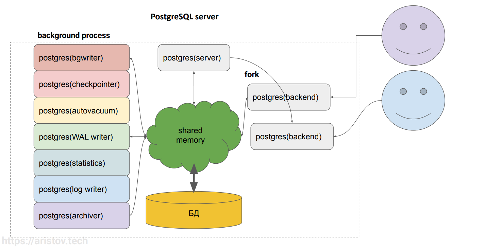
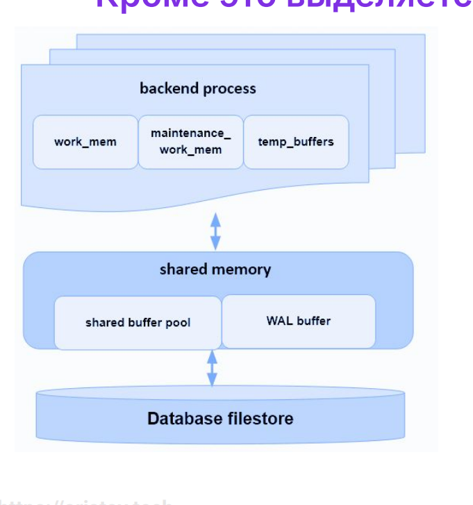
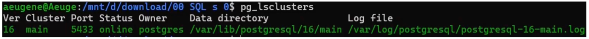
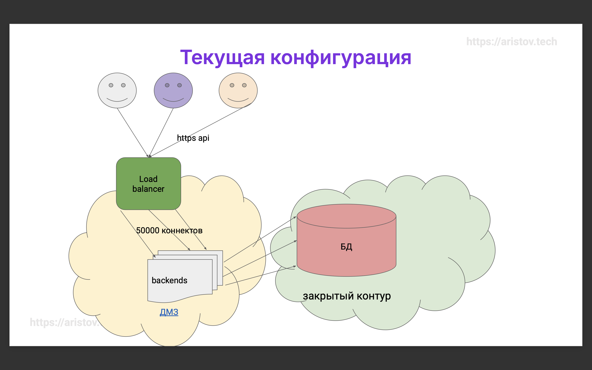
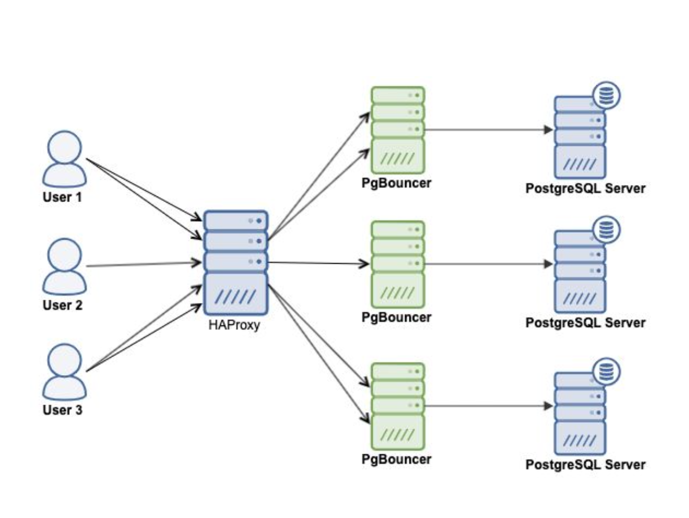
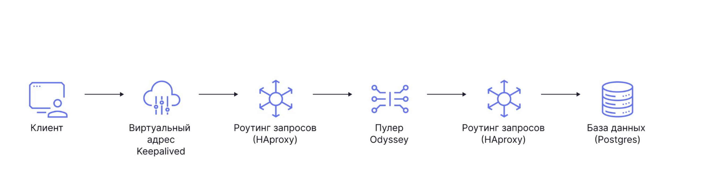

# Управление соединениями и пулконнекторы

Коннектинг к постгресу и управление пользователями

## Маршрут вебинара

- Принципы подключения в PostgreSQL - pg_hba, fork backend process, work_mem, проблематика
- Назначение и виды пуллконнекторов
- Pgbouncer - принципы работы, настройка и возможный troubleshooting
- Проблематика idle и idle in transaction - исследование и рекомендации
- Управление пользователями - архитектура, принципы и подходы, caveats

## Проблематика

Основная проблематика - коннектимся к постгресу, происходит форк процессов. Клиенты - это и psql, и дбивер, и процессы. Из мобилки в базу никто напрямую не ходит - идут через рест апи. База вообще напрямую в интернет не смотрит! Ее задача - защищаться от ддос атак и прочего. База должна быть в закрытом контуре!



По мере подключения пользователей происходят форки процессов (`postgres(backend)`). Это плохо потому что у нас происходит клонирование процесса, выделяется своя память и тд. Чем больше пользователей - тем больше форков. ФОрк - процесс не мнгновенный и в постгресе коннект, наверное, самый тяжелый из всех баз. Именно поэтому у нас по умолчанию всего 100 соединений. 

Кроме это выделяется память для каждой сессии  #ТЮНИНГ
- принадлежит КАЖДОМУ backend процессу
- work_mem (4 MB) эта память используется на этапе выполнения запроса. Обычно ее увеличивают. Если переполняется - используется temp tablespace (уходим на диск). Выставляем 16Мб. При этом work_mem мы можем увеличить на каждую конкретную транзакцию!
- maintenance_work_mem (64MB) используется служебными операциями типа VACUUM и REINDEX (все ддл команды)
- temp_buffers (8 MB) используется на этапе выполнения для хранения временных таблиц. Лектор не исполюзует временные таблицы. Но если используем - можно увеличить этот параметр  
Это все достаточно недешево по сравнению с другим субд, где коннект - это практически ничего.



Принадлежит каждому backend процессу:  
- work_mem (4 MB) - эта память используется на этапе выполнения запроса для сортировок строк, например ORDER BY и DISTINCT - выделяться может неоднократно!!!(до 5 точно, повлиять на это не можем) https://www.postgresql.org/docs/current/runtime-config-resource.html 
- maintenance_work_mem (64MB) используется служебными операциями типа VACUUM и REINDEX. Хорошая практика выставить его достаточно  большим, ведь он выделяется только когда приходят служебные процессы
- выделяется только при использовании команд обслуживания в сессии
- temp_buffers (8 MB) используется на этапе выполнения для хранения временных таблиц - При превышении work_mem или temp_buffers - дальше идем в temp tablespace. ВРеменные таблицы в постгресе всегда пишутся на диск! даже простые таблицы сначала в памяти, пока не пришел checkpointer or bgwriter. А здесь запись на диск и при этом используются temp_buffers и короче жесть. 

Методика подсчета памяти для инстанса:
- work_mem (4 мб) * количество коннектов (300) = 1.2гб
- 1гб под shared buffers
- 1-2гб под систему  
Итого 4гб минимум + еще какое то количество памяти под mainatance work mem (1-2гб)

## work_mem 9 00

Используется для сортировок, построения hash таблиц. Это позволяет выполнять данные операции в памяти, что гораздо быстрее обращения к диску. В рамках одного запроса данный параметр может быть использован несколько раз. Если ваш запрос содержит 5 операций сортировки, то память, которая может использоваться для его выполнения уже может сожрать как минимум work_mem * 5. Т.к. скорее-всего на сервере вы не одни и сессий много, то каждая из них может использовать этот параметр по нескольку раз, поэтому не рекомендуется делать его слишком большим. Можно выставить небольшое значение для глобального параметра в конфиге и потом, в случае сложных запросов, менять этот параметр локально (для текущей сессии). Обратите внимание, что при превышении этого параметра будет использовано временное пространство, расположенное на диске - запросы будут выполняться медленнее и при большом запросе с декартовым произведением могут привести к опустошению пустого места на диске и завершаться с ошибкой, также могут способствовать приходу ООМ киллера в зависимости от конфигурации ОС.

Параметр можно выставлять на транзакцию, пользователя, сессию, базу и тд. Классически, если мы начинаем ходить на диск - это плохо и нужно увеличивать work_mem (полностью или конкретно на пользователя). Один из вариантов ускориться - монтируем временное пространство на диске в память.

Что под капотом work_mem? На самом деле всё очень сложно.  
[Измеряем расходы на память у Postgres процессов](https://habr.com/ru/articles/562222/). Например не чистый форк, а механизм copy-on-write - копия только изменененных страниц (если мы страницку поменяли, то нам страничку потом нужно будет еще записать на диск). В версии Postgres 14 появилось новое представление pg_backend_memory_contexts которое показывает подробную утилизацию памяти текущим процессом с точки зрения самого Postgres. (со стороны линукса значения могут быть другие)
```sql
SELECT * FROM pg_backend_memory_contexts;
```
вкратце - четко сказать, сколько занимает процесс, практически невозможно.

Памяти у инстанса 32 Gb (периодически приходил OOM killer)
- max_connections = 1000
- shared_buffers = 40GB
- work_mem = 64MB
- maintenance_work_mem = 1024MB  
[ссылка](https://www.kernel.org/doc/gorman/html/understand/understand016.html)  
Что здесь не так, почему приходил ООМ киллер?
1. Мы говорим постгресу - используй памяти больше, чем есть у инстанса (памяти 32гб, под буферный кэш 40)
2. 1000 коннектов на 64мб work_mem = 64Гб, опять же больше чем у инстанса

Общая формула настройки памяти:
ОЗУ > 2Gb + Shared buffers + max_connections * (work_mem + temp_buffers (если их используем)) + maintance_parallel_workers * maintance_work_mem.
С учетом того, что work_mem может выделяться несколько раз. Можно выделять еще 5-10 процентов на всякий случай.
Правда не весь объем сразу резервируется, но есть шанс OOM killer.  
Это примерная формула - старт для исследований (пришли, в среднем так поставили - и смотрим)

## Варианты доступа к кластеру (21 30)

Допустим, мы делаем большую вставку. Постгрес сначала пытается сделать вставку в память, а затем ее зафиксировать. При превышении объема - начинает писать физически на диск. При тяжелых запросах же - падает с ООМом (при превышении work_mem + temp_buffers)

После того как мы установили постгрес на виртуалку - на самом деле, у нас происходит доступ только из линукс сокета. Как это происходит: мы запускаем psql, постгрес спрашивает, какой пользователь его запустил (то есть какой пользователь залогинен в системе). На скрине - это `aeugene`. Затем постгрес говорит - ага, система пользователю доверяет, значит и я доверяю. Пользователь существует - значит и мы заходим в постгрес, пользователя нет - мы не смогли зайти. Естественно что мы маловероятно будем заходить в постгрес на той же тачке, что и запущен инстанс, скорее всего мы будем работать по сети.



На предыдущем занятии мы установили Постгрес на ВМ. После установки Постгрес запускается с такими параметрами: 
- Одна инсталяция инстанса Постгреса называется кластером
- При этом при установке создается Linux пользователь postgres. Он предназначен для запуска кластера Постгреса и является владельцем всех файлов, относящихся к Постгресу - исполняемых файлов, файлов данных и логов. По умолчанию к этим файлам кроме него могут получить доступ только суперпользователи Линукс - root и группа пользователей, имеющая право на запуск утилиты sudo - позволяющей повысить свои личные права до прав суперпользователя. По хорошему пользователь должен работать только из-под специально выделенного юзера!

Доступ к Постгресу после запуска возможен только через psql и Unix socket. Это означает, что пароль от единственного пользователя СУБД НЕ будет запрашиваться при входе в Постгрес, вместо этого Постгрес спросил у ОС - авторизован ли такой пользователь в ОС. В нашем случае суперпользователь БД также имеет имя postgres и если мы в Линукс перейдем от нашего пользователя aeugene к пользователю postgres, повысив свои права до суперпользователя Линукс и дав команду переключиться на пользователя postgres, то при запуске утилиты psql Постгрес спросит у Линукса авторизован ли пользователь postgres и пустит внутрь СУБД без пароля. Иначе доступ мы не получим.

Для проверки подключения необходимо выполнить 3 шага:
1. Набрать в консоли команду для перехода под пользователя postgres `sudo su postgres`
2. Зайти в утилиту управления СУБД `psql`
3. Посмотреть параметры подключения `\conninfo`  
```
You are connected to database "postgres" as user "postgres" via socket in "/var/run/postgresql" at port "5432"
```
Второй вариант - повысить свои права до суперюзера и подключиться: `sudo -u postgres psql`

Кроме подключения по Unix Socket стандартным подключением к СУБД является подключение по сети (протокол TCP/IP). Для того, чтобы зайти по сети мы должны отредактировать два конфигурационных
файла:
- hba_file.conf - настройки встроенного в Постгрес файрвола (но постгрес не является файерволом, поэтому не надо пытаться его так испольщовать. Настраиваем там классические правила. Задачей борьбы с ддосами должны заниматься специально обученный софт, специально обученные железки)
- postgresql.conf - настройки Постгреса, в том числе подключений извне  
Расположение этих файлов зависит от типа и варианта ОС. Посмотреть, где они расположены можно из утилиты psql:
```sql
show hba_file;
show config_file;
```
P.S. чтобы вставить в консоль скопированные команды в VirtualBox нужно нажать Ctrl+Shift+V

в интернет не надо открывать постгрес! Инстанс легко потерять, лучше открыть внутреннюю сеть и прописываем, откуда кто имеет доступ. Естественно, под пользователем постгрес не работаем

В Ubuntu данные файлы расположены (классически в убунте файлы с настройками лежат в etc, файлы с данными - в /var/lib):
- /etc/postgresql/16/main/pg_hba.conf
- /etc/postgresql/16/main/postgresql.conf  
Посмотрим на настройки файрвола. Используем утилиту просмотра файлов cat под текущим пользователем Линукс postgres `cat /etc/postgresql/16/main/pg_hba.conf`  
Важно! Открывать только сетевое подключение в доверенной локальной сети! НЕ рекомендуется открывать доступ в интернет!  
P.S. если комбинация Alt+Tab для переключения окон не выпускает нас из ВМ в VirtualBox -
необходимо сначала нажать кнопку правый Ctrl для освобождения удерживаемого фокуса

pg_hba.conf
```conf
# TYPE  DATABASE        USER            ADDRESS                 METHOD

# "local" is for Unix domain socket connections only
host    all             all             127.0.0.1/32            trust
```
Расписываем, по какому хосту, к каакой базе мы будем подключаться. Методы есть trust, scram-sha-256 (постхэв!). С 14 версии используется система шифрования паролей SCRAM-SHA-256, в более ранних версиях - система MD5
- ! они не совместимы, при обновлении кластера с 13 на 14+ версию нужно это иметь ввиду.
- ! не стоит использовать систему PASSWORD - Пароль передается в открытом виде! Любой прослушиватель сети отловит парольочень быстро. Никогда и ни в коем случае не использовать

Чтобы задать пароль необходимо выполнить:
1. Зайти в консоль `psql`
2. Установить пароль для текущего пользователя
   1. команда psql `\password`
   ИЛИ
   1. SQL команда `ALTER USER postgres PASSWORD '123';`

Теперь мы можем зайти по сети на localhost (127.0.0.1). Для этого необходимо выполнить 3 шага:
1. выйти из psql `\q`
2. подключиться указав хост для подключения `psql -h localhost`
3. посмотреть статус подключения `\conninfo`  
Видим, что теперь мы вместо Unix Socket подключились по сети с локалхоста  
P.S. psql мы запускаем из линукса из под пользователя postgres, а НЕ student. Если закрыли консоль, переключиться на пользователя postgres можно выполнив `sudo su postgres`

## Подключение извне 37 00

Следующее, что мы должны включить - это listen_addresses. По умолчанию постгрес слушает только локалхост. Нам нужно включить, на каких адаптерах он слушает подключения. Если их много - можно перечислить через запятую

Для подключения извне ВМ, нам необходимо сделать несколько больше шагов:
1. включаем listener в postgresql.conf (обычно 2 сети - внутренняя и внешняя - интернет. Подключение через интернет категорически не рекомендуется)
2. listen_addresses = '*' ( IP адреса, на которых принимает подключения Постгрес, например localhost, 10.*.*.*;). 
  - второй вариант - `alter system set listen_addresses = ‘*ʼ;`
3. включаем вход по паролю в pg_hba.conf и меняем маску подсети `host all all 0.0.0.0/0 scram-sha-256` в 13 и меньше версии scram-sha-256 → md5
4. добавляем порт во внешний файрвол, используемый у вас в организации
5. задаем пароль юзеру postgres `ALTER USER postgres PASSWORD '123';`
6. Перегружаем сервер - обратите внимание, что при установке PostgreSQL запущен от имени root и рестарт от пользователя postgres мы сделать не можем (только stop и потом start). Правильно потом переконфигурировать пользователя на postgres при старте ВМ.

```bash
pg_ctlcluster 16 main restart
psql -h 104.197.151.20 -U postgres  # если не указать базу - постгрес будет пытаться зайти на базы по имени пользователя!  
# Мы оказались внутри нашего кластера и можем посмотреть параметры подключения выполнив
\conninfo
```

## Подключение из других версий

Так как у PostgreSQL открытый протокол обмена между кластерами и версиями, то никаких проблем при совместимости, начиная с версии 9.6, не наблюдается. То есть из psql версии 13 мы можем подключиться к базе версии 17 и наоборот. Естественно, если вы используете psql 16 версии и подключаетесь к 10, то функционал будет доступен только 10 версии (функционал доступен по минимальной версии). 

при этом физически файлы баз данных не совместимы! мы не можем скопировать файлы БД 10 и вставить в 17 версию, у нас ничего не заработает. Для такого есть специальная утилитка pgupgrade

## Текущая конфигурация 39 00

Текущая конфигурация - наши юзеры идут на лоад балансер, которых их распределяет по нашим бэкэндам, которые уже ходят в базу в закрытом контуре. ДМЗ на скрине - демилитаризованная зона. Постгрес дожен работать только в доверенной зоне!



Несмотря на встроенный файрвол - Постгрес не средство защиты от DDoS и других атак:
- желательно работать только в доверенной зоне
- меняем стандартный порт
- аккуратнее поднимаем докер контейнеры с портом наружу -p 54325432 - лучше докер сеть и по ней доступ к бэкендам (касается и k8s и port-forward как вариант)
- сложные пароли - ибо никто ботов не отменял

Если мы используем докер:
- Безопасность наше все!
- Только проверенные источники (официальные образы, bitnami, etc)
- [Тестируем контейнеры на безопасность](https://habr.com/ru/companies/vk/articles/652149/)
- Открывать доступ извне для БД - плохая идея (помним про порты)
- [Мультистейдж](https://habr.com/ru/articles/349802/) сборка - в 1 окружении собрали jar, потом в минимальном окружении запустили типа apline
- группируем команды, возможно есть смысл к 1 слою все [схлопнуть](https://habr.com/ru/articles/234829/)
- Конфиги в 1 каталоге, который и монтируем внутрь контейнера
- Указываем версию контейнера - latest плохая практика из-за несовместимости
файлов БД разных версий
- docker → containerd && CRI-O из-за отсутствия поддержки c-groups 2.0

Чем плохо много коннектов? Вспоминаем, что каждый коннект - это клон процесса + выделение памяти.
Поэтому используем пулер (pooler). Это специально обученные утилиты, которые позволяют держать постоянные подключения (то есть не постоянно подключаться/отключаться). Так мы экономим уже на форке процессов и выделение памяти. Легковесные постоянные коннекты от бэкендов и постоянные соединения в БД.
- Pgpool II
- pg_bouncer + haproxy (Подключение к pg_bouncer - всего 2Кб!)
- Odyssey  
Ну или использовать готовые кластера

## Классические варианты

[pgpool 2](https://www.pgpool.net/mediawiki/index.php/Main_Page) - используется примерно в трети рынка (особенно популярен на Западе)
- используется встроенный механизм репликации
- есть пул соединений
- балансировщик нагрузки
- высокая доступность (наблюдатель с виртуальным IP, автоматическое переключение мастера)
- Позволяет задавать фильтры, роутить запросы, анализировать запросы по пулам, по маскам.  
Как раз излишек функционала и есть основная проблема производительности Pgpool2  
https://severalnines.com/database-blog/guide-pgpool-postgresql-part-one  
Довольно сложен в настройке и есть вопросы по производительности

[PgBouncer](https://www.pgbouncer.org/) - пул соединений:
- легковесный - 2 Кб на соединение
- можно выбрать тип соединения: на сессию (возможно не очень хороший вариант - он получил коннект и держит эту сессию, больше никого туда не пуская), транзакцию (это проще - держит транзакцию, закрыл, пустил следующего клиента) или каждую операцию (самый производительный вариант, но есть ряд ограничение - используются ли temp_buffers, prepare statement)
- онлайн-реконфигурация без сброса подключений  
PgBouncer спроектирован однопоточным (самая большая проблема пгбаунсер). Он сделан максимально простым и в этой простоте масштабируемость не присутствует как класс. Вот в CPU мы видим 97 % загрузки. База при этом не так, чтобы занята, но Bouncer не успевает передавать байтики туда и сюда.  
Сравнение https://scalegrid.io/blog/postgresql-connection-pooling-part-4-pgbouncer-vs-pgpoo

Все пгбаунсеры упираются в 1 ядро!

Видим поднятый каскадом PgBouncer, где у нас есть внутренний Bouncer, который по-прежнему уперт в одно ядро. Вы можете в каскаде обойтись без внутреннего PgBouncer, но тогда у вас будет connection pool внутри каждого процесса PgBouncer. И снова приходим к той же проблеме, что у нас много коннектов. Внешний слой PgBouncer обычно используется для приема волны TLS-соединений. TLS-соединения – это операция, которая требует участие центрального процессора значительно больше, чем типичное перекладывание байтов из сокета в сокет. Т. е. для центрального процессора потоки данных, измеренные в байтах в секунду, они не заметны. Но необходимость выполнять криптографию при TLS handshake существенна. 

Яндекс любил использовать пгбаунсер, но на все предложения допилит - им отвечали отказом. Поэтому они запилили свой и назвали его Одиссей. Он относительно прост.

Если у вас приложение по какой-то причине бросило соединение с базой данных, то PgBouncer продолжит выполнять тот запрос, который выполнялся. На эту проблему обращали внимание много раз. Авторы Odyssey написали pull request. Он принят не был. Его рассматривают до сих пор. И это еще одна проблема, что PgBouncer не очень хорошо саппортился. Пришлось изобретать свой велосипед. [Odyssey](https://github.com/yandex/odyssey) , разбор [архитектуры](https://habr.com/ru/articles/498250/) . Одиссей довольно крут, но сложнее для развертывания (пгбаунсер разворачивается в 1 команду)

Новичок нашего пула: [pg agroal](https://github.com/agroal/pgagroal) is a high-performance protocol-native connection pool
- High performance
- Connection pool
- Limit connections for users and databases
- Prefill support
- Remove idle connections
- Perform connection validation
- etc..
- есть детские болезни, например, не умеет работаь с 5значными портами
- лучше проверять на тестовых стендах

Суперновичок нашего пула: [Supavisor](https://github.com/supabase/supavisor)
- Apache 2.0
- Highly available
- Connection buffering
- Cloud-native
- Multi-tenant
- Scalable
- Load balancing
- 1 млн [коннектов](https://supabase.com/blog/supavisor-1-million):

## Пулеры ЯП

У каждого ЯП свои пулеры. С ними, с одной стороны, проще, тк все они находятся рядом с нашим бэкэндом. С другой стороны, с каждым из них свои приседания и проблемы. Естественно что не стоит совмещать пулеры! Стоит исползовать один. Главное - равномерно распределять нагрузку.

Java - [Hikari](https://www.baeldung.com/java-connection-pooling) - периодические проблемы
Общие проблемы:
- свой зоопарк
- держат коннект с конкретным инстансом - нет учета особенностей переключения между бэкендами
- сложность равномерно распределить нагрузку

В зависимости от задачи и профиля нагрузки тестируем на дев стенде, помня об ограничениях, плюсах и минусах. На что стоит обратить внимание:  #БЕСТ_ПРАКТИС
- количество коннектов (если их не слишком много - пулер нам скорее всего не нужен)
- нагрузка на сеть/проц (пулер дает оверхед)
- минимизация обмена данными по сети (посмотреть, сколько запросов передаем по сети, селект 1 лучше не использовать)
- делать меньше запросов
- читать меньше данных (сделать пагинацию, пользователь пряд ли пойдет на вторую страницу)
- обновлять меньше данных (несколько update insert в одну транзакцию)
- уменьшать обработку на лету
- проанализировать передачу данных
  - сколько данных было просканировано - сколько отослано
  - сколько было отослано - сколько использовано приложением
- бэкап снимаем с secondary
- возможно есть смысл в каскадной репликации при проблемах с производительностью сети
- не забываем про OLAP - делаем специальную реплику, возможно например подключить clickhouse
- геораспределение нагрузки
- не забываем про LT-стенды (Стенд для нагрузочного тестирования: от DEV до PROD )

Соответственно: пользователь пошел в балансер, балансер пошел к бэкэндам, у нас теперь есть пулер и постоянные соединения. Все это у нас +- в дмз в закрытом контуре. Осталось понять, как нам терминировать ssl трафик. Можем ли мы доверять трафику внутри нашей дмз или нет? Или вообще не триминируем полностю? Понятно что нам нужно зашифровать/дешифровать, но это тратятся ресурсы нашего cpu, но это безопаность. SSL это хорошо, но тратим ресурсы; без SSL ресурсы не тратим, но небезопасно

Использование TLS/SSL (Secure Socket Layer) для защищенного соединения с PostgreSQL внутри закрытой периметрии (например, внутри безопасной сети или сети виртуальных машин) имеет свои плюсы и минусы:
- Плюсы использования SSL
  - Шифрование данных: SSL обеспечивает шифрование данных между клиентом и сервером, что делает перехват и утечку информации более сложными для злоумышленников, даже если они имеют доступ к внутренней сети.
  - Доверие и безопасность: Использование SSL помогает подтвердить подлинность сервера перед клиентом и создает доверительный канал для обмена данными. Это защищает от атак "человек посередине" (Man-in-the-Middle) и поддерживает целостность данных.
  - Соответствие стандартам и нормам: В зависимости от вашей отрасли и законодательства, вам может потребоваться шифрование данных, даже если они передаются внутри закрытой сети. Использование SSL позволяет соответствовать стандартам безопасности данных.
  - Защита от внутренних угроз: Внутренние угрозы, такие как злоумышленники внутри сети, могут
  попытаться перехватить данные или осуществить атаки на базу данных. SSL помогает уменьшить
  риски таких атак.
- Минусы использования SSL внутри закрытой периметрии:
  - Дополнительная нагрузка на производительность: Шифрование и расшифровка данных может вызвать некоторую нагрузку на производительность сервера PostgreSQL. В закрытой сети эта нагрузка может быть излишней.
  - Сложность настройки: Настройка SSL требует наличия корректных сертификатов, и это может быть сложно в случае внутренних сетей. Неправильная настройка может привести к проблемам соединения.
  - Увеличение сложности обслуживания: Внедрение SSL увеличивает сложность конфигурации и обслуживания базы данных. Это может потребовать дополнительных шагов при развертывании и обновлении.
  - Затраты на ресурсы: Создание и управление сертификатами требует времени и ресурсов. Возможно, вам потребуется наличие собственной инфраструктуры управления сертификатами.  
В целом, использование SSL внутри закрытой периметрии имеет смысл, если вы стремитесь к обеспечению дополнительного уровня безопасности, защиты данных и соответствия стандартам. Однако следует тщательно взвесить плюсы и минусы в соответствии с требованиями вашей организации и сетевой инфраструктурой.

Обеспечение безопасности базы данных PostgreSQL
- Безопасность на сетевом уровне
- Безопасность на транспортном уровне
- Безопасность на уровне базы данных

Наш пгбаунсер - это только коннект-пулинг. Неплохо бы еще [добавить](https://www.percona.com/blog/2018/10/02/scaling-postgresql-using-connection-poolers-and-load-balancers-for-an-enterprise-grade-environment/) HAPROXY для балансинга нагрузки. запрос на запись идет на мастер, запрос на чтение идет реплику. Распределяем нагрузку потому что не всегда мы можем вертикально вырасти, поэтому растем горизонтально. Еще варианты балансеров:
- используем или встроенный GLB в облако или варианты:
- NGINX https://docs.nginx.com/nginx/admin-guide/load-balancer/http-load-balancer/

4 варианта балансировки нагрузки со своими + и -:
- Классический вариант - есть хапрокси, пгбаунсер и постгрес. Пользователь идет к хапрокси, хапрокси знлает где мастер и отправляет на нужный баунсер, баунсер идет на постгрес. Держим открытые коннекты, пользователи приходит и пишет, закрывает-открывает. Минус: упал хапрокси - ну и все, единая точки отказа. То есть желательно поставить хотя бы 2 хапрокси


- следующий вариант - мы идем на пгбаунсер, которы знает где хапрокси, а хапрокси уже знает куда писать. Тут уже 2 точки отказа, ну и помним что пгбаунсер == 1 ядро


- решение орион софт - есть клиент, есть софт keepalived (есть один сервер, есть другой, который с этим айпишников продолжает работать, для этого есть специальный протокол, который позволяет это реализовать). Затем идем на хапрокси (их несколько для отказоустойчивости, keepalived знает где они находятся), который через одиссея идем на хапрокси, следующий хапрокси идет в БД. Делаем много шагов, зато у нас все отказоустойчиво. Орионсофт - форк постгреса


- вариант амазона. У них есть свой лоад балансер (aws), у них совмещен хапрокси с пгбаунсер как sidecar. Очень отказоустойчивое и крутое решение.


## Практика 1 03 00

Потестируем пгбаунсер. Зальем тайские перевозки и поделаем селектов (сымитируем нагрузку)
```bash
# имитация рандомных селектов - r = рандомное число от 0 до 5кк, делаем запрос на фильтрацию
cat > ~/workload.sql << EOL
\set r random(1, 5000000) 
SELECT id, fkRide, fio, contact, fkSeat FROM book.tickets WHERE id = :r;
EOL

# for 17 PG
/usr/lib/postgresql/17/bin/pgbench -c 8 -j 4 -T 10 -f ~/workload.sql -n -U postgres thai
# -c 8 - делаем 8 коннектов, 4 ядра, 4 потока

# pgbench (17.1 (Debian 17.1-1.pgdg110+1))
# transaction type: /var/lib/postgresql/workload.sql
# scaling factor: 1
# query mode: simple
# number of clients: 8
# number of threads: 4
# maximum number of tries: 1
# duration: 10 s
# number of transactions actually processed: 555034
# number of failed transactions: 0 (0.000%)
# latency average = 0.144 ms
# initial connection time = 13.647 ms
# tps = 55523.932750 (without initial connection time)


# -- в 100 юзеров
/usr/lib/postgresql/17/bin/pgbench -c 100 -j 4 -T 10 -f ~/workload.sql -n -U postgres thai
# часть не смогли получить коннект - они будут просто ожидать появления коннектов. То есть в теории мы должны еще больше выдать, но по факту выдадим меньше, тк часть этим коннектов висят и ждут свободных мест

# pgbench (17.1 (Debian 17.1-1.pgdg110+1))
# transaction type: /var/lib/postgresql/workload.sql
# scaling factor: 1
# query mode: simple
# number of clients: 100
# number of threads: 4
# maximum number of tries: 1
# duration: 10 s
# number of transactions actually processed: 467017
# number of failed transactions: 0 (0.000%)
# latency average = 2.136 ms
# initial connection time = 89.928 ms
# tps = 46809.765024 (without initial connection time)
```

100 коннектов - не совсем 100! Малое количество отводится под админские коннекты.

Развернем пгбаунсер
```bash
apt install -y pgbouncer

sudo systemctl status pgbouncer
# pgbouncer.service - connection pooler for PostgreSQL
#     Loaded: loaded (/lib/systemd/system/pgbouncer.service, enabled)
#     Active: inactive (dead)
systemctl stop pgbouncer
# все настройки делаются на остановленном баунсере!

cat > temp.cfg << EOF 
[databases]
# подключаться будем к локалхосту тк ставим пгбаунсер на той же машине к базе тай
thai = host=127.0.0.1 port=5432 dbname=thai
# можем ограничить количество коннектов к баунсеру, к базе и прописать, под каким пользователем сколько коннектом разрешать
[pgbouncer]
logfile = /var/log/postgresql/pgbouncer.log
pidfile = /var/run/postgresql/pgbouncer.pid
listen_addr = *
listen_port = 6432
auth_type = scram-sha-256
# прописываем где файл аутентификации
auth_file = /etc/pgbouncer/userlist.txt
admin_users = admindb
EOF
cat temp.cfg | tee -a /etc/pgbouncer/pgbouncer.ini

# есть ряд нюансов. Раньше можно было хранить только в открытом виде пароли, сейчас их можно хранить и в мд5, и в sha, но могут возникнуть проблемы с ша при переадресации
cat > temp2.cfg << EOF 
"admindb" "admin123#"
"postgres" "admin123#"
EOF
cat temp2.cfg | tee -a /etc/pgbouncer/userlist.txt

systemctl start pgbouncer


# зададим пароль юзеру postgres
su postgres
psql -c "ALTER USER postgres WITH PASSWORD 'admin123#';"
psql -c "create user admindb with password 'admin123#';"

# -- скрам-ша-256 в некоторых версиях не работает для юзерлиста
# -- !!! обратите внимание, если встречаются спецсимволы скрипты могут криво отрабатывать с такими паролями в скрам-ша-256!!!
# мы можем выгрузить хэш и загрузить в юзерлист - тогда нам не придется хэшировать хэш
psql -c "select usename,passwd from pg_shadow;"
#  usename  |                                                                passwd                                                                 
# ----------+---------------------------------------------------------------------------------------------------------------------------------------
#  postgres | SCRAM-SHA-256$4096:3A7zhNiGx4/N+Irya8OTzw==$b6+vKlwdNcx/QLxbvAC2Cr4338WPEQxOYKHW5Hd+40g=:TQwk/LtK6OMcLBnmqh7c0yGUVMtdmvFItKdpbfVAB5k=
#  admindb  | SCRAM-SHA-256$4096:Q34rXxj/dMM8C4h/LdmNJw==$RWF3kY2zvCAFnIspwgqDeRaajyhB3WmSXU/Az4UNEQI=:zlv8NxlZhHZNG37f6F9zhdMBI22NevztjwevEDIDK/8=
# (2 rows)

psql -c "select sha256('pass');"

# добавим в пгпасс чтобы не вводить руками. Что мы здесь добавили: по localhost:5432 в БД тай пользователь постгрес с таким-то паролем заходит без пароля. Права ставим 600 - иначе ругнется что дали слишком широкие права
echo "localhost:5432:thai:postgres:admin123#" | tee -a /var/lib/postgresql/.pgpass && chmod 600 /var/lib/postgresql/.pgpass 
chown postgres:postgres /var/lib/postgresql/.pgpass

su postgres
psql -h localhost -U postgres
psql -h localhost -U postgres -d thai
```

```sql
SHOW password_encryption;
--  password_encryption 
-- ---------------------
--  scram-sha-256
-- (1 row)

\! nano /etc/pgbouncer/pgbouncer.ini
\! nano /etc/pgbouncer/userlist.txt

# -- трейс логов
\! tail /var/log/postgresql/postgresql-17-main.log
\! tail /var/log/postgresql/pgbouncer.log
```

```bash
# Порт 6432, мы это прописали! Слушаем 6432, а идем в 5432
psql -p 6432 -h 127.0.0.1 -d thai -U postgres

# зайти в админку pgbouncer
psql -p 6432 -h 127.0.0.1 -d pgbouncer -U admindb

# psql (17.1 (Debian 17.1-1.pgdg110+1), server 1.24.0/bouncer)
# WARNING: psql major version 17, server major version 1.24.
        #  Some psql features might not work.
# Type "help" for help.

# мы в админке пгбаунсера! Это что то типа sqllite, в которой есть различный функционал для доступа (команды ниже)

# кто подключен
# show clients;

# -- Просмотр статистики в баунсере, сервера, пулы
# show servers;
# SHOW STATS_TOTALS;
# show pools;

# -- Поставить на паузу коннекты:
# -- пауза на прием новых коннектов, старые будут выполняться
# pause thai;

# -- Возобновить коннект:
# resume thai;

# есть и релоад конфигурации без перезапуска!
```

Потестируем производительность. Как ни странно, производительность через сокет и через локалхост отличается! Несмотря на то что это локалхост - он бегает по всем 7 уровням модели оси, и это медленно
```bash

# сравним скорости на разных сетевых интерфейсах

# через линукс сокет - мы не указываем хост и порт
psql -p 6432 -h 127.0.0.1 -d thai -U postgres
/usr/lib/postgresql/17/bin/pgbench -c 8 -j 4 -T 10 -f ~/workload.sql -n -U postgres thai
# tps = 52107.820782 (without initial connection time)
# если есть физическая возможность запускать бэкэнды на том же самом физическом сервере, что и база, чтобы коннектиться через линукс сокет - это будет быстрее

# а теперь TCP
/usr/lib/postgresql/17/bin/pgbench -c 8 -j 4 -T 10 -f ~/workload.sql -n -U postgres -p 5432 -h localhost thai
# tps = 52004.094205 (without initial connection time)


# -- admin123#
/usr/lib/postgresql/17/bin/pgbench -c 8 -j 4 -T 10 -f ~/workload.sql -n -U postgres -p 6432 -h 127.0.0.1 thai
# tps = 24850.073978 (without initial connection time)

# -- 100+ юзеров
/usr/lib/postgresql/17/bin/pgbench -c 200 -j 4 -T 10 -f ~/workload.sql -n -U postgres -p 5432 -h localhost thai
# pgbench: error: connection to server at "localhost" (127.0.0.1), port 5432 failed: FATAL:  sorry, too many clients already
# pgbench: error: could not create connection for client 172
/usr/lib/postgresql/17/bin/pgbench -c 120 -j 4 -T 10 -f ~/workload.sql -n -U postgres -p 6432 -h 127.0.0.1 thai


# nano /etc/postgresql/17/main/pg_hba.conf

# можно внести в конфиг пгбаунсера
# -- pool_mode
max_client_conn = 2000
# How many server connections to allow per user/database pair
default_pool_size = 20
```

## idle vs idle in transaction

Если мы открываем соединение (это плохо) - сколько на держать это соединение и держать ли его открытым?

[Запись](https://www.youtube.com/watch?v=wK8VSeDG_6I) видео  
В виде [статьи](https://aristov.tech/blog/idle-vs-idle-in-transaction/)  
Скрипты на Питоне выложены на [гитхаб](https://github.com/aeuge/aristov_tech)

## Модели использования прав доступа 1 25 00

Пользователи в постгресе нарезаются сразу на весь кластер! Система прав разрешительная - если доступ мы не разрешили, то праву нас нет. Если права не даны - то их нет! Есть наследование, есть разрешительные права на наследование, есть владелец (у владельца права не проверяются), у суперпользователя права не проверяются вообще никуда.

Три основных модели (а уж сколько комбинаций):
1. RBAC внутри PG (можно прикрутить LDAP, AD, IPA и тд):
   - можем дотюнить доступ вплоть до колонки
   - несмотря на тяжесть настройки в целом при интеграции с LDAP есть и плюсы, но и тяжесть сопоставления ролей
   - излишне ветвистая структура прав доступа - легко что-нибудь упустить из вида
   - сложность изменения структура БД, необходимо помнить про групповые права на LDAP
   - потеря производительности - проверка доступа каждый раз при обращении к тому или иному объекту. То есть каждый запрос просматривает абсолютно все имеющиеся права!
2. Одна или несколько групповых учеток и RBAC на бэке:
   - очевидная легкость настройки и простота
   - функционал юзера ограничиваем на бэке
   - дополнительный слой логики при проектировании приложения
   - недоступные функции просто у юзера не будут отображаться
   - не забываем заблокировать учетку уволенного сотрудника
   - предпочтительный вариант для дба (но согласовать достаточно трудно)
3. Набор хранимок с нужными правами (security definer) - напрямую к таблицам никто доступа не имеет (пользователь не видит таблиц, он видит набор функций):
   - можем менять структуру независимо от приложения - главное имя хранимки сохранить
   - легко вводить новый функционал или убирать старый
   - дополнительный слой абстракции, платим производительностью
   - можем получить сайд эффекты после изменений цепочки вызовов, особенно если этим занимаются разные команды  
https://www.cybertec-postgresql.com/en/abusing-security-definer-functions/

Тут все упирается в ресурсы людей для поддержки железа и ПО и финансовых возможностей компании. Когда все на одном сервере и на одной БД - это круто, но если что-то падает - это глобальный простой. Опять же, а если надо откатить данные только одной схемы … Глобально зависит от заложенной архитектуры, RTO, RPO, SLA и тд (с) один мой друг ДБА

На практике - это все может комбинироваться

## Checklist

#БЕСТ_ПРАКТИС

- учитываем количество коннектов
- если больше 500 - выбираем пулер
- обязательно тестирование на вашем железе, объеме и профиле нагрузки
- учитываем рекомендации по сетевому обмену
- совместно с СБ выбираем модель SSL и терминации трафика
- выбираем модель балансинга в соответствии с вашим железом и бизнес задачами
- совместно с СБ выбираем модель RBAC
- учитываем риски утечки чувствительных данных

## HW

Протестировать падение производительности при использовании пгбаунсер в разных режимах - statement, transaction, session (даст ли какое то преимущество, можно сделать несколько запросов в одной транзакции или запрос посложнее)