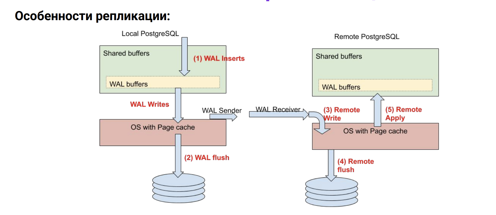
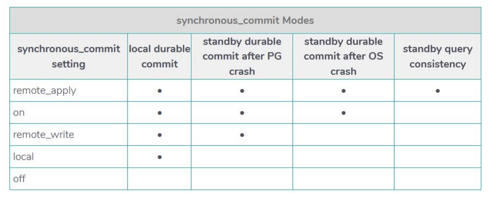
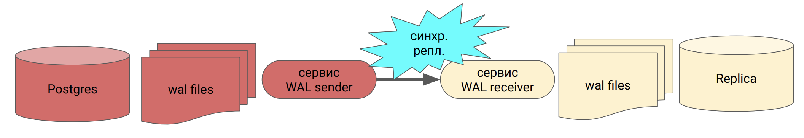
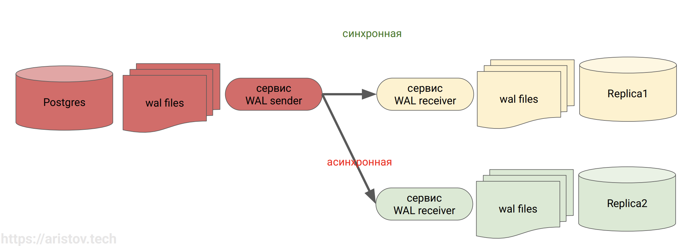
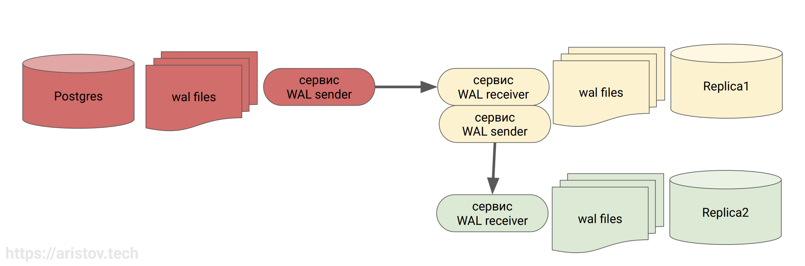
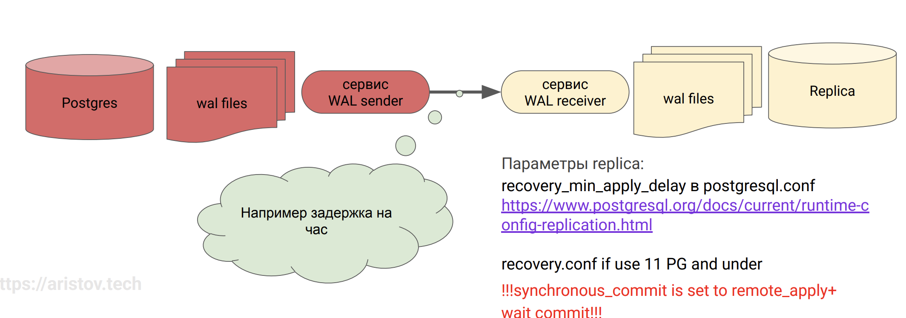
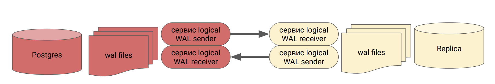

# Физическая и логическая репликация

Маршрут вебинара
- HA vs DR vs Reliability vs Perfomance
- Репликация - назначение и принципы работы
- Физическая репликация - механизмы реализации, пять уровней синхронного коммита и их влияние на отказоустойчивость и производительность
- Логическая репликация - механизмы реализации, подписчик и подписка, мультимастер, проблематика и варианты решения
- Кейсы использования в разных продакшн системах - миграция, реализация различных бизнес схем, параллельное масштабирование

Высокая доступность High Availability, или HA
- измеряется в 9-ках - SLA (количество времени от 0 до 100 сколько у нас система может быть недоступна, в это время можно провести какие то регламентные работы ("окно sla")). Желательно чтобы sla было приписано в каких то регламентирующих документах
- все хотят 99,999 - 5 минут простоя в год
- все предлагают 99,99 - час простоя в год
- метод измерения и критерий доступности  
Тот еще вопрос, например работает, но жутко тормозит - это рабочая ситуация или нет?Реплика на чтение недоступна - как считать?

Performance
- Как измерить? explain? еще что то?
- время отклика на запрос?
  - как измерить?
  - эмуляция запроса?
  - мониторинг?
  - поменяется профиль нагрузки?
  - пиковые моменты?  
При сдаче системы в эксплуатацию лучше сделать какие то тестовые замеры (максимальное обслуживаемое количество клиентов, какие запросы и тд). С заказчиком согласуются методы замера.

Что влияет на доступность?
- отказы
  - профилактика: запланированные
  - аварии: незапланированные
- частота
  - по вине человека (уборщица)
  - техники (убили систему централизованного кондиционирования в банке и пришлось все вентиляторы собирать)
  - природы (аномальная жара, сдохли кондеи - поливали крышу холодной водой с брандспойтов)
Наша задача может решаться только через защиту от отказов или отказоустойчивость.

Reliability - устойчивость к отказам
- метод повышения доступности (HA) (оставаться в рамках сла)
- не путать с DR (disaster recovery) 
- обеспечивается техническими (избыточной техникой) и организационными средствами
- избавляемся от единой точки отказа

HA vs DR
- HA - высокая доступность
  - 5 9-к еще достижимо
  - нет потери данных (мы всегда доступны)
  - не дальше 100 км (дата центы должны быть рядом)
- DR - восстановление после катастроф - (когда HA уже не помог), тут никто уже не говорит об сла!
  - никаких пяти 9-к
  - потеря данных почти всегда
  - только дальше 100 км
  - желательно проводить учения

## Репликация

Бэкап это хорошо, но нужно время на его развертывание. Чтобы обеспечить высокую доступность и придумали репликацию. Кроме этого:
- Что делать, когда закончились физические ядра и память у сервера? горизонтально масштабировать (апскейл всегда конечен). Иногда проще поднять 2-3 средненьких сервера и настроить репликацию, чем платить в 3-4 раза больше за мощный сервер
- Бэкап лучше делать с реплики, а не мастера. (мастер итак у нас самый загруженный сервер, мастер - это куда идет запись)
- Геораспределение нагрузки.
- Нагрузку по чтению и отчетам можно переложить на реплику

Варианты со своими плюсами и минусами:
- физическая - pg_basebackup (утилита бекапа), это бинарное перемещение наших wal-файлов
- логическая - pub/sub, тоже использует wal-файлы, но нужно включать logical

### Физическая репликация

Особенности:
- мастер-слейв: поток данных только в одну сторону
- трансляция потока журнальных записей - WAL
- требуется двоичная совместимость серверов - одна и та же мажорная (основная) версия
- возможна репликация только всего кластера
- pg_basebackup с ключом -R - прописывает все параметры и обеспечивает постоянное соединение
- wal_keep_size + слот (специальные слоты, которые держат wal-файлы и, когда реплика вернется в строй, - он их донакатит)

Так как реплика - это бинарная копия, то на ней не допускаются никакие изменения!  
Команды, которые допускаются на реплике:
- создание резервной копии (pg_basebackup)
- установка параметров сервера (set, reset)
- запросы на чтение данных (select, copy to, курсоры)
- управление транзакциями (begin, commit, rollback...)  
Не допускаются на реплике:
- команды DDL (create, drop...), в том числе создание временных таблиц
- любые изменения (insert, update, delete, truncate, nextval...)
- блокировки, предполагающие изменение (select for update...)
- команды сопровождения (vacuum, analyze, reindex...) (это доезжает через wal файлы)
- управление доступом (grant, revoke - это изменение данных в файле!)
- не срабатывают триггеры и пользовательские (advisory) блокировки  
Что происходит с Vacuum:
- зависит от параметра hot_standby_feedback (будет ли сообщать наш ведомый сервер о тех строчках, которые у него сейчас заняты)



Как работает механизм записи. Мы вставляем данные, они изменяют у нас shared buffers, они попадают в wal buffers, попадают на диск в wal-файлы. Wal-файлы через процесс wal sender транслируются на ведомые сервера, где процесс wal receiver получает их. Помимо получения он может записать их на диск или внести изменнения в shared buffers (в память).

Особенности синхронной репликации (дока)



У нас есть 5 уровней синхронного коммита.
- `off` - отключенный, то есть асинхронный режим. Пишем пачками, за определенный период накапливается буфер и пишется (классически раз в 200мс). ЧТо нехорошо - можем потерять часть данных
- уровень `local`, мы пишем wal-файлы себе на диск на мастере. То есть wal buffers сначала будут зафиксированы на диск и только потом приложение скажет окей.
- `remote_write` - реплика у нас получила, все хорошо. Но если реплика закрашилась - нам нужно будет снова эти данные (вал-файлы) получать (мы их потеряем)
- `on` - мы еще их пишем на диск на реплике
- `remote_apply` - самый тяжелый вариант, мы еще применили эти файлы на реплике. Получаются, у нас данные там будут консистентны.  
Чем выше уровень, тем медленнее работает репликация (тем больше действий нужно будет сделать прежде чем приложение скажет окей).

Обязательно задавать параметр стендбай неймс при всключении синхронной репликации! В доке этот момент как-то обошли. Без него remote_apply работать не будет.

Уровень репликации можно задавать вплоть до уровня транзакций, например, выставить асинхронный режим, а важные финансовые транзакции проводить на уровне remote_apply. Разные объекты могут жить в своем режиме.
- At each transaction level. In a perfectly tunned application design, specific transaction can opt-in for specific sychronous_commit levels for each transaction, for example: `SET LOCAL synchronous_commit = 'remote_write';`
- At session level - The setting can be specified at each session-level so that it is applicable across the session unless overridden by the transaction level setting mentioned above. `SET synchronous_commit = 'remote_write';`
- At user level - In an ideal system, with well-managed user accounts, each user account will be dealing with specific functionality. It can range from the critical transaction system to the reporting user accounts. For example: `ALTER USER trans_user SET synchronous_commit= ON;`
- At database level - Specifying at the database level is useful when we have dedicated systems for reporting or temporary staging information. `ALTER DATABASE reporting SET synchronous_commit=OFF;`
- At instance level This is at the PostgreSQL instance level as follows: `ALTER SYSTEM SET synchronous_commit=OFF;`

Так мы значительно ускоряемся, но есть единственная проблема - как потом это дебажить.

### Логическая репликация

Wal-файлы мы поднимаем до logical, пишется больше информации. Поэтому если нет логической репликации - НЕ НАДО поднимать до уровня logical.

Особенности:
- поставщик-подписчик: поток данных возможен в обе стороны
- возможна выборочная репликация отдельных таблиц
- используется информация о строках (необходимо повысить уровень WAL до logical)
- возможна репликация между разными основными версиями PostgreSQL

Кейсы использования:
- кастомная логика
- миграция на новую версию Постгреса (протокол один и тот же, ничего не менялось)
- объединение данных из разных источников
- репликация отдельных таблиц, когда весь сервер не нужен
- рассылка справочников по территориальным подразделениям

Мы публикуем какой то объект (например, 10 таблиц) и мы можем на них подписываться с других реплик. Соответственно, здесь мы не весь кластер реплицируем, а какие то объекты. Соответственно, у нас есть возможность первичной инициализации или получать только изменения наших данных. Также мы можем наши данные переналить.  
Работает помедленней - нагрузка чуть больше. И трудней настроить (нужно будет и публиковать, и подписаться)

Логическая репликация. Публикующий сервер
- выдает изменения данных построчно в порядке их фиксации
- параметр wal_level = logical
- реплицируются команды INSERT, UPDATE, DELETE, в 11 версии добавили TRUNCATE
- DDL не передаются, то есть таблицы-приемники на стороне подписчика надо создавать вручную (все таблички должны быть созданы на стороне получателя до этого)
- все триггеры отрабатывают отдельно, счетчики не реплицируются
- возможна начальная синхронизация
- используется слот логической репликации
- реплицировать данные возможно только из базовых таблиц в базовые таблицы. То есть таблицы на стороне публикации и на стороне подписки должны быть обычными, а не представлениями, мат. представлениями
- при репликации секционированных таблиц есть ограничения до 13 версии - вы можете реплицировать секции одну в одну, но нельзя реплицировать данные в таблицы, секционированные по-другому
- данные последовательностей не реплицируются
- репликация может поломаться. Например, придут данные, нарушающие уникальность. При этом репликация поломается молча, нужно мониторить слот репликации!  
Процесс будет не wal-sender/wal-receiver, а logical-sender/logical-receiver.

Логическая репликация. Сервер подписки
- получают и применяют изменения
- может быть сколько угодно, зависит только от количества слотов репликации
- применение изменений происходит без выполнения команд SQL и связанных с этим накладных расходов на разбор и планирование, что уменьшает нагрузку на подписчика
- возможны конфликты с локальными данными
- триггеры срабатывают для каждого подписчика отдельно

Пример, как справиться с ломанием репликации "репликация может поломаться. Например, придут данные, нарушающие уникальность. Пришел id=10, а у нас уже есть в таблице такая запись". Можно на одном публикующем сервере айди делать только четные, а на другом - только нечетные, тогда все будет ок.

Логическая репликация. Особенности
- Варианты идентификации строки для изменения и удаления:
  - столбцы первичного ключа (по умолчанию)
  - столбцы указанного уникального индекса с ограничением NOT NULL
  - все столбцы
  - без идентификации (для системного каталога)
- При конфликтах (нарушение ограничений целостности):
  - репликация приостанавливается до устранения конфликта вручную
  - при этом об этом вы никак не узнаете - нужно мониторить слот репликации!!!
- Варианты исправить ситуацию:
  - либо исправить данных
  - либо пропустить конфликтующую транзакцию

В 16 и 17 постгресе значительно бустнули логическую репликацию. Сделали ее параллельной, можно сделать потоковую (раньше ждало коммита), сделали передачу в бинарном виде (то есть сами данные пишутся в сжатом формате) 

Логическая репликация. Параметры
CREATE SUBSCRIPTION sub CONNECTION 'host=ec2-44-209-69-249.compute-1.amazonaws.com
user=admin password=password dbname=demo' PUBLICATION pub WITH (copy_data = off,
streaming=parallel, synchronous_commit=remote_apply);
streaming=- on for current transaction - или после коммита полностью
in 16 PG - Parallel up to 50-60%
copy_data=on, binary=true up to 50%
https://www.pgedge.com/blog/postgresql-16-logical-replication-improvements-in-action
https://blog.peerdb.io/five-tips-on-postgres-logical-decoding
https://www.enterprisedb.com/blog/logical-decoding-large-progress-transactions-postgresql
create_slot for durability - куча новых опций с 14, 17
manually-create-replication-slot-for-publication-in-postgresql-10
https://pgpedia.info/p/pg_create_logical_replication_slot.html

## Варианты репликации 33 00

1. Горячий резерв for high availability

Синхронная репликация:
- реплика должна максимально соответствовать мастеру
- запросы к реплике возможны, но не приоритетны
- количество и имена в параметре synchronous_standby_names = 'FIRST/ANY 2 (s1, s2, s3)' (можем указать сколько синхронных серверов у нас будет). Если указываем синхронный сервер и он у нас недоступен - у нас все запросы на вставку зависнут! (ок он не скажет)
- synchronous_standby_names = '*' (есть много но, ждет ответа от самого медленного сервера)



- Параметры primary: 
  - synchronous_commit = on
- Параметры replica:
  - hot_standby_feedback = off - не сообщаем о транзакциях мастеру (реплика не должна никак аффектить! Можно ее даже закрыть на чтение)
  - max_standby_streaming_delay=t - маленькое время отмены конфликтующих транзакций

2. Балансировка OLTP

Много коротких запросов (пишем на мастера, читаем на слейва):
- запросы на реплике должны отрабатываться
- долгие запросы повлияют на primary, но у нас их не должно быть

- Параметры primary:
  - synchronous_commit = off/local
- Параметры replica:
  - hot_standby_feedback = on - сообщаем о транзакциях мастеру
  - max_standby_streaming_delay=T - большое время отмены конфл.транз. (здесь уже можем подождать какое то время)

Она у нас как раз для чтения!

3. Реплика для отчетов (OLAP)

Запросы могут читаться часами! Поэтому отключаем транзакции (см параметры реплики)

Аналитическая реплика:
- запросы на реплике должны отрабатывать, в том числе и долгие. Самые актуальные данные не нужны
- мастер не должен испытывать от этого неудобства

- Параметры primary:
  - synchronous_commit = off
- Параметры replica:
  - hot_standby_feedback = off - не сообщаем о транзакциях мастеру
  - max_standby_streaming_delay=-1 - отключаем отмену конфл.транз. (аналитики анализирует миллионы строк, поэтому пара-тройка заблокированных за час построения отчета - погоды не сделают, для нам несущественно)

4. Горизонтальное масштабирование с HA

- Синхронная реплика для отказоустойчивости. Если отваливается - у нас встает запись. Поэтому может имеет смысл сделать две синхронные реплики сделать и указать any one / first one (сначала будет писать на более быструю реплику)
- Асинхронная для OLTP нагрузки. 



5. Каскадная репликация

Для снижения сетевой нагрузки и нагрузки на жесткий диск primary сервера. Мы снимаем реплику с реплики (мастер у нас и так самое нагруженное место, не нужно его аффектить еще больше)



6. Time machine

Изменения на реплике применяются с задержкой. Мы wal-файлы получили, а запросы наши начинаем кидать через час/два (обычно делают до 4 часов). Например, зачем это может понадобиться:
- произошел фатальный сбой по той или иной причине и мы можем остановить репликацию до битой транзакции
- можно поставить репликацию на паузу для проведения опасных миграций



Ни в коем случае не делаем синхронную реплику с тайм машиной! А то каждая вставка будет идти час + сколько выполняется запрос.

7. Объединение данных

- Логическая репликация
- Можем выбирать отдельные таблицы для репликации
- Публикация+подписка
- Не забываем про уникальность ПК

Здесь мы можем продавать локально локальные товары, а потом через логическую репликацию сливать их уже на основной сервер, где уже считаем все отчеты.

8. Рассылка данных (например, справочников)

- Логическая репликация
- Можем выбирать отдельные таблицы для репликации
- можем комбинировать с предыдущим вариантом

9. Смена версии ПГ (тут используем логическую репликацию)

## PITR

PITR - Point In Time Recovery - восстановление данных на определенную точку во времени.  
Для PITR вам нужен:
- basebackup (полная копия) (или аналог) как основа, должно быть завершено его снятие до даты и времени требуемого восстановления pitr
- непрерывный архив всех wal сегментов без пропусков от момента checkpoint перед снятием используемого в восстановлении basebackup и до требуемой точки восстановления

У postgresql REDO recovery, а не UNDO. PITR только вперёд от текущей позиции. И не раньше достижения точки консистентности состояния (окончания снятия basebackup)

Классический вариант настройки мастера - слейвы под:
- фэиловеры (1)
- бэкапы (1)
- парочка под бэкэнд нагрузку
- построение отчетов (olap) (1)

## Мастер-мастер репликация

- Нет её по умолчанию в Постгресе
- Да и эксперты и я в том числе, сходимся во мнении, что тут больше проблем, чем их решения.
- Вариант - Мастер-мастер в Enterprise версии Postgres Pro. Но даже там она основана на логической репликации и четко прописано, что НЕ рекомендовано использовать в продакшн средах. Обещали выпустить 1.0 в 17 версии
- Если очень хочется, то мой вариант:



Берем 2 сервера и настраиваем разнонаправленную генерацию. Можем разнести по логике - на один сервер пишем данные по бухгалтерии, на другой - по производству. Затем подписываемся.

Главное для последовательностей генерируйте через шаг и чет/нечет

Общие проблемы #БЕСТ_ПРАКТИС
- бэкап снимаем с secondary
- не забываем про валидацию бэкапа
- возможно есть смысл в каскадной репликации при проблемах с производительностью сети
- синхронная реплика снижает производительность, но обеспечивает надежность
- не забываем про OLAP - делаем специальную реплику, возможно например подключить clickhouse (реплику для кликхауса)
- геораспределение нагрузки
- строим планы развития системы (краткосрочный, долгосрочный) - прогноз обязателен!!!
- мониторим пустое место !!! размер WAL и не только !!! (слоты репликации начинают жрать место) лекция по мониторингу в курсе 2.0

### pg_rewind

[Утилита](https://www.postgresql.org/docs/current/app-pgrewind.html) для перенакатки валов - например отвалилась реплика  
[гитхаб](https://github.com/aeuge/pg_rewind) лектора ВМ + докер

## Практика 53 00

Сценарий:
- поднимаем реплику - тестируем
- отключаем синхронный коммит - тестируем
- промоутим до 2 раздельных серверов
- создаем публикацию
- подписываемс

```bash
# поднимаем реплику - тестируем
# 1 node
su postgres 
cd ~
# добавляем listen_addresses - считается последняя настройка (полностью в интернет не открываем!)
cat >> /var/lib/postgresql/data/postgresql.conf << EOL
listen_addresses = '172.24.0.2'
EOL
# sudo pg_conftool 17 main13 set listen_addresses '*' - с адресом НЕ работает !!! кавычек не ставит и не воспринимается
# задаем маску подсети /16 чтобы ограничить диапазоны
# пользователя кидаем replicator! создадим его чуть ниже
cat >> /etc/postgresql/17/main/pg_hba.conf << EOL
host replication replicator 10.128.0.0/16 scram-sha-256
EOL
# стоп и старт кластера под юзером postgres, ибо запущен был под суперюзером и restart не сработает
pg_ctlcluster 17 main stop && pg_ctlcluster 17 main start

# зальём тайские перевозки
wget https://storage.googleapis.com/thaibus/thai_small.tar.gz && tar -xf thai_small.tar.gz && psql < thai.sql


# общая рекомендация - несмотря на то, что мы можем все настроить под пользователем постгрес, рекомендуется делать своего юзера под репликацию
# права юзеру чисто под репликацию, то есть он не зайдет и запросики не покидает просто так
# обратим внимание на возможные проблемы экранирования спецсимволов при командном исполнении
psql -c "CREATE USER replicator WITH REPLICATION ENCRYPTED PASSWORD 'secret$123';"
# psql -c "ALTER USER replicator WITH PASSWORD 'secret\$123';"

# создадим слот для устойчивости
# у нас пока физическая репликация всего кластера!
psql -c "SELECT pg_create_physical_replication_slot('test');"

##################
# 2 инстанс
##################

sudo su postgres
# format hostname:port:database:username:password and supports wildcards, so you can just set the database to "*" for example.
# чтобы не вводить пароль для пользователя - создадим в домашнем каталоге пользователя постгрес файл с паролями .pgpass
cat >> ~/.pgpass << EOL
postgres4:5432:*:replicator:secret$123
EOL

# выдадим нужные права для секьюрности
chmod 0600 ~/.pgpass


# останавливаем кластер на реплике, удаляем каталог с данными полностью, чтобы наш бейзбэкап переналил данные с реплики
pg_ctlcluster 17 main stop
rm -rf /var/lib/postgresql/17/main
pg_basebackup -h postgres4 -p 5432 -U replicator -R -S test -D /var/lib/postgresql/17/main
# ключ -R очень важен! Если без него - будет просто бэкап, то есть не поймет что он реплика. С ним же включится режим получения вал-файлов и автоматом пропишустся все остальные настройки


##################
# 1 инстанс
##################

# если висит, ожидает checkpoint (в 1 инстансе)
checkpoint;

# тестируем
# нагрузка на запись (аффектить будет - если мы сделаем синхронную, то нам синхронная реплика должна ок дать. То есть на 2 сетевых хопа больше)
cat > ~/workload2.sql << EOL
INSERT INTO book.tickets (fkRide, fio, contact, fkSeat)
VALUES (
	ceil(random()*100)
	, (array(SELECT fam FROM book.fam))[ceil(random()*110)]::text || ' ' ||
    (array(SELECT nam FROM book.nam))[ceil(random()*110)]::text
    ,('{"phone":"+7' || (1000000000::bigint + floor(random()*9000000000)::bigint)::text || '"}')::jsonb
    , ceil(random()*100));

EOL

# ------------------------------------
# for 17 PG
/usr/lib/postgresql/17/bin/pgbench -c 8 -j 4 -T 10 -f ~/workload2.sql -n -U postgres -p 5432 thai
# 3600

# нагрузка на чтение (аффектить на будет)
cat > ~/workload.sql << EOL

\set r random(1, 5000000) 
SELECT id, fkRide, fio, contact, fkSeat FROM book.tickets WHERE id = :r;

EOL
# ------------------------------------
# for 17 PG
/usr/lib/postgresql/17/bin/pgbench -c 8 -j 4 -T 10 -f ~/workload.sql -n -U postgres thai
# 18000

##################
# 2 инстанс
##################

pg_ctlcluster 17 main start

# проверяем что реплика находится в состоянии рековери
psql -d thai -c "select pg_is_in_recovery();"
# если она не в рековери - это стандэлон реплика, ниоткуда не появляются вал-файлы

# убедимся что все накатилось
psql -d thai -c "select count(*) from book.tickets;"

# физическая репликация - это всего 1 команда!

# -- тестируем на запись
# -- 3300
# -- если включить синхронный коммит, падение будет более драматическим

# -- тестируем на чтение мастера
# -- 20000

# -- тестируем на чтение слейва
# -- 19000
# -- в целом небольшая погрешность

# -- обратите внимание, что несмотря на то, что включен синхронный коммит, реплика НЕ настроена правильно
# -- нужно корректно настроить application_name на реплике
# -- и synchronous_standby_names на мастере
psql -c "SHOW synchronous_commit;"

# -- Проверим состояние репликации в расширенном режиме:
SELECT * FROM pg_stat_replication \gx

# -- sync_state       | async
# он покажет что репликация асинхронная (несмотря на то, что чуть выше он выдат `on` на `SHOW synchronous_commit;` ). Для того чтобы работала синхронная репликация - мы должны задать standby_names


# Посмотрим на процессы реплики:
ps -o pid,command --ppid `head -n 1 /var/lib/postgresql/17/main/postmaster.pid`
#  PID COMMAND
#   848 postgres: 16/main: startup process   recovering 00000001000000000000000B
#   849 postgres: 16/main: checkpointer process
#   850 postgres: 16/main: writer process
#   851 postgres: 16/main: stats collector process
#   852 postgres: 16/main: wal receiver process   streaming 0/B002290
# Процесс wal receiver принимает поток журнальных записей, процесс startup применяет изменения.

# Сравним с процессами мастера:
ps -o pid,command --ppid `head -n 1 /var/lib/postgresql/17/main/postmaster.pid`
#   PID COMMAND
#   853 postgres: 16/main: wal sender process postgres [local] streaming 0/B002290
# 10430 postgres: 16/main: checkpointer process
# 10431 postgres: 16/main: writer process
# 10432 postgres: 16/main: wal writer process
# 10433 postgres: 16/main: autovacuum launcher process
# 10434 postgres: 16/main: stats collector process
# 10435 postgres: 16/main: bgworker: logical replication launcher

# на реплице процессов значительно меньше, чем на мастере! Реплика не занимается вакуумом, бг-райтерством. Она занимается только чтением, то есть более легковесная.


# 1 03 00 примерно
# вернемся к настройке синхронной репликации. Попробуем его отключить

# -- кворум можно настроить для репликации
# -- https://wiki.postgresql.org/wiki New_in_postgres_10#Quorum_Commit_for_Synchronous_Replication

ALTER SYSTEM SET synchronous_commit='off';
pg_ctlcluster 17 main reload

# -- запромоутим реплику
pg_ctlcluster 17 main promote

psql -d thai -c "select pg_is_in_recovery();"
# -- f - теперь самостоятельный мастер

ls -la
# -rw-------  1 postgres postgres      0 Mar 25 16:59 standby.signal

# -- Логическая репликация
ALTER SYSTEM SET wal_level = logical;

# -- Рестартуем кластер
pg_ctlcluster 17 main restart


# -- На первом сервере создаем публикацию:
CREATE TABLE test(i int);
CREATE PUBLICATION test_pub FOR TABLE test;
\password 
-- admin$123
\dRp+

# -- создадим подписку на втором экземпляре
CREATE TABLE test(i int);
# --создадим подписку к БД по Порту с Юзером и Паролем и Копированием данных=false
CREATE SUBSCRIPTION test_sub 
CONNECTION 'host=10.128.0.50 port=5432 user=postgres password=admin$123 dbname=postgres' 
PUBLICATION test_pub WITH (copy_data = false);

# -- ERROR:  could not connect to the publisher: connection to server at "10.128.0.25", port 5432 failed: FATAL:  no pg_hba.conf entry for host "10.128.0.17", user "postgres", database "postgres", SSL encryption
# -- connection to server at "10.128.0.25", port 5432 failed: FATAL:  no pg_hba.conf entry for host "10.128.0.17", user "postgres", database "postgres", no encryption

nano /etc/postgresql/17/main/pg_hba.conf
# -- а настраивали то только для replicator

cat >> /etc/postgresql/17/main/pg_hba.conf << EOL
host postgres postgres 10.128.0.0/16 scram-sha-256
EOL

pg_ctlcluster 17 main reload

# -- Теперь подписка создалась
\dRs

SELECT * FROM pg_stat_subscription \gx

# --добавим одинаковые данные
insert into test values (1);
insert into test values (1);

# ---добавить индекс
CREATE unique index on test (i);
\dS+ test

# -- обратите внимание, индекс не доедет до подписки! ручное создание


# -- если нужно удалить публикацию/подписку
# -- drop publication test_pub;
# -- drop subscription test_sub;
```

[Типичные ошибки при построении высокодоступных кластеров и как их избежать.](https://habr.com/ru/articles/518216/)

## ДЗ

- Развернуть асинхронную реплику (можно использовать 1 ВМ, просто рядом кластер развернуть и подключиться через localhost):
- тестируем производительность по сравнению с сингл инстансом

Эталонного решения не будет, так как всё показано на лекции.
Задание со * переделать:
а) под синхронную реплику
б) синхронная реплика + асинхронная каскадно снимаемая с синхронной
Задание с **: переделать скрипты для ВМ или докера из моей репы с pg_rewind под 17 ПГ