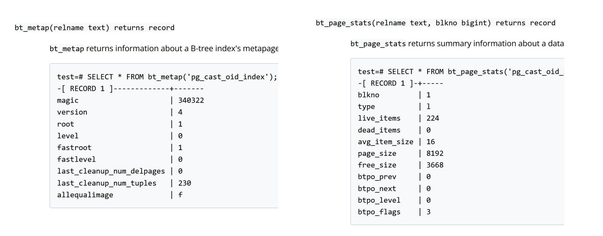

# Индексы и их слабые стороны

## Маршрут вебинара

- Виды индексов в PostgreSQL - плюсы и минусы их использования, как они работают
- Принципы работы популярных индексов - btree, hash, GIN
- Физическая архитектура индексов
- Explain - структура, как правильно читать планы запросов, инструменты визуализации
- Типы индексов Btree - простой, уникальный, составной, покрывающий, частичный
- Обслуживание индексов - принципы, задачи и подходы к реализации и в каких случаях они НЕ работают
- Кластерный индекс в PostgreSQL - что с ним не так
- Особенности массовой загрузки данных

## Что такое индекс

Это указатели наших данных, которые позволяют быстро найти информацию, классически по логарифму (несмотря на то, что их много, обычно мы используем один, би-плюс-три).

Плюсы индексов:
- Позволяют обеспечить уникальность (когда мы говорим что поле уникально - под капотом создается индекс в любом случае. Как мы проверяем на уникальность - смотрим, есть ли у нас такое значение или нет. Если индекс есть - мы находим, если нет - значение добавляем)
- Ускоряют выборку в операциях SELECT (если есть выборка по какому то условию, диапазону значений)
- При выборке данных только индексного поля, данные из таблицы не выбираются
- Увеличение скорости сортировки по индексному полю  
Минусы индексов:
- Индексы требуют дополнительного места
- Необходимо перестраивать индексы при операциях UPDATE, DELETE, INSERT (чем больше индексов - тем дольше вставки!)
- При большом количестве индексов оптимизатору сложно выбрать какой использовать

Индекс необходимо поддерживать, обслуживать! Это не бесплатно, на это тратятся ресурсы! Количество индексов по хорошему должно быть ограничено, ограничено количеством наших запросов на выборку и на сортировку.

### Виды индексов

```sql
CREATE [ UNIQUE ] INDEX [ CONCURRENTLY ] [ [ IF NOT EXISTS ] имя ] ON имя_таблицы [
USING метод ]
 ( { имя_столбца | ( выражение ) } [ COLLATE правило_сортировки ] [ класс_операторов ] [
ASC | DESC ] [ NULLS  FIRST | LAST } ] [, ...] )
 [ INCLUDE ( имя столбца [,...]) ] для Btree и Gist
 [ WITH ( параметр_хранения = значение [, ... ] ) ]
 [ TABLESPACE табл_пространство ]
 [ WHERE предикат ]
```
- CONCURRENTLY - рекомендуется использовать конкурентность. Если мы не используем конкурентность - то у нас используется эксклюзивная блокировка и таблица блокируется на вставку, спасибо за это на проде не скажут.
- метод - обычно не указывается, тк по умолчанию у нас обычно btree индекс (наше сбалансированное дерево). Еслди нужно что то другое - то во первых, нам точно нужно понимать, что именно нам нужно
- INCLUDE - покрывающий индекс, может включать в себя столбец. Зачем это может понадобится - индекс будет включать это поле и нам не потребуется идти за данными на диск (обычно индекс содержит значение и ссылку на место, где эти данные лежат на диске)
- WHERE - моржем сделать частичный индекс, не так часто используется

Видов индексов в Постгресе довольно много:
- Битри (btree) или сбалансированное дерево (default). Используется в 99% индексов. Применим для любого типа, который можно отсортировать в чётко определённом линейном порядке. Работает с операторами сравнения >, <, =, >=, <=, BETWEEN и IN и условия пустоты IS NULL и IS NOT NULL (то есть работает практически по всем условиям). Плюс учавствует в сортировках - то есть данные у нас хранятся предсортированные.
- Хэш-индекс (hash). Работает только с условием равенства (=). В условиях IS NULL и IS NOT NULL также не используется. Быстрее битри
- GIN индекс (Generalized Inverted Index) или обобщённый инвертированный индекс. Применяется к составным типам, работа с которыми осуществляется с помощью ключей: массивы, jsonb. Предназначается для случаев, когда индексируемые значения являются составными, а запросы ищут значения элементов в этих составных объектах. Самый распространённый вариант использования индексов GIN & GiST - полнотекстовый поиск по аналогии с Google/Yandex.
- GiST индекс (Generalized Search Tree) - обобщённое поисковое дерево. Базовый шаблон, на основе которого могут реализовываться произвольные схемы индексации. Для построения используют один из нескольких алгоритмов, наиболее подходящих под тип индексируемого поля, поэтому набор операторов зависит от типа поля. Применяется для специфических типов данных: геометрии, сетевые адреса, диапазоны. (но вообще есть целые экстеншены, позволяющие работать с геоданными. Нету смысла использовать индексы для геоданных и писать что то свое, когда люди уже долгое время пишут что то специализированное для этого)
- SP-GiST индекс (Space-Partitioned GiST). Это GiST с разбиением пространства. Метод поддерживает деревья поиска с разбиением, что позволяет работать с различными несбалансированными структурами данных (деревья квадрантов, kмерные и префиксные деревья). Как и GiST, SP-GiST позволяет разрабатывать дополнительные типы данных с соответствующими методами доступа.
- BRIN - block range index (с 11 версии) - блоковый индекс. Постранично раскладывает данные по времени. Может использовать например в таблицах логирования, GPS трекинга, IoT https://www.crunchydata.com/blog/postgres-indexing-when-does-brin-win (уходит во временные ряды)

### Btree (на самом деле btree+) 17 00

В чем идея: у нас есть корень верхний, который содержит определенное количество значений (там есть сложные формулы, которые считают, сколько может быть значенией в корне, от этого зависит высота дерева, мы на это повлиять не можем). На верхнем ряду у нас есть ряд значений. Меньше 32 - уходим налево, больше 64 - идем направо. Чем больше значений - тем быстрее мы находим (когда мыло значений - индекс просто работать не будет). КОгда мы доходим до листа - на листе содержится значение и ссылка, где эти данные на диске находятся. Но дерево у нас btree+ - плюс тут заключается в том, что ссылки на листьях есть еще и друг на друга. Это удобно когда мы ищем по неравенству - условно, ,27 - это мы находим 27 и смотрим все листья слева. Данные на листьях отсортированы - это побочный эффект такой технологии (при том что сортировка - это вообще то одна из самых дорогих операций, которые есть). В обычном бинарном дереве пришлось бы прочитать все данные с диска и потом уже фильтровать.


Начиная с версии Postgresql 13 - Btree может занимать меньше места за счет [дедупликации](https://www.cybertec-postgresql.com/en/b-tree-index-deduplication/) (default), которая говорит нам о том, что с одинаковым значением будет храниться не просто значение-ссылка, а будет храниться значение и список ссылок. Так мы экономим место на значениях.


Как работает хэш. У нас есть определенное значение, есть функция хэширования. Она у нас равномерная - это для нас начит что она равномерно нагружает бакет. В данной ситуации у нас есть какое то количство бакетов, функция хэширования сразу говорит нужный бакет. При поиске мы сразу знаем нужный бакет. В этом бакете и лежат все наши значения. Внутри бакетов тоже скорее всего есть какая то структурка, которая позволяет не все перебирать, а быстро найти. То есть с битрии - у нас сложность логарифм, а с хэшом - вообще по идее константа


Gin и gist вообще у нас чем то похожи на алфавитный указатель.
- Используются для работы с текстом (более предпочтителен Gin) и геоданными (Gist)
- Тип столбца должен быть tsvector или tsquery (в случае GIST)
- Gin похож на алфавитный указатель

Brin - В отличие от индексов, с которыми мы уже познакомились, идея BRIN не в том, чтобы быстро найти нужные строки, а в том, чтобы избежать просмотра заведомо ненужных. То есть он говорит нам где значений точно нет "там искать не нужно, иди ищи примерно там".Это всегда неточный индекс: он вообще не содержит TID-ов табличных строк. Для больших объемов, где физическое расположение коррелирует со значением. То есть если у нас миллион файлов и нам нужно найти 5000-чный файл - нужно иджти и искать примерно на 5000чной страничке. На практике редко встречается.

Наглядная картинка по битри, [статья](https://habr.com/ru/companies/quadcode/articles/696498/)


Стрелочки от листьев внизу - в разные стороны. Мы ссылаемся на данные на диске. А так как у нас система mvcc , мы пишем в пустое место - у нас данные на диске вообще абсолютно фрагментированы (в отличии от обычной субд). О последовательном чтении вообще речи не идет!

Есть и проблема. Когда создается индекс - есть такое понятие как плотность. Плотность 90% - 10% ячеек остаются пустыми при его создании. Когда они забиваются - приходится добавлять лист и делать перебалансировку. При добавлении большого количества значений происходит рост дерева. [Статья](https://medium.com/@lordmoma/why-using-b-tree-indexing-in-sql-6a3203ed57a5) . Все это регулируются автоматически

Как это происходит с физической точки зрения: нужно добавить в первый лист. Добавляется еще один лист, в первом листе - ссылка на новый лист и на него добавлячются новые данные.


Итого: индекс это очень круто, очень быстро ищем, но замедлет вставку/обновление/удаление.

Как это все выглядит внутри? [дока](https://www.postgresql.org/docs/current/pageinspect.html#PAGEINSPECT-B-TREE-FUNCS), включаем pageinspect и становится видно, какое уровень, данные из индекса берем. МОжно разобрать индекс по косточкам (практической ценности нет, только теоретическая). А вот статистика страницы - вещь полезная. На ней можно убедиться что есть проблема блоатинга/распхуания. Как у нас в системе mvcc новая строчка на каждое изменение, так и в индексах. Мы не изменяем значение в индексе, а у нас дорбавляется новое значение. Здесь нас вакуум не всегда спасает



Удаление значений тоже не всегда [очевидно](https://iq.opengenus.org/b-tree-deletion/)

Плюсы Btree:
- довольно быстрый индекс - сложность O(log n) 
- широкий диапазон условий для выборки по условиям  
Минусы:
- если при очередном добавлении/изменении/удалении значения требуется балансировка - довольно медленно. Именно поэтому изначально плотность заполнения 90%
- необходимо их обслуживать - будет рассмотрено дальше в курсе
- работает хорошо только с простыми типами данных (числа, даты, денежные)
- работает со строками, только если ищем по шаблону с начала строки (%АБВ)  
https://www.geeksforgeeks.org/what-is-logarithmic-time-complexity/

Можно подсмотреть неиспользуемые индексы (если он нам не нужен - зачем мы тратим ресурсы на его обслуживание?) , а еще можем посмотреть наши запросы, которые используют SeqScan (последовательное сканирование, а не индексное сканирование) - тогда есть смысл сделать индексы чтобы не использовать его.

Есть распространенный подход - дроп индекс, батч инсернт, криэйт индекс (но пока мы вставляем данные - у нас все запросы будут использовать секскан, что не очень оптимально)

### Особенности построения GIN индекса 34 00

GIN индекс - немного особенный, у нас используются корни слов и где эти слова встречаются, в каких строчках. Похож на битри, указывает, на каких страничках находятся какие корни. Благодаря такому индексу мы можем быстро находить, где у нас находится какое слово. В индексе будет лежать уже конкретно разобранная лексема и где она находится. Если лексемы не будет - нам нужно будет каждый раз каждую строчку преобразовывать в лексему и сравнивать (очень медленно!)


К каждому элементу привязан упорядоченный набор ссылок на строки таблицы, содержащие значения с этим элементом. Упорядоченность не принципиальна для выборки данных (порядок сортировки TID-ов не несет в себе особого смысла), но важна с точки зрения внутреннего устройства индекса. Элементы никогда не удаляются из GIN-индекса. Считается, что значения, содержащие элементы, могут пропадать, появляться, изменяться, но набор элементов, из которых они состоят — довольно статичен. Такое решение существенно упрощает алгоритмы, обеспечивающие параллельную работу с индексом нескольких процессов. Для хранения списков используется уже известное нам B-дерево (просто, на B, т.е. однонаправленное). Возьмем за основу для демо [статью](https://habr.com/ru/company/postgrespro/blog/340978/) с хабра Егора Рогова из компании ПостгресПро.  
Проблема построения - Дело в том, что вставка или обновление данных в GIN-индексе выполняется относительно медленно. Каждый документ обычно содержит много лексем, подлежащих индексированию. Поэтому при появлении или изменении одного-единственного документа приходится вносить массовые изменения в дерево индекса. С другой стороны, если изменяется сразу несколько документов, то часть лексем у них может совпасть, и общий объем работы окажется меньше, чем при изменении документов поодиночке.  
У GIN-индекса есть параметр хранения fastupdate, который можно указать при создании индекса или изменить позже: `create index on ts using gin(doc_tsv) with (fastupdate = true);` При включенном параметре изменения будут накапливаться в виде отдельного неупорядоченного списка (в отдельных связанных страницах). Когда этот список становится достаточно большим, либо при выполнении процесса очистки, все накопленные изменения одномоментно вносятся в индекс. Что считать «достаточно большим» списком, определяется конфигурационным параметром gin_pending_list_limit или одноименным параметром хранения самого индекса. Но такой подход имеет и негативные стороны: во-первых, замедляется поиск (за счет того, что кроме дерева приходится просматривать еще и неупорядоченный список), а вовторых, очередное изменение может внезапно занять много времени, если неупорядоченный список переполнился.

GIN индекс достаточно сложный за счет своей развесистой структуры.

### Применение GIN индекса

Области его применения:
- полнотекстовый поиск
- индексирование массивов
- индексирование JSONB  
Возможности:
- Поиск частичного совпадения
- Компактное представление

Можно использовать также данные из JSONB для полнотекстового поиска с помощью функции [jsonb_to_tsvector](https://www.postgresql.org/docs/current/datatype-json.html#JSON-INDEXING)  
Доп. ссылки для изучения:
- https://scalegrid.io/blog/using-jsonb-in-postgresql-how-to-effectively-store-index-json-data-in-postgresql/
- https://bitnine.net/blog-postgresql/postgresql-internals-jsonb-type-and-its-indexes/?ckattempt=1
- https://pganalyze.com/blog/gin-index

### Обслуживание GIN индекса

В отличии от Btree индексов, Элементы никогда не удаляются из GIN-индекса. Считается, что значения, содержащие элементы, могут пропадать, появляться, изменяться, но набор элементов, из которых они состоят — довольно статичен. Такое решение существенно упрощает алгоритмы, обеспечивающие параллельную работу с индексом нескольких процессов. Но в целом рекомендуется REINDEX INDEX CONCURRENTLY в моменты наименьшей нагрузки

## Типы индексов

- Простой индекс
- Уникальный индекс (есть проблема с наллбл)
- Составной индекс (сразу по нескольким полям)
- Покрывающий индекс (не нуждно ходить на диск, но происходит дублирование информации)
- Функциональный индекс (можно использовать свою функцию, ее тип должен быть IMMUTABLE) (есть функция like, есть ilike - но она в 5-6 раз тяжелее. Мы можем создать индекс в нижнем регистре и искать по нижнему регистру)
- Частичный индекс (позволяет проиндексировать маленький кусочек информации)

## Практика 41 00

Обычный индекс
```sql
-- создадим тестовую табличку
drop table if exists test;
create table test as 
select generate_series as id
	, generate_series::text || (random() * 10)::text as col2 
    , (array['Da', 'Net', 'Ne znayu'])[floor(random() * 3 + 1)] as is_okay
from generate_series(1, 20000);
create index idx_test_id on test(id);

-- explain позволяет нам смотреть план запроса, узнать что под капотом - какое сканирование использовалось, какие этапы были
explain
select * from test where id = 1;
/*
                               QUERY PLAN                                
-------------------------------------------------------------------------
 Index Scan using idx_test_id on test  (cost=0.29..8.30 rows=1 width=31)
   Index Cond: (id = 1)
(2 rows)
*/
-- без индекса было бы так
/*
                       QUERY PLAN                       
--------------------------------------------------------
 Seq Scan on test  (cost=0.00..396.00 rows=82 width=68)
   Filter: (id = 1)
(2 rows)
*/
-- Index Scan - у нас идет индексное сканирование
-- Seq Scan - последовательное сканирование
```

Следующий индекс - уникальный. При уникальном индексе важно заметить чтобы поле было нот налл. Если мы его не сделаем, то это считается ошибка человека (субд ничего не скажет), каждый налл уникален. Главная проблема - когда составной ПК и одно из полей налл. Констрэинт уникальность и создание уникального индекса - это абсолютно одно и то же
```sql
-- создадим тестовую табличку
drop table if exists test;
create table test as 
select generate_series as id
	, generate_series::text || (random() * 10)::text as col2 
    , (array['First', 'SEcond', 'Third'])[floor(random() * 3 + 1)] as is_okay
from generate_series(1, 20000);
alter table test add constraint uk_test_id unique(id);

explain
select * from test where id = 1;

-- поле нот налл мы не объявляли - так что можем вставить 2 значения с налл. Каждый налл уникален
insert into test values (null, 12, 'First');
insert into test values (null, 12, 'SEcond');
explain
select * from test where id is null;
/*
                               QUERY PLAN                               
------------------------------------------------------------------------
 Index Scan using uk_test_id on test  (cost=0.29..4.30 rows=1 width=32)
   Index Cond: (id IS NULL)
(2 rows)
*/
```

Составной индекс. Мы можем делать индекс сразу по 2 полям. По первому создастся б-дерево и в каждой ячейке еще будет б-дерево по фрукту
```sql
drop table if exists test;
create table test as 
select generate_series as id
	, generate_series::text || (random() * 10)::text as col2 
    , (array['Apple', 'Banana', 'Pinaapple'])[floor(random() * 3 + 1)] as fruit
from generate_series(1, 100000);
create index idx_test_id_is_okay on test(id, fruit);


explain
select * from test where id = 1 and fruit = 'Banana';
/*
                                    QUERY PLAN                                    
----------------------------------------------------------------------------------
 Bitmap Heap Scan on test  (cost=4.44..12.17 rows=2 width=68)
   Recheck Cond: ((id = 1) AND (fruit = 'Banana'::text))
   ->  Bitmap Index Scan on idx_test_id_is_okay  (cost=0.00..4.44 rows=2 width=0)
         Index Cond: ((id = 1) AND (fruit = 'Banana'::text))
(4 rows)
*/
-- explain select * from test where id = 1;
-- explain select * from test order by id, fruit;
explain select * from test order by id, fruit desc;  -- добавится сортировка
/*
 Incremental Sort  (cost=0.48..9478.11 rows=100000 width=34)
   Sort Key: id, fruit DESC
   Presorted Key: id
   ->  Index Scan using idx_test_id_is_okay on test  (cost=0.42..4978.10 rows=100000 width=34)
(4 rows)
*/
explain select * from test order by id desc, fruit desc;
/*
                                            QUERY PLAN                                            
--------------------------------------------------------------------------------------------------
 Index Scan Backward using idx_test_id_is_okay on test  (cost=0.42..4978.10 rows=100000 width=34)
(1 row)
*/
-- Index Scan Backward !

-- должно быть отсортирповано в одном направлениие, иначе индекс работать не будет

-- также - у нас индекс по айди и фрукту. Если поменяем их местами и попробуем поискать по айди - индекс работать не будет, айди внизу у нас вразнобой
drop index idx_test_id_is_okay;
create index idx_test_id_is_okay on test(fruit, id);
explain select * from test where id = 1;
/*
                       QUERY PLAN                       
--------------------------------------------------------
 Seq Scan on test  (cost=0.00..2082.00 rows=1 width=34)
   Filter: (id = 1)
(2 rows)
*/
```

Покрывающий индекс. Там просто на листе будут лежать значения. Он значитьельно проще в обслуживании и меньше по размеру. Включая поля в индекс, мы можем избежать похода на диск!
```sql
drop table if exists test;
create table test as 
select generate_series as id
	, generate_series::text || (random() * 10)::text as col2 
    , (array['Apple', 'Banana', 'Pinaapple'])[floor(random() * 3 + 1)] as fruit
from generate_series(1, 100000);
create index idx_test_id_is_okay on test(id) INCLUDE (fruit);  -- эти поля никак практически не учавствуют

explain select * from test where  fruit = 'Banana';
/*
                         QUERY PLAN                         
------------------------------------------------------------
 Seq Scan on test  (cost=0.00..2082.00 rows=33507 width=34)
   Filter: (fruit = 'Banana'::text)
(2 rows)
*/
explain select * from test where id = 1;
/*
                                   QUERY PLAN                                    
---------------------------------------------------------------------------------
 Index Scan using idx_test_id_is_okay on test  (cost=0.42..8.44 rows=1 width=34)
   Index Cond: (id = 1)
(2 rows)
*/
explain select * from test where id < 10;
explain select id, fruit from test where id < 10;
-- по идее стоимость будет ниже, так как он не пойдет на диск за лишними полями
```

Функциональный индекс. lower(fruit) = 'banana' с функциональным индексом будет работать сильно лучше, чем айлайк!
```sql
drop table if exists test;
create table test as 
select generate_series as id
	, generate_series::text || (random() * 10)::text as col2 
    , (array['BaNaNa', 'Mushroom', 'Coconut'])[floor(random() * 3 + 1)] as fruit
from generate_series(1, 50000);
create index idx_test_id_is_okay on test(lower(fruit));    

explain select * from test where fruit = 'Banana';
/*
                        QUERY PLAN                        
----------------------------------------------------------
 Seq Scan on test  (cost=0.00..1073.00 rows=250 width=68)
   Filter: (fruit = 'Banana'::text)
(2 rows)
*/
explain select * from test where fruit = 'BaNaNa';
explain select * from test where lower(fruit) = 'banana';  -- вот тут попадем в индекс
/*
                                       QUERY PLAN                                       
----------------------------------------------------------------------------------------
 Bitmap Heap Scan on test  (cost=194.05..862.19 rows=16743 width=35)
   Recheck Cond: (lower(fruit) = 'banana'::text)
   ->  Bitmap Index Scan on idx_test_id_is_okay  (cost=0.00..189.86 rows=16743 width=0)
         Index Cond: (lower(fruit) = 'banana'::text)
*/
explain select * from test where lower(fruit) = 'BaNaNa';
-- здесь мы не будем приводить каждую строчку к нижнему регистру! Он будет подставлять значение, хранящееся в индексу
/*
                                   QUERY PLAN                                    
---------------------------------------------------------------------------------
 Index Scan using idx_test_id_is_okay on test  (cost=0.29..7.85 rows=1 width=35)
   Index Cond: (lower(fruit) = 'BaNaNa'::text)
(2 rows)
*/

-- сравнение лайк и айлайк
explain analyze
select count(*) from test where fruit like 'BaNaNa' limit 1;
/*
                                                      QUERY PLAN                                                      
----------------------------------------------------------------------------------------------------------------------
 Limit  (cost=1083.86..1083.87 rows=1 width=8) (actual time=12.373..12.375 rows=1 loops=1)
   ->  Aggregate  (cost=1083.86..1083.87 rows=1 width=8) (actual time=12.371..12.372 rows=1 loops=1)
         ->  Seq Scan on test  (cost=0.00..1042.00 rows=16743 width=0) (actual time=0.036..10.970 rows=16656 loops=1)
               Filter: (fruit ~~ 'BaNaNa'::text)
               Rows Removed by Filter: 33344
 Planning Time: 1.075 ms
 Execution Time: 12.552 ms
(7 rows)
*/
explain analyze
select count(*) from test where fruit ilike 'BaNaNa' limit 1;
/*
                                                      QUERY PLAN                                                      
----------------------------------------------------------------------------------------------------------------------
 Limit  (cost=1083.86..1083.87 rows=1 width=8) (actual time=50.622..50.623 rows=1 loops=1)
   ->  Aggregate  (cost=1083.86..1083.87 rows=1 width=8) (actual time=50.619..50.620 rows=1 loops=1)
         ->  Seq Scan on test  (cost=0.00..1042.00 rows=16743 width=0) (actual time=0.122..48.848 rows=16656 loops=1)
               Filter: (fruit ~~* 'BaNaNa'::text)
               Rows Removed by Filter: 33344
 Planning Time: 0.292 ms
 Execution Time: 50.669 ms
(7 rows)
*/
```

Частичный индекс - индексируем только часть значений
```sql
drop table if exists test;
create table test as 
select generate_series as id
	, generate_series::text || (random() * 10)::text as col2 
    , (array['Oops', 'Bad', 'False'])[floor(random() * 3 + 1)] as bad
from generate_series(1, 500000);
vacuum analyze;
create index idx_test_id_100 on test(id) where id < 100;                                     

explain analyze select * from test where bad = 'True';
/*
                                                    QUERY PLAN                                                     
-------------------------------------------------------------------------------------------------------------------
 Gather  (cost=1000.00..7636.27 rows=1 width=32) (actual time=29.019..35.965 rows=0 loops=1)
   Workers Planned: 2
   Workers Launched: 2
   ->  Parallel Seq Scan on test  (cost=0.00..6636.17 rows=1 width=32) (actual time=24.912..24.912 rows=0 loops=3)
         Filter: (bad = 'True'::text)
         Rows Removed by Filter: 166667
 Planning Time: 0.755 ms
 Execution Time: 35.998 ms
(8 rows)
*/
explain analyze select * from test where id < 99;
/*
                                                        QUERY PLAN                                                        
--------------------------------------------------------------------------------------------------------------------------
 Index Scan using idx_test_id_100 on test  (cost=0.14..13.61 rows=84 width=32) (actual time=0.156..0.176 rows=98 loops=1)
   Index Cond: (id < 99)
 Planning Time: 0.102 ms
 Execution Time: 0.199 ms
(4 rows)
*/
explain analyze select * from test where id = 99;
explain analyze select * from test where id = 100;
/*
                                                    QUERY PLAN                                                    
------------------------------------------------------------------------------------------------------------------
 Gather  (cost=1000.00..7623.27 rows=1 width=32) (actual time=0.506..32.619 rows=1 loops=1)
   Workers Planned: 2
   Workers Launched: 2
   ->  Parallel Seq Scan on test  (cost=0.00..6623.17 rows=1 width=32) (actual time=9.922..19.134 rows=0 loops=3)
         Filter: (id = 100)
         Rows Removed by Filter: 166666
 Planning Time: 0.271 ms
 Execution Time: 32.645 ms
(8 rows)
*/
```

По vacuum analyze - у постгреса есть багофича, при большой заливке информации он во-первых не собирает статистики (чем занимается аналайз), а во вторых, он не проставляет карту видимости (visability map). То есть делаем vacuum analyze после большой заливки обязательбно - и он строит оптимальный план. Если видим что что то идет не так - делаем вакуум аналайз

## План запроса 1 03 00

Читается снизу вверх! Более подробно про шаги планирования запроса можно почитать [Запросы в PostgreSQL: 1. Этапы выполнения](https://habr.com/ru/companies/postgrespro/articles/574702/)

Показывает сканирование, что он делает, как объединяет. Подробно разбираем на оптимизации. Иксплейн показывает цифру кост - это тн попугаи, потому что непонятно о чем это. Это предпорлагаемая сложность, но она ни к чему не относится. Сравнивать можно только 2 плана!

```sql
EXPLAIN [ ( параметр [, ...] ) ] оператор
EXPLAIN [ ANALYZE ] [ VERBOSE ] оператор
```
Здесь допускается параметр:
- ANALYZE [ boolean ]
- VERBOSE [ boolean ]
- COSTS [ boolean ]
- SETTINGS [ boolean ]
- BUFFERS [ boolean ] - сколько буферов было использовано
- WAL [ boolean ] - сколько вал-файлов записано
- TIMING [ boolean ]
- SUMMARY [ boolean ]
- FORMAT { TEXT | XML | JSON | YAML } - в текстовом виде не слишком много информации, в тех же ямл/джсонах инфы значительно больше

Посмотрим более [подробно](https://www.postgresql.org/docs/current/sql-explain.html)

[explain tensor](https://explain.tensor.ru/) - строит планы как визуальные, так и позволяет узнать, что где выполнялось. Узлы можно сворачивать/разворачивать с ссылками на документацию и даже на ютуб с зашитыми таймстампами! СТроит планы, модельки

1 09 00 - скармливаем запрос с дз

С прода ни в коем случае ничего сюда не заливать! Иначе по хэшу можно найти. НО есть кнопочка download - может установить себе в закрытый контур и использовать.

Еще одна ссылка на разбор плана запроса - https://www.pgexplain.dev . Планы важно смотреть чторбы понимать, что вообще под капотом происходит

Время выполнения, измеренное с помощью EXPLAIN ANALYZE , может отличаться от нормального выполнения одного и того же запроса двумя важными способами:
- поскольку никакие выходные строки не доставляются клиенту, затраты на передачу по сети и затраты на преобразование ввода-вывода не включаются
- накладные расходы на измерения, добавленные EXPLAIN ANALYZE

Также результаты EXPLAIN не следует экстраполировать на ситуации, сильно отличающиеся от той, которую вы фактически тестируете; например, нельзя предполагать, что результаты для таблицы размером с 1000 строк применимы к большим таблицам. Смета расходов планировщика не является линейной, поэтому он может выбрать другой план для большего или меньшего набора данных. Ярким примером является то, что для таблицы, занимающей только одну страницу на диске, вы почти всегда получаете план последовательного сканирования независимо от того, доступны ли индексы или нет. Планировщик понимает, что для обработки таблицы в любом случае потребуется чтение одной страницы с диска, поэтому нет смысла расходовать дополнительные чтения страницы для просмотра индекса.  
Бывают случаи, когда фактические и расчетные значения не совпадают, но на самом деле все в порядке. Один из таких случаев происходит, когда выполнение узла плана прекращается из-за LIMIT или аналогичного эффекта. В реальности узел с Limit перестает запрашивать строки после того,как их стало требуемое количество и время выполнения будет меньше, чем можно предположить по расчетной стоимости. 

Если у нас сортировка и лимит - сначала сделается сортировка, затем выдаст первую запись. Если сортировки нет - то первая запись вернется (запрос сильно проще, не надо поднимать все с диска)

Explain. Типы запросов и соединений
- [Объясняя необъяснимое. Часть 3 / Хабр](https://habr.com/ru/articles/279255/)
- https://habr.com/ru/post/560834/
- https://habr.com/ru/company/postgrespro/blog/696680/
- https://habr.com/ru/company/postgrespro/blog/412605/
- https://habr.com/ru/company/postgrespro/blog/683020/
- https://postgrespro.ru/docs/postgresql/15/using-explain
- Варианты повлиять на планировщик: https://postgrespro.ru/docs/postgresql/15/runtime-config-query#RUNTIME-CONFIG-QUERY-ENABLE
- [хинты планировщику](https://github.com/ossc-db/pg_hint_plan) . Контрибьютеры постгреса очень сильно сопротивляются хинтам оптимизатору. Поэтому их нет в постгресе, но они есть в экстеншне. Хинты оптимизатору - допустим, мы хотим чтобы у нас таблички джоинились не через вложенным циклы, а по хэш джоину или наоборот. МОжем указать в какой очередности какие команды выполнять. Общее мнение - если мы доходим до такого уровня - скорее всего мы уже делаем что то не так!

## Случаи, когда индексы в PostgreSQL могут не работать

Индексы могут не работать в разных ситуациях. Так что для нашего варианта:
- использовать cstore_fdw
- предагригаты
- мат.представления
- триггеры
- ну или clickhouse

Для больших вставок ВСЕГДА используем вакуум аналайз чтобы начал работать индекс (так он в память поднимет разложенным визабилити мап, без этого ему придется все искать на диске)
```
After adding or deleting a large number of rows, it might be a good idea to issue a VACUUM
ANALYZE command for the affected table. This will update the system catalogs with the results
of all recent changes, and allow the PostgreSQL query planner to make better choices in
planning queries.
```
Подробнее на скринах в презе. Обратить внимание - сложность у нас всего в 4 раза меньше, а время выполнения - в 30! раз меньше

Также индексы могут не работать:
- слишком мало данных в таблице (например справочник) и Постгресу быстрее извлечь все данные в память, чем бегать туда сюда
- используется функциональный индекс, но не совпадает количество аргументов у функции (обычно это касается полнотекстового поиска, количесвто и типы аргументов должны совпадать)
- используется составной индекс, но поиск (сортировка) ведется только по второму и дальнейшим ключам
- используется покрывающий индекс при наличие предыдущих ключей в запросе при сортировке 2 и дальнейших полей  
На [что](https://www.postgresql.org/docs/current/indexes-examine.html) стоит обратить внимание 

Не применяйте частичные индексы в качестве замены секционированию!!! У вас может возникнуть желание создать множество неперекрывающихся частичных индексов, например:
```sql
CREATE INDEX mytable_cat_1 ON mytable (data) WHERE category = 1;
CREATE INDEX mytable_cat_2 ON mytable (data) WHERE category = 2;
CREATE INDEX mytable_cat_3 ON mytable (data) WHERE category = 3;
...
CREATE INDEX mytable_cat_N ON mytable (data) WHERE category = N;
-- Но так делать не следует! Почти наверняка вам лучше использовать один не частичный индекс, объявленный так:
CREATE INDEX mytable_cat_data ON mytable (category, data);
```
Лучше один большой индекс, чем много маленьких! Потому что нужно поддреживать актуальность кучи индексом, вакуумировать, индексировать, они участвуют при выборке каждого значения и тд

## Кластерный индекс 1 21 00

Во всех реляционных субд данные расположены на диске по кластерному индексу. Данные на диске только в дному экземпляре. Классически кластерный индекс - это ПК


В постгресе он не работаект - мыв не можем обеспечить что вставка того же номера будет на том же месте. У нас все фрагментировано. ПОэтому у нас есть только единоразовая операция `cluster` - то есть он сделал "кластер", при любом апдейте у нас все рушится. Кластер требует эксклюизвного доступа, то есть он просто создает рядорм файлик и упорядоченно в него складывает данные. 

В результате кластеризации таблицы её содержимое физически переупорядочивается в зависимости от индекса. Кластеризация является одноразовой операцией: последующие изменения в таблице нарушают порядок кластеризации. [Дока](https://www.postgresql.org/docs/current/sql-cluster.html)

ЧТо мы можем сделать - мы можем систему немного обмануть, создать покрывающий индекс по нужному полю, положить остальные поля в него и у нас получится радом класетрный индекс. Но это х2 места , обслуживание - смысла в этом практически никакого.

## Обслуживание индексов

#ТЮНИНГ

Обязательно мониторим использование индексов!!
- ненужные удаляем
- отсутствующие добавляем  
Обязательно смотрим состав индексов и перестраиваем:
- при большой фрагментарности листьев индекса 
- при низкой средней плотности
- при большом количестве пустых или удаленных листьев  
На время создания индекса влияет параметр maintenance_work_mem. Вакуум постарается части листьев вернуть первозданный вид (мертвые данные к мертвым, живые к живым), но это у него не всегда получается. Чтобы привести индекс в первозданное, хорошее состояние - для этого у нас есть команда `reindex`. Она также имеет конкурентное выполнение, поскольку простое выполнение приведет нас к эксклюзивному доступу.

Конкурентная перестройка - НЕ забываем использовать! [Иначе](https://www.postgresql.org/docs/current/sql-createindex.html) построение/перестройка индекса требует эксклюзивной блокировки

Чтобы планировщик запросов PostgreSQL мог эффективно оптимизацировать запросы, данные в [pg_statistic](https://postgrespro.ru/docs/postgresql/15/catalog-pg-statistic) должны быть актуальными для всех таблиц, задействованных в запросе. Обычно об этом автоматически заботится VACUUM. Но если в таблице недавно произошли значительные изменения, может потребоваться вручную выполнить [ANALYZE](https://postgrespro.ru/docs/postgresql/15/sql-analyze), не дожидаясь, пока автоочистка обработает эти изменения. Чем больше собираем статистику - тем она более точная!

Индексы и внешние ключи - обычно считается что скорее всего поможет. В 90% лучше использовать

## Практика 1 25 00

```sql
-- посмотрим разные форматы вывода

-- посмотрим на планы запросов
-- просто план запроса
EXPLAIN SELECT * FROM book.busstation where city = 'Pattaya';

-- план запроса + время выполнения
EXPLAIN ANALYZE SELECT * FROM book.busstation where city = 'Pattaya';

-- план в JSON для анализа стронноим ПО
-- более подробный вывод
EXPLAIN (FORMAT JSON) SELECT * FROM book.busstation where city = 'Pattaya';

-- WAL c 13 версии Постгреса
-- https://fluca1978.github.io/2020/07/27/PostgreSQLWALExplain.html 
EXPLAIN (WAL TRUE) SELECT * FROM book.busstation where city = 'Pattaya';
EXPLAIN (ANALYZE, WAL TRUE) SELECT * FROM book.busstation where city = 'Pattaya';
-- план запроса строится не лучший, а за минимальное время относительно лучшей! Потому что планы мы можем строить бесконечно. Постгрес старается минимизировать время на построение плана, считает что план хороший - окей, погнали выполнять. Поэтому Planning Time часто бывает больше чем Execution Time. При этом планы не кэшируются, строятся каждый раз
/*
                                             QUERY PLAN                                              
-----------------------------------------------------------------------------------------------------
 Seq Scan on busstation  (cost=0.00..1.12 rows=1 width=68) (actual time=0.021..0.023 rows=3 loops=1)
   Filter: (city = 'Pattaya'::text)
   Rows Removed by Filter: 7
 Planning Time: 0.071 ms
 Execution Time: 0.037 ms
(5 rows)
*/
EXPLAIN (ANALYZE, WAL TRUE, FORMAT JSON) SELECT * FROM book.busstation where city = 'Pattaya';
/*
                 QUERY PLAN                  
---------------------------------------------
 [                                          +
   {                                        +
     "Plan": {                              +
       "Node Type": "Seq Scan",             +
       "Parallel Aware": false,             +
       "Async Capable": false,              +
       "Relation Name": "busstation",       +
       "Alias": "busstation",               +
       "Startup Cost": 0.00,                +
       "Total Cost": 1.12,                  +
       "Plan Rows": 1,                      +
       "Plan Width": 68,                    +
       "Actual Startup Time": 0.026,        +
       "Actual Total Time": 0.027,          +
       "Actual Rows": 3,                    +
       "Actual Loops": 1,                   +
       "Filter": "(city = 'Pattaya'::text)",+
       "Rows Removed by Filter": 7,         +
       "WAL Records": 0,                    +
       "WAL FPI": 0,                        +
       "WAL Bytes": 0                       +
     },                                     +
     "Planning Time": 0.114,                +
     "Triggers": [                          +
     ],                                     +
     "Execution Time": 0.047                +
   }                                        +
 ]
(1 row)
*/

-- BUFFERS
EXPLAIN (ANALYZE, BUFFERS TRUE, FORMAT JSON) SELECT * FROM book.busstation where city = 'Pattaya';

-- Посмотрим на Тензоре

https://www.pgexplain.dev


-- обслуживание индексов
select * from pg_stat_all_tables where relname = 'tickets';
/*
 relid | schemaname | relname | seq_scan |         last_seq_scan         | seq_tup_read | idx_scan | last_idx_scan | idx_tup_fetch | n_tup_ins | n_tup_upd | n_tup_del | n_tup_hot_upd | n_tup_newpage_upd | n_live_tup | n_dead_tup | n_mod_since_analyze | n_ins_since_vacuum | last_vacuum |        last_autovacuum        | last_analyze |       last_autoanalyze        | vacuum_count | autovacuum_count | analyze_count | autoanalyze_count 
-------+------------+---------+----------+-------------------------------+--------------+----------+---------------+---------------+-----------+-----------+-----------+---------------+-------------------+------------+------------+---------------------+--------------------+-------------+-------------------------------+--------------+-------------------------------+--------------+------------------+---------------+-------------------
 16435 | book       | tickets |        4 | 2025-03-31 13:13:45.351207+00 |     15556515 |        0 |               |             0 |   5185505 |         0 |         0 |             0 |                 0 |    5185675 |          0 |                   0 |                  0 |             | 2025-03-31 13:14:21.775671+00 |              | 2025-03-31 13:14:23.185453+00 |            0 |                1 |             0 |                 1
*/
-- видим большое значение seq_tup_read - стоит задуматься насчет того чтобы использовать индекс


-- !! REINDEX CONCURRENTLY
-- желательно вообще отключать на время загрузки больших объемов

-- посмотреть раздутость индекса - создаем тестовую базу и туда генерим 1кк записей
sudo su postgres
psql -c "drop database if exists index_test;"
psql -c "create database index_test;"
pgbench -i -s 10 index_test
psql index_test -c "CREATE EXTENSION pgstattuple;"
psql index_test -c "\d+ pgbench_accounts";
/*
                                         Table "public.pgbench_accounts"
  Column  |     Type      | Collation | Nullable | Default | Storage  | Compression | Stats target | Description 
----------+---------------+-----------+----------+---------+----------+-------------+--------------+-------------
 aid      | integer       |           | not null |         | plain    |             |              | 
 bid      | integer       |           |          |         | plain    |             |              | 
 abalance | integer       |           |          |         | plain    |             |              | 
 filler   | character(84) |           |          |         | extended |             |              | 
Indexes:
    "pgbench_accounts_pkey" PRIMARY KEY, btree (aid)
Access method: heap
Options: fillfactor=100
*/
-- смотрим статистику нашего индекса
psql index_test -c "SELECT * FROM pgstatindex('pgbench_accounts_pkey');"
/*
 version | tree_level | index_size | root_block_no | internal_pages | leaf_pages | empty_pages | deleted_pages | avg_leaf_density | leaf_fragmentation 
---------+------------+------------+---------------+----------------+------------+-------------+---------------+------------------+--------------------
       4 |          2 |   22487040 |           290 |             11 |       2733 |           0 |             0 |            90.06 |                  0
(1 row)
*/
-- обновим вторичное поле и посмотрим, что у нас с мертвыми строчками
psql index_test -c "update pgbench_accounts set bid = bid + 1000000;"
psql index_test
SELECT relname, n_live_tup, n_dead_tup, trunc(100*n_dead_tup/(n_live_tup+1))::float "ratio%", last_autovacuum FROM pg_stat_user_TABLEs WHERE relname = 'pgbench_accounts';
/*
     relname      | n_live_tup | n_dead_tup | ratio% |        last_autovacuum        
------------------+------------+------------+--------+-------------------------------
 pgbench_accounts |     999700 |          0 |      0 | 2025-03-31 15:38:11.042803+00
(1 row)
*/
SELECT * FROM pgstatindex('pgbench_accounts_pkey');
-- размер индекса увеличится! в 2 раза, при этом плотность на каждом листе уменьшится
/*
 version | tree_level | index_size | root_block_no | internal_pages | leaf_pages | empty_pages | deleted_pages | avg_leaf_density | leaf_fragmentation 
---------+------------+------------+---------------+----------------+------------+-------------+---------------+------------------+--------------------
       4 |          2 |   44941312 |           290 |             20 |       5465 |           0 |             0 |            45.19 |              49.99
(1 row)
*/
update pgbench_accounts set aid = aid + 1000000;
SELECT relname, n_live_tup, n_dead_tup, trunc(100*n_dead_tup/(n_live_tup+1))::float "ratio%", last_autovacuum FROM pg_stat_user_TABLEs WHERE relname = 'pgbench_accounts';
/*
     relname      | n_live_tup | n_dead_tup | ratio% |        last_autovacuum        
------------------+------------+------------+--------+-------------------------------
 pgbench_accounts |     999700 |    1000000 |    100 | 2025-03-31 15:38:11.042803+00
(1 row)
*/
-- вакуум может помочь при обновлении ключевого поля
VACUUM pgbench_accounts;
SELECT * FROM pgstatindex('pgbench_accounts_pkey') \gx
/*
-[ RECORD 1 ]------+---------
version            | 4
tree_level         | 2
index_size         | 67403776
root_block_no      | 290
internal_pages     | 11
leaf_pages         | 2733
empty_pages        | 0
deleted_pages      | 5483
avg_leaf_density   | 90.06
leaf_fragmentation | 0
*/

VACUUM FULL pgbench_accounts; -- на хайлоаде невозможно - требует исключительной блокировки всей таблицы (pg_repack)
SELECT * FROM pgstatindex('pgbench_accounts_pkey') \gx
/*
-[ RECORD 1 ]------+---------
version            | 4
tree_level         | 2
index_size         | 22487040
root_block_no      | 290
internal_pages     | 11
leaf_pages         | 2733
empty_pages        | 0
deleted_pages      | 0
avg_leaf_density   | 90.06
leaf_fragmentation | 0
*/

-- ключевое поле на проде вряд ли будет когда то обновляться. А обнорвление вторичных полей приводит к росту, фрагментации, уменьшению плотности - что приводит к падению производительности
-- при этом вакуум нам не удалит страницы! поэтому для этого у нас есть специальная процедура - конкурентный реиндекс

REINDEX INDEX CONCURRENTLY pgbench_accounts_pkey;
-- и снова обновим все записи и посмотрим что будет
update pgbench_accounts set bid = bid + 1000000;
update pgbench_accounts set aid = aid + 1000000;
SELECT * FROM pgstatindex('pgbench_accounts_pkey') \gx
/*
-[ RECORD 1 ]------+---------
version            | 4
tree_level         | 2
index_size         | 67403776
root_block_no      | 290
internal_pages     | 30
leaf_pages         | 8197
empty_pages        | 0
deleted_pages      | 0
avg_leaf_density   | 85.96
leaf_fragmentation | 33.33
*/
VACUUM pgbench_accounts;
update pgbench_accounts set bid = bid + 1000000;
SELECT * FROM pgstatindex('pgbench_accounts_pkey') \gx
/*
-[ RECORD 1 ]------+---------
version            | 4
tree_level         | 2
index_size         | 89866240
root_block_no      | 290
internal_pages     | 21
leaf_pages         | 5465
empty_pages        | 0
deleted_pages      | 5483
avg_leaf_density   | 83.9
leaf_fragmentation | 49.97
*/
VACUUM pgbench_accounts;
update pgbench_accounts set aid = aid + 1000000;
SELECT * FROM pgstatindex('pgbench_accounts_pkey') \gx
/*
-[ RECORD 1 ]------+---------
version            | 4
tree_level         | 2
index_size         | 89866240
root_block_no      | 290
internal_pages     | 30
leaf_pages         | 8198
empty_pages        | 0
deleted_pages      | 2741
avg_leaf_density   | 60.15
leaf_fragmentation | 33.34
*/
VACUUM pgbench_accounts;
SELECT * FROM pgstatindex('pgbench_accounts_pkey') \gx
/*
-[ RECORD 1 ]------+---------
version            | 4
tree_level         | 2
index_size         | 89866240
root_block_no      | 290
internal_pages     | 11
leaf_pages         | 2734
empty_pages        | 0
deleted_pages      | 8224
avg_leaf_density   | 90.03
leaf_fragmentation | 0.07
*/

REINDEX INDEX CONCURRENTLY pgbench_accounts_pkey;
SELECT * FROM pgstatindex('pgbench_accounts_pkey') \gx
-- индекс у нас вернется в первозданное состояние
/*
-[ RECORD 1 ]------+---------
version            | 4
tree_level         | 2
index_size         | 22487040
root_block_no      | 290
internal_pages     | 11
leaf_pages         | 2733
empty_pages        | 0
deleted_pages      | 0
avg_leaf_density   | 90.06
leaf_fragmentation | 0

*/

--Неиспользуемые индексы
SELECT s.schemaname,
       s.relname AS tablename,
       s.indexrelname AS indexname,
       pg_size_pretty(pg_relation_size(s.indexrelid)) AS index_size,
       s.idx_scan
FROM pg_catalog.pg_stat_user_indexes s
   JOIN pg_catalog.pg_index i ON s.indexrelid = i.indexrelid
WHERE s.idx_scan < 10      -- has never been scanned
  AND 0 <>ALL (i.indkey)  -- no index column is an expression
  AND NOT i.indisunique   -- is not a UNIQUE index
  AND NOT EXISTS          -- does not enforce a constraint
         (SELECT 1 FROM pg_catalog.pg_constraint c
          WHERE c.conindid = s.indexrelid)
ORDER BY pg_relation_size(s.indexrelid) DESC;

--Дублирующие индексы
SELECT pg_size_pretty(SUM(pg_relation_size(idx))::BIGINT) AS SIZE, (array_agg(idx))[1] AS idx1,
(array_agg(idx))[2] AS idx2,
(array_agg(idx))[3] AS idx3,
(array_agg(idx))[4] AS idx4
FROM ( SELECT indexrelid::regclass AS idx,
     (indrelid::text ||E'\n'|| indclass::text ||E'\n'||
      indkey::text ||E'\n'|| COALESCE(indexprs::text,'')||E'\n' ||        COALESCE(indpred::text,'')) AS KEY 
     FROM pg_index) sub
GROUP BY KEY
HAVING COUNT(*)>1
ORDER BY SUM(pg_relation_size(idx)) DESC;

-- Индекс не используется !!!
-- создадим индекс на таблицу book.busstation:
CREATE INDEX CONCURRENTLY airport_city_idx ON book.busstation(city);

-- Анализируем EXPLAIN
-- Выполним запрос 
EXPLAIN ANALYZE
SELECT * FROM book.busstation where city = 'Pattaya';
-- Видим что поиск осуществляется по последовательному чтению:
/*
Seq Scan on busstation (cost=0.00..3.30 rows=1 width=69) (actual time=0.033..0.036 rows=1 loops=1)
Filter: (city = 'Pattaya'::text)
Rows Removed by Filter: 103
Planning Time: 0.098 ms
Execution Time: 0.054 ms
*/

-- Планироващик считает это оптимальным планом запроса, так как обьем данных помещаетя в 1 страницу данных. 
-- Отключим использование последовательного сканирования:
set enable_seqscan = 'off';

EXPLAIN ANALYZE
SELECT * FROM book.busstation where city = 'Pattaya';

Index Scan using airport_city_idx on busstation (cost=0.14..8.16 rows=1 width=69) (actual time=0.027..0.029 rows=1 loops=1)
Index Cond: (city = 'Pattaya'::text)
Planning Time: 0.102 ms
Execution Time: 0.051 ms

-- Видим что да, по планировщику стоимость чтения по индексу выше 8.16 > 3.30
-- но реальное выполние показывает обратную картину - 0.029 против 0.036 seq_scan)

-- Уменьшим random_page_cost (по умолчанию 4, а seq_page_cost 1).
-- https://github.com/aeuge/postgres16book/blob/main/scripts/parameters.md
-- Теперь у нас идет сканирование
-- текстовое поле как первичный ключ
-- классика - телефон как ПК

-- !!! https://www.db-fiddle.com/f/3XPzSaEsoLZhtCW3qhR4wX/3
-- подготовить пример на хэш индексы --
-- будут ли использоваться при джойне
https://www.db-fiddle.com/f/3XPzSaEsoLZhtCW3qhR4wX/2


-- Использование ПК как текстовое поле (ужасная идея). Но есть такое понятие как искусственные и естественные ПК. С естественными ПК больше проблем чем решений. Поэтому классически используется синтетические ПК. Ниже - эксперименть со сравнением
-- основная проблема возникнет когда мы начнем использовать внешний ключ. Внешних - записей значительно больше (человек совершил 100к звонков, смс и тд - у него 100к записей). Мы сразу попадаем на переиспользование места.
-- 1кк записей
CREATE TABLE test as 
SELECT '7' || (1000000000::bigint + floor(random()*9000000000)::bigint)::text as id
	, generate_series::text || (random() * 10)::text as col2 
FROM generate_series(1, 1000000);
CREATE INDEX idx_test_id on test(id);
~ 2 sec

DROP TABLE if exists test2;

CREATE TABLE test2 as 
SELECT ('7' || (1000000000::bigint + floor(random()*9000000000)::bigint))::bigint as id
	, generate_series::text || (random() * 10)::text as col2 
FROM generate_series(1, 1000000);
CREATE INDEX idx_test2_id on test2(id);

\dt+
SELECT relname, pg_size_pretty(pg_relation_size(oid)) FROM pg_class WHERE relname like 'idx%';

-- 100 к FK
DROP TABLE if exists test_fk;
CREATE TABLE test_fk
(
    id INT PRIMARY KEY,
    fk_id TEXT REFERENCES test(id), 
    col2 TEXT
);
ERROR:  there is no unique constraint matching given keys for referenced table "test"

DROP INDEX idx_test_id;
CREATE UNIQUE INDEX idx_test_id on test(id);
-- Key (id)=(71830426439) is duplicated.

-- удалим дубликаты
DELETE FROM test a
    USING test b
WHERE a.col2 < b.col2
    and a.id = b.id;

CREATE UNIQUE INDEX idx_test_id on test(id);
CREATE TABLE test_fk
(
    id INT PRIMARY KEY,
    fk_id TEXT REFERENCES test(id), 
    col2 TEXT
);

-- 21 sec on 100k !!! Внешний ключ - он же проверяет на существование. Индекс есть, а проверка очень долгая
INSERT INTO test_fk
SELECT generate_series::int,
(array(SELECT id FROM test))[ceil(random()*100000)]::text as fk_id
	, generate_series::text || (random() * 20)::text as col2 
FROM generate_series(1, 100000);

CREATE INDEX idx_test_fk_id2 on test_fk(fk_id);

-- bigint
DROP TABLE if exists test2_fk;
DROP INDEX idx_test2_id;
-- удалим дубликаты
DELETE FROM test2 a
    USING test2 b
WHERE a.col2 < b.col2
    and a.id = b.id;

CREATE UNIQUE INDEX idx_test2_id ON test2(id);
CREATE TABLE test2_fk
(
    id INT PRIMARY KEY,
    fk_id bigint REFERENCES test2(id), 
    col2 TEXT
);

-- 0.86 sec on 100k !!! - 20x++
INSERT INTO test2_fk
SELECT generate_series::int,
(array(SELECT id FROM test2))[ceil(random()*100000)]::bigint as fk_id
	, generate_series::text || (random() * 20)::text as col2 
from generate_series(1, 100000);

CREATE INDEX idx_test2_fk_id2 on test2_fk(fk_id);


-- explain
SELECT * FROM test_fk LIMIT 1;
SELECT * FROM test2_fk LIMIT 1;


-- размеры данных и индексов
SELECT relname, pg_size_pretty(pg_relation_size(oid)) FROM pg_class WHERE relname like 'test%';
SELECT relname, pg_size_pretty(pg_relation_size(oid)) FROM pg_class WHERE relname like 'idx%';

-- посмотрим скорость работы
SELECT a.id, b.col2
FROM test a
JOIN test_fk b
on a.id=b.fk_id
LIMIT 1;

SELECT a.id, b.col2
FROM test2 a
JOIN test2_fk b
on a.id=b.fk_id
LIMIT 1;

-- усложним задачу
SELECT a.id, count(b.col2) as c
FROM test a
JOIN test_fk b
on a.id=b.fk_id
GROUP BY a.id
ORDER BY c
LIMIT 1;

SELECT a.id, count(b.col2) as c
FROM test2 a
JOIN test2_fk b
on a.id=b.fk_id
GROUP BY a.id
ORDER BY c
LIMIT 1;

-- без сортировки
SELECT a.id, count(b.col2) as c
FROM test a
JOIN test_fk b
on a.id=b.fk_id
GROUP BY a.id
LIMIT 1;

SELECT a.id, count(b.col2) as c
FROM test2 a
JOIN test2_fk b
on a.id=b.fk_id
GROUP BY a.id
LIMIT 1;


-- а уж совсем круто JSON как ПК) - вспоминаем про тосты

-- запрос
explain
WITH all_place AS (
    SELECT count(s.id) as all_place, s.fkbus as fkbus
    FROM book.seat s
    group by s.fkbus
),
order_place AS (
    SELECT count(t.id) as order_place, t.fkride
    FROM book.tickets t
    group by t.fkride
)
SELECT r.id, r.startdate as depart_date, bs.city || ', ' || bs.name as busstation,  
      t.order_place, st.all_place
FROM book.ride r
JOIN book.schedule as s
      on r.fkschedule = s.id
JOIN book.busroute br
      on s.fkroute = br.id
JOIN book.busstation bs
      on br.fkbusstationfrom = bs.id
JOIN order_place t
      on t.fkride = r.id
JOIN all_place st
      on r.fkbus = st.fkbus
GROUP BY r.id, r.startdate, bs.city || ', ' || bs.name, t.order_place,st.all_place
ORDER BY r.startdate
limit 10;
```

## HW

1. Развернуть ВМ (Linux) с PostgreSQL
2. Залить Тайские перевозки https://github.com/aeuge/postgres16book/tree/main/database
3. Проверить скорость выполнения сложного запроса (приложен в конце файла скриптов)
4. Навесить индексы на внешние ключ (все джоины идут на внешние ключи) (create index for unique key, запускаем запрос, смотрим, помог/не помог)
5. Проверить, помогли ли индексы на внешние ключи ускориться

```sql
-- запрос
explain
WITH all_place AS (
    SELECT count(s.id) as all_place, s.fkbus as fkbus
    FROM book.seat s
    group by s.fkbus
),
order_place AS (
    SELECT count(t.id) as order_place, t.fkride
    FROM book.tickets t
    group by t.fkride
)
SELECT r.id, r.startdate as depart_date, bs.city || ', ' || bs.name as busstation,  
      t.order_place, st.all_place
FROM book.ride r
JOIN book.schedule as s
      on r.fkschedule = s.id
JOIN book.busroute br
      on s.fkroute = br.id
JOIN book.busstation bs
      on br.fkbusstationfrom = bs.id
JOIN order_place t
      on t.fkride = r.id
JOIN all_place st
      on r.fkbus = st.fkbus
GROUP BY r.id, r.startdate, bs.city || ', ' || bs.name, t.order_place,st.all_place
ORDER BY r.startdate
limit 10;
```

```sql
-- https://www.db-fiddle.com/f/3XPzSaEsoLZhtCW3qhR4wX/2
create table test as 
select '7' || (1000000000::bigint + floor(random()*9000000000)::bigint)::text as id
	, generate_series::text || (random() * 10)::text as col2 
from generate_series(1, 20000);
create index idx_test_id on test(id);

create table fk_test as 
select generate_series::int,
(array(SELECT id FROM test))[ceil(random()*20000)]::text as fk_id
	, generate_series::text || (random() * 20)::text as col2 
from generate_series(1, 200000);
create index idx_fk_test_id on fk_test(id);
create index idx_fk_test_id2 on fk_test(fk_id);

-- explain
-- select * from test limit 1;
select * from fk_test limit 1;
```