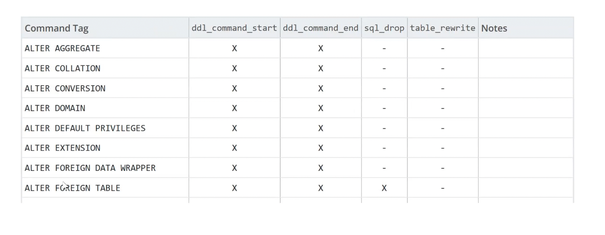

# Основные управляющие конструкции в функциях и процедурах

- Принципы и кейсы использования операторов ветвления
- Варианты использования циклов с переменными и по результатам запроса
- Причины использования динамического sql и примеры реализации
- Варианты обработки ошибок
- Последовательности
- Виды триггеров, продакшн кейсы и особенности использования
- Понятие курсоров, курсорных переменных
- Понятие рекурсии и варианты использования

## Язык PL/PGSQL, основные операторы, управляющие конструкции

Наиболее полезная и важная часть PL/pgSQL. С [их](https://www.postgresql.org/docs/current/plpgsql-control-structures.html) помощью можно очень гибко и эффективно манипулировать данными в PostgreSQL. Сегодня мы рассмотрим:
- Ветвления
- Циклы
- Исключения

Операторы IF и CASE позволяют выполнять команды в зависимости от определённых условий. PL/pgSQL поддерживает три формы IF,
- `IF ... THEN ... END IF`
- `IF ... THEN ... ELSE ... END IF`
- `IF ... THEN ... ELSIF ... THEN ... ELSE ... END IF` - еще одно условие, проверить и тогда выполнить  

и две формы CASE,
- `CASE ... WHEN ... THEN ... ELSE ... END CASE` - проверяем условия и тогда выполняем какие то действия
- `CASE WHEN ... THEN ... ELSE ... END CASE`

IF-THEN это простейшая форма условного оператора.
```sql
IF логическое-выражение THEN
 операторы
END IF;
```
Операторы между THEN и END IF выполняются, если условие (логическое выражение) истинно. В противном случае они опускаются. Пример:
```sql
IF user_id <> 0 THEN
 UPDATE users SET user_email = email WHERE id_user = user_id;
END IF;
```

IF-THEN-ELSE добавляет к IF-THEN возможность указать альтернативный набор операторов, которые будут выполнены, если условие не истинно (в том числе, если условие NULL).
```sql
IF логическое-выражение THEN
 операторы
ELSE
 операторы
END IF;
```
Обратите внимание, что выполнение команд пойдет только по 1 пути!!! Если одно из условий будет истинно, дальнейшие сравнения и операторы будут проигнорированы.

IF-THEN-ELSE добавляет к IF-THEN возможность указать альтернативный набор операторов, которые будут выполнены, если условие не истинно (в том числе, если условие NULL).
```sql
IF a=1 THEN
 t := ‘a=1ʼ
ELSE IF a=2 THEN  -- elsif - небольшой синтаксический сахар
 t := ‘a=2ʼ
ELSE
 t := ‘a not 1 or 2ʼ
END IF;
```

IF-THEN-ELSIF обеспечивает удобный способ проверки нескольких вариантов по очереди. В целом это больше синтаксический сахар.
```sql
IF логическое-выражение THEN
 операторы
[ELSIF логическое-выражение THEN операторы [ELSIF логическое-выражение
THEN операторы ...]]
[ELSE операторы]
END IF;
```
Условия в IF последовательно проверяются до тех пор, пока не будет найдено первое истинное. После этого операторы, относящиеся к этому условию, выполняются, и управление переходит к следующей после END IF команде. (Все последующие условия не проверяются.) Если ни одно из условий IF не является истинным, то выполняется блок ELSE (если присутствует).
```sql
IF n = 0 THEN
 result := 'zero';
ELSIF n > 0 THEN
 result := 'positive';
ELSIF number < 0 THEN
 result := 'negative';
ELSE
 -- остаётся только один вариант: number имеет значение NULL
 result := 'NULL';
END IF;
```

Простая форма CASE реализует условное выполнение на основе сравнения операндов.
```sql
CASE выражение-поиска
 WHEN выражение [, выражение [...]] THEN операторы
 [WHEN выражение [, выражение [...]] THEN операторы ...]
 [ELSE операторы]
END CASE;
```
Выражение-поиска вычисляется (один раз) и последовательно сравнивается с каждым выражением в условиях WHEN. Если совпадение найдено, то выполняются соответствующие операторы и управление переходит к следующей после END CASE команде. (Все последующие выражения WHEN не проверяются.) Если совпадение не было найдено, то выполняются операторы в ELSE. Но если ELSE нет, то вызывается исключение CASE_NOT_FOUND.

!!! Условные опреаторы довольно дорогие! Если можно обойтись без них - лучше обойтись без них (например, использовать математическую формулу, выполняются мнгвенно, за 1 такт процессора, это значительно продуктивнее)
```sql
CASE x
 WHEN 1, 2 THEN msg := 'один или два';
 ELSE msg := 'значение, отличное от один или два';
END CASE;

CASE
 WHEN логическое-выражение THEN операторы
 [WHEN логическое-выражение THEN операторы ...]
 [ELSE операторы]
END CASE;
```
Эта форма CASE реализует условное выполнение, основываясь на истинности логических условий. Каждое логическое-выражение в предложении WHEN вычисляется по порядку до тех пор, пока не будет найдено истинное. Затем выполняются соответствующие операторы и управление переходит к следующей после END CASE команде. (Все последующие выражения WHEN не проверяются) Если ни одно из условий не окажется истинным, то выполняются операторы в ELSE. Но если ELSE нет, то вызывается исключение CASE_NOT_FOUND.
```sql
CASE
    WHEN x BETWEEN 0 AND 10 THEN msg := 'значение в диапазоне между 0 и 10';
    WHEN x BETWEEN 11 AND 20 THEN msg := 'значение в диапазоне между 11 и 20';
END CASE;
```
Эта форма CASE полностью эквивалента IF-THEN-ELSIF, за исключением того, что при невыполнении всех условий и отсутствии ELSE, IF-THEN-ELSIF ничего не делает, а CASE вызывает ошибку.

[Циклы](https://www.postgresql.org/docs/current/plpgsql-control-structures.html#PLPGSQL-CONTROL-STRUCTURES-LOOPS) - Позволяют повторить серию команд в функции на PL/pgSQL:
- LOOP,
- EXIT,
- CONTINUE,
- WHILE,
- FOR,
- FOREACH

```sql
[<<метка>>]
LOOP
 операторы
END LOOP [ метка ]; 
```
LOOP организует безусловный цикл, который повторяется до бесконечности, пока не будет прекращён операторами EXIT или RETURN. Для вложенных циклов рекомендую использовать метку в операторах EXIT и CONTINUE, чтобы указать, к какому циклу эти операторы относятся (если большая вложенность, то мы можем выйти не на предыдущий уровень, а на 5 уровней выше, на какой угодно уровень).

`EXIT [ метка ] [WHEN логическое-выражение];` - Если метка не указана, то завершается самый внутренний цикл, далее выполняется оператор, следующий за END LOOP. Если метка указана, то она должна относиться к текущему или внешнему циклу, или это может быть метка блока. При этом в именованном цикле/блоке выполнение прекращается, а управление переходит к следующему оператору после соответствующего END.  
При наличии WHEN цикл прекращается, только если логическое-выражение истинно. В противном случае управление переходит к оператору, следующему за EXIT. EXIT можно использовать со всеми типами циклов, не только с безусловным.Когда EXIT используется для выхода из блока, управление переходит к следующему оператору после окончания блока. Обратите внимание, что для выхода из блока нужно обязательно указывать метку. EXIT без метки не позволяет прекратить работу блока.
```sql
LOOP
 -- здесь производятся вычисления
 IF count > 0 THEN
    EXIT; -- выход из цикла
 END IF;
END LOOP;
LOOP
 -- здесь производятся вычисления
 EXIT WHEN count > 0; -- аналогично предыдущему примеру
END LOOP;
<<new_block>>
BEGIN
 -- здесь производятся вычисления
 IF stocks > 1000 THEN
    EXIT new_block; -- выход из блока BEGIN
 END IF;
 -- вычисления не будут выполнены, если stocks > 1000
END;
```

`CONTINUE [ метка ] [WHEN логическое-выражение];` - Если метка не указана, то начинается следующая итерация самого внутреннего цикла. То есть все оставшиеся в цикле операторы пропускаются, и управление переходит к управляющему выражению цикла (если есть) для определения, нужна ли ещё одна итерация цикла. Если метка присутствует, то она указывает на метку цикла, выполнение которого будет продолжено.  
При наличии WHEN следующая итерация цикла начинается только тогда, когда логическое-выражение истинно. В противном случае управление переходит к оператору, следующему за CONTINUE. CONTINUE можно использовать со всеми типами циклов, не только с безусловным
```sql
LOOP
 -- здесь производятся вычисления
 EXIT WHEN count > 100;
 CONTINUE WHEN count < 50;
 -- вычисления для count в диапазоне 50 .. 100
END LOOP;
```

Loop встречается довольно редко. Обычно почти в любом языке программирования есть WHILE, мы сразу пишем условие
```sql
[<<метка>>]
WHILE логическое-выражение LOOP
 операторы
END LOOP [ метка ];
```
WHILE выполняет серию команд до тех пор, пока истинно логическое-выражение. Выражение проверяется непосредственно перед каждым входом в тело цикла.
```sql
WHILE amount_owed > 0 AND gift_certificate_balance > 0 LOOP
 -- здесь производятся вычисления
END LOOP;

-- Классика - использовать флаги:
WHILE NOT done LOOP
 -- здесь производятся вычисления
END LOOP;
```

```sql
[<<метка>>]
FOR имя IN [REVERSE] выражение .. выражение [BY выражение] LOOP
    операторы
END LOOP [ метка ];
```
В цикле FOR итерации выполняются по диапазону целых чисел. Переменная имя автоматически определяется с типом integer и существует только внутри цикла (если уже существует переменная с таким именем, то внутри цикла она будет игнорироваться). Выражения для нижней и верхней границы диапазона чисел вычисляются один раз при входе в цикл. Если не указано BY, то шаг итерации 1, в противном случае используется значение в BY, которое вычисляется, опять же, один раз при входе в цикл. Если указано REVERSE, то после каждой итерации величина шага вычитается, а не добавляется.
```sql
FOR i IN 1..10 LOOP
 -- внутри цикла переменная i будет иметь значения 1,2,3,4,5,6,7,8,9,10
END LOOP;
FOR i IN REVERSE 10..1 LOOP
 -- внутри цикла переменная i будет иметь значения 10,9,8,7,6,5,4,3,2,1
END LOOP;
FOR i IN REVERSE 10..1 BY 2 LOOP
 -- внутри цикла переменная i будет иметь значения 10,8,6,4,2
END LOOP;
```
Если нижняя граница цикла больше верхней границы (или меньше, в случае REVERSE), то тело цикла не выполняется вообще. При этом ошибка не возникает.

Другой вариант FOR позволяет организовать цикл по результатам запроса (самая частая ситуация).
```sql
[ <<метка>> ]
FOR цель IN запрос LOOP  -- цель - переменная типа record или анонимный record
 операторы
END LOOP [ метка ];
```
Переменная цель может быть строковой переменной, переменной типа record или разделённым запятыми списком скалярных переменных. Переменной цель последовательно присваиваются строки результата запроса, и для каждой строки выполняется тело цикла.  
Для переменных PL/pgSQL в тексте запроса выполняется подстановка значений, план запроса кешируется для возможного повторного использования, как подробно описано [здесь](https://www.postgresql.org/docs/current/plpgsql-implementation.html)

Цикл FOREACH очень похож на FOR. Отличие в том, что вместо перебора строк SQL- запроса происходит перебор элементов массива. Синтаксис цикла FOREACH,
```sql
[ <<метка>> ]
FOREACH цель [ SLICE число ] IN ARRAY выражение LOOP
 операторы
END LOOP [ метка ];
```
Без указания SLICE, или если SLICE равен 0, цикл выполняется по всем элементам массива, полученного из выражения. Переменной цель последовательно присваивается каждый элемент массива и для него выполняется тело цикла.

Ещё одна разновидность этого типа цикла FOR-IN-EXECUTE, (для динамического sql)
```sql
[ <<метка>> ]
FOR цель IN EXECUTE выражение_проверки [ USING выражение [, ... ] ] LOOP
 операторы
END LOOP [ метка ];
```
Она похожа на предыдущую форму, за исключением того, что текст запроса указывается в виде строкового выражения. Текст запроса формируется и для него строится план выполнения при каждом входе в цикл. Это даёт программисту выбор между скоростью предварительно разобранного запроса и гибкостью динамического запроса, так же, как и в случае с обычным оператором EXECUTE. Как и в EXECUTE, значения параметров могут быть добавлены в команду с использованием USING.

## Динамический SQL (21 00)

Для чего может понадобится динамический скл. Допустим, мы открываем свой маркетплейс и у нас сотни параметров, которые мы можем подобрать. Причем эти параметры зависят от типа товара. На простейшем sql мы это можем реализовать так - если параметра нет, то is null, и перечислять через AND. Но если параметров сотни, то запрос будет километровый и все это будет очень долго работать. Мы можем динамически формировать код скл запроса (если параметр есть - то добавить его в наш код, если нет - то не добавлять). То есть тут есть 2 подхода - использование встроенного динамического скл или использование текстового поля (переменной), которая будет потом подставляться. В первом случае это позволит избежать скл-инъекций, во втором случае нам нужно будет обслуживать самим, но там есть тоже свои варианты.

Часто требуется динамически формировать команды внутри функций на PL/pgSQL, то есть такие команды, в которых при каждом выполнении могут использоваться разные таблицы или типы данных. Обычно PL/pgSQL [кеширует](https://www.postgresql.org/docs/current/plpgsql-implementation.html#PLPGSQL-PLAN-CACHING) планы выполнения процедур, но в случае с динамическими командами это не будет работать.  
Для исполнения динамических команд предусмотрен оператор EXECUTE, `EXECUTE строка [ INTO [STRICT] цель ] [ USING выражение [, ... ] ];` , где строка это выражение, формирующее текст SQL команды, которую нужно выполнить (строка - это наш динамический скл). Необязательная цель — это переменная или разделённый запятыми список простых переменных и полей записи/кортежа, куда будут помещены результаты команды. Необязательные выражения в USING формируют значения, которые будут вставлены в команду.  
В сформированном тексте команды замена имён переменных PL/pgSQL на их значения проводиться не будет. Все необходимые значения переменных должны быть вставлены в командную строку при её построении, либо нужно использовать параметры, как описано ниже. Обратите внимание, что нет никакого плана кеширования для команд, выполняемых с помощью EXECUTE. Вместо этого план создаётся каждый раз при выполнении. То есть, строка команды может динамически создаваться внутри функции для выполнения действий с различными таблицами и столбцами.

Так как скл динамический - никакого кэширования не будет!

В тексте команды можно использовать значения параметров, ссылки на параметры обозначаются как $1, $2 и т. д. Эти символы указывают на значения, находящиеся в предложении USING. Такой метод зачастую предпочтительнее, чем вставка значений в команду в виде текста: он позволяет исключить во время исполнения дополнительные расходы на преобразования значений в текст и обратно, и не открывает возможности для SQL-инъекций, не требуя применять экранирование или кавычки для спецсимволов. [SQL injection для начинающих. Часть 1](https://habr.com/ru/articles/148151/) , Пример:
```sql
EXECUTE 'SELECT count(*) FROM mytable WHERE inserted_by = $1 AND inserted <= $2'
INTO c
USING checked_user, checked_date;

-- чуть поподробнее - допустим, у нас есть поля ввода логина-пароля, пользователь вводит их. Тогда у нас запрос будет выглядеть так
SELECT count(*) FROM mytable WHERE inserted_by = "Petrov" AND inserted <= "Password123"
-- злоумышленник может сделать так - ввести окончание кода, которое всегда выполнится
EXECUTE 'SELECT count(*) FROM mytable WHERE inserted_by = "' or 1=1 or ' AND inserted <= $2'
INTO c
USING checked_user, checked_date;
-- код будет валиден! а после кода можно написать все что угодно - инсерт, апдейт и тд.
```
В 90х каждый второй-третий сайт ломали таким образом. Как раз наш EXECUTE позволяет этого избежать, тк подставляется $1 и автоматом экранируются все опасные символы.

При работе с динамическими командами часто приходится иметь дело с экранированием одинарных кавычек, чтобы не допустить SQL инъекций. Можно напрямую вызывать функции заключения в кавычки:
```sql
EXECUTE 'UPDATE tbl SET '
|| quote_ident(colname)
|| ' = '
|| quote_literal(newvalue)
|| ' WHERE key = '
|| quote_literal(keyvalue);
```
Функция quote_ident (и quote_literal, это аналогичные функции) позволяет экранировать скл инъекции! Если мы конкатенируем - то нужно хотя бы использовать функцию, ни в коем случае нельзя вставлять наживую!

Мы можем заранее создать запрос. Постгрес его оптимально подготовит (построит план запроса и при следующем запросе постгресу не потребуется строить план, мы экономим на построении плана, поскольку это довольно тяжелая операция). В дальнейшем мы можем использовать этот подготовленный запрос и передавать туда параметры, не изменяя структуры запроса. Если в запросе изменится набор полей и тд, нужно будет создавать новый подготовленный запрос:
```sql
PREPARE запрос AS имя
EXECUTE имя(параметры)
```
https://www.postgresql.org/docs/current/sql-prepare.html

```sql
PREPARE fooplan (int, text, bool, numeric) AS
 INSERT INTO foo VALUES($1, $2, $3, $4);
EXECUTE fooplan(1, 'Hunter Valley', 't', 200.00);
PREPARE usrrptplan (int) AS
 SELECT * FROM users u, logs l WHERE u.usrid=$1 AND u.usrid=l.usrid
 AND l.date = $2;
EXECUTE usrrptplan(1, current_date);
```

## Практика 1 (38 00)

```sql
-- Практика 1
-- Чтобы вернуть несколько значений, используем несколько OUT параметров.

-- функция на вход принимает телефон, дальше анализирует, что он должен содержать у нас только символы и длина 10. Здесь мы используем не LIKE, а регулярные выражения!
CREATE FUNCTION fmt_out_2 (IN phone text, OUT code text, OUT num text)
-- RETURNS можно не писать, предполагается RETURNS record
AS $$
BEGIN
    IF phone ~ '^[0-9]*$' AND length(phone) = 10 THEN
    --  ^[0-9]{10}$ - сразу проверить и количество символов
        code := substr(phone,1,3);
        num  := substr(phone,4);
    ELSE
        code := NULL;
        num  := NULL;
    END IF;
END;
$$ LANGUAGE plpgsql IMMUTABLE;

-- Условный оператор CASE (анонимный блок)
DO $$
DECLARE
    code text := (fmt_out_2('9992128506')).code; -- сразу обращаемся к возвращаемой переменной из функции через .
BEGIN
    CASE code
    WHEN '495', '499' THEN
        RAISE NOTICE '% - Москва', code;
    WHEN '812' THEN
        RAISE NOTICE '% - Санкт-Петербург', code;
    WHEN '384' THEN
        RAISE NOTICE '% - Кемеровская область', code;
    else RAISE NOTICE '% - dont know', code;
    END CASE;
END;
$$;
/*
NOTICE:  999 - dont know
DO
*/


-- Пример использования RETURN NEXT:

CREATE TABLE foo (fooid INT, foosubid INT, fooname TEXT);
INSERT INTO foo VALUES (1, 2, 'three');
INSERT INTO foo VALUES (4, 5, 'six');

CREATE OR REPLACE FUNCTION get_all_foo() RETURNS SETOF foo AS
$BODY$
DECLARE
    r foo%rowtype;  -- мы указываем не анонимную запись, а запись типа таблицы. Как только мы создаем таблицу по определенному имени, автоматически создается тип по такому имени и содержит ту же самую информацию.
    -- мы можем вернуть множество такого типа данных. Тут мы говорим что переменная - это строчка этой таблицы
BEGIN
    FOR r IN
        SELECT * FROM foo WHERE fooid > 0
    LOOP
        -- здесь возможна обработка данных
        r.fooid := r.fooid + 10;
        RETURN NEXT r; -- возвращается текущая строка запроса
    END LOOP;
    RETURN;
END
$BODY$
LANGUAGE plpgsql;

SELECT * FROM get_all_foo();
/*
 fooid | foosubid | fooname 
-------+----------+---------
    11 |        2 | three
    14 |        5 | six
(2 rows)
*/
SELECT * FROM foo;
/*
 fooid | foosubid | fooname 
-------+----------+---------
     1 |        2 | three
     4 |        5 | six
(2 rows)
*/

-- Объем порядка 6 млн.строк (600МБ):
-- https://github.com/aeuge/postgres16book/tree/main/database
wget https://storage.googleapis.com/thaibus/thai_small.tar.gz && tar -xf thai_small.tar.gz && psql < thai.sql

-- Пример использования RETURN QUERY:
CREATE or replace FUNCTION get_available_rideid(date) RETURNS SETOF integer AS
$BODY$
BEGIN
    RETURN QUERY SELECT id
                   FROM ride
                  WHERE cast(startdate as date) >= $1
                    AND cast(startdate as date) < ($1 + 1);

    -- можем наполнять (дообогащать) множество, пока не встретим RETURN (то есть порядок нам не гарантирован)
    RETURN QUERY SELECT id
                   FROM ride
                  WHERE cast(startdate as date) >= $1
                    AND cast(startdate as date) < ($1 + 1);
    -- Так как выполнение ещё не закончено, можно проверить, были ли возвращены строки, и если нет, выдать исключение.
    IF NOT FOUND THEN
        RAISE EXCEPTION 'Нет рейсов на дату: %.', $1;
    END IF;

    RETURN;
 END
$BODY$
LANGUAGE plpgsql
set search_path to book, public;
-- search_path - это где искать наши схемы
create table foo();
\dt
/*
        List of relations
 Schema | Name | Type  |  Owner   
--------+------+-------+----------
 public | foo  | table | postgres
 public | t    | table | postgres
*/
create temp table foo();
\dt
/*
          List of relations
  Schema   | Name | Type  |  Owner   
-----------+------+-------+----------
 pg_temp_3 | foo  | table | postgres
 public    | t    | table | postgres
(2 rows)
*/
-- у темповых таблиц приоритет выше, чем у остальных!

SELECT get_available_rideid('20000101') limit 10;


-- Возвращает доступные рейсы либо вызывает исключение, если таковых нет.
SELECT * FROM get_available_rideid(cast('2000-01-01' as date));
SELECT * FROM get_available_rideid(CURRENT_DATE);
/*
ERROR:  Нет рейсов на дату: 2025-05-02.
CONTEXT:  PL/pgSQL function get_available_rideid(date) line 16 at RAISE
*/


-------------
-- Циклы
-------------

-- простой цикл
drop procedure if exists triple;
CREATE PROCEDURE triple(INOUT x int)
LANGUAGE plpgsql
AS $$
BEGIN
	LOOP
    	-- здесь производятся вычисления
    	IF x > 0 THEN
        	EXIT;  -- выход из цикла
    	END IF;
    	x = x + 3;
	END LOOP;
    x = x * 3;
END;
$$;

CALL triple(4);
-- 12

-- выход из блока сразу
drop procedure if exists triple;
CREATE PROCEDURE triple(INOUT x int)
LANGUAGE plpgsql
AS $$
<<abc>>
BEGIN
	LOOP
    	-- здесь производятся вычисления
    	IF x > 0 then
	    	return;
        	exit abc;  -- выход из цикла
    	END IF;
    	x = x + 3;
	END LOOP;
    x = x * 3;
END;
$$;

CALL triple(4);


-- цикл по результатам запроса
-- обновляем все МВ - продакшн кейс
CREATE or replace FUNCTION refresh_mviews() RETURNS integer AS $$
DECLARE
    mviews RECORD;
BEGIN
    RAISE NOTICE 'Refreshing all materialized views...';

    FOR mviews IN
       SELECT n.nspname AS mv_schema,
              c.relname AS mv_name,
              pg_catalog.pg_get_userbyid(c.relowner) AS owner
         FROM pg_catalog.pg_class c
    LEFT JOIN pg_catalog.pg_namespace n ON (n.oid = c.relnamespace)
        WHERE c.relkind = 'm'
     ORDER BY 1
    LOOP

        -- Здесь "mviews" содержит одну запись с информацией о матпредставлении

        RAISE NOTICE 'Refreshing materialized view %.% (owner: %)...',
                     quote_ident(mviews.mv_schema),
                     quote_ident(mviews.mv_name),
                     quote_ident(mviews.owner);
        EXECUTE format('REFRESH MATERIALIZED VIEW %I.%I', mviews.mv_schema, mviews.mv_name);
    END LOOP;

    RAISE NOTICE 'Done refreshing materialized views.';
    RETURN 1;
END;
$$ LANGUAGE plpgsql;

SELECT refresh_mviews();
-- то же самое можно сделать с реиндексом

-- пример цикла по элементам массива
CREATE or replace FUNCTION sum(int[]) RETURNS int8 AS $$
DECLARE
  s int8 := 0;
  x int;
BEGIN
  -- для каждого элемента в нашем массиве просуммируй
  FOREACH x IN ARRAY $1
  LOOP
    s := s + x;
  END LOOP;
  RETURN s;
END;
$$ LANGUAGE plpgsql;

SELECT sum(array[1,2,3,4]);

-- пример цикла по элементам массива
-- то же самое, но конкатенируем
drop function sum(int[]);
CREATE or replace FUNCTION sum(arr text[]) RETURNS text AS $$
DECLARE
  s text := '';
  x text;
BEGIN
  FOREACH x IN ARRAY arr
  LOOP
    s := s || x;
  END LOOP;
	raise notice '%',arr[1]; -- можем обратиться к конкретному элементу	
  RETURN s;
END;
$$ LANGUAGE plpgsql;

SELECT sum(array['1','2','3','4']);
```

## Обработка ошибок (1 09 00)

По умолчанию любая возникающая ошибка прерывает выполнение функции на PL/pgSQL, а также транзакцию, относящуюся к этой функции. Использование в блоке секции EXCEPTION позволяет перехватывать и обрабатывать ошибки. Синтаксис секции EXCEPTION расширяет синтаксис обычного блока (можем поймать ошибку и указать, что с этим делать):
```sql
[ <<метка>> ]
[ DECLARE
 объявления ]
BEGIN
 операторы
EXCEPTION
 WHEN условие [ OR условие ... ] THEN
 операторы_обработчика
 [ WHEN условие [ OR условие ... ] THEN
 операторы_обработчика
 ... ]
END;
```
Обработка ошибок - это ОЧЕНЬ дорого. У нас будет stacktrace и, если мы обрабатываем ошибки, то наша процедура будет значительно тяжелее. Эксепшн считается правилом хорошего тона, но не в постгресе, тут с этим все печально.

Если ошибок не было, то выполняются все операторы блока и управление переходит к следующему оператору после END. Но если при выполнении оператора происходит ошибка, то дальнейшая обработка прекращается и управление переходит к списку исключений в секции EXCEPTION.  
В этом списке ищется первое исключение, условие которого соответствует ошибке. Если исключение найдено, то выполняются соответствующие операторы_обработчика и управление переходит к следующему оператору после END. Если исключение не найдено, то ошибка передаётся наружу, как будто секции EXCEPTION не было. При этом ошибку можно перехватить в секции EXCEPTION внешнего блока. Если ошибка так и не была перехвачена, то обработка функции прекращается.

В качестве условия (`WHEN условие [ OR условие ... ]`) может задаваться одно из имён, перечисленных [тут](https://www.postgresql.org/docs/current/errcodes-appendix.html). Если задаётся имя категории, ему соответствуют все ошибки в данной категории. Специальному имени условия OTHERS (другие) соответствуют все типы ошибок, кроме QUERY_CANCELED и ASSERT_FAILURE. Имена условий воспринимаются без учёта регистра

Условие ошибки также можно задать кодом SQLSTATE; например, эти два варианта равнозначны:
```sql
WHEN SQLSTATE '22012' THEN ...
WHEN division_by_zero THEN ... 
```
Если при выполнении операторов_обработчика возникнет новая ошибка, то она не может быть перехвачена в этой секции EXCEPTION. Ошибка передаётся наружу и её можно перехватить в секции EXCEPTION внешнего блока.

При выполнении команд в секции EXCEPTION локальные переменные функции на PL/pgSQL сохраняют те значения, которые были на момент возникновения ошибки. Однако, будут отменены все изменения в базе данных, выполненные в блоке. **Наличие секции EXCEPTION значительно увеличивает накладные расходы на вход/выход из блока, поэтому не используйте EXCEPTION без надобности. Наличие секции EXCEPTION не позволит создавать транзакции внутри процедур** . Строить логику на экспешнах дорого, лучше логировать и там уже обрабатывать.

Например, обработка исключений помогает выполнить либо команду UPDATE, либо INSERT, в зависимости от ситуации. Однако в современных приложениях вместо этого приёма рекомендуется использовать INSERT с ON CONFLICT DO UPDATE. [upsert](https://www.postgresqltutorial.com/postgresql-tutorial/postgresql-upsert/)

При обработке исключений часто бывает необходимым получить детальную информацию о произошедшей ошибке. Для этого в PL/pgSQL есть два способа:
- использование специальных переменных 
- команда GET STACKED DIAGNOSTICS. (доступ к стеку выполнения)  
Внутри секции EXCEPTION специальная переменная SQLSTATE содержит код ошибки, для которой было вызвано исключение. Специальная переменная SQLERRM содержит сообщение об ошибке, связанное с исключением. Эти переменные являются неопределёнными вне секции EXCEPTION.  
Также в обработчике исключения можно получить информацию о текущем исключении командой GET STACKED DIAGNOSTICS, которая имеет вид:
```sql
GET STACKED DIAGNOSTICS переменная { = | := } элемент [ , ... ];
```
Каждый элемент представляется ключевым словом, указывающим, какое значение состояния нужно присвоить заданной переменной. [Дока](https://www.postgresql.org/docs/current/plpgsql-control-structures.html#PLPGSQL-EXCEPTIO N-DIAGNOSTICS-VALUES)

Команда GET DIAGNOSTICS, получает информацию о текущем состоянии выполнения кода (тогда как команда GET STACKED DIAGNOSTICS, рассмотренная ранее, выдаёт информацию о состоянии выполнения в момент предыдущей ошибки). Её элемент состояния PG_CONTEXT позволяет определить текущее место выполнения кода. PG_CONTEXT возвращает текст с несколькими строками, описывающий стек вызова. В первой строке отмечается текущая функция и выполняемая в данный момент команда GET DIAGNOSTICS, а во второй и последующих строках отмечаются функции выше по стеку вызовов.
https://www.postgresql.org/docs/current/plpgsql-statements.html#PLPGSQL-STATEMENTS-DIAGNOSTICS
```sql
DECLARE
 text_var1 text;
 text_var2 text;
 text_var3 text;
BEGIN
 -- здесь происходит обработка, которая может вызвать исключение
 ...
EXCEPTION WHEN OTHERS THEN
 GET STACKED DIAGNOSTICS text_var1 = MESSAGE_TEXT,  -- записываем в переменные диагностическую информацию, по необходимости можно логировать
 text_var2 = PG_EXCEPTION_DETAIL,
 text_var3 = PG_EXCEPTION_HINT;
END;
```
Потом например записать в таблицу с логами проблему. Или сделать raise notice - вывести сообщение в консоль. И если повысить детализацию системы логирования, эта информация также попадет в журнал.

### Управление транзакциями в процедурах

В процедурах, вызываемых командой CALL, а также в анонимных блоках кода (в команде DO) можно [завершать транзакции](https://www.postgresql.org/docs/current/plpgsql-transactions.html), выполняя COMMIT и ROLLBACK. После завершения транзакции этими командами новая будет начата автоматически, поэтому отдельной команды START TRANSACTION нет. (команды BEGIN и END в PL/pgSQL имеют другой смысл.). Транзакция не может завершаться внутри блока с обработчиками исключений (внутри эксепшна). Не забываем про SAVEPOINT (когда мы можем откатиться на определенный этап в транзакции). [Туториал по транзакциям](https://www.postgresql.org/docs/15/tutorial-transactions.html).  Автономных транзакций, к сожалению, в ванильном ПГ нет( Есть в платных версиях

## Практика 2 (1 15 00)

```sql
-- Практика 2
-- EXCEPTION
drop TABLE if exists mytab;
CREATE TABLE mytab(firstname text, lastname text);
INSERT INTO mytab(firstname, lastname) VALUES('Tom', 'Jones');

drop procedure if exists test_excep;
CREATE PROCEDURE test_excep(INOUT x int)
LANGUAGE plpgsql
AS $$
declare
	 y int = 0;
BEGIN
    UPDATE mytab SET firstname = 'Joe' WHERE lastname = 'Jones';
    x := x + 1;
    y := x / 0;
EXCEPTION
    WHEN division_by_zero THEN
        RAISE NOTICE 'перехватили ошибку division_by_zero';
END;
$$;

call test_excep(1);
/*
NOTICE:  перехватили ошибку division_by_zero
 x 
---
 2
(1 row)
*/
SELECT * FROM mytab;
/*
 firstname | lastname 
-----------+----------
 Tom       | Jones
(1 row)
*/

/*
При присвоении значения переменной y произойдёт ошибка division_by_zero. Она будет перехвачена в секции EXCEPTION. Оператор RETURN вернёт значение x, увеличенное на единицу, но изменения сделанные командой UPDATE будут отменены. Изменения, выполненные командой INSERT, которая предшествует блоку, не будут отменены. В результате, база данных будет содержать Tom Jones, а не Joe Jones.

Когда у нас идет эксепшн - мы уже не можем закоммитить транзакцию! То есть строить логику ну эксепшне чревато проблемами
*/

-- exception on UPDATE
CREATE TABLE db (a INT PRIMARY KEY, b TEXT);

CREATE FUNCTION merge_db(key INT, data TEXT) RETURNS VOID AS
$$
BEGIN
    LOOP
        -- сначала попытаться изменить запись по ключу
        UPDATE db SET b = data WHERE a = key;
        IF found THEN
            RETURN;
        END IF;
        -- записи с таким ключом нет, поэтому её нужно добавить
        -- если параллельно будет вставлена запись с таким же ключом,
        -- произойдёт ошибка уникальности
        BEGIN
            INSERT INTO db(a,b) VALUES (key, data);
            RETURN;
        EXCEPTION WHEN unique_violation THEN
            -- здесь не нужно ничего делать,
            -- просто продолжить цикл, чтобы повторить UPDATE.
        	<<ff>>
         	begin
		        EXCEPTION WHEN unique_violation THEN
		            -- вложенная проверка на исключение
			end;
        END;
    END LOOP;
END;
$$
LANGUAGE plpgsql;

SELECT merge_db(1, 'david');
SELECT merge_db(1, 'dennis');
SELECT * FROM db;
/*
 a |   b    
---+--------
 1 | dennis
(1 row)
*/

-- Получение информации о месте выполнения
-- делаем внешнюю функцию, которая вызывает внутреннюю. Внутренняя  функция у нас вызывает стэк диагностики. Кто где какую функцию вызвал и посмотреть всю иерархию стэка вызовов
CREATE OR REPLACE FUNCTION outer_func() RETURNS integer AS $$
BEGIN
  RETURN inner_func();
END;
$$ LANGUAGE plpgsql;

CREATE OR REPLACE FUNCTION inner_func() RETURNS integer AS $$
DECLARE
  stack text;
BEGIN
  GET DIAGNOSTICS stack = PG_CONTEXT;
  RAISE NOTICE E'--- Стек вызова ---\n%', stack;
  RETURN 1;
END;
$$ LANGUAGE plpgsql;

SELECT outer_func();
/*
NOTICE:  --- Стек вызова ---
PL/pgSQL function inner_func() line 5 at GET DIAGNOSTICS
PL/pgSQL function outer_func() line 3 at RETURN
CONTEXT:  PL/pgSQL function outer_func() line 3 at RETURN
 outer_func
 ------------
           1
(1 row)
*/

-- проверим значения стектрейса при ошибке
drop procedure if exists test_excep;
CREATE PROCEDURE test_excep(INOUT x int)
LANGUAGE plpgsql
AS $$
declare
  y int = 0;
 text_var1 text;
 text_var2 text;
 text_var3 text;
 t text;

BEGIN
    UPDATE mytab SET firstname = 'Joe' WHERE lastname = 'Jones';
    x := x + 1;
--СOMMIT;
    y := x / 0;
    
EXCEPTION 
WHEN OTHERS THEN
 GET STACKED DIAGNOSTICS text_var1 = MESSAGE_TEXT,
   text_var2 = PG_EXCEPTION_DETAIL,
   text_var3 = PG_EXCEPTION_HINT;

 t = text_var1 || '/' || text_var2 || '/' || text_var3;
 RAISE NOTICE 'перехватили ошибку %' , text_var2;
END;
$$;

call test_excep(1);
/*
NOTICE:  перехватили ошибку 
 x 
---
 2
(1 row)
*/
SELECT * FROM mytab;
/*
 firstname | lastname 
-----------+----------
 Tom       | Jones
(1 row)
*/


-- вложенная процедура и попытка коммита
drop procedure test_excep;
CREATE PROCEDURE test_excep(INOUT x int)
LANGUAGE plpgsql
AS $$
declare
  y int = 0;
 
BEGIN
    UPDATE mytab SET firstname = 'Joe' WHERE lastname = 'Jones';
    x := x + 1;
    commit;
    y := x / 0;

END;
$$;

drop procedure test_excep2;
CREATE PROCEDURE test_excep2(INOUT x int)
LANGUAGE plpgsql
AS $$
declare x int;
text_var1 text;
 text_var2 text;
 text_var3 text;
 t text;
begin
    call test_excep(x);
	EXCEPTION 
	WHEN OTHERS THEN
	 GET STACKED DIAGNOSTICS text_var1 = MESSAGE_TEXT,
	   text_var2 = PG_EXCEPTION_DETAIL,
	   text_var3 = PG_EXCEPTION_HINT;
	
	 t = text_var1 || '/' || coalesce(text_var2,'') || '/' || coalesce(text_var3,'');
	 RAISE NOTICE 'перехватили ошибку %' , t;
END;
$$;


call test_excep2(1);
-- Can a Postgres Commit Exist in Procedure that has an Exception Block?
-- https://stackoverflow.com/questions/55406735/can-a-postgres-commit-exist-in-procedure-that-has-an-exception-block

```

## Виды триггеров, продакшн кейсы и особенности использования (1 28 00)

[Триггеры](https://www.postgresql.org/docs/current/plpgsql-trigger.html) - специальные подпрограммы, которые реагируют на изменение данных или ддл. Классический вариант использования: мы продали товар - сразу пересчитывается витрина. Триггер сам по себе ничего не делает. Триггер вызывает триггерную функцию, которую нужно заранее прописать. Триггерная функция - это наша классическая функция, только она вызывает тип триггер (`RETURNS TRIGGER`) и внутри уже что то делает.

В PL/pgSQL можно создавать триггерные функции, которые будут вызываться при изменениях данных или событиях в базе данных. Триггерная функция создаётся командой CREATE FUNCTION, при этом у функции не должно быть аргументов, а типом возвращаемого значения должен быть trigger (для триггеров, срабатывающих при изменениях данных - DML) или event_trigger (для триггеров, срабатывающих при событиях в базе - DDL). Для триггеров автоматически определяются специальные локальные переменные с именами вида TG_имя, описывающие условие, повлёкшее вызов триггера.
```sql
CREATE [ OR REPLACE ] [ CONSTRAINT ] TRIGGER name { BEFORE | AFTER | INSTEAD OF } {
event [ OR ... ] }
 ON table_name
 [ FROM referenced_table_name ]
 [ NOT DEFERRABLE | [ DEFERRABLE ] [ INITIALLY IMMEDIATE | INITIALLY DEFERRED ] ]
 [ REFERENCING { { OLD | NEW  TABLE [ AS ] transition_relation_name } [ ... ] ]
 [ FOR [ EACH ] { ROW | STATEMENT } ]
 [ WHEN ( condition ) ]
 EXECUTE { FUNCTION | PROCEDURE } function_name ( arguments )
where event can be one of:
 INSERT
 UPDATE [ OF column_name [, ... ] ]
 DELETE
 TRUNCATE
```
Триггерная функция должна объявляться без аргументов, даже если ожидается, что она будет получать аргументы, заданные в команде CREATE TRIGGER — такие аргументы передаются через TG_ARGV, как описано ниже:
- NEW - Тип данных RECORD. Переменная содержит новую строку базы данных для команд INSERT/UPDATE в триггерах уровня строки. В триггерах уровня оператора и для команды DELETE эта переменная имеет значение null.
- OLD - Тип данных RECORD. Переменная содержит старую строку базы данных для команд UPDATE/DELETE в триггерах уровня строки. В триггерах уровня оператора и для команды INSERT эта переменная имеет значение null.  
(Мы имеем доступ к старым и новым данным, мы можем с ними что то делать. Триггер мы можем вызывать как до выполнения инсерта, так и после. Если мы вызываем до - можем повлиять на поведение (дообогатить информацией), если после - в основном используется для логирования)

Мы можем вызвать триггер как на каждую строку, так и на каждый стейтмент. Разница в чем: мы можем сделать апдейт всей таблицы или отдельно строки. Как происходит обработка стейтмента в данном ситуации: создается временная таблица, которая нам передается и которую можно потом пробежать в цикле. Соответственно есть схема, таблица и тд - то есть мы можем сделать один триггер на кучу таблиц. Также мы можем сделать и на одну таблицу кучу триггеров - триггеры будут отрабатывать по очереди, отсортированные по имени.

Передаваемые параметры:
- TG_NAME - Тип данных name. Переменная содержит имя сработавшего триггера.
- TG_WHEN - Тип данных text. Строка, содержащая BEFORE, AFTER или INSTEAD OF, в зависимости от определения триггера.
- TG_LEVEL - Тип данных text. Строка, содержащая ROW или STATEMENT, в зависимости от определения триггера.
- TG_OP - Тип данных text. Строка, содержащая INSERT, UPDATE, DELETE или TRUNCATE, в зависимости от того, для какой операции сработал триггер.
- TG_RELID - Тип данных oid. OID таблицы, для которой сработал триггер.
- TG_RELNAME - Тип данных name. Имя таблицы, для которой сработал триггер. Эта переменная устарела и может стать недоступной в будущих релизах. Вместо неё нужно использовать TG_TABLE_NAME.
- TG_TABLE_NAME - Тип данных name. Имя таблицы, для которой сработал триггер.
- TG_TABLE_SCHEMA - Тип данных name. Имя схемы, содержащей таблицу, для которой сработал триггер.
- TG_NARGS Тип данных integer. Число аргументов в команде CREATE TRIGGER, которые передаются в триггерную функцию.
- TG_ARGV[] Тип данных массив text. Аргументы от оператора CREATE TRIGGER. Индекс массива начинается с 0. Для недопустимых значений индекса ( < 0 или >= tg_nargs) возвращается NULL

Возвращаемые значения:  
Триггерная функция должна вернуть либо NULL, либо запись/строку, соответствующую структуре таблице, для которой сработал триггер. Если BEFORE триггер уровня строки возвращает NULL, то все дальнейшие действия с этой строкой прекращаются (т. е. не срабатывают последующие триггеры, команда INSERT/UPDATE/DELETE для этой строки не выполняется). Если возвращается не NULL, то дальнейшая обработка продолжается именно с этой строкой. Возвращение строки отличной от начальной NEW, изменяет строку, которая будет вставлена или изменена. Если в триггерной функции нужно выполнить некоторые действия и не менять саму строку, то нужно возвратить переменную NEW (или её эквивалент). Для того чтобы изменить сохраняемую строку, можно поменять отдельные значения в переменной NEW и затем её вернуть. Либо создать и вернуть полностью новую переменную. В случае строчного триггера BEFORE для команды DELETE само возвращаемое значение не имеет прямого эффекта, но оно должно быть отличным от NULL, чтобы не прерывать обработку строки. Обратите внимание, что переменная NEW всегда NULL в триггерах на DELETE, поэтому возвращать её не имеет смысла. Традиционной идиомой для триггеров DELETE является возврат переменной OLD.

Продакшн кейсы
- для сложных проверок/интеграций (опасно ходить в другие системы - можем сами себя заддосить)
- для довнесения изменений - дата записи, пользователь и тд
- для аудита в PL/pgSQL
- для ведения таблицы итогов

Какие особенности - триггер обычно не видно. То есть нужно подходить к этому осознанно, желательно документировать что мы делаем. Особенно если триггер ходит в другие системы, базы, таблицы, на диск и тд. Нужно понимать что триггер - это очень дорого.

Пример на практике:
1. Напишем простую табличку магазин (товар, остаток, цена)
2. Простую табличку с продажами из этого магазина (товар, колво, сумма)
3. Сделаем триггер, чтобы при продаже товара остатки уменьшались
4. Сделаем тригер, чтобы сумма автоматом проставлялась при продаже

Особенности:
- Может быть несколько триггеров на 1 таблицу - выполняются по типу действия + имя
- Может быть один триггер на несколько таблиц - если имя релейшна, для которого он вызывается
- Посмотрим на падение производительности при использовании триггеров

### DDL триггеры - событийные



Продакшн кейсы DDL триггеров
- логирование удаляемых/создаваемых объектов
- оценка работы обслуживающих рутин (ночью реиндекс и тд)
- при удалении старой секции автоматизированное создание новой

## Практика 3 (1 34 00)

```sql
-- Практика 3
-- триггерная функция
-- если несколько триггеров на одно событие, они сортруются по имени

CREATE TABLE shop (id serial, tovar text, kolvo int, price numeric(12,2));
truncate shop;
INSERT INTO shop(tovar,kolvo, price) 
VALUES ('apple', 10, 13.30),
	   ('cherry', 20, 35.99);
SELECT * FROM shop;
/*
 id | tovar  | kolvo | price 
----+--------+-------+-------
  1 | apple  |    10 | 13.30
  2 | cherry |    20 | 35.99
(2 rows)
*/
CREATE TABLE sales (id serial, tovar text, kolvo int, total numeric(12,2));


CREATE or replace FUNCTION ostatok() RETURNS trigger AS $emp_stamp$
	declare 
		p numeric(12,2);
    begin
	   -- уменьшим остатки
	   UPDATE shop set kolvo = kolvo - new.kolvo WHERE tovar = new.tovar;
	  -- узнаем цену товара
	   SELECT price INTO p FROM shop WHERE tovar = new.tovar;
	  -- установим сумму продажи
	   new.total = new.kolvo*p;
       RETURN NEW;
    END;
$emp_stamp$ LANGUAGE plpgsql;

CREATE TRIGGER ostatok BEFORE INSERT OR UPDATE ON sales
    FOR EACH ROW EXECUTE FUNCTION ostatok();

truncate sales;
INSERT INTO sales(tovar,kolvo) 
VALUES ('apple', 1),
	   ('apple', 2),
	   ('cherry', 2);
SELECT * FROM sales;
/*
 id | tovar  | kolvo | total 
----+--------+-------+-------
  1 | apple  |     1 | 13.30
  2 | apple  |     2 | 26.60
  3 | cherry |     2 | 71.98
(3 rows)
*/

-- простейший кейс на проверку и дообогащение информацией
drop TABLE if exists emp;
CREATE TABLE emp (
    empname text,
    salary integer,
    last_date timestamp,
    last_USER text
);

CREATE FUNCTION emp_stamp() RETURNS trigger AS $emp_stamp$
    BEGIN
        -- Проверить, что указаны имя сотрудника и зарплата
        IF NEW.empname IS NULL THEN
            RAISE EXCEPTION 'empname cannot be null';
        END IF;
        IF NEW.salary IS NULL THEN
            RAISE EXCEPTION '% cannot have null salary', NEW.empname;
        END IF;

        -- Кто будет работать, если за это надо будет платить?
        IF NEW.salary < 0 THEN
            RAISE EXCEPTION '% cannot have a negative salary', NEW.empname;
        END IF;

        -- Запомнить, кто и когда изменил запись
        NEW.last_date := current_timestamp;
        NEW.last_USER := current_user;
        RETURN NEW;
    END;
$emp_stamp$ LANGUAGE plpgsql;

CREATE TRIGGER emp_stamp BEFORE INSERT OR UPDATE ON emp
    FOR EACH ROW EXECUTE FUNCTION emp_stamp();

INSERT INTO emp(empname, salary) VALUES ('Ivan', 100);
SELECT * FROM emp;


-- Триггерная функция для аудита в PL/pgSQL

drop TABLE if exists emp;
CREATE TABLE emp (
    empname           text NOT NULL,
    salary            integer
);

drop TABLE if exists emp_audit;
CREATE TABLE emp_audit(
    operation         char(1)   NOT NULL,
    stamp             timestamp NOT NULL,
    userid            text      NOT NULL,
    empname           text      NOT NULL,
    salary integer
);

CREATE OR REPLACE FUNCTION process_emp_audit() RETURNS TRIGGER AS $emp_audit$
    BEGIN
        --
        -- Добавление строки в emp_audit, которая отражает операцию, выполняемую в emp;
        -- для определения типа операции применяется специальная переменная TG_OP.
        --
        IF (TG_OP = 'DELETE') THEN
            INSERT INTO emp_audit SELECT 'D', now(), user, OLD.*;
        ELSIF (TG_OP = 'UPDATE') THEN
            INSERT INTO emp_audit SELECT 'U', now(), user, NEW.*;
        ELSIF (TG_OP = 'INSERT') THEN
            INSERT INTO emp_audit SELECT 'I', now(), user, NEW.*;
        END IF;
        RETURN NULL; -- возвращаемое значение для триггера AFTER игнорируется
    END;
$emp_audit$ LANGUAGE plpgsql;

CREATE TRIGGER emp_audit
AFTER INSERT OR UPDATE OR DELETE ON emp
    FOR EACH ROW EXECUTE FUNCTION process_emp_audit();
   
INSERT INTO emp(empname, salary) VALUES ('Ivan', 100);
SELECT * FROM emp;
SELECT * FROM emp_audit;

CREATE OR REPLACE FUNCTION process_emp_audit2() RETURNS TRIGGER AS $emp_audit$
 declare s int = 0;
    begin
	    select count(*) into s from temp_table;
		raise notice '%', s;
        RETURN NULL; -- возвращаемое значение для триггера AFTER игнорируется
    END;
$emp_audit$ LANGUAGE plpgsql;

-- триггер на всю операцию
drop trigger emp_audit2 on emp;
create TRIGGER emp_audit2
AFTER INSERT ON emp
referencing new table as temp_table -- создаем временную таблицу с результатами
FOR EACH STATEMENT EXECUTE FUNCTION process_emp_audit2();

INSERT INTO emp(empname, salary) VALUES ('Ivan', 100),('Ivan2', 1000);

CREATE OR REPLACE FUNCTION process_emp_audit3() RETURNS TRIGGER AS $emp_audit$
 declare s record;
    begin
	    select * into s from temp_table;
		raise notice '%', s;
        RETURN NULL; -- возвращаемое значение для триггера AFTER игнорируется
    END;
$emp_audit$ LANGUAGE plpgsql;

-- триггер на всю операцию
drop trigger emp_audit3 on emp;
create TRIGGER emp_audit3
AFTER update ON emp
referencing new table as temp_table -- создаем временную таблицу с результатами
FOR EACH STATEMENT EXECUTE FUNCTION process_emp_audit3();

update emp set empname = empname || '2';


-- производительность триггеров
sudo -u postgres psql

drop TABLE if exists emp cascade;
CREATE TABLE emp (
    empname text,
    salary integer,
    last_date timestamp
);

drop TABLE if exists emp2 cascade;
CREATE TABLE emp2 (
    empname text,
    salary integer,
    last_date timestamp default now()
);

drop TABLE if exists emp3 cascade;
CREATE TABLE emp3 (
    empname text,
    salary integer,
    last_date timestamp
);

drop TABLE if exists emp4 cascade;
CREATE TABLE emp4 (
    empname text,
    salary integer,
    last_date timestamp
);


CREATE or replace FUNCTION emp_stamp() RETURNS trigger AS $emp_stamp$
    BEGIN
        NEW.last_date := current_timestamp;
        RETURN NEW;
    END;
$emp_stamp$ LANGUAGE plpgsql;

CREATE TRIGGER emp_stamp BEFORE INSERT OR UPDATE ON emp
    FOR EACH ROW EXECUTE FUNCTION emp_stamp();

\timing
-- триггер
DO $$
     BEGIN FOR i IN 0..999999 LOOP
        INSERT INTO emp(empname, salary) 
        VALUES ('Ivan', 100)
        ;
    END LOOP;
END;
$$ LANGUAGE plpgsql;
-- Time: 6.5

-- default value
DO $$
     BEGIN FOR i IN 0..999999 LOOP
        INSERT INTO emp2(empname, salary) 
        VALUES ('Ivan', 100)
        ;
    END LOOP;
END;
$$ LANGUAGE plpgsql;

Time: 4.0

-- сразу значение
DO $$
     BEGIN FOR i IN 0..999999 LOOP
        INSERT INTO emp3(empname, salary,last_date) 
        VALUES ('Ivan', 100,'20250311')
        ;
    END LOOP;
END;
$$ LANGUAGE plpgsql;
-- Time: 4.0

-- из-за преобразования типов

-- генерируем значение - вопрос еще по быстродействию функций даты/времени
DO $$
     BEGIN FOR i IN 0..999999 LOOP
        INSERT INTO emp4(empname, salary,last_date) 
        VALUES ('Ivan', 100,now())
        ;
    END LOOP;
END;
$$ LANGUAGE plpgsql;
-- Time: 4.0 ms 

-- проверяем update
-- generated always - также для update
drop TABLE if exists emp5 cascade;
CREATE TABLE emp5 (
    empname text,
    salary integer,
    last_date timestamp GENERATED ALWAYS AS (now()) STORED
);
ERROR:  generation expression is not immutable

create or replace function mynow() returns timestamp
as 'select now()' language sql immutable;

CREATE TABLE emp5 (
    empname text,
    salary integer,
    last_date timestamp GENERATED ALWAYS AS (mynow()) STORED
);

DO $$
     BEGIN FOR i IN 0..999999 LOOP
        INSERT INTO emp5(empname, salary) 
        VALUES ('Ivan', 100)
        ;
    END LOOP;
END;
$$ LANGUAGE plpgsql;
-- Time: 17 (00:08.536)
-- !!! также generated timestamp column обновится при восстановлении из pg_dump !!!
pg_dump -d postgres -t emp5 > 1.scv
tail 1.scv
Ivan    100
Ivan    100
Ivan    100
-- при экспорте генерируемые поля не экспортируются

-- update
-- 1
update emp set salary = salary + 1;
-- Time: 4262.549 ms (00:04.263)

--2 и 4 одно и то же
update emp2 set salary = salary + 1, last_date=now();
-- Time: 2494.609 ms (00:02.495)

--3
update emp3 set salary = salary + 1, last_date='20250311 00:00:00';
Time: 2096.003 ms (00:02.096)
-- оижадемо, если в правилььном формате - самый быстры метод


--5
update emp5 set salary = salary + 1;
-- Time: 1775.843 ms (00:01.776)
table emp5 limit 1;
-- а вот это неожиданно - хотя - GENERATED не вызывается, так как поле не участвует в update и значение будет НЕВЕРНОЕ !!!
 Ivan    |    101 | 2025-03-11 15:09:35.840863 - а сейчас 15:16 
```

Если можно обходиться без триггера, то лучше обходиться без него! Тут не так производительно как на оракле.

## Курсоры и последовательности (1 39 00)

[Последовательности](https://www.postgresql.org/docs/current/sql-createsequence.html), [еще ссылка](https://www.cybertec-postgresql.com/en/uuid-serial-or-identity-columns-for-postgresql-auto-generated-primary-keys/). Если мы создаем serial, то у нас создается последовательность (1, 2, 3, 4, 5 и тд)

[Курсоры](https://www.postgresql.org/docs/current/plpgsql-cursors.html). Позволяют сделать переменную, которая будет ссылаться на определенную строчку для определенного набора данных. Потом мы ручками можем ходить вперед-назад и перебирать наши данные. Foreach/for - под капотом тот же самый курсор. То есть это указатель на конкретную строчку в конкретном наборе, и с этим работать очень удобно. Это как виртуальный указатель (кто на си писал, тот поймет). Также мы можем наш refcursor передать в виде переменной в другую функцию и дальше с ним работать.

Вместо того чтобы сразу выполнять весь запрос, есть возможность настроить курсор, инкапсулирующий запрос, и затем получать результат запроса по нескольку строк за раз. Одна из причин так делать заключается в том, чтобы избежать переполнения памяти, когда результат содержит большое количество строк. (Пользователям PL/pgSQL не нужно об этом беспокоиться, так как циклы FOR автоматически используют курсоры, чтобы избежать проблем с памятью.) Более интересным вариантом использования является возврат из функции ссылки на курсор, что позволяет вызывающему получать строки запроса. Это эффективный способ получать большие наборы строк из функций

Доступ к курсорам в PL/pgSQL осуществляется через курсорные переменные, которые всегда имеют специальный тип данных refcursor. Один из способов создать курсорную переменную, просто объявить её как переменную типа refcursor. Другой способ заключается в использовании синтаксиса объявления курсора, который в общем виде выглядит так:
```sql
имя [ [ NO ] SCROLL ] CURSOR [ ( аргументы ) ] FOR запрос;
```
С указанием SCROLL курсор можно будет прокручивать назад. При NO SCROLL прокрутка назад не разрешается. Если ничего не указано, то возможность прокрутки назад зависит от запроса. Если указаны аргументы, то они должны представлять собой пары имя тип_данных, разделённые через запятую. Эти пары определяют имена, которые будут заменены значениями параметров в данном запросе. Фактические значения для замены этих имён появятся позже, при открытии курсора.
```sql
DECLARE
curs1 refcursor;
curs2 CURSOR FOR SELECT * FROM tenk1;
curs3 CURSOR (key integer) FOR SELECT * FROM tenk1 WHERE unique1 = key;
```
Все три переменные имеют тип данных refcursor. Первая может быть использована с любым запросом, вторая связана (bound) с полностью сформированным запросом, а последняя связана с параметризованным запросом. (key будет заменён целочисленным значением параметра при открытии курсора.) Про переменную curs1 говорят, что она является несвязанной (unbound), так как к ней не привязан никакой запрос.

Мы можем открывать/закрывать курсос. На самом деле, закрывается он и автоматически при завершении работы функции, но считается правилом хорошего тона закрывать.

Открытие курсора - Прежде чем получать строки из курсора, его нужно открыть. (Это эквивалентно действию SQL-команды DECLARE CURSOR.) В PL/pgSQL есть три формы оператора OPEN, две из которых используются для несвязанных курсорных переменных, а третья для связанных. Связанные курсорные переменные можно использовать с циклом FOR без явного открытия курсора.

OPEN FOR запрос
```sql
OPEN несвязанная_переменная_курсора [[NO] SCROLL] FOR запрос;
```
Курсорная переменная открывается и получает конкретный запрос для выполнения. Курсор не может уже быть открытым, а курсорная переменная обязана быть несвязанной (то есть просто переменной типа refcursor). Запрос должен быть командой SELECT или любой другой, которая возвращает строки (к примеру EXPLAIN). Запрос обрабатывается так же, как и другие команды SQL в PL/pgSQL, имена переменных PL/pgSQL заменяются на значения, план запроса кешируется для повторного использования. Подстановка значений переменных PL/pgSQL проводится при открытии курсора командой OPEN, последующие изменения значений переменных не влияют на работу курсора. SCROLL и NO SCROLL имеют тот же смысл, что и для связанного курсора. Пример:
```sql
OPEN curs1 FOR SELECT * FROM foo WHERE key = mykey;

-- Динамический курсор
OPEN FOR EXECUTE
OPEN несвязанная_переменная_курсора [[NO] SCROLL] FOR EXECUTE строка_запроса
 [USING выражение [, ...]];
```
Переменная курсора открывается и получает конкретный запрос для выполнения. Курсор не может быть уже открыт и он должен быть объявлен как несвязанная переменная курсора (то есть, как просто переменная refcursor). Запрос задаётся строковым выражением, так же, как в команде EXECUTE. Это также означает, что замена переменных происходит не в самой строке команды. Как и с EXECUTE, значения параметров вставляются в динамическую команду, используя format() и USING. Параметры SCROLL и NO SCROLL здесь действуют так же, как и со связанным курсором. Пример:
```sql
OPEN curs1 FOR EXECUTE format('SELECT * FROM %I WHERE col1 = $1',tabname) USING keyvalue;
```

Открытие связанного курсора
```sql
OPEN связанная_переменная_курсора [( [имя_аргумента :=] значение_аргумента [, ...])];
```
Эта форма OPEN используется для открытия курсорной переменной, которая была связана с запросом при объявлении. Курсор не может уже быть открытым. Список фактических значений аргументов должен присутствовать только в том случае, если курсор объявлялся с параметрами. Эти значения будут подставлены в запрос. План запроса для связанного курсора всегда считается кешируемым. В этом случае нет эквивалента EXECUTE. Обратите внимание, что SCROLL и NO SCROLL не могут быть указаны в этой форме OPEN, возможность прокрутки назад была определена при объявлении курсора. Примеры (курсоры объявлены ранее):
```sql
OPEN curs2;
OPEN curs3(42);
OPEN curs3(key := 42);
```
Так как для связанного курсора выполняется подстановка значений переменных, то, на самом деле, существует два способа передать значения в курсор. Либо использовать явные аргументы в OPEN, либо неявно, ссылаясь на переменные PL/pgSQL в запросе. В связанном курсоре можно ссылаться только на те переменные, которые были объявлены до самого курсора. В любом случае значение переменной для подстановки в запрос будет определяться на момент выполнения OPEN. Пример:
```sql
DECLARE
key integer;
curs4 CURSOR FOR SELECT * FROM t WHERE unique1 = key;
BEGIN
key := 42;
OPEN curs4;
```

Также мы можем двигаться по курсору (делать фетч). Можем двигаться просто, можем двигаться с извлечением данных. Фетч извлекает еще и в переменную, мув - просто двигаемся по курсору.
```sql
FETCH [направление { FROM | IN }] курсор INTO цель;
```
FETCH извлекает следующую строку из курсора в цель. В качестве цели может быть строковая переменная, переменная типа record, или разделённый запятыми список простых переменных, как и в SELECT INTO. Если следующей строки нет, цели присваивается NULL. Как и в SELECT INTO, проверить, была ли получена запись, можно при помощи специальной переменной FOUND. Здесь направление может быть любым допустимым в SQL-команде FETCH вариантом, кроме тех, что извлекают более одной строки. А именно: NEXT, PRIOR, FIRST, LAST, ABSOLUTE число, RELATIVE число, FORWARD или BACKWARD. Без указания направления подразумевается вариант NEXT. Значения направления, которые требуют перемещения назад, приведут к ошибке, если курсор не был объявлен или открыт с указанием SCROLL. Примеры:
```sql
FETCH curs1 INTO rowvar;
FETCH curs2 INTO foo, bar, baz;
FETCH LAST FROM curs3 INTO x, y;
FETCH RELATIVE -2 FROM curs4 INTO x;

MOVE [направление { FROM | IN }] курсор;
```
MOVE перемещает курсор без извлечения данных. MOVE работает точно так же как и FETCH, но при этом только перемещает курсор и не извлекает строку, к которой переместился. Как и в SELECT INTO, проверить успешность перемещения можно с помощью специальной переменной FOUND. Примеры:
```sql
MOVE curs1;
MOVE LAST FROM curs3;
MOVE RELATIVE -2 FROM curs4;
MOVE FORWARD 2 FROM curs4;
```

Курсоры. UPDATE/DELETE WHERE CURRENT OF
```sql
UPDATE таблица SET ... WHERE CURRENT OF курсор;
DELETE FROM таблица WHERE CURRENT OF курсор;
```
Когда курсор позиционирован на строку таблицы, эту строку можно изменить или удалить при помощи курсора. Не должно быть группировок. Пример:
```sql
UPDATE foo SET dataval = myval WHERE CURRENT OF curs1;
```

Курсоры. Close `CLOSE курсор;`  
CLOSE закрывает связанный с курсором портал. Используется для того, чтобы освободить ресурсы раньше, чем закончится транзакция, или чтобы освободить курсорную переменную для повторного открытия. При выходе из блока закрывается автоматически, если не передаётся далее. Правила хорошего тона предписывают указывать. Пример:
```sql
CLOSE curs1;
```

Курсоры можно возвращать из функции на PL/pgSQL. Это полезно, когда нужно вернуть множество строк и столбцов, особенно если выборки очень большие. Для этого, в функции открывается курсор и его имя возвращается вызывающему (или просто открывается курсор, используя указанное имя портала, каким-либо образом известное вызывающему). Вызывающий затем может извлекать строки из курсора. Курсор может быть закрыт вызывающим или он будет автоматически закрыт при завершении транзакции.

Обработка курсора в цикле  
Один из вариантов цикла FOR позволяет перебирать строки, возвращённые курсором. Вот его синтаксис:
```sql
[ <<метка>> ]
-- это и есть передача курсора в нашу переменную
FOR переменная-запись IN связанная_переменная_курсора [ ( [ имя_аргумента := ] значение_аргумента [, ...] ) ] LOOP
операторы
END LOOP [ метка ];
```
Курсорная переменная должна быть связана с запросом при объявлении. Курсор не может быть открытым. Команда FOR автоматически открывает курсор и автоматически закрывает при завершении цикла. Список фактических значений аргументов должен присутствовать только в том случае, если курсор объявлялся с параметрами. Эти значения будут подставлены в запрос, как и при выполнении OPE
https://info-comp.ru/obucheniest/254-cursor-in-functions.html

## Практика 4 (1 44 00)

```sql

-- Практика 4
-- последовательности можем создавать и сами, но тогда надо ручками указывать nextval. Зачем, если можно указывать сериал
CREATE SEQUENCE if not exists serial START 101;

SELECT nextval('serial');

-- 2 варианта исолпьзования:

-- ручное

CREATE TABLE test_serial(i int, t text);

INSERT INTO 
    test_serial 
VALUES (
    nextval('serial'), 
    'nothing'
);

SELECT * FROM test_serial;

--автоматическое

CREATE TABLE test_serialA(
    i int DEFAULT nextval('serial') primary KEY, 
    t text
);

INSERT INTO test_serialA(t) VALUES ('nothing');

-- используем дефолтное значение сиквенса
INSERT INTO test_serialA VALUES (DEFAULT, 'nothing2');

SELECT * FROM test_serialA;


-- Listing all sequences in a database
-- To list all sequences in the current database, you use the following query:

SELECT
    relname sequence_name
FROM 
    pg_class 
WHERE 
    relkind = 'S';


-- курсоры
-- варианты объявления
DROP TABLE IF EXISTS t;
CREATE TABLE t(id integer, s text);
INSERT INTO t VALUES (1, 'Раз'), (2, 'Два'), (3, 'Три');

-- 1. Несвязанная переменная cur:
-- Делаем анонимную процедуру, которая говорит, что у нас теперь есть курсор. И открываем курсор для запроса.
DO $$
DECLARE
    -- объявление переменной
    cur refcursor; 
BEGIN
    -- связывание с запросом и открытие курсора
    OPEN cur FOR SELECT * FROM t;
END;
$$;


-- 2. Связанная переменная связывается с запросом уже при объявлении.
DO $$
DECLARE
    -- объявление и связывание переменной
    cur CURSOR FOR SELECT * FROM t;
BEGIN
    -- открытие курсора
    OPEN cur; 
END;
$$;

-- 3. Связанная переменная может иметь параметры:
DO $$
DECLARE
    -- объявление и связывание переменной
    cur CURSOR(id integer) FOR SELECT * FROM t WHERE t.id = cur.id;
BEGIN
    -- открытие курсора с указанием фактических параметров
    OPEN cur(1);
END;
$$;

-- 4. Переменные PL/pgSQL также являются (неявными) параметрами курсора.

DO $$
<<local>>
DECLARE
    id integer := 3;
    -- объявление и связывание переменной (мы к ней обращаемся через имя блока local)
    cur CURSOR FOR SELECT * FROM t WHERE t.id = local.id;
BEGIN
    id := 1;
    -- открытие курсора (значение id берется на этот момент)
    OPEN cur;
END;
$$;

-- Чтение данных из курсора
-- Чтение выполняется командой FETCH. Если нужно только сдвинуть "окно" курсора, то можно воспользоваться другой командой - MOVE.
-- Мы открываем переменную сразу для запроса. Двигаемся на одну строчку, одну еще извлекаем - выводим в лог
DO $$
DECLARE
    cur refcursor;
    rec record;
BEGIN
    OPEN cur FOR SELECT * FROM t ORDER BY id;
    MOVE cur;
    FETCH cur INTO rec;
    RAISE NOTICE '%', rec;
    CLOSE cur;
END;
$$;
-- Что будет выведено на экран?


-- Обработка курсора в цикле
-- Обычный способ организации цикла:
DO $$
DECLARE
    cur refcursor;
    rec record;
BEGIN
    OPEN cur FOR SELECT * FROM t;
    LOOP
        FETCH cur INTO rec;
        EXIT WHEN NOT FOUND;
        RAISE NOTICE '%', rec;
    END LOOP;
    CLOSE cur;
END;
$$;

-- Чтобы не писать много команд, можно воспользоваться командой FOR, которая делает ровно то же самое:
DO $$
DECLARE
    cur CURSOR FOR SELECT * FROM t;
BEGIN
    FOR rec IN cur LOOP -- cur должна быть связана с запросом
        RAISE NOTICE '%', rec;
    END LOOP;
END;
$$;

-- Более того, можно вообще обойтись без явной работы с курсором, если цикл - это все, что требуется. 
-- И такой цикл будет работать быстрее (из-за выборки по 10 строк, а не по одной).
DO $$
DECLARE
    rec record; -- надо объявить явно
BEGIN
    FOR rec IN (SELECT * FROM t) LOOP
        RAISE NOTICE '%', rec;
    END LOOP;
END;
$$;

-- Точно так же, как и цикл LOOP, FOR позволяет указать метку - во вложенных циклах это может оказаться полезным:
-- что делает данная анонимная функция? какой будет вывод на экран?
DO $$
DECLARE
    rec_outer record;
    rec_inner record;
BEGIN
    <<OUTER>>
    FOR rec_outer IN (SELECT * FROM t ORDER BY id) LOOP
        <<INNER>>
        FOR rec_inner IN (SELECT * FROM t ORDER BY id) LOOP
            EXIT OUTER WHEN rec_inner.id = 3;
            RAISE NOTICE '%, %', rec_outer, rec_inner;
        END LOOP INNER;
    END LOOP OUTER;
END;
$$;

-- Переменная FOUND позволяет узнать, была ли обработана хотя бы одна строка:
DO $$
DECLARE
    rec record;
BEGIN
    FOR rec IN (SELECT * FROM t WHERE false) LOOP
        RAISE NOTICE '%', rec;
    END LOOP;
    RAISE NOTICE 'Была ли как минимум одна итерация? %', FOUND;
END;
$$;

-- пример функции конкатенации
CREATE or replace FUNCTION loopcursor() RETURNS text AS $$
declare 
	cur cursor FOR SELECT s FROM t;
	t text;
	r record;
BEGIN
    t = '';
    for r in cur loop
      t = t || ', ' || r.col;
    end loop;
    RETURN t;
END;
$$ LANGUAGE plpgsql;

SELECT loopcursor();

-- передача курсора как параметра на сторону клиента (до этого все было на стороне сервера)
-- Следующий пример показывает один из способов передачи имени курсора вызывающему:

CREATE TABLE test (col text);
INSERT INTO test VALUES ('123');
INSERT INTO test VALUES ('456');
INSERT INTO test VALUES ('789');

CREATE FUNCTION reffunc(refcursor) RETURNS refcursor AS '
BEGIN
    OPEN $1 FOR SELECT col FROM test;
    RETURN $1;
END;
' LANGUAGE plpgsql;

-- для использования курсоров на стороне клиента, необходимо начать транзакцию
BEGIN;
SELECT reffunc('funccursor');
FETCH ALL IN funccursor;
COMMIT;

-- Обновление или удаление текущей строки
-- Продемонстрируем обработку в цикле с обновлением строки, выбранной курсором. Типичный случай - обработка пакета заданий с изменением статуса задания.
DO $$
DECLARE
    cur refcursor;
    rec record;
BEGIN
    OPEN cur FOR SELECT * FROM t FOR UPDATE;
    LOOP
        FETCH cur INTO rec;
        EXIT WHEN NOT FOUND;
        UPDATE t SET s = s || ' (обработано)' WHERE CURRENT OF cur;
    END LOOP;
    CLOSE cur;
END;
$$;

SELECT * FROM t;

gcloud compute instances delete postgres4


----- ДЗ -----
-- https://github.com/aeuge/postgres16book/blob/main/database/README.md
-- запрос для ДЗ по подсчету билетов
EXPLAIN
WITH all_place AS not materialized(
    SELECT count(s.id) as all_place, s.fkbus as fkbus
    FROM book.seat s
    group by s.fkbus
),
order_place AS not materialized (
    SELECT count(t.id) as order_place, t.fkride
    FROM book.tickets t
    group by t.fkride
)
SELECT  r.id, 
        r.startdate as depart_date, 
        bs.city || ', ' || bs.name as busstation,  
        st.all_place - t.order_place as svobodno
FROM book.ride r
JOIN book.schedule as s
      on r.fkschedule = s.id
JOIN book.busroute br
      on s.fkroute = br.id
JOIN book.busstation bs
      on br.fkbusstationfrom = bs.id
JOIN order_place t
      on t.fkride = r.id
JOIN all_place st
      on r.fkbus = st.fkbus
GROUP BY r.id, r.startdate, bs.city || ', ' || bs.name, t.order_place,st.all_place
ORDER BY r.startdate
limit 10;
```

## HW 

Реализовать итоговую таблицу подсчета Тайских перевозок, написать триггер, чтобы на вставку записи увеличить на поездке количество занятых мест в автобусе. Оценить падение производительности по сравнению со вставкой без триггера.  
Задание со *: обработать удаление и проверку на отрицательное количество мест/превышение количества проданных билетов

1. Считаем сколько у нас занято мест в автобусе. Для этого у нас есть запрос. Считаем, сколько всего мест, сколько занято было мест, на основании этого делаем МВ и делаем триггер - в случае добавления поездки в нашем аналитическом отчете увеличивается на единичку количество занятых мест (это всего строк на 10)
2. Вдруг человек отказался - это тоже обновляем. И случай когда мы продали билет, а у нас места закончились (проверка до обновления информации что места уже закончились)
```sql
----- ДЗ -----
-- https://github.com/aeuge/postgres16book/blob/main/database/README.md
-- запрос для ДЗ по подсчету билетов
EXPLAIN
WITH all_place AS not materialized(
    SELECT count(s.id) as all_place, s.fkbus as fkbus
    FROM book.seat s
    group by s.fkbus
),
order_place AS not materialized (
    SELECT count(t.id) as order_place, t.fkride
    FROM book.tickets t
    group by t.fkride
)
SELECT  r.id, 
        r.startdate as depart_date, 
        bs.city || ', ' || bs.name as busstation,  
        st.all_place - t.order_place as svobodno
FROM book.ride r
JOIN book.schedule as s
      on r.fkschedule = s.id
JOIN book.busroute br
      on s.fkroute = br.id
JOIN book.busstation bs
      on br.fkbusstationfrom = bs.id
JOIN order_place t
      on t.fkride = r.id
JOIN all_place st
      on r.fkbus = st.fkbus
GROUP BY r.id, r.startdate, bs.city || ', ' || bs.name, t.order_place,st.all_place
ORDER BY r.startdate
limit 10;
```