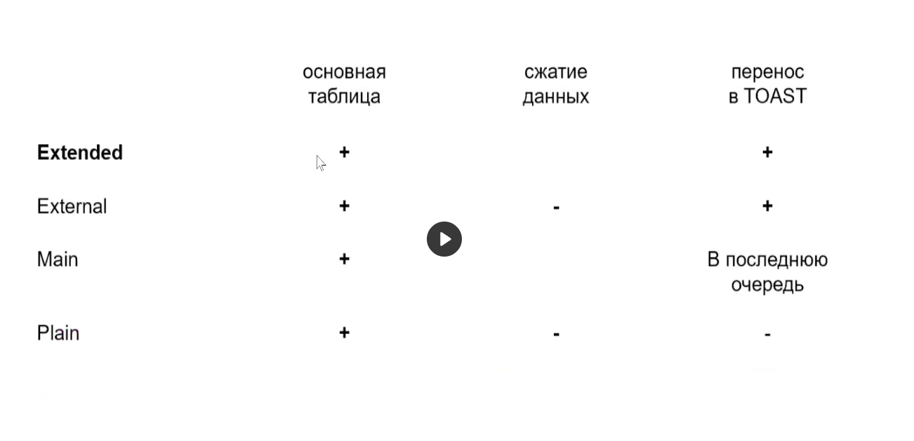
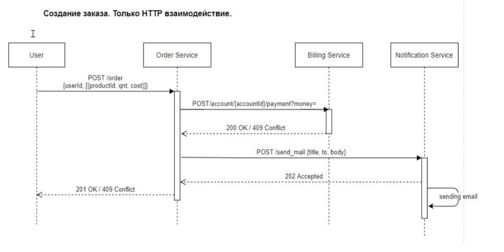
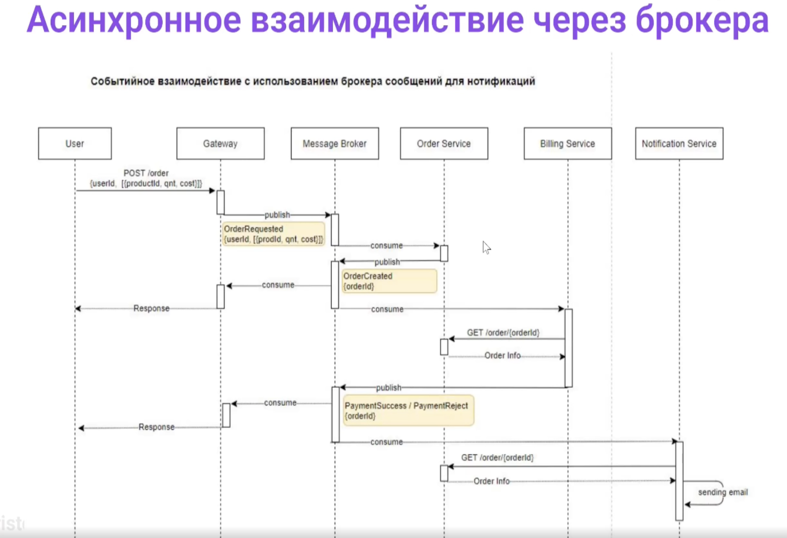

# Слабоструктурированные данные и асинхронная обработка

Маршрут вебинара
1. Слабоструктурированные типы - назначение и варианты
2. Подходы к использования XML - бизнес-задачи и функционал в PostgreSQL
3. TOAST - причины использования, варианты сжатия, особенности физического хранения, проблематика при использовании
4. Разница между JSON и JSONB - кейсы практического использования, реализация индексного поиска и особенности реализации внутри PostgreSQL
5. Задачи асинхронной обработки - задачи и варианты реализации, плясы и минусы каждого варианта

По факту какие типы используятся в ПГ:
- для текста - text
- для целых чисел int (синтаксический сахар над integer)
- для вещественных real
- для денег decimal (синоним numeric), не money!!! из-за проблем с округлением в сша (к ближайшему четному, а не как у лядей)
- дата и время - date & timestamp. Если нужен часовой пояс то Z в конце  
Но современные системы намного сложнее и иногда требуятся специальные типы данных. Не всегда наша бизнес логика укладывается в нормальизацию, иногда проще использовать слабоструктурированные типы данных

## XML

[XML](https://javarush.ru/groups/posts/2287-chto-takoe-xml) - eXtensible Markup Language

Тип xml предназначен для хранения XML-данных. Его преимущество по сравнения с обычным типом text в том, что он проверяет вводимые значения на допустимость по правилам XML и для работы с ним есть типо безопасные [функции](https://www.postgresql.org/docs/current/functions-xml.html)

XML in PostgreSQL
Реализация отвратительная…
Чтобы получить значение типа xml из текстовой строки, используйте функция xmlparse:
```sql
XMLPARSE ( { DOCUMENT | CONTENT } value)
XMLPARSE (DOCUMENT '<?xml
version="1.0"?><book><title>Manual</title><chapter>...</chapter></book>')
XMLPARSE (CONTENT 'abc<foo>bar</foo><bar>foo</bar>')
```
Хотя в стандарте SQL описан только один способ преобразования текстовых строк в XML значения, специфический синтаксис Postgres Pro также будет работать:
```sql
xml '<foo>bar</foo>'
'<foo>bar</foo>'::xml
```
Обратная операция, получение текстовой строки из xml, выполняется с помощья функции xmlserialize:
```sql
XMLSERIALIZE ( { DOCUMENT | CONTENT } значение AS тип )
```
Здесь допустимый тип - character, character varying или text (или их псевдонимы). И в данном случае стандарт SQL предусматривает только один способ преобразования xml в тип текстовых строк, но Postgres Pro позволяет просто привести значение к нужному типу

Для того чтобы работать с XML есть 2 функции - сереализация и десерелизация.

[Посмотрим](https://www.postgresql.org/docs/current/functions-xml.html), что у нас есть из функционала. Даже нет элементарной замены элемента.

XPATH - В SQL:2006 были внесены значительные изменения в посвящённой XML части ISO/IEC 9075-14 (SQL/XML). Реализация типа данных XML и связанных функций в PostgreSQL в большей степени соответствует более ранней редакции, SQL:2003, с некоторыми заимствованиями из последуящих редакций. Запросы ограничиваятся XPath версии 1.0. XML давно в Постгресе не развивается и развиваться не будет - считается что формат устарел и что во всем мире он уже практически не используется (не подходит для многих задач).

Практика 14 00
```sql
-- https://postgrespro.com/community/demodb
cd $HOME && wget --quiet https://edu.postgrespro.com/demo-small-en.zip && unzip demo-small-en.zip && psql < demo-small-en-20170815.sql

-- XML
psql -d demo
SELECT XMLSERIALIZE(CONTENT query_to_xml('SELECT * FROM bookings.tickets limit 10', true, false,'') as text);

drop TABLE if exists xmldata;
CREATE TABLE xmldata AS SELECT
xml $$
<ROWS>
  <ROW id="1">
    <COUNTRY_ID>AU</COUNTRY_ID>
    <COUNTRY_NAME>Australia</COUNTRY_NAME>
  </ROW>
  <ROW id="5">
    <COUNTRY_ID>JP</COUNTRY_ID>
    <COUNTRY_NAME>Japan</COUNTRY_NAME>
    <PREMIER_NAME>Shinzo Abe</PREMIER_NAME>
    <SIZE unit="sq_mi">145935</SIZE>
  </ROW>
  <ROW id="6">
    <COUNTRY_ID>SG</COUNTRY_ID>
    <COUNTRY_NAME>Singapore</COUNTRY_NAME>
    <SIZE unit="sq_km">697</SIZE>
  </ROW>
</ROWS>
$$ AS data;

SELECT * FROM xmldata;

INSERT INTO xmldata VALUES ('<ROWS>
  <ROW id="1">
    <COUNTRY_ID>AU</COUNTRY_ID>
    <COUNTRY_NAME>Australia</COUNTRY_NAME>
  </ROW>
  <ROW id="5">
    <COUNTRY_ID>JP</COUNTRY_ID>
    <COUNTRY_NAME>Japan</COUNTRY_NAME>
    <PREMIER_NAME>Shinzo Abe</PREMIER_NAME>
    <SIZE unit="sq_mi">145935</SIZE>
  </ROW>
  <ROW id="6">
    <COUNTRY_ID>SG</COUNTRY_ID>
    <COUNTRY_NAME>Singapore</COUNTRY_NAME>
    <SIZE unit="sq_km">697</SIZE>
  </ROW>
</ROWS>');

-- каждый раз, когда мы хотим что то достать из xml, нам нужно описывать его структуру
SELECT xmlTABLE.*
  FROM xmldata,
       XMLTABLE('//ROWS/ROW'
                PASSING data
                COLUMNS id int PATH '@id',
                        ordinality FOR ORDINALITY,
                        "COUNTRY_NAME" text,
                        country_id text PATH 'COUNTRY_ID',
                        size_sq_km float PATH 'SIZE[@unit = "sq_km"]',
                        size_other text PATH
                             'concat(SIZE[@unit!="sq_km"], " ", SIZE[@unit!="sq_km"]/@unit)',
                        premier_name text PATH 'PREMIER_NAME' DEFAULT 'not specified') ;


SELECT * FROM xmldata WHERE data::text like '%Australia%';
```

## JSON (24 00)

Более стандартный и лучший способ по работе со слабоструктурированными данными. Самый большой плюс - значительно меньше оверхеда под хранение метатегов

> The json data type stores an exact copy of the input text, which processing functions must reparse on each execution; while jsonb data is stored in a decomposed binary format that makes it slightly slower to input due to added conversion overhead, but significantly faster to process, since no reparsing is needed. jsonb also supports indexing, which can be a significant advantage.

JSONB - бинарный джсон. Разница в том, что бинарный джсон сортирует ключи и при наличии такого же ключа - оставляет последний. Работает быстрее чем простой.
- [статья](https://habr.com/ru/articles/584660/) - Храним данные в JSONB, как это влияет на скорость запросов? 
- [статья](https://habr.com/ru/companies/oleg-bunin/articles/646987/) - Борьба с TOAST или будущее JSONB в PostgreSQL

[Функционал](https://www.postgresql.org/docs/current/functions-json.html). Функций для работы с джсоном значительно больше!

Конечно можем создавать функциональный индекс на часть jsonb. Основная проблема, что при хранении ходим в TOAST с его проблемами и блоатингом! Так как джсон у нас - это текст, он хранится у нас в TOAST-сегментах.

Почему джсон, а не таблицы? Иногда призодится работать со слабоструктурированными данными (например, договора) - структура разная и мы просто не можем разложить на таблицы. Также хороший кейс - маркетплейс. У товаров разное количество свойств, это разные группы - разложить не получится.

Практика (31 00)
```sql

psql -d demo

-- JSON
-- can only used in transaction blocks
set local search_path to bookings, public;

SELECT * 
FROM tickets;
/*
   ticket_no   | book_ref | passenger_id |     passenger_name      |                                     contact_data                                      
---------------+----------+--------------+-------------------------+---------------------------------------------------------------------------------------
 0005432000987 | 06B046   | 8149 604011  | VALERIY TIKHONOV        | {"phone": "+70127117011"}
 0005432000988 | 06B046   | 8499 420203  | EVGENIYA ALEKSEEVA      | {"phone": "+70378089255"}
 0005432000989 | E170C3   | 1011 752484  | ARTUR GERASIMOV         | {"phone": "+70760429203"}
*/

-- видим, что contact_data - поле json
SELECT 	t.ticket_no
		, t.contact_data
		, contact_data->>'phone' as phone
		, contact_data->>'email' as email
FROM tickets as t
limit 3
;
/*
   ticket_no   |       contact_data        |    phone     | email 
---------------+---------------------------+--------------+-------
 0005432000987 | {"phone": "+70127117011"} | +70127117011 | 
 0005432000988 | {"phone": "+70378089255"} | +70378089255 | 
 0005432000989 | {"phone": "+70760429203"} | +70760429203 | 
(3 rows)
*/

-- второй вариант
-- мы сджоинились с преобразованным форматом джсона в построчный вариант
SELECT 	t.ticket_no
		, t.contact_data
--		, contact_data->>'phone' as phone
--		, contact_data->>'email' as email
		, cd.*
FROM tickets as t, jsonb_each_text(t.contact_data) as cd;
/*
   ticket_no   |       contact_data        |  key  |    value     
---------------+---------------------------+-------+--------------
 0005432000987 | {"phone": "+70127117011"} | phone | +70127117011
 0005432000988 | {"phone": "+70378089255"} | phone | +70378089255
 0005432000989 | {"phone": "+70760429203"} | phone | +70760429203
(3 rows)
*/

-- поиск с использованием джсон
-- добавим 2 телефона и по ним поищем
SELECT 	t.ticket_no
		, t.contact_data
		, contact_data#>>'{phone,0}' as phone
		, contact_data->>'email' as email
FROM bookings.tickets as t
WHERE ticket_no = '0005432000987';
/*
   ticket_no   |       contact_data        | phone | email 
---------------+---------------------------+-------+-------
 0005432000987 | {"phone": "+70127117011"} |       | 
(1 row)
*/


UPDATE bookings.tickets set contact_data = '{"email": "volkova.alina_030303@postgrespro.ru", 
"phone": ["+80555584000", "+90555584030"]}' WHERE ticket_no = '0005432000987';

-- посмотрим предыдущий запрос для {phone,3} {phone,2} {phone,1}

-- порядок в JSONB имеет место. для сохранения этого порядка используем with ordinality
-- джсонб сортирует только неупорядоченный джсон по имени! Массивы в велью не сортируются
SELECT 	t.ticket_no
		, t.contact_data
--		, contact_data->>'phone' as phone
--		, contact_data->>'email' as email
		, cd.*
FROM tickets as t, jsonb_each_text(t.contact_data) with ordinality as cd;

-- можем убирать значения из json
SELECT 	t.ticket_no
		, t.contact_data
		, contact_data->>'phone' as phone
		, contact_data->>'email' as email
		, contact_data - 'phone' as cd_without_phone
FROM tickets as t;


-- можем искать по ключам в json - выдаст только строчки с полем email
SELECT 	t.ticket_no
		, t.contact_data
		, contact_data->>'phone' as phone
		, contact_data->>'email' as email
		, contact_data - 'phone' as cd_without_phone
FROM tickets as t
WHERE contact_data ? 'email';


-- можем искать по значениям в json
SELECT  t.ticket_no
  , t.contact_data
  , contact_data->>'{phone,0}' as phone
  , contact_data->>'email' as email
  , contact_data - 'phone' as cd_without_phone
FROM tickets as t
 WHERE contact_data#>>'{phone,0}' like '+8%'
--WHERE ticket_no = '0005432000987'
;

-- !!! нужно найти на первом уровне массива
-- !!! не работает
SELECT  t.ticket_no
  , t.contact_data
  , contact_data->>'{phone,0}' as phone
  , contact_data->>'email' as email
  , contact_data - 'phone' as cd_without_phone
FROM tickets as t
WHERE contact_data#>>'{0,phone}' like '+7%'
--WHERE ticket_no = '0005432000987'
;


-- проверим json на равенство
SELECT '{}'::jsonb = '{}'::jsonb;  -- t
SELECT '{"a":15}'::jsonb = '{"a":15}'::jsonb;  -- t
SELECT '{"a":15}'::jsonb = '{"A":15}'::jsonb;  -- f (хотя классически постгрес регистронезависимый, все приводит к нижнему регистру!)
SELECT '{"a":15, "c":"hiall"}'::jsonb = '{"a":15}'::jsonb;  -- f
SELECT '{"a":15, "c":"hiall"}'::jsonb = '{"a":15, "c":"hiall"}'::jsonb;  -- t

-- ???
SELECT '{"c":"hiall", "a":15}'::jsonb = '{"a":15, "c":"hiall"}'::jsonb;  -- t
-- ???

SELECT '{"c":"hiall", "a":15}'::json = '{"a":15, "c":"hiall"}'::json;  -- просто

SELECT '{"c":"hiall", "a":15}'::json;
SELECT '{"c":"hiall", "a":15}'::jsonb;  -- если приводить в джсонб, то он их еще и отсортирует!


-- автоматически будет json отсортирован, а массив в JSON нет
UPDATE bookings.tickets set contact_data = '{"phone": ["+80555500000", "+70500005555"], "email": "volkova.alina_030303@postgrespro.ru"}' WHERE ticket_no = '0005432000987';

SELECT 	t.ticket_no
		, t.contact_data
FROM bookings.tickets as t
WHERE ticket_no = '0005432000987';

-- замена значения
SELECT jsonb_set('[{"f1":1,"f2":null},2,null,3]', '{0,f1}','[2,3,4]', false);
/*
                  jsonb_set                  
---------------------------------------------
 [{"f1": [2, 3, 4], "f2": null}, 2, null, 3]
(1 row)
*/

SELECT jsonb_set('[{"f1":1,"f2":null},2]', '{0,f3}','[2,3,4]');
SELECT jsonb_set('[{"f1":1,"f2":null},2]', '{0,f3}','[2,3,4]', false);

-- замена значения в строке в таблице
UPDATE bookings.tickets 
set contact_data = jsonb_set(contact_data,'{email}','"volkova.alina_333@postgrespro.ru"') 
WHERE ticket_no = '0005432000987';

-- ||	jsonb	Соединяет два значения jsonb в новое значение - конкатенация срабатывает не только для текста!
-- складывает два массива
select jsonb	'["a", "b"]'::jsonb || '["c", "d"]'::jsonb;
select jsonb	'["a", "b"]'::jsonb || '["b", "d"]'::jsonb;
/*
       ?column?       
----------------------
 ["a", "b", "b", "d"]
(1 row)
*/

-- не отработает
select '{"a" , "b"}'::jsonb || '{"a" , "d"}'::jsonb;

-- а так отработает
select '{"a" : "b"}'::jsonb || '{"a" : "d"}'::jsonb;

-- JSON && NULL
select '{"a":NULL}'::jsonb;
/*
ERROR:  invalid input syntax for type json
LINE 1: select '{"a":NULL}'::jsonb;
               ^
DETAIL:  Token "NULL" is invalid.
CONTEXT:  JSON data, line 1: {"a":NULL...
*/
select '{"a":null}'::jsonb;


truncate testj;
create table testj(j jsonb);
insert into testj values('{"a":null,"b":1}'),('{"b":2}');
select * from testj where j->'a' IS NOT NULL;
/*
          j          
---------------------
 {"a": null, "b": 1}
(1 row)
*/
select j->'a' from testj;
/*
 ?column? 
----------
 null
 
(2 rows)
*/
select * from testj where j->'a'='null';
/*
          j          
---------------------
 {"a": null, "b": 1}
(1 row)
*/
-- null он распознает как текст!


-- jsonb index - 53 00
-- посмотрим какие функции поддерживает GIN для JSONB
select opc.opcname, amop.amopopr::regoperator, amop.amopstrategy as str
from pg_opclass opc, pg_opfamily opf, pg_am am, pg_amop amop
where opc.opcname in ('jsonb_ops','jsonb_path_ops')
and opf.oid = opc.opcfamily
and am.oid = opf.opfmethod
and amop.amopfamily = opc.opcfamily
and am.amname = 'gin'
and amop.amoplefttype = opc.opcintype;
/*
    opcname     |      amopopr       | str 
----------------+--------------------+-----
 jsonb_ops      | ?(jsonb,text)      |   9
 jsonb_ops      | ?|(jsonb,text[])   |  10
 jsonb_ops      | ?&(jsonb,text[])   |  11
 jsonb_ops      | @>(jsonb,jsonb)    |   7
 jsonb_ops      | @?(jsonb,jsonpath) |  15
 jsonb_ops      | @@(jsonb,jsonpath) |  16
 jsonb_path_ops | @>(jsonb,jsonb)    |   7
 jsonb_path_ops | @?(jsonb,jsonpath) |  15
 jsonb_path_ops | @@(jsonb,jsonpath) |  16
(9 rows)
*/

-- создадим табличку с jsonb - соберем в джсон все маршруты по нашему аэропорту
create table routes_jsonb as
  select to_jsonb(t) route
  from (
      select departure_airport_name, arrival_airport_name, days_of_week
      from bookings.routes
      order by flight_no limit 4
  ) t;

select ctid, jsonb_pretty(route) from routes_jsonb;
/*
 ctid  |                        jsonb_pretty                         
-------+-------------------------------------------------------------
 (0,1) | {                                                          +
       |     "days_of_week": [                                      +
       |         6                                                  +
       |     ],                                                     +
       |     "arrival_airport_name": "Surgut Airport",              +
       |     "departure_airport_name": "Ust-Ilimsk Airport"         +
       | }
 (0,2) | {                                                          +
       |     "days_of_week": [                                      +
       |         7                                                  +
       |     ],                                                     +
       |     "arrival_airport_name": "Ust-Ilimsk Airport",          +
       |     "departure_airport_name": "Surgut Airport"             +
       | }
 (0,3) | {                                                          +
       |     "days_of_week": [                                      +
       |         2,                                                 +
       |         6                                                  +
       |     ],                                                     +
       |     "arrival_airport_name": "Sochi International Airport", +
       |     "departure_airport_name": "Ivanovo South Airport"      +
       | }
 (0,4) | {                                                          +
       |     "days_of_week": [                                      +
       |         3,                                                 +
       |         7                                                  +
       |     ],                                                     +
       |     "arrival_airport_name": "Ivanovo South Airport",       +
       |     "departure_airport_name": "Sochi International Airport"+
       | }
(4 rows)
*/

-- создадим индекс
create index on routes_jsonb using gin(route);

explain (costs off)
select jsonb_pretty(route)
from routes_jsonb
where route @> '{"days_of_week": [5]}';
/*
                     QUERY PLAN                      
-----------------------------------------------------
 Seq Scan on routes_jsonb
   Filter: (route @> '{"days_of_week": [5]}'::jsonb)
(2 rows)
*/


-- SET enable_seqscan = OFF;
explain
select jsonb_pretty(route)
from routes_jsonb
where route @> '{"days_of_week": [5]}';
/*
 Bitmap Heap Scan on routes_jsonb  (cost=12.92..16.94 rows=1 width=32)
   Recheck Cond: (route @> '{"days_of_week": [5]}'::jsonb)
   ->  Bitmap Index Scan on routes_jsonb_route_idx  (cost=0.00..12.92 rows=1 width=0)
         Index Cond: (route @> '{"days_of_week": [5]}'::jsonb)
(4 rows)
*/

select jsonb_pretty(route) from routes_jsonb where route @> '{"days_of_week": [5]}';


\d+ bookings.tickets


-- проясним за хранение jsonb
-- проясним за jsonb
-- здесь показывается что джсон у нас отличается от хранения в виде текста. Тут делается билд джсона и туда запихиваются значения в различном формате
psql
create extension pageinspect;
drop table if exists test_jsonb;
create table test_jsonb(jb jsonb);
insert into test_jsonb(jb)
values (jsonb_build_object('name',repeat('Alice',200), 'address',repeat('Wonderland',200),'name',repeat('Description text',200)));

drop table if exists test_jsonb2;
create table test_jsonb2(t text);
insert into test_jsonb2(t)
values (jsonb_build_object('name',repeat('Alice',200), 'address',repeat('Wonderland',200),'name',repeat('Description text',200))::text);


SELECT
    n.nspname || '.' || c.relname AS table_name,
    pg_size_pretty(pg_total_relation_size(c.oid)) AS total_size,
    pg_size_pretty(pg_total_relation_size(c.reltoastrelid)) AS toast_size
FROM pg_class c
JOIN pg_namespace n
    ON c.relnamespace = n.oid
WHERE
    relname = 'test_jsonb';
/*
     table_name      | total_size | toast_size 
---------------------+------------+------------
 bookings.test_jsonb | 16 kB      | 8192 bytes
(1 row)
*/

SELECT relname, reltoastrelid FROM pg_class WHERE relname = 'test_jsonb';
/*
  relname   | reltoastrelid 
------------+---------------
 test_jsonb |         16575
(1 row)
*/
SELECT relname FROM pg_class WHERE oid = 16575;
/*
    relname     
----------------
 pg_toast_16572
(1 row)
*/

SELECT chunk_id, chunk_seq, length(chunk_data) FROM pg_toast.pg_toast_16572;

select * from heap_page_items(get_raw_page('test_jsonb',0))
union all
select * from heap_page_items(get_raw_page('test_jsonb2',0));
/*
 lp | lp_off | lp_flags | lp_len | t_xmin | t_xmax | t_field3 | t_ctid | t_infomask2 | t_infomask | t_hoff | t_bits | t_oid |                                                                                                                                      t_data                                                                                                                                      
----+--------+----------+--------+--------+--------+----------+--------+-------------+------------+--------+--------+-------+----------------------------------------------------------------------------------------------------------------------------------------------------------------------------------------------------------------------------------------------------------------------------------
  1 |   8032 |        1 |    159 |    906 |      0 |        0 | (0,1)  |           1 |       2050 |     24 |        |       | \x1e0200006f1400000002000020040000800007000000800c000000d00700006e616d65006164647265737344006573637269707469806f6e20746578740f10ffff0f10ff0f10ff0f10ff0f10ff0f10ff0f10ff0f10ff0f10ff070f10ff0f10ff0f10a3576f6e6465e0726c616e640f0aff0f0aff0f0aff1f0f0aff0f0aff0f0aff0f0aff0f0a3d
  1 |   8040 |        1 |    152 |    908 |      0 |        0 | (0,1)  |           1 |       2050 |     24 |        |       | \x020200006b140000007b226e616d65223a002022446573637269007074696f6e207465fc78740f10ff0f10ff0f10ff0f10ff0f10ff0f10ff3f0f10ff0f10ff0f10ff0f10ff0f10ff0f10a3222c0020226164647265730273c18f576f6e646572f06c616e640f0aff0f0aff0f0aff0f0aff0f0f0aff0f0aff0f0aff0f0a3d227d
(2 rows)
*/
-- в строчках джсонб выглядит побольше чем текст! При этом индивидуально с каждым значением он работает быстрее.

select * from test_jsonb;

select bit_length(t_data) from heap_page_items(get_raw_page('test_jsonb',0))
union all
select bit_length(t_data) from heap_page_items(get_raw_page('test_jsonb2',0));
/*
 bit_length 
------------
       1080
       1024
(2 rows)
*/
```
Джсон сейчас особо никто не использует, все используют джсонб! Работает побыстрее обычного джсона

@> - очень много операция для поиска в джсонах! Documentation 17: 9.16. JSON Functions and Operators

## TOAST (58 00)

Джсонб в 17 версии все еще хранится в виде текста, и хранится он в так называемом TOAST-сегменте. Странички у нас 8 кб, тексты могут быть большие. Чтобы у нас информация занимала меньше места, она выносится в отдельный TOAST-сегмент, где она делится на тн чанки по 2кб и постгрес там пытается ее еще заархивировать (сжать), чтобы она занимала меньше места. Итого вместо того чтобы держать страницы по 100кб текста, у нас содержится ссылка на TOAST-сегмент (это отдельная TOAST-таблица), которую мы сами не видим но чуть выше показано, как ее получить. Там и содержатся сжатые текстовые данные. Соответственно, когда мы пишем select * , он еще идет и туда (в тост-сегмент), что довольно дорого. Также там есть индекс для поиска по номеру сегмента. Он автоматически обслуживается, мы его не видим (но доступ получить к нему можно). По хорошему, его тоже нужно обслуживать (автоматически обслуживается не очень хорошо).

Версия строки должна помещаться на одну страницу 8кб
- можно сжать часть атрибутов,
- или часть вынести в отдельнуя TOAST-таблицу,
- или сжать и вынести одновременно  
TOAST-таблица
- поддержана собственным индексом
- читается только при обращении к «длинному» атрибуту
- собственная версионность (если при обновлении toast часть не меняется, то и не будет создана новая версия toast части)
- работает прозрачно для приложения
- стоит задуматься, когда пишем select *
- обновление тоста влечет блоатинг (увидим на практике) - необходимо задуматься об обслуживании

https://www.postgresql.org/docs/current/storage-toast.html

Стратегии хранения TOAST



По умолчанию он пытается сжать наши данные в основной табличке. Если они помещаются в 2кб - окей, если нет - перемещаются в тост-сегмент. Можем поменять модель хранения, например, не сжимать данные, а сразу переносить в тост-сегмент. Или вообще не использовать тост-сегмент и не сжимать данные.

Можем повлиять на поведение:
- `TOAST_MAX_CHUNK_SIZE bytes` (by default this value is chosen so that four chunk rows will fit on a page, making it about 2000 bytes).  
  Классика - это размер 2кб каждого чанка. Чанк - это отдельный кусочек информации. Есть айдишник поля, есть номер чанка - совместный индекс, по ним достаем эту информцию их нашего тост сегмента.
- The TOAST code will compress and/or move field values out-of-line until the row value is shorter than `TOAST_TUPLE_TARGET` bytes (also normally 2 kB, adjustable) or no more gains can be had.
- Each TOAST-able data type specifies a default strategy for columns of that data type, but the strategy for a given table column can be altered with `ALTER TABLE ... SET STORAGE`.
- `TOAST_TUPLE_TARGET` can be adjusted for each table using ALTER TABLE ... SET (toast_tuple_target = N)
- `ALTER … SET STORAGE` само по себе не меняет ничего в таблице, оно только задаёт стратегия, которая будет реализована при будущих изменениях в таблице. 

Архитектура решения:
- https://habr.com/ru/company/oleg-bunin/blog/597187/
- https://hakibenita.com/sql-medium-text-performance?ref=refind
- https://habr.com/ru/companies/oleg-bunin/articles/646987/ 

Практика (1 02 00)
```sql
-- TOAST
drop table if exists toast_test;
CREATE TABLE toast_test (id SERIAL, value TEXT);
-- когда тип данных TEXT - автоматом под капотом создается тост-сегмент
SELECT relname, reltoastrelid FROM pg_class WHERE relname = 'toast_test';
/*
  relname   | reltoastrelid 
------------+---------------
 toast_test |         16394
(1 row)
*/
SELECT relname FROM pg_class WHERE oid = 16394;
/*
    relname     
----------------
 pg_toast_16390
(1 row)
*/
\d pg_toast.pg_toast_16390
/*
   Column   |  Type   
------------+---------
 chunk_id   | oid
 chunk_seq  | integer
 chunk_data | bytea
Owning table: "public.toast_test"
Indexes:
    "pg_toast_16390_index" PRIMARY KEY, btree (chunk_id, chunk_seq)
*/
-- chunk_id: A reference to a toasted value.
-- chunk_seq: A sequence within the chunk. (номер сегмента)
-- chunk_data: The actual chunk data.

-- все наши объекты хранятся в pg_class!
select * from pg_class limit 1;

SELECT
    n.nspname || '.' || c.relname AS table_name,
    pg_size_pretty(pg_total_relation_size(c.oid)) AS total_size,
    pg_size_pretty(pg_total_relation_size(c.reltoastrelid)) AS toast_size
FROM pg_class c
JOIN pg_namespace n
    ON c.relnamespace = n.oid
WHERE
    relname = 'toast_test';
/*
    table_name     | total_size | toast_size 
-------------------+------------+------------
 public.toast_test | 8192 bytes | 8192 bytes
(1 row)
*/

-- запихнем маленькое значение
INSERT INTO toast_test (value) VALUES ('small value');
select * from pg_toast.pg_toast_16390;  -- тут ничего нет
/*
    table_name     | total_size | toast_size 
-------------------+------------+------------
 public.toast_test | 16 kB      | 8192 bytes
(1 row)
*/

-- запихаем строчку 4000 байт (пробелов)
INSERT INTO toast_test (value) VALUES (repeat(' ', 4097));
-- размер не увеличится! Пустые пробелы легко сжимаются, там будет не 4000 байт, а байт 100 по факту
/*
    table_name     | total_size | toast_size 
-------------------+------------+------------
 public.toast_test | 16 kB      | 8192 bytes
(1 row)
*/
INSERT INTO toast_test (value) VALUES (repeat('s', 400097));
SELECT count(*) FROM pg_toast.pg_toast_16390;  -- 3  # количество чанков
SELECT chunk_id, chunk_seq, length(chunk_data) FROM pg_toast.pg_toast_16390;
/*
-- в основной табличке будет просто ссылка на наш тост сегмент
 chunk_id | chunk_seq | length 
----------+-----------+--------
    16396 |         0 |   1996
    16396 |         1 |   1996
    16396 |         2 |    595
(3 rows)
*/
/*
-- тост сегмент вырастет
    table_name     | total_size | toast_size 
-------------------+------------+------------
 public.toast_test | 32 kB      | 24 kB
(1 row)
*/
-- WTF?
-- автоматическое сжатие TEXT!!!!
-- на самом деле в случае с 4097 символами сжатие произошло и храниться непосредственно в таблице с данными

-- функция генерации случайных значений. Передаем туда алфавит и указываем, какого размера строчку сгенерировать
CREATE OR REPLACE FUNCTION generate_random_string(
  length INTEGER,
  characters TEXT default '0123456789ABCDEFGHIJKLMNOPQRSTUVWXYZabcdefghijklmnopqrstuvwxyz'
) RETURNS TEXT AS
$$
DECLARE
  result TEXT := '';
BEGIN
  IF length < 1 then
      RAISE EXCEPTION 'Invalid length';
  END IF;
  FOR __ IN 1..length LOOP
    result := result || substr(characters, floor(random() * length(characters))::int + 1, 1);
  end loop;
  RETURN result;
END;
$$ LANGUAGE plpgsql;


INSERT INTO toast_test (value) VALUES (generate_random_string(1024 * 10));


SELECT chunk_id, COUNT(*) as chunks, pg_size_pretty(sum(octet_length(chunk_data)::bigint))
FROM pg_toast.pg_toast_16390 GROUP BY 1 ORDER BY 1;
-- в чанк у нас улетело 6 чанков общего размера 10кб. Это потому что нашу последовательность сложно сжать
/*
 chunk_id | chunks | pg_size_pretty 
----------+--------+----------------
    16396 |      3 | 4587 bytes
    16398 |      6 | 10 kB
(2 rows)
*/

TRUNCATE toast_test;
-- обратите внимание, транкейт вернул место!!!

-- Postgres use LZ comperssion 
-- https://doxygen.postgresql.org/pg__lzcompress_8c_source.html
-- поменять можно 
-- https://www.postgresql.org/docs/current/runtime-config-client.html#GUC-DEFAULT-TOAST-COMPRESSION 
-- втсавим случайную строку из всего нескольких значений

-- сгенерируем всего из 3 символов (123)
INSERT INTO toast_test (value) VALUES (generate_random_string(1024 * 10, '123'));

SELECT chunk_id, COUNT(*) as chunks, pg_size_pretty(sum(octet_length(chunk_data)::bigint))
FROM pg_toast.pg_toast_16390 GROUP BY 1 ORDER BY 1;
/*
 chunk_id | chunks | pg_size_pretty 
----------+--------+----------------
    16402 |      2 | 3047 bytes
(1 row)
*/


-- Configuring TOAST
-- toast_tuple_target: The minimum tuple length after which PostgreSQL tries to move long values to TOAST.
-- storage: The TOAST strategy. PostgreSQL supports 4 different TOAST strategies. The default is EXTENDED, which means PostgreSQL will try to compress the value and store it out-of-line.
-- https://www.postgresql.org/docs/current/storage-toast.html#STORAGE-TOAST-ONDISK

-- !!!! update JSONB в TOAST довольно медленный !!!
-- https://habr.com/ru/companies/oleg-bunin/articles/597187/ 
-- https://www.postgresql.org/docs/current/datatype-json.html

-- джсонб под капотом хранится как текст, поэтому если мы поменяли какое то значение в джсоне - у нас по факту все равно будет новая версия джсона целиком.
-- погенерируем джсоны - 10к джсонов, в каждом по 1000 объектов
drop table if exists t;
CREATE TABLE t AS
SELECT i AS id, (SELECT jsonb_object_agg(j, j) FROM generate_series(1, 1000) j) js
FROM generate_series(1, 10000) i;

SELECT oid::regclass AS heap_rel,
       pg_size_pretty(pg_relation_size(oid)) AS heap_rel_size,
       reltoastrelid::regclass AS toast_rel,
       pg_size_pretty(pg_relation_size(reltoastrelid)) AS toast_rel_size
FROM pg_class WHERE relname = 't';
/*
 heap_rel | heap_rel_size |        toast_rel        | toast_rel_size 
----------+---------------+-------------------------+----------------
 t        | 512 kB        | pg_toast.pg_toast_16403 | 78 MB
(1 row)

heap_rel_size - наши сами данные (там останутся только заголовки и ссылки на тост сегмент)
toast_rel_size - тост сегмент (все наши джсоны улетят туда)
*/

-- Сама таблица будет занимать 512 Кб, а хранилище TOAST — 78 Мб. JSON будет 19 Кб, и он сжимается в 6 Кб, 
-- которые займут 4 чанка в TOAST (чанки размером по 2 Кб). Дальше давайте проапдейтим колонку id — она маленькая, 
-- находится отдельно и никогда не попадет в TOAST:
\timing
\d+ t
SELECT pg_current_wal_lsn(); -->  0/59F4D98
UPDATE t SET id = id + 1; -- Time: 29.876 ms
SELECT pg_current_wal_lsn(); -->  0/5BF4DC0
SELECT pg_size_pretty(pg_wal_lsn_diff('0/59F4D98','0/5BF4DC0')) AS wal_size;
/*
 wal_size 
----------
 -2048 kB
(1 row)
*/

-- Апдейт займет всего 37 мс, и WAL  будет всего 1,5 Мб, то есть 150 байт на запись. 
-- При этом размер TOAST не изменится — как был 78 Мб, так и останется. И теперь давайте проапдейтим JSON:

SELECT pg_current_wal_lsn(); -->  0/5BF4DF8
UPDATE t SET js = js::jsonb || '{"a":1}'; -- 17316 ms (was 42 ms, ~500x slower)
-- Time: 16748.006 ms (00:16.748)
SELECT pg_current_wal_lsn(); -->  0/DA39AB0
SELECT pg_size_pretty(pg_wal_lsn_diff('0/DA39AB0','0/5BF4DF8')) AS wal_size;
/*
 wal_size 
----------
 126 MB
(1 row)
*/
-- на каждый тост-сегмент, на кажду строчку, сделали свою копию в конец, старую пометили на удаление

-- Это займет 12 секунд, то есть станет в 300 раз медленней, а размер  WAL увеличится до 130 Мб вместо 1,5 Мб. 
-- Хранилище TOAST соответственно увеличилось в 2 раза.  То есть, мы сделали маленький апдейт и у нас сразу же возникли проблемы. 
-- Работа с тост сегментом - это очень дорого!
SELECT oid::regclass AS heap_rel,
       pg_size_pretty(pg_relation_size(oid)) AS heap_rel_size,
       reltoastrelid::regclass AS toast_rel,
       pg_size_pretty(pg_relation_size(reltoastrelid)) AS toast_rel_size
FROM pg_class WHERE relname = 't';
/*
 heap_rel | heap_rel_size |        toast_rel        | toast_rel_size 
----------+---------------+-------------------------+----------------
 t        | 1024 kB       | pg_toast.pg_toast_16403 | 156 MB
(1 row)
*/

-- помимо распухания тост сегментов, у нас также пухнут и индексы!
-- имеем распухание - bloating
-- pluggable TOAST - комьюнити не приняло(
-- https://habr.com/ru/companies/postgrespro/articles/710104/
будет распухать до х4 - связано с механизмом хранения
\d+ pg_toast.pg_toast_16390
/*
   Column   |  Type   | Storage 
------------+---------+---------
 chunk_id   | oid     | plain
 chunk_seq  | integer | plain
 chunk_data | bytea   | plain
Owning table: "public.toast_test"
Indexes:
    "pg_toast_16390_index" PRIMARY KEY, btree (chunk_id, chunk_seq)
Access method: heap
*/

-- добавить просмотр размера индекса
-- наш индекс распух в 2 раза и нам нужно сделать реиндекс!
REINDEX INDEX CONCURRENTLY pg_toast.pg_toast_16390_index;  -- Time: 10.857 ms
-- не помогло, хотя должно было %(
-- https://habr.com/ru/companies/tensor/articles/498292/

-- автоматически у нас реиндекс не делается в тост сегментах, нигде и никак. Он делается только через вакуум (он максимум помечает старые записи на удаление, а новые у нас выглядят в относительно нормально виде. При этом сам индекс может пухнуть до 8 раз). Не всегда вакуум нам помогает


-- Варианты решения:
-- мы можем кластеризовать нашу табличку. При кластере у нас рядом созщдается такой же объект и информация раскладывается туда, упорядочивается. Это нам помочь может, но для этого нам нужен эксклюзивный доступ, который нам классический механизм постгреса не дал. 
EXTENDED -> MAIN
toast_tuple_target - MAX
VACUUM FULL(
CLUSTER pg_toast.pg_toast_16390 USING pg_toast_16390_index;
-- pg_repack не работает... Online VACUUM FULL (packing rows only)
-- https://github.com/reorg/pg_repack?tab=readme-ov-file

-- физическая структура таблицы
-- https://www.postgresql.org/docs/current/storage-page-layout.html

-- а можем и не уйти в TOAST
https://www.db-fiddle.com/f/bWAv3Cv9bChndD6o5DDuB2/0


CREATE TABLE jsonb_table (
    id SERIAL PRIMARY KEY,
    data JSONB
);

BEGIN;

DO $$
DECLARE
    batch_size INT := 100;
    i INT;
BEGIN
    FOR i IN 1..100 LOOP
        INSERT INTO jsonb_table (data)
        SELECT jsonb_build_object(
            'field1', md5(random()::text),
            'field2', md5(random()::text),
            'field3', md5(random()::text)
        )
        FROM generate_series(1, batch_size);
    END LOOP;
END $$;

COMMIT;


select * from jsonb_table limit 10;

SELECT oid::regclass AS heap_rel,
       pg_size_pretty(pg_relation_size(oid)) AS heap_rel_size,
       reltoastrelid::regclass AS toast_rel,
       pg_size_pretty(pg_relation_size(reltoastrelid)) AS toast_rel_size
FROM pg_class WHERE relname = 'jsonb_table';

```

## Хранение бинарных данных (1 16 00)

Мы можем хранить бинарную информацию внутри базы. Классическая ситуация - у нас есть миллионы маленькихъ файлов, которые нам нужно хранить. Так у нас может закончится INODE. Вторая ситуация - что мы просто зайти в каталог не можем, где куча файлов. То есть нужно сделать какую-то иерархическую систему хранения (год-меся-число и тд). А можем хранить их в базе. Храниться они будут намного более эффективно, хотя бы по той причине что опять же не будет выделяться им полный сегмент для хранения. Ну и работать это будет значительно быстрее. Для этого есть специальный тип ByteA

LargeObject vs ByteA - Binary data performance in PostgreSQL - CYBERTEC  
Также можно использовать БД для хранения миллионов мелких файлов (например биллинг смс, геопозиций и т.д.). Попробуйте зайти в каталог с миллионом файлов) да INODE https://firstvds.ru/technology/how-to-check-and-clean-inode

Следующее что мы можем делать - это хранить большие файлоы (видеофайлы и тд). Это у нас идет LargeObject. Но стоит отметить, что в постгресе это реализовано криво, на каждый LargeObject объект у нас создается отдельный объект внутри пг_класс. Плюс на эти объекты не работает вакуум. Для этого нужно использовать vacuumlo (vacuum large object). А как же фуллвакуум? он же нам поможет? А вот и нет; [vacuumlo](https://www.postgresql.org/docs/current/vacuumlo.html)

### Асинхронная обработка

В современных больших системах мы уходим от больших монолитов в сторону асинхронной обработки данных.



Прилег один из сервисов - система встала. Как обновить билинг или нотификейшн сервис? Например, нотификейшн отправляется через смс шляз и пока ответ не получен - все висит

Асинхронное взаимодействие через брокера (кафка, рэббит)



Требования к брокерам
- Гарантия доставки сообщений
  - at least once delivery
  - at most once delivery
  - exactly once
- Порядок передачи сообщений - важен ли он нам?
- Управления размером очереди (ограничение на передачу)
- Зеркалирование
- Масштабирование
- Отказоустойчивость

Сценарии использования
- Асинхронные ответы на долгие запросы
  - не хотим висеть и ждать ответа - реактивность (например в монго - callback, мы не ждем синхронного ответа, он когда нибудь приедет)
  - построение отчетов
  - аналитические, бухгалтерские запросы
- Передача данных между приложениями, микросервисами
- Каждый получает свой кусок информаци
- Асинхронная обработка очереди запросов
  - Балансировка нагрузки между воркерами
  - Нестабильная связь
  - Регулировка нагрузки в зависимости от времени суток (ночью дообрабатываем, когда нагрузка маленькая)

## HW

1. Сгенерировать таблицу с 1 млн JSONB документов
2. Создать индекс
3. Обновить 1 из полей в json
4. Убедиться в блоатинге TOAST
5. Придумать методы избавится от него и проверить на практике
6. Не забываем про блоатинг индексов (задание со звездочкой)