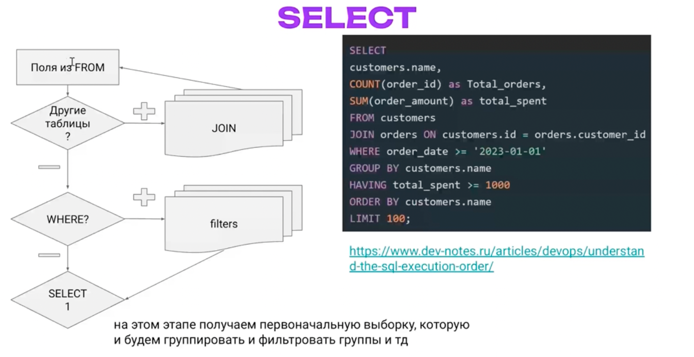
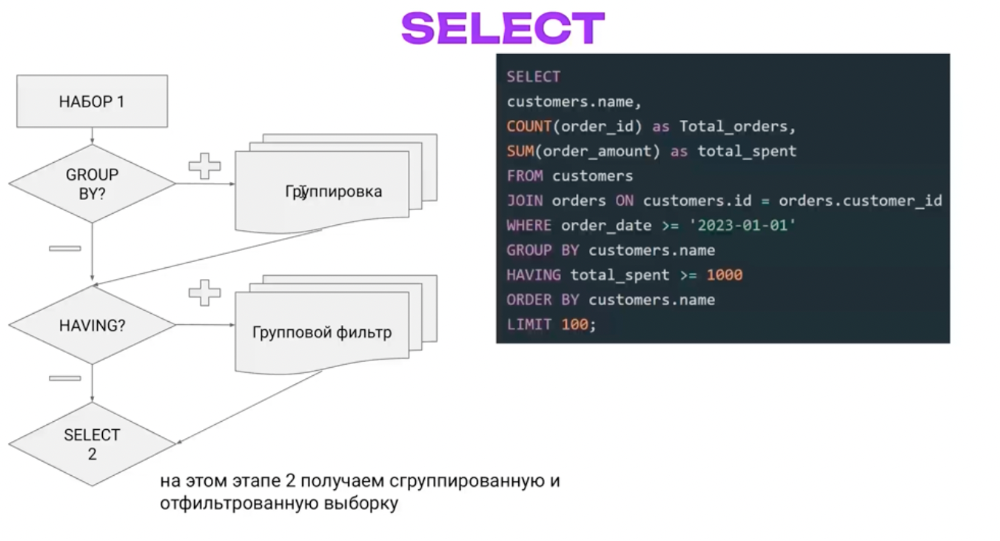
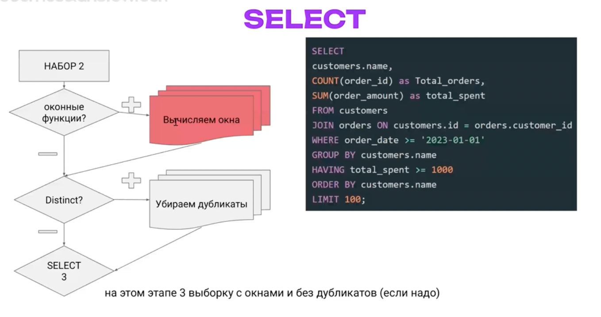
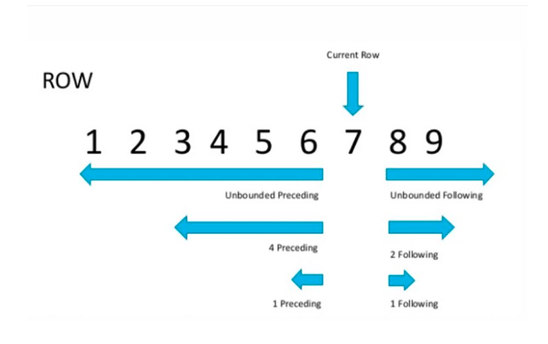
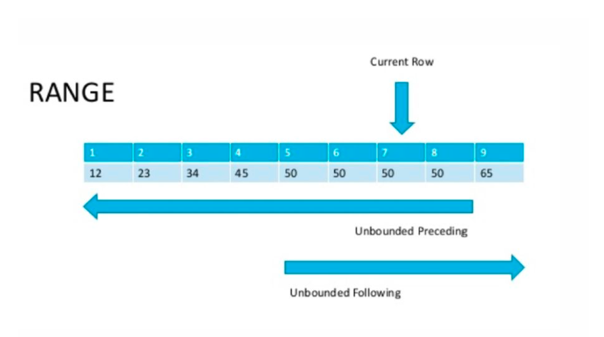
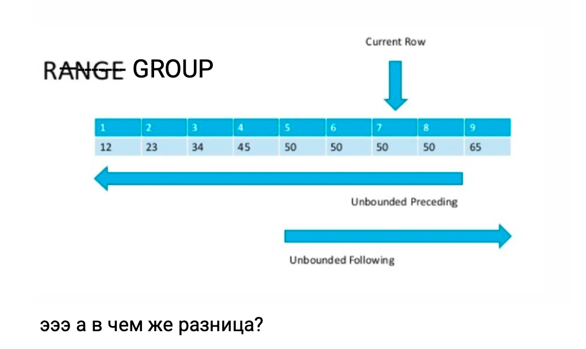
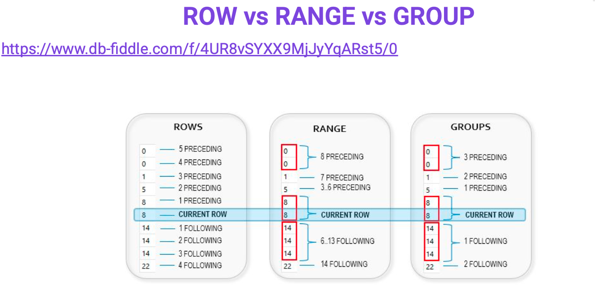

# Оконные функции и полнотекстовый поиск

## Маршрут вебинара

1. Оконные/аналитические функции - назначение и принципы работы, скользящее окно, практические кейсы использования, параллелизм выполнения
2. Полнотекстовый поиск - задачи, особенности реализации, бизнескейсы, использование индексов
3. Регулярные выражения, like, ilike и разница с полнотекстовым поиском
4. Триграммы - понятие и кейсы использования

## Оконные/аналитические функции

Иногда есть ситуации, когда стандартных функций SQL может не хватать или реализация становится очень сложной. Можно посчитать:
- Нарастающий итог (нужны предыдущие строчки, в классическом sql это нереализуемо)
- В запросе нужны данные из предыдущей/последующей строки (латерал джоин - это сложно, оконками намного легче)
- Нужно совместить результаты агрегатной функции и сами данные
- Выбрать топ 3 из группы, например выбрать 3 самых дешевых товара в каждой группе
- Топ 10 самых свежих постов
- Разделить набор данных на N групп

[Оконные/аналитические функции](https://www.postgresql.org/docs/current/tutorial-window.html). Самое простое определение - это диапазон видимости, по которому мы считаем ту или иную функцию. Раньше считали сумму по всему диапазону, тут же мы можем сами настроить диапазон (задать, сколько видеть строк до нас, после нас, сортировать их), кроме того таких окон может быть много

Что такое окно?
```sql
Function() OVER (окно, по которому идет подсчет)

Func() OVER (
    PARTITION BY [список полей]  -- аналог груп бай
    ORDER BY  -- не влияет на сортировку в запросе!
    ROWS/RANGE 
)
-- Примеры:
RANK() OVER (ORDER BY username)
RANK() OVER (PARTITION BY city ORDER BY username)
-- в постгресе отсутствует row_number!
```

SELECT  
Но важно вспомнить этапы обработки оператора SELECT: [Запросы в PostgreSQL: 1. Этапы выполнения](https://habr.com/ru/companies/postgrespro/articles/574702/), где рассмотрены:
- Лексический и синтаксический разбор, cемантический разбор
- Трансформация (он уже строит наш запрос в одну строку, с одними пробелами - то есть он приходит уже к тому моменту когда машина может его прочитать)
- Планирование -> Дерево плана
- Перебор планов. Здесь нужно понимать, что мы строим не идеальный план, а самый лучший план за отведенное время! На сложных, многострочных запросах мы можем потратить времени на перебор планов больше, чем на исполнение запроса.
- Управление порядком соединений → Выбор лучшего плана
- Общая схема вычисления оценки, в т.ч. кардинальности
- И уже в самом конце выполнение  
[Выполнение запросов в PostgreSQL | Статья | Сообщество Directum](https://club.directum.ru/post/361562)

План по ходу выполнения не меняется! Как это происходит (запрос). У нас есть что то во фром полях, затем смотрим, есть ли у нас джоины. Когда нибудь джоины у нас заканчиваются - список полей мы сформировали. Далее мы фильтруем что мы навыбирали, по каким критериям. Затем переходим к предварительной выборке, которая переходит у нас на следующий этап (тут - селект 1). Это промежуточный этап.



Дальше у нас идет группировка, по каким полям. В цикле группируем и одновременно фильтруем через хэйвинг (в постгресе алиасы для хэйвинг не работают)



И только после этого начинают работать наши оконные функции и затем дистинкт, который убирает дубликаты. Идут дополнительные вычисления - они достаточно дорогие, поэтому идут в самом конце. В конце мы уже сортируем и пагинируем наши результаты (лимит, оффсет). То есть на самом деле оконная функция ничего не сортирует.



Count, sum - тоже оконные функции, просто для них не указано окно! Окно накладывается сразу по всему диапазону. Полный список оконных функций - [тут](https://www.postgresql.org/docs/current/functions-window.html). Выделяют 3 типа
- агрегирующие
- ранжирующие
- по значению, позволяют нам выбрать первое/второе/последнее в определенном окне

Ранжирующие функции
- ROW_NUMBER() – присваивает строке последовательный номер с 1 в порядке указанной в OVER() сортировки
- RANK() – функция ранжирует строки по указанному полю в ORDER BY, присваивая различный ранг (номер) только строком с разным значением (distinct), при этом следующий ранг будет учитывать количество строк, с одинаковым рангом, Ранк следущее значение получает по роу намбер, а дэнс рэнк - по порядку.
- DENSE_RANK() – функция ранжирует строки по указанному полю в ORDER BY, присваивая различный ранг (номер) только строком с разным значением (distinct), при этом следующий номер присвоится без учета строк с одинаковым рангом
- PERCENT_RANK() – функция ранжирует строки в процентном соотношении
- NTILE(кол-во групп) – позволяет распределить строки по примерно одинаковым по размеру группам
- CUME_DIST() – функция распределения текущей стркои в интервале 0 - 1, по формуле np / nr, где np – количество строк до текущей строки в группе, nr количество строк в партиции

https://www.db-fiddle.com/f/hUqBzp1PXF1Vzy7yNdEjbj/4

```sql
create table wf (i int, t text);
insert into wf values (1,'a'),(1,'b'),(1,'b'),(1,'c'),(1,'d'),(2,'d'),(2,'d'),(2,'d'),(3,'d'),(3,'d');
/*
 i | t 
---+---
 1 | a
 1 | b
 1 | b
 1 | c
 1 | d
 2 | d
 2 | d
 2 | d
 3 | d
 3 | d
(10 rows)
*/

-- ответственность за правильное использование окон на аналитике!
select 
	i, 
    t,
    ROW_NUMBER() OVER (),  -- без OVER не работает
    RANK() OVER (),  -- без окна не работают, но ошибок нет
    DENSE_RANK() OVER (),
    PERCENT_RANK() OVER (),    
    NTILE(2) OVER (),  -- делит нам на равные доли
    CUME_DIST() OVER (),
    ROW_NUMBER() OVER (PARTITION BY i),
    RANK() OVER (PARTITION BY i),  -- без сортировки не работают, но ошибок нет
    RANK() OVER (PARTITION BY i ORDER BY t),
    DENSE_RANK() OVER (PARTITION BY i ORDER BY t),
    PERCENT_RANK() OVER (PARTITION BY i ORDER BY t),    
    PERCENT_RANK() OVER (PARTITION BY i ORDER BY t DESC) as d,  -- сортировка DESC
    CUME_DIST() OVER (PARTITION BY i ORDER BY t) as c
from wf
-- ORDER BY t DESC -- полная ерунда
-- окна должны совпадать!!!
;
/*
 i | t | row_number | rank | dense_rank | percent_rank | ntile | cume_dis
t | row_number | rank | rank | dense_rank | percent_rank |  d   |  c  
---+---+------------+------+------------+--------------+-------+---------
--+------------+------+------+------------+--------------+------+-----
 1 | a |          1 |    1 |          1 |            0 |     1 |         
1 |          1 |    1 |    1 |          1 |            0 |    1 | 0.2
 1 | b |          2 |    1 |          1 |            0 |     1 |         
1 |          2 |    1 |    2 |          2 |         0.25 |  0.5 | 0.6
 1 | b |          3 |    1 |          1 |            0 |     1 |         
1 |          3 |    1 |    2 |          2 |         0.25 |  0.5 | 0.6
 1 | c |          4 |    1 |          1 |            0 |     1 |         
1 |          4 |    1 |    4 |          3 |         0.75 | 0.25 | 0.8
 1 | d |          5 |    1 |          1 |            0 |     1 |         
1 |          5 |    1 |    5 |          4 |            1 |    0 |   1
 2 | d |          6 |    1 |          1 |            0 |     2 |         1 |          1 |    1 |    1 |          1 |            0 |    0 |   1
 2 | d |          7 |    1 |          1 |            0 |     2 |         1 |          2 |    1 |    1 |          1 |            0 |    0 |   1
 2 | d |          8 |    1 |          1 |            0 |     2 |         1 |          3 |    1 |    1 |          1 |            0 |    0 |   1
 3 | d |          9 |    1 |          1 |            0 |     2 |         1 |          1 |    1 |    1 |          1 |            0 |    0 |   1
 3 | d |         10 |    1 |          1 |            0 |     2 |         1 |          2 |    1 |    1 |          1 |            0 |    0 |   1
(10 rows)
*/
```

Мы можем задать диапазон как считать. Есть 3 варианта:

Row - текущая строчка. Мы можем задать неограниченно/сколько то до/неограниченно после (построчный способ) 



Диапазон. Включая строчку и до включатся все значения-аналогичные строчки, на скрине - 50 или менее, Рэндж идет по значению!



Группа - практически то же самое



В чем же разница? Строчки идут от номера строчки, range идет от значения, group идет от группы значений.



Рассмотрим на практике:
```sql
create table delivery(provider text, amount int);
insert into delivery values 
('gazon',100),('gazon',200),('gazon',200),('gazon',200),
('gazon',300),('gazon',400),('gazon',500),('gazon',500),
('vv',10),('vv',20),('vv',20),('vv',20),
('vv',30),('vv',40),('vv',50),('vv',50);

SELECT provider, 
	   amount,
       sum(amount) OVER w_rows AS rows,
       sum(amount) OVER w_range AS range,
       sum(amount) OVER w_groups AS groups,
       sum(amount) OVER w_range2 AS range2,
       sum(amount) OVER w_groups2 AS groups2        
FROM delivery 
WINDOW 
w_rows AS (PARTITION BY provider ORDER BY amount 
            ROWS BETWEEN UNBOUNDED PRECEDING AND CURRENT ROW)
, w_range AS (PARTITION BY provider ORDER BY amount 
             RANGE BETWEEN UNBOUNDED PRECEDING AND CURRENT ROW)
, w_groups AS (PARTITION BY provider ORDER BY amount 
                     GROUPS BETWEEN UNBOUNDED PRECEDING AND CURRENT ROW), 
w_range2 AS (PARTITION BY provider ORDER BY amount 
                     RANGE BETWEEN 1 PRECEDING AND 1 FOLLOWING), 
w_groups2 AS (PARTITION BY provider ORDER BY amount 
                     GROUPS BETWEEN 1 PRECEDING AND 1 FOLLOWING) 
ORDER BY provider,amount;
/*
 provider | amount | rows | range | groups | range2 | groups2 
----------+--------+------+-------+--------+--------+---------
 gazon    |    100 |  100 |   100 |    100 |    100 |     700
 gazon    |    200 |  300 |   700 |    700 |    600 |    1000
 gazon    |    200 |  500 |   700 |    700 |    600 |    1000
 gazon    |    200 |  700 |   700 |    700 |    600 |    1000
 gazon    |    300 | 1000 |  1000 |   1000 |    300 |    1300
 gazon    |    400 | 1400 |  1400 |   1400 |    400 |    1700
 gazon    |    500 | 1900 |  2400 |   2400 |   1000 |    1400
 gazon    |    500 | 2400 |  2400 |   2400 |   1000 |    1400
 vv       |     10 |   10 |    10 |     10 |     10 |      70
 vv       |     20 |   30 |    70 |     70 |     60 |     100
 vv       |     20 |   50 |    70 |     70 |     60 |     100
 vv       |     20 |   70 |    70 |     70 |     60 |     100
 vv       |     30 |  100 |   100 |    100 |     30 |     130
 vv       |     40 |  140 |   140 |    140 |     40 |     170
 vv       |     50 |  190 |   240 |    240 |    100 |     140
 vv       |     50 |  240 |   240 |    240 |    100 |     140
(16 rows)
*/
```
Здесь WINDOW - мы можем писать окна сами! Это важно потому что окон много, каждое окно мы можем разворачивать как хотим. Основная проблема в том, что если мы напишем все синтаксически верно - постгрес не ругнется. При этом будет проблема с интерпретацией результата. Вся ответственность за дачу ложных показаний - на нас! Аналитические функции написать очень просто. Трудно ситуацию смоделировать и правильно интерпретировать.

Функции смещения
- LAG(поле, [смещение], default) – значение предыдущей строки с учетом смещения, по умолчанию смещение 1
- LEAD(поле, [смещение], default) – значение следующей строки, с учетом смещения
- FIRST_VALUE(поле) – первое значение в группе
- LAST_VALUE(поле) – последнее значение в группе
- NTH_VALUE(поле, [смещение]) – N значение в группе  
Здесь важно понимать, что если мы хотим получить следующее значение, а окно закончилось - мы ничего не получим
```sql
-- пример окна продаж 
create table sales (
	id serial,
  	sales_amount numeric,
  	client text,
  	date date
);

insert into sales (sales_amount, client, date) values
(100,'Petr','20241001'),
(200,'Petr','20241002'),
(99,'Ivan','20241005'),
(111,'Svetlana','20241001')
;

SELECT *,
	Sum(sales_amount)
		OVER (
			partition BY client) AS sales_total,
	Sum(sales_amount)
		OVER (
			partition BY client order by date desc) AS running_total
FROM sales
order by date;
/*
 id | sales_amount |  client  |    date    | sales_total | running_total 
----+--------------+----------+------------+-------------+---------------
  1 |          100 | Petr     | 2024-10-01 |         300 |           300
  4 |          111 | Svetlana | 2024-10-01 |         111 |           111
  2 |          200 | Petr     | 2024-10-02 |         300 |           200
  3 |           99 | Ivan     | 2024-10-05 |          99 |            99
(4 rows)
*/
-- в окне мы сортируем по убыванию, а итоговую сортировку мы делаем по дате. Поэтому странные результаты
```
Категорически рекомендуется делать сортировку в одном направлении!

ВАЖНО! НЕ видим дальнейшие значения; Посмотрим сложный запрос на практике.

Агрегатные функции, По умолчанию RANGE
- SUM()
- COUNT()
- AVG()
- MIN()
- MAX()

```sql
-- доработанный пример с нарастающим итогом
https://www.db-fiddle.com/f/8NPYvVi9N6Dr5EV4TiypCw/0

/*SELECT *,
Sum(sales_amount)
OVER (
partition BY client) AS
sales_total
FROM sales;*/

-- нарастающий итог
SELECT 
	*,
	Sum(sales_amount) OVER (partition BY client rows between unbounded preceding and current row) AS sales_total
FROM sales
order by date;
/*
 id | sales_amount |  client  |    date    | sales_total 
----+--------------+----------+------------+-------------
  1 |          100 | Petr     | 2024-10-01 |         100
  4 |          111 | Svetlana | 2024-10-01 |         111
  2 |          200 | Petr     | 2024-10-02 |         300
  3 |           99 | Ivan     | 2024-10-05 |          99
(4 rows)
*/

-- текущий и предыдущий
SELECT 
	*,
	Sum(sales_amount) OVER (partition BY client rows between 1 preceding and current row) AS sales_total
FROM sales;
/*
 id | sales_amount |  client  |    date    | sales_total 
----+--------------+----------+------------+-------------
  3 |           99 | Ivan     | 2024-10-05 |          99
  1 |          100 | Petr     | 2024-10-01 |         100
  2 |          200 | Petr     | 2024-10-02 |         300
  4 |          111 | Svetlana | 2024-10-01 |         111
(4 rows)
*/

-- нарастающий итог за последние 2 дня, исключая текущий
SELECT 
	*,
	Sum(sales_amount) OVER (partition BY client rows between 2 preceding and 1 preceding) AS sales_total
FROM sales;
/*
 id | sales_amount |  client  |    date    | sales_total 
----+--------------+----------+------------+-------------
  3 |           99 | Ivan     | 2024-10-05 |            
  1 |          100 | Petr     | 2024-10-01 |            
  2 |          200 | Petr     | 2024-10-02 |         100
  4 |          111 | Svetlana | 2024-10-01 |            
(4 rows)
*/

-- пример rank, dense_rank
https://www.db-fiddle.com/f/3L28YmGoBYWSs9nuxGgRUb/1

SELECT *,
	   ROW_NUMBER() OVER (w) ,
	   rank() OVER (w),  
       dense_rank() OVER (w) 
FROM sales
window w as (order by date);
/*
 id | sales_amount |  client  |    date    | row_number | rank | dense_rank 
----+--------------+----------+------------+------------+------+------------
  1 |          100 | Petr     | 2024-10-01 |          1 |    1 |          1
  4 |          111 | Svetlana | 2024-10-01 |          2 |    1 |          1
  2 |          200 | Petr     | 2024-10-02 |          3 |    3 |          2
  3 |           99 | Ivan     | 2024-10-05 |          4 |    4 |          3
(4 rows)
*/

-- первая продажа каждого клиента
https://www.db-fiddle.com/f/xxwc5JbNMctLX5ucGfpH5Y/0

SELECT *,
	   ROW_NUMBER() OVER (w) ,
	   rank() OVER (w),
       dense_rank() OVER (w) 
FROM sales
window w as (order by date);
/*
 id | sales_amount |  client  |    date    | row_number | rank | dense_rank 
----+--------------+----------+------------+------------+------+------------
  1 |          100 | Petr     | 2024-10-01 |          1 |    1 |          1
  4 |          111 | Svetlana | 2024-10-01 |          2 |    1 |          1
  2 |          200 | Petr     | 2024-10-02 |          3 |    3 |          2
  3 |           99 | Ivan     | 2024-10-05 |          4 |    4 |          3
(4 rows)
*/

-- range (default for SUM AVG) vs rows
https://www.db-fiddle.com/f/wNV5HY8QASURaZMUwWM14E/0

SELECT *,
	   sum(sales_amount) OVER (partition by client 
                               --order by date 
							   -- range current row
                               rows current row
                              )
FROM sales;
/*
 id | sales_amount |  client  |    date    | sum 
----+--------------+----------+------------+-----
  3 |           99 | Ivan     | 2024-10-05 |  99
  1 |          100 | Petr     | 2024-10-01 | 100
  2 |          200 | Petr     | 2024-10-02 | 200
  4 |          111 | Svetlana | 2024-10-01 | 111
(4 rows)
*/
```

Есть небольшая особенность - какие то функции дефолтно работают по строкам, какие то - по диапазону

```sql
\c thai
with orderPlaces AS (
    SELECT count(t.id) as orderPlaces, t.fkride
    FROM book.tickets t
    group by t.fkride
),
busstationName AS (
      SELECT 
            s.id as id, 
            s.price as price,
            bs.city || ', ' || bs.name as busstation
      FROM book.schedule as s
      JOIN book.busRoute br
            on s.fkroute = br.id
      JOIN book.busStation bs
            on br.fkbusstationFrom = bs.id
)
SELECT  r.startdate as departDate, 
        bs.busstation as busstationFrom,  
        sum(t.orderPlaces*bs.price) as summ,
        LAG(sum(t.orderPlaces*bs.price)) OVER (ORDER BY bs.busstation,r.startdate),
        LEAD(sum(t.orderPlaces*bs.price)) OVER (ORDER BY bs.busstation,r.startdate desc),
        FIRST_VALUE(sum(t.orderPlaces*bs.price)) OVER (ORDER BY bs.busstation,r.startdate), 
        LAST_VALUE(sum(t.orderPlaces*bs.price)) OVER (ORDER BY bs.busstation,r.startdate), -- НЕ видим дальнейшие значения
        NTH_VALUE(sum(t.orderPlaces*bs.price),3) OVER (ORDER BY bs.busstation,r.startdate)
FROM book.ride r
JOIN busstationName bs
      on bs.id = r.fkschedule
JOIN orderPlaces t
      on t.fkride = r.id
GROUP BY r.startdate, bs.busstation
ORDER BY bs.busstation,r.startdate
LIMIT 20
;
-- как бы вы доработали этот запрос?
-- сделать единое окно
```

Мы можем и дообогатить окно!
```sql
select *
    , row_number() over (w)
    , rank() over (w order by date) 
from sales
window w as (partition by client)
```


### Продвинутый функционал оконных функций 48 00

Что можно переписать теперь с помощью аналитических функций?
- Нарастающий итог
- Поиск дубликатов
- Поиск пропусков в последовательности
- Возвращения первых N строк в группе - топ 3 товаров по категориям  
!!!ВАЖНО!!!
!!!одинаковые окна во всех запросах - сортировка в том же порядке, что и в запросе!!! можно создать окно, дать ему имя и использовать по имени. [Синтакс](https://www.postgresql.org/docs/current/sql-expressions.html#SYNTAX-WINDOW-FUNCTIONS)

Еще запросы
```sql
-- Поиск дубликатов
SELECT
    ROW_NUMBER() OVER w AS duplicate_num, -- номер дубля
    *
FROM person AS d
WHERE EXISTS(SELECT
             FROM person AS t
             WHERE t.name = d.name -- в идеале на это поле должен стоять индекс
                   -- если нет первичного ключа, замените "id" на "ctid"
                   AND d.id != t.id -- оригинал и дубликаты
                   -- AND d.id > t.id -- только дубликаты
            )
WINDOW w AS (PARTITION BY name ORDER BY id)
ORDER BY name, duplicate_num;


-- Поиск пропусков в последовательности
drop table if exists StockItems;
create table StockItems (StockItemID int);
insert into StockItems values (1),(2),(5),(6),(7),(9),(10),(11);
SELECT StockItemID + 1
FROM (
	SELECT  StockItemID, LEAD(StockItemID) over (order by StockItemID) LAST_NUM
	FROM StockItems
) a1
WHERE StockItemID + 1 != LAST_NUM;
-- юз-кейс - если мы используем сериал, то рано или поздно он закончится и попытается начать сначала. А там уже айдишки 1 есть, произойдет падение из-за нарушения уникальности и бизнес встанет. Поэтому временное решение - найти пропуски (они могут либо удалиться, либо из-за роллбэка транзакций счетчик пойдет дальше)
-- хакерство - начать с -2млрд

-- выведем топ 3 заказа для каждого кастомера
-- очень просто, но очень ДОРОГО, так как сначала мы все пронумеруем, а потом выберем только 3
-- mssql БД с кастомерами и продажами
-- практику не доделал(
SELECT *
FROM 
	(SELECT Invoices.InvoiceId, Invoices.InvoiceDate, Invoices.CustomerID, trans.TransactionAmount,
			ROW_NUMBER() OVER (PARTITION BY Invoices.CustomerId ORDER BY trans.TransactionAmount DESC) AS CustomerTransRank
		FROM Sales.Invoices as Invoices
			JOIN Sales.CustomerTransactions as trans
				ON Invoices.InvoiceID = trans.InvoiceID
	) AS tbl
WHERE CustomerTransRank <= 3
order by CustomerID, TransactionAmount desc;
```

## Полнотекстовый поиск 51 00

Очень недооцененная тема. 

Простой поиск
- like - регистрозависимый поиск по шаблону, например text like ‘%tomat%ʼ
- ilike - дороже, но регистроНЕзависимый. Работает в 5-6 раз медленнее чем like   
можно попытаться проиндексировать текстовое поле, но работать будет только если нет % в начале строки для поиска. А если нужен более сложный вариант поиска? И быстрее? Что делать в такой ситуации?

Проблема в том, что ilike регистронезависимый, а мы классически не знаем, в каком регистре у нас запись. Чтобы искать быстро, можно попытаться проиндекстировать би-три, но в формате с плейсхолдером в начале он работать не будет, тк он ищет сначала.

[Полнотекстовый поиск](https://www.postgresql.org/docs/current/textsearch.html) - позволяет нам построить наш текст в определенном векторном формате. Он создает нам дерево корней слов

Полнотекстовый поиск (или просто поиск текста) — это возможность находить
документы на естественном языке, соответствующие запросу, и, возможно,
дополнительно сортировать их по релевантности для этого запроса. Наиболее
распространённая задача — найти все документы, содержащие слова запроса, и выдать
их отсортированными по степени соответствия запросу.
Предназначение - ранжирование слов и ускорение поиска по тексту
Например:
SELECT 'a fat cats sat on a mat and ate a fat rat'::tsvector @@ 'rat & cat'::tsquery

Полнотекстовый поиск
Полнотекстовая индексация заключается в предварительной обработке документов и
сохранении индекса для последующего быстрого поиска. Предварительная обработка
включает следующие операции:
1. Разбор документов на фрагменты. При этом полезно выделить различные классы
фрагментов, например, числа, слова, словосочетания, почтовые адреса и т. д.
1. Преобразование фрагментов в лексемы. Лексема — это нормализованный фрагмент,
в котором разные словоформы приведены к одной
1. Хранение документов в форме, подготовленной для поиска. Например, каждый
документ может быть представлен в виде сортированного массива
нормализованных лексем

Полнотекстовый поиск
Как можем искать:
https://www.postgresql.org/docs/current/textsearch-intro.html#TEXTSEARCH-MATCHING
@@ - поиск совпадений
↔ (FOLLOWED BY)
Логические условия при поиске:
& и
| или
! не
( ) для изменения приоритета
SELECT to_tsvector('fat cats ate fat rats') @@ to_tsquery('fat & rat');
SELECT to_tsvector('fat cats ate fat rats') @@ to_tsquery('fat ↔ rat');
SELECT to_tsvector('fat cats ate fat rats') @@ to_tsquery('rat ↔ fat');

Индексирование полнотекстового
поиска
Существует заблуждение, что нужно создать отдельно поле для хранения лексем
для полнотекстового поиска.
На самом деле у нас есть функциональный индекс и мы используем его:
CREATE INDEX idx ON test USING GIN (to_tsvector('english',col2));
И при поиске при использовании той же функции будет использован индекс!
select * from test where to_tsvector('english',col2) @@ to_tsquery('abs');
Важно! Функции to_tsvector('english',col2)) и to_tsvector(col2) - разные!!!
Важно! Функция to_tsvector - это преобразование текста в формат tsvector
text::tsvector != to_tsvector(text)
Несмотря на значение языка по умолчанию english - количество аргументов разное!!!

Особенности полнотекстового поиска
Для английских языков есть несколько словарей (синонимы, тезаурус и т.д.), можно
с ними поэкспериментировать для более лучшего распознавания
https://www.postgresql.org/docs/current/textsearch-dictionaries.html
Важно для индексов - разное количество аргументов - вызываться будут разные
функции!
Дополнительный материал для изучения:
http://www.sai.msu.su/~megera/postgres/talks/fts_pgsql_intro.html
https://habr.com/ru/post/442170/

Практика

Регулярные
выражения

Регулярные выражения
Поиск по паттернам:
PostgreSQL: Documentation: 16: 9.7. Pattern Matching
string SIMILAR TO pattern ESCAPE escape-character]
string NOT SIMILAR TO pattern ESCAPE escape-character]
● | denotes alternation (either of two alternatives).
● * denotes repetition of the previous item zero or more times.
● + denotes repetition of the previous item one or more times.
● ? denotes repetition of the previous item zero or one time.
● {m} denotes repetition of the previous item exactly m times.
● {m,} denotes repetition of the previous item m or more times.
● {m,n} denotes repetition of the previous item at least m and not more than n times.
● Parentheses () can be used to group items into a single logical item.
● A bracket expression [...] specifies a character class, just as in POSIX regular expressions.

Регулярные выражения
Регулярные выражения в POSIX стандарте:
PostgreSQL: Documentation: 16: 9.7. Pattern Matching
Some examples:
'abcd' ~ 'bc' true
'abcd' ~ 'a.c' true — dot matches any character
'abcd' ~ 'a.*d' true — * repeats the preceding pattern item
'abcd' ~ '(b|x)' true — | means OR, parentheses group
'abcd' ~ '^a' true — ^ anchors to start of string
'abcd' ~ '^(b|c)' false — would match except for anchoring
https://en.wikibooks.org/wiki/Regular_Expressions/POSIX_Basic_Regular_Expressions

Триграммы

Триграммы
Есть кейсы, когда нам нужен нечеткий поиск и желательно индексный.
Используем расширение pg_trgm и индекс
https://habr.com/ru/articles/341142/

ДЗ №9
Проанализировать данные о зарплатах сотрудников с использованием оконных функций.
а) На сколько было увеличение с предыдущей зарплатой
б) если это первая зарплата - вместо NULL вывести 0