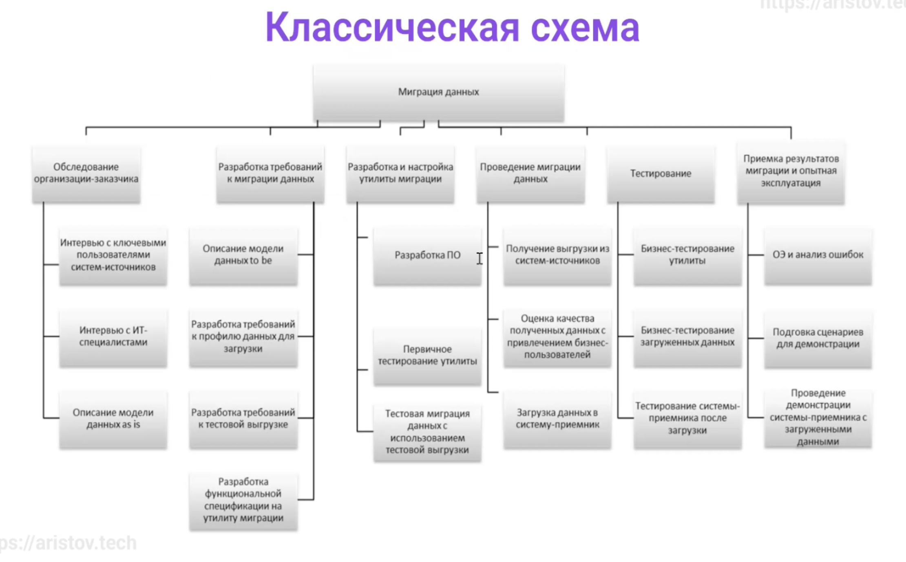
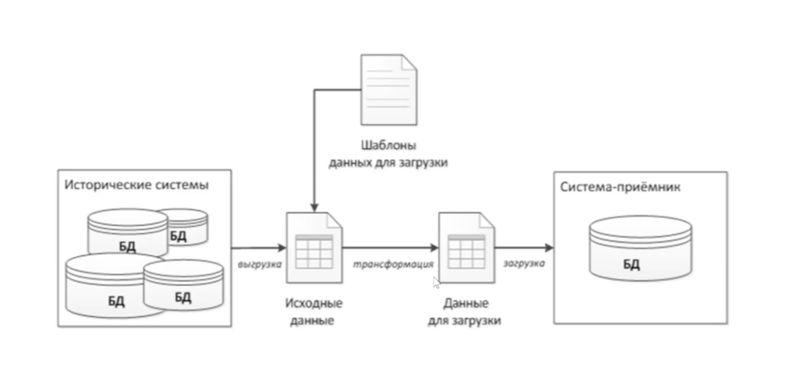
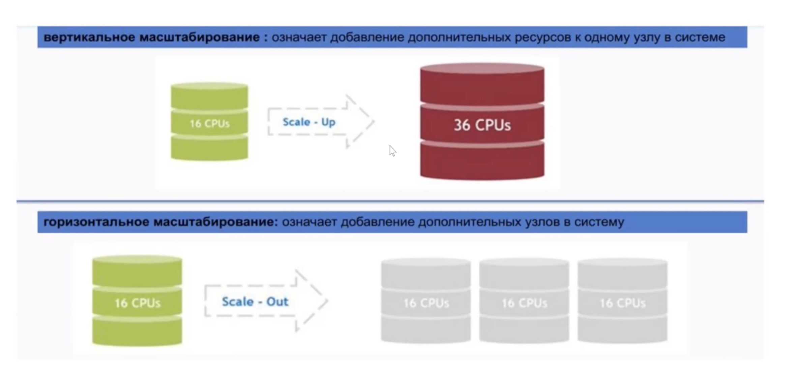

# Внешние данные и миграция данных

Маршрут вебинара
- Разница в типах данных между разными СУБД
- Внешние данные - задачи, варианты и принцип подключения, postgres_fdw, ora2pg, dblink
- Внешние источники - варианты практических кейсов для использования (перелив данных, смена версий PostgreSQL и другие)
- Миграция данных - задачи, принципы и схемы реализации как с даунтаймом так и без, в тч миграция старого легаси
- Концепция CDC - change data capture, кейсы использования
- Batch insert (как массово вставляются данные)

## Внешние данные

Зачем нужно в целом подключение внушних данных?
- Нужно загрузить часть данных (или) все из другой БД (забрать откуда то данные, не всегда рест апи работает, иногда нужно разом выгрузить терабайты данных)
- Желательно нативно (использовать таблицу из другой СУБД как родную таблицу) + возможность джойнов, условий для выборки
- Миграция на другую СУБД
- Смена мажорных версий СУБД (большая проблема в постгресе, бинарные данные несовместимы, не всегда есть возможность остановить наши субд для регламентныхработ)

Представители. Уже много написано, можно брать и использовать
- Oracle & MySQL - https://ora2pg.darold.net/ , бесплатный инструмент, позволяет в текстовом виде вытащить данные из оракла и мускула, вытаскивает данные, схему, мв, пытается экспортировать код хранимых процедур. Работает практически на любой платформе.
- MSSql 
  - https://pgloader.readthedocs.io/en/latest/
  - https://github.com/dalibo/sqlserver2pgsql/tree/master
- postgres 
  - https://www.postgresql.org/docs/current/postgres-fdw.html (утилиты для подключенния внешних источников, лябая база данных постгреса для любой базы будет внешним источником. Для подключения внешних баз данных у нас есть такое понятие как внешние таблицы. Нужно ставить fdw - foreign data wrapper^ нужно ставить экстеншн, он идет в поставке)
- https://www.vinchin.com/database-tips/how-to-migrate-sql-server-to-postgresql-in-2-ways.html - интересная статья по миграции

Если мы посмотрим документацию ПГ, то увидим множество типов данных. [Типы данных](https://postgrespro.ru/docs/postgresql/15/datatype) в ПГ. Но по факту все значительно проще. Посмотрим статью на Хабре:
- [Карманный справочник: сравнение синтаксиса MS SQL Server и PostgreSQL](https://habr.com/ru/companies/ozontech/articles/645173/)
- [Сопоставление типов данных Oracle с PostgreSQL](https://habr.com/ru/articles/335716/)  
Падение производительности при переезде на Постгрес ~30% (тут зависит насколько сложные у нас идут запросы, на небольших данных все ок) . Типы данных могут быть несовместимы и по разному могут работатьь разные СУБД

## postgres_fdw (15 00)

Обертка для подключения к другим БД. Допустим, мы создали один кластер (инстанс) постгреса и в нем создали несколько БД. Даже при подключении к другой БД у нас под капотом идет дисконнект и новое соединение. То есть мы получаем новый pid и это очень дорого. postgres_fdw позволяет использовать чужие таблички как родные.

Варианты использования [postgres_fdw](https://www.postgresql.org/docs/current/postgres-fdw.html) для ускорения работы:
- в ПГ мы не можем получать доступ к другой БД даже в том же кластере - практически единственный вариант делать внешнюю таблицу
- получаем такую же таблицу, как родная
- после этого мы можем писать джойны и тд
- как альтернатива [ETL](https://habr.com/ru/articles/248231/). Здесь возникает интересный момент. Нужно отслеживать данные, которые мы перегрузили. Потом нужно их как то догружать.
- хороший кейс - перелить данные из внешней таблицы (мб другой сервер) - быстрее, чем выгружать в SQL или CSV

Есть конкурент - [dblink](https://www.postgresql.org/docs/current/contrib-dblink-function.html); Более классический (дблинк есть практически в любой субд), но немного устаревший, тут уже не нативно, более сложно в настройке
- https://www.crunchydata.com/blog/understanding-postgres_fdw
- https://www.ongres.com/blog/boost-query-performance-using-fdw-with-minimal-changes/

## Миграция

Основная проблема в том, что все наши субд концептуально построены по разному. Далее в курсе мы посмотрим кластерные конфигурации постгреса (в частности, патрони). У каждой субд все построено по своему. Соответственно, разные форматы репликации, по разному работают бэкапы.

Несовместимость:
- архитектур в целом
- форматов кластеризации/репликации/бэкапов
- форматов данных
- форматов процедурных языков
- различие функционала
- желательно минимальный даунтайм при переходе на новую систему (независимо от того, откуда/куда мы мигрируем - бизнес у нас 24/7!)
- поддержка софтом новой СУБД  
Только перелить данные не поможет!!! Полностью переписывать все хранимые процедуры/функции минимум. Нужно понимать, что у нас все работает, перед тем как переезжать

Если можно не мигрировать, то лучше не мигрировать!
- Бизнес цикл приложения 5-7 лет. Потом возникает или что то другое или переходит в формат легаси идли бизнес умирает
- Несмотря на наличие языка PL/pgSQL - это не полный аналог Ораклового PLSQL - многих фичей нет и архитектура отличается
- Новые фичи лучше уже добавлять на новый продукт, не тратя время на внедрение на старой платформе
- Однозначно будут проблемы при конвертации, настройке безопасности (в разных субд безопасность осуществляется по разному) и производительности (обязательно нужно тестировать, хотя бы на небольшом объеме)

Страхи миграции. Перед тем как мигрировать желательно задать такие вопросы:
1. Сколько это будет стоить? (нужно посчитать, сколько займет физически ресурсов, в тч работа инженеров, тестировщиков, нагрузка на инфру, в тч тестовые контуры, нагрузка на разрабов по изменению софта, дублирование железа)
2. Каким будет простой? (нужно либо выбрать окно на миграцию)
3. Насколько безопасен процесс и не пропадут ли данные?
4. Совместима ли новая среда с нынешней? Кроме того, что работают пользователи, у нас еще наверняка куча информационных порталов, как входящих, так и исходящих (мы кому то предоставляем данные, кто то нам предоставляет)
5. Достаточно ли знаний у ИТ-департамента для переноса данных? Постгрес - не самая простая база в обслуживании (на курсе затронут верхний пласт проблематики, процентов 10!). Хватит ли ресурсов заниматься поддержкой инфры после переезда?
6. Или воспользоваться аутсорсом? (заказать у кого то переезд бывает дешевле!)
7. Смогут ли работать бизнес-процессы в новой среде?
8. Сколько всего потребуется времени для переноса данных?
9. Тестировалось ли заранее выбранное решение миграции данных? Пробовали ли какое то МВП, затестить на нескольких процентах для переезда и затем уже оценивать сроки полной миграции

Классическая схема по миграции, что можно предположить и сделать.



- Описание модели данных to be - что должно быть. Здесь может возникнуть желание совместить миграцию с пересмотром структуры БД. Этот подход имеет плюсы (избавляемсяя от легаси), так и минусы (на порядок усложняем задачу). Помимо миграции будет еще и рефакторинг нашей системы. Классически считается что нужно от этого уклониться.
- разработка требований к профилю данных для загрузки - что должна осуществлять у нас утилита миграции (переливка данных, переливка схем данных, переливка функционального программирования и тд)
- учитываем требования к кластеризации, к производительности
- разрабатываем спецификацию к утилите миграции (пилить свою - обычно нет смысла!)
- необходимо убедиться что полная выгрузка вообще происходит, то есть нет никаких ошибок при полной выгрузке. И оценить качество полученных результатов.
- сначала просто перегружаем данные, траффик не переключаем! Перегружаем данные и проводим интеграционное тестирование, нагрузочное тестирование, как вообще новая система у нас работает.
- после этого уже можно согласовывать сроки по миграции, также необходимо продумать механизм отката назад
- миграция 0 это не просто так, миграция - это большой-большой проект, даже на 1 таблице можно поймать очень много граблей

Виды миграции
1. Изменение СУБД
2. Изменение архитектуры PostgreSQL
3. Изменение версии PostgreSQL (мажорной)
4. Изменение схемы данных

Как происходит классически изменение СУБД. У нас есть выгрузка каких либо исходных данных в каком-либо формате, дальше трансформация и загрузка (ЕТЛ). Здесь как раз могут помочь написанные кем-то утилиты. Повезет, если не придется ничего допиливать. Главный тут момент - надо мигрировать только если действительно надо! Если проект работает и так - то лучше не мигрировать. Миграция ради миграции - это плохо.



Изменение СУБД
1. Зачем нужен перенос на другую СУБД?
2. Выберите самую маленькую часть и перенесите ее (если проект большой).
3. Команда должна успеть разобраться с новой СУБД (это категорически важно!)
4. Миграцию не нужно совмещать с рефакторингом! (правда, бывают варианты, когда без этого не обойтись)

Есть различные инструменты, которые позволяют автоматизировать миграцию. Они берут схему, джанные и стартует миграция. Основная проблема (помимо стоимости) - миграция ХП!!! И падение производительности/разница в механизмах работы кластерных архитектур. Также проблема - перенос пользователей, шардированные таблицы и тд. Поэтому на проектах должна какая нибудь документация.

### Изменение архитектуры PostgreSQL

Казалось бы, вертикальное масштабирование - взяли, увеличили количество cpu, количество памяти. В отличии от того же MSSQL, который автоматом адаптируется, постгрес будет думать что у него столько памяти и ядер, сколько мы указали в настройках. Поэтому просто добавить ядер и памяти может не помочь. Ну и конечно изменение количества реплик ведет к изменению архитектуры. Нам нужен будет какой то прокси сервер, который будет определять где мастер, где слейв.



### Изменение версии СУБД

Какая тут проблема. В основном нужно для увеличения производительности, добавления фичей, исправления багов.  
Классически постгрес из себя представляет бинарник и несколько библиотек. Если сервер один - все ок, гасим, подменяем бинарник, даунтайм всего 20 секунд. А вот изменение мажорной версии - это уже сложно, тк бинарные данные отличаются и постгрес не знает, что с ними делать. Есть специальная утилитка pg_upgrade, но она работает только на выключенной версии и весьма небыстро. Поэтому классически для поднятия версии используется выгрузка со старой версии и вставка в новую версию постгреса. Но здесь тоже есть ряд проблем

### Изменение схемы данных

ПО в помощь (контроллируют версию СУБД, версию ПО):
1. [Liquibase](https://www.liquibase.com/)
2. [Flyway](https://www.red-gate.com/products/flyway/)  
Обратимые изменения:
- добавления поля;
- создание таблицы;
- удаление процедур/функций.  
Необратимые/сложно обратимые изменения:
 - удаление столбца/таблицы;
 - удаление/изменение данных из таблицы;
 - изменение типа.

Важные моменты
- Сначала все прогоянем на тестовом стенде !!!
- Всегда проверяйте сгенерированные ПО скрипты и давать на согласование ДБА
- есть необратимые изменения (если удаляем столбец - откуда нам потом брать данные? или удаление таблицы)

## Инструменты PostgreSQL для миграции (52 00)

Когда мы переносим данные между нашими постресами, у нас есть простейшее COPY - берем данные и копируем в файлик и загружаем на новое место.
```sql
COPY { имя_таблицы [ ( имя_столбца [, ...] ) ] | ( запрос ) }
 TO { 'имя_файла' | PROGRAM 'команда' | STDOUT } [ [ WITH ] ( параметр [, ...] ) ]
COPY имя_таблицы [ ( имя_столбца [, ...] ) ]
 FROM { 'имя_файла' | PROGRAM 'команда' | STDIN } [ [ WITH ] ( параметр [, ...] ) ]
```
По одной табличке так делать довольно неудобно, поэтому у нас есть более современные методы - [PG_DUMP](https://www.postgresql.org/docs/current/app-pgdump.html) и [PG_DUMPALL](https://www.postgresql.org/docs/current/app-pg-dumpall.html). PG_DUMP выгружает наши данные, параллельно исполняется, может выгружать только таблички/только схемы/только данные. НО не умеет создавать табличные пространства или пользователей.

утилита PG_DUMP
- Плюсы 
  - выдает на консоль, или в файл, или SQL-скрипт, или архив в специальном формате с оглавлением.
  - поддерживает параллельное выполнение
  - позволяет ограничить набор выгружаемых объектов (таблицы --table, схемы --schema-only, данные --data-only и т.п.)
- Минусы - по умолчанию не создает tablespace и юзеров

Поддерживает специальный кастомный формат. Классически это просто sql скрипт, который мы потом загружаем в базу (перенаправляем вывод)
```bash
pg_dump -d backup --create
pg_dump -d backup --create | gzip > backup.gz
pg_dump -d backup -Fc >1.gz  # для pg_restore
```
С pg_dump все хорошо, кроме того что часть информации он не выгружает (например, создание табличный пространств). PG_DUMPALL выгружает вообще все, но не умеет параллельно. Поэтому классика - через PG_DUMPALL выгружаем всю структуру, а через PG_DUMP выгружаем сами данные 

PG_DUMPALL
- плюсы - выгружает всё!!!
- минусы - не поддерживает параллельное выполнение

pg_dumpall - структура + юзеров и тд, pg_dump в параллель данные

Кастомный формат PG_DUMP нужен вот для чего. Базово мы выгрузим один sql-ник на весь кластер. ВОзникает огромный вопрос, как нам потом взятьодну табличку, если нам нужно ее достать. Это довольно сложно. Кастомный формат позволяет использовать утилиту [pg_restore](https://www.postgresql.org/docs/current/app-pgrestore.html). Она посмотрит оглавление и сможет достать нам конкретную табличку. Кастомный формат - это ключики `-Fc`.

Есть кое какая проблема - если у нас 2 кластера на одной машине, то у нас не получится восстановиться с тем же самым тейблспейсом. Тейблспейс - это открытый каталог, 2 раза мы его открыть не можем.

Так как это простой SQL скрипт: `$ psql < 1.sql`  
- заранее должны быть созданы роли и табличные пространства  
pg_restore - если архив с оглавлением `$ pg_restore 2.gz` (бинарный формат, так что нечитаемый)  
- позволяет ограничить набор объектов при восстановлении
- поддерживает параллельное выполнение
- заранее должны быть созданы роли, табличные пространства и БД!!!
- после восстановления имеет смысл выполнить сбор статистики (ANALIZE)

[pg_upgrade](https://www.postgresql.org/docs/current/pgupgrade.html) - обновление версии, Основная проблема - только на выключенном кластере!!! А если он 100 Тб... А если больше... Апгрейд не обязательно по порядку. Под капотом происходит копия этих файлов в нужном формате. Если это не нужно, можно воспользоваться ключиком `-k` - вместо копии файлов он сделает хардлинк на старые файлы.

## Обновление мажорной версии

Например есть Постгрес 16(major).2(minor)
- Смена минорной версии
  - выводим сначала слейвы на обслуживание, обновляем бинарники, потом переключаем мастера и последнюю ноду
- Cмена мажорной версии (убедитесь, что бэкендщики умеют в новую версию)
  - Если есть время на обслуживание 
    - утилита pg_upgrade
    - pg_dump+pg_dumpall -> pg_restore
  - Если можем потерпеть без write - HA replica - promote, pg_upgrade и переключаем трафик
  - Если никак поток записи не остановить, то логическая репликация - делаем логическую репликацию всего и переключаем трафик. Минус этого варианты - сложность настройки. Нам нужно пропитсать всю схему, подписаться - это все не так очевидно  

### Best practice. CDC - Change Data Capture (1 00 00)

Может быть использован для онлайн миграции как между различными СУБД PostgreSQL, так и между другими СУБД. Самый популярный представитель - [Debezium](https://debezium.io/).  
[Архитектура](https://www.google.com/search?client=firefox-b-d&q=Debezium) Debezium  
Еще [один](https://www.tarantool.io/ru/cdc/) представитель

debezium - под капотом кафка в любом исполнении (рекомендация - в кластерном для отказоустойчивости). Дальше мы пишем коннекторы на ямле, там под капотом работает джава-машинка, которая, используя нативные механизмы баз данных, выступает как реплика. Эти данные получает, загружает в кафка-топики и из этих топиков, используя кафка-коннекторы, мы выгружаем в БД. Коннекторов (Source Connectors) довольно много.

Очень удобная схема. Настроили CDC, он через механизм бин-логов затаскивает в кафку и адльше через вал-файлу кидаем в постгрес всю необходимую информацию. Ну и все, все настроено. Убеждаемся что задержек нет, что все переливается - и переключаем трафик, все онлайн. Рекомендация - подтянуть кафку.

Лайфхак - Мажорная версия с минимальным даунтаймом:
```bash
pg_upgrade -b /usr/lib/postgresql/10/bin -B /usr/lib/postgresql/16/bin -d /var/lib/postgesql/10/pgdata -D /var/lib/postgresql/16/pgdata --link
```

## Итоговые пути решения

- Не изобретаем велосипед! Используем автоматизированные утилиты для миграции. Например для Оракл это ora2pg (https://ora2pg.darold.net/)
- Находим несовместимости и устраняем их
- Переписываем хранимые процедуры и функции
- Уделяем много! внимания на тестирование и профилирование запросов
- Разрабатываем функциональное и нагрузочное тестирование (Обязательно!)
- Не торопитесь выключать исходную систему после миграции  
Не забываем! Перед миграцией:
- проведите обучение своих сотрудников (разработчиков, администраторов, архитекторов, руководителей проектов и тд) навыками работы с Постгресом
- целесообразно доверить миграцию тем, кто будет в дальнейшем осуществлять техническую поддержку этого проекта

Проблемы миграции. Заключение
- Миграция данных очень сложный многоэтапный подход, который требует тщательного планирования
- Каждый этап важен и влияет на исходный результат
- Нужно оценивать каждый этап и закладывать время на факапы
- Желательно совмещать проект и модернизировать ИТ инфраструктуру, очищаться от старых данных, пересмотреть концепцию безопасности
- Тестирование, тестирование и еще раз тестирование!

## Практика (1 05 00)

```sql
-- зальём тайские перевозки
sudo su postgres
cd && wget https://storage.googleapis.com/thaibus/thai_small.tar.gz && tar -xf thai_small.tar.gz && psql < thai.sql

-- поднимаем реплику - тестируем
-- поднимаем уровень логирования, будем смотреть логическую переливку данных
psql -c "ALTER SYSTEM SET wal_level = logical;"
pg_ctlcluster 17 main stop && pg_ctlcluster 17 main start


-- создадим пользоателя для репликации. НЕ используем postgres
psql -c "ALTER USER postgres WITH PASSWORD 'secret\$123';"


-- создаем кластер рядом
-- 2 cluster
pg_createcluster 17 main2
/*
Ver Cluster Port Status Owner    Data directory               Log file
17  main2   5433 down   postgres /var/lib/postgresql/17/main2 /var/log/postgresql/postgresql-17-main2.log
*/
pg_ctlcluster 17 main2 start
psql -p 5433 -c "show wal_level;"
psql -p 5433 -c "ALTER SYSTEM SET wal_level = logical;"

pg_ctlcluster 17 main2 restart

psql -p 5432 -d thai -c "select count(*) from book.tickets;"  -- 5185505

-- На первом сервере создаем публикацию:
psql -p 5432 -d thai
CREATE PUBLICATION test_pub FOR TABLES IN SCHEMA book;
-- делаем подписку на все таблицы


-- создадим подписку на втором экземпляре
-- создадим подписку к БД по Порту с Юзером и Паролем и Копированием данных=true
-- перед созданием подписки нужно создать объекты
-- вытащить описание или pg_dumpall
pg_dumpall -p 5432 -s > schema.sql  -- вытащим все схемы
ls -la
-- -rw-r--r--  1 postgres postgres      1644 May 10 12:46 schema.sql
-- для того чтобы использовать логическую репликацию, у нас должна быть ддл структура! Так мы его создаем
psql -p 5433 < schema.sql

psql -p 5433 -d thai
\dt+ book.*  -- у нас появилась структура, но все схемы пустые!
/*
                                         List of relations
 Schema |     Name     | Type  |  Owner   | Persistence | Access method |    Size    | Description 
--------+--------------+-------+----------+-------------+---------------+------------+-------------
 book   | bus          | table | postgres | permanent   | heap          | 8192 bytes | 
 book   | busroute     | table | postgres | permanent   | heap          | 0 bytes    | 
 book   | busstation   | table | postgres | permanent   | heap          | 8192 bytes | 
 book   | fam          | table | postgres | permanent   | heap          | 8192 bytes | 
 book   | nam          | table | postgres | permanent   | heap          | 8192 bytes | 
 book   | ride         | table | postgres | permanent   | heap          | 0 bytes    | 
 book   | schedule     | table | postgres | permanent   | heap          | 0 bytes    | 
 book   | seat         | table | postgres | permanent   | heap          | 0 bytes    | 
 book   | seatcategory | table | postgres | permanent   | heap          | 8192 bytes | 
 book   | tickets      | table | postgres | permanent   | heap          | 8192 bytes | 
(10 rows)
*/

\timing
CREATE SUBSCRIPTION test_sub 
CONNECTION 'host=localhost port=5432 user=postgres password=secret\$123 dbname=thai' 
PUBLICATION test_pub WITH (copy_data = true);

-- Проверим состояние репликации на 2 кластере:
SELECT * FROM pg_stat_subscription \gx
/*
-[ RECORD 1 ]---------+------------------------------
subid                 | 16515
subname               | test_sub
worker_type           | table synchronization
pid                   | 3128
leader_pid            | 
relid                 | 16435
received_lsn          | 
last_msg_send_time    | 2025-05-10 12:59:42.801905+00
last_msg_receipt_time | 2025-05-10 12:59:42.801905+00
latest_end_lsn        | 
latest_end_time       | 2025-05-10 12:59:42.801905+00
-[ RECORD 2 ]---------+------------------------------
subid                 | 16515
subname               | test_sub
worker_type           | apply
pid                   | 3120
leader_pid            | 
relid                 | 
received_lsn          | 0/1EBD24B8
last_msg_send_time    | 2025-05-10 12:59:43.444451+00
last_msg_receipt_time | 2025-05-10 12:59:43.444538+00
latest_end_lsn        | 0/1EBD24B8
latest_end_time       | 2025-05-10 12:59:43.444451+00
*/

-- посмотрим на 1 кластере
select * from pg_stat_replication;
/*
-[ RECORD 1 ]----+------------------------------
pid              | 3121
usesysid         | 10
usename          | postgres
application_name | test_sub
client_addr      | 127.0.0.1
client_hostname  | 
client_port      | 58266
backend_start    | 2025-05-10 12:59:42.743435+00
backend_xmin     | 
state            | streaming
sent_lsn         | 0/1EBD7DA0
write_lsn        | 0/1EBD7DA0
flush_lsn        | 0/1EBD7DA0
replay_lsn       | 0/1EBD7DA0
write_lag        | 
flush_lag        | 
replay_lag       | 
sync_priority    | 0
sync_state       | async
reply_time       | 2025-05-10 13:00:42.160948+00

*/


/*
                                         List of relations
 Schema |     Name     | Type  |  Owner   | Persistence | Access method |    Size    | Description 
--------+--------------+-------+----------+-------------+---------------+------------+-------------
 book   | bus          | table | postgres | permanent   | heap          | 16 kB      | 
 book   | busroute     | table | postgres | permanent   | heap          | 8192 bytes | 
 book   | busstation   | table | postgres | permanent   | heap          | 16 kB      | 
 book   | fam          | table | postgres | permanent   | heap          | 16 kB      | 
 book   | nam          | table | postgres | permanent   | heap          | 16 kB      | 
 book   | ride         | table | postgres | permanent   | heap          | 6424 kB    | 
 book   | schedule     | table | postgres | permanent   | heap          | 152 kB     | 
 book   | seat         | table | postgres | permanent   | heap          | 40 kB      | 
 book   | seatcategory | table | postgres | permanent   | heap          | 16 kB      | 
 book   | tickets      | table | postgres | permanent   | heap          | 461 MB     | 
(10 rows)
*/
-- данные перекинутся быстрее, чем мы накатывали через скл-файл!
-- так в 3 команды мы без даунтайма переключились на другую версию!

-- без дропа не смождем дропнуть БД
drop subscription test_sub;
drop publication test_pub;

-- реализцем через postgres_fdw

-- import schema - чтобы руками 100 таблиц не прописывать
-- https://www.postgresql.org/docs/current/sql-importforeignschema.html
drop subscription test_sub;
\c postgres
drop database thai;
create database thai;
\c thai
create extension postgres_fdw;  -- экстеншн создается только в той же БД, где мы его создаем. В другой его нет
CREATE SERVER myserver FOREIGN DATA WRAPPER postgres_fdw OPTIONS (host 'localhost', dbname 'thai', port '5432');
CREATE USER MAPPING FOR postgres SERVER myserver OPTIONS (user 'postgres', password 'secret$123');
create schema book;
-- импорт схемы, чтобы не перебирать в цикле много таблиц
IMPORT FOREIGN SCHEMA book
    FROM SERVER myserver INTO book;
-- CREATE FOREIGN TABLE book.nam(nam text) server myserver;
\dt book.*
-- почему не видим таблиц?

-- создались внешние таблицы!!!
\dE book.*
/*
                List of relations
 Schema |     Name     |     Type      |  Owner   
--------+--------------+---------------+----------
 book   | bus          | foreign table | postgres
 book   | busroute     | foreign table | postgres
 book   | busstation   | foreign table | postgres
 book   | fam          | foreign table | postgres
 book   | nam          | foreign table | postgres
 book   | ride         | foreign table | postgres
 book   | schedule     | foreign table | postgres
 book   | seat         | foreign table | postgres
 book   | seatcategory | foreign table | postgres
 book   | tickets      | foreign table | postgres
(10 rows)
*/
select count(*) from book.tickets;

\timing
-- EXPLAIN
WITH all_place AS (
    SELECT count(s.id) as all_place, s.fkbus as fkbus
    FROM book.seat s
    group by s.fkbus
),
order_place AS (
    SELECT count(t.id) as order_place, t.fkride
    FROM book.tickets t
    group by t.fkride
)
SELECT r.id, r.startdate as depart_date, bs.city || ', ' || bs.name as busstation,  
      t.order_place, st.all_place
FROM book.ride r
JOIN book.schedule as s
      on r.fkschedule = s.id
JOIN book.busroute br
      on s.fkroute = br.id
JOIN book.busstation bs
      on br.fkbusstationfrom = bs.id
JOIN order_place t
      on t.fkride = r.id
JOIN all_place st
      on r.fkbus = st.fkbus
GROUP BY r.id, r.startdate, bs.city || ', ' || bs.name, t.order_place,st.all_place
ORDER BY r.startdate
limit 10;
-- все данные лежат не у нас! Поэтому выполняется дольше (данные перегоняются)

-- создадим дамп через кастомный формат
pg_dump -d thai --create -Fc > ~/backup.gz
-- выполняется подольше тк нужно еще заархивировать

-- можем восстановить отдельную табличку!!!
pg_restore --help

psql -p 5433 -d thai
drop table book.tickets;
drop FOREIGN table book.tickets;

-- pg_restore -p 5433 -d thai -t book.tickets -Fc ~/backup.gz > 1.log

pg_restore -p 5433 -d thai -t tickets -Fc ~/backup.gz

select count(*) from book.tickets;  -- 5185505


gcloud compute instances delete postgres4

```
Миграции - довольно многоуровневый процесс и каждывй этап важен! Мы не можем просто пропустить тестирование и развернуть. Пропуск любого этапа влияет на конечный результат, закладываем х3 времени! Также можно мигрироваться сразу на новую инфру.

## Массовая загрузка данных (1 19 00)

batch insert/update - Одна из самых недооцененных проблем не только в Постгресе

Batch insert. Продвинутый инструмент [пг_лоадер](https://pgloader.readthedocs.io/en/latest/). КРоме того, что он позволяет нам мигрировать, он нам позволяет еще и параллельно заливать данные, писать хуки на пре/пост скл команды и надстройка над простой загрузкой
- Schema discovery
- User defined casting rules
- On the fly data transformations
- Partial Migrations
- Schema only, Data only
- Repeatable (DROP+CREATE)
- On error stop / On error resume next
- Pre/Post SQL commands, Post-Schema SQL commands
- Online ALTER schema
- Materialized Views, or schema rewrite on-the-fly
- Streaming CSV data from an HTTP compressed file
- Migrating from MySQL

Тесты от Лазуткина Александра (скрины в презе). Самое быстрое - писать в нелогируемые таблицы. Эти таблицы не попадают под эйсид, данные не пишутся в вал-файлы. При аварийной смерти постгреса эти таблицы будут очищены. Никаких гарантий безопасности нет. Еще момент - когда мы включим логирование, он все с первой записи запишет в вал-файлы

Batch insert. [Best practice](https://www.enterprisedb.com/blog/7-best-practice-tips-postgresql-bulk-data-loading)
- Оптимальные размеры батчей 100к-1кк - учитываем размер транзакций, аффект на WAL файлы и занимаемую память + сброс грязных буферов на диск
- самый быстрый метод, как ни странно, COPY (иногда бывает быстрее фдв - открыли и скопировали по сети)
- отключаем индексы, если позволяет логика
- отключаем триггеры, внешние ключи (это быстрее чем если у нас будет постоянно перебалансирование ключей и тд)
- не забываем VACUUM ANALYZE после лоада. Помимо подсчета статистики он еще нам проставит карту видимости
- ну и вернуть индексы и иже с ними

Batch insert. Best practice
- COPY in 16 Postgres can be 300% faster. [ссылка](https://pganalyze.com/blog/5mins-postgres-16-faster-copy-bulk-load)
- Parallel COPY, [ссылка](https://dev.to/josethz00/speed-up-your-postgresql-bulk-inserts-with-copy-40pk)
- Asynchronous I/O is not going to make it in Postgres 16, there were a couple of patches that relate to it like this one, but Postgres 17 is going to be the first release where there is actually going to be interesting

Новомодный [инструмент заливки](https://github.com/heterodb/pg-strom) с использованием GPU  
https://community.cloudera.com/t5/Community-Articles/PG-Strom-Let-PostgreSQL-run-faster-on-the-GPU/ta-p/247724

## ДЗ 12

1. Установить 16 ПГ
2. Залить средние Тайские перевозки
3. Рядом поднять кластер 17 версии
4. Протестировать скорость онлайн вариантов миграции (логическая репликация, postgres_fdw, pg_dump/pg_restore)
5. Один минимум, лучше 2+